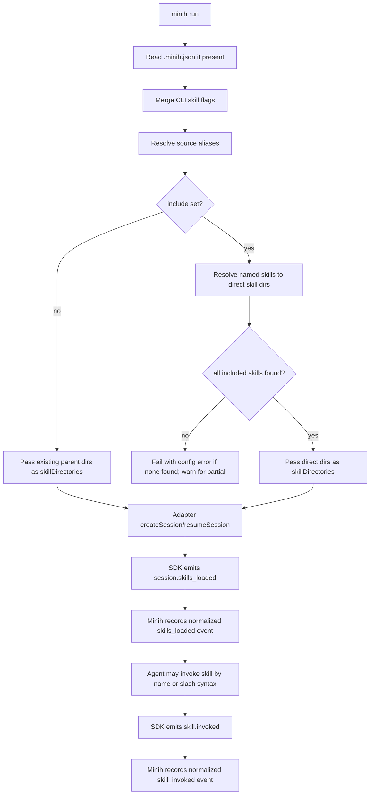

# Workshop: Minih Skills CLI Config and Discovery

**Type**: CLI Flow + Storage Design + Integration Pattern
**Plan**: 022-minih-skills-config
**Spec**: _Not yet written — workshop created directly from user request on first-class skill loading_
**Created**: 2026-06-05T00:00:00Z
**Status**: Draft

**Value Thesis**: This workshop makes skill-enabled minih runs cheaper and safer by turning machine-specific skill paths into first-class, discoverable source aliases, with explicit include/exclude controls and CLI diagnostics that agents can understand without prior local knowledge.
**Target Proof Level**: Implementation Ready
**Current Proof Level**: Preferred Direction

**Selected Value Axes**:
- **Operator Usability**: Humans should write `global:agents` or `.agents`, not paste `/Users/.../.agents/skills` into agent prompts.
- **Agent Readiness**: A fresh agent on another machine should discover available skill sources and know why a configured source did or did not resolve.
- **Implementation Readiness**: The config must map cleanly to Copilot SDK `skillDirectories` / `disabledSkills` without changing runner/adapter import boundaries.
- **Review Compression**: CLI commands and doctor checks should make the behavior auditable from JSON envelopes and stderr tables.
- **Portability / Attention Reduction**: Config should be durable in the repo while resolving safely per-machine at runtime.

**Related Documents**:
- `docs/domains/cli/domain.md`
- `docs/domains/runner/domain.md`
- `docs/domains/adapter/domain.md`
- `docs/domains/domain-map.md`
- `agents/skills-smoke-test/prompt.md`
- `docs/retros/skills-smoke-test.md`

**Domain Context**:
- **Primary Domain**: `cli` owns user-facing flags, config discovery, JSON envelopes, and SDK runtime composition.
- **Related Domains**: `runner` carries resolved run config but must stay SDK-independent; `adapter` passes skill config through to `@github/copilot-sdk`; `measurement` can later score discoverability/evidence but is not needed for v1.

---

## Purpose

Clarify the first-class minih design for loading Copilot/Claude/agent harness skills into SDK-backed minih runs. The workshop answers where config should live, how friendly source aliases resolve, how to include only selected skills, how agents can discover what is available on other machines, and what CLI/doc surfaces should light up so this does not become hidden tribal knowledge.

## Fresh Entrant Outcome

A fresh human or agent should be able to use this workshop to reach **Implementation Ready** with no additional context.

They should be able to:

- Add a simple repo config that enables skill sources without absolute paths.
- Predict which local folders minih will scan on macOS/Linux-style machines.
- Choose between loading all skills from a source and loading only named skills.
- Implement pass-through to the Copilot SDK without violating minih's domain boundaries.
- Add CLI/doctor/docs surfaces that make skill state visible and diagnosable.

## Key Questions Addressed

- Where should minih skill config live?
- Which skill source aliases should be supported first?
- How do repo-relative, home-relative, and named harness sources resolve?
- Can minih pass a direct skill directory rather than only a parent `skills/` directory?
- How do users include only some skills from a broad global source?
- How does this remain affordable/easy for agents on machines with different local skill installs?
- Which CLI docs and diagnostic surfaces should expose this feature?

---

## Evidence Ledger

| Evidence | Location | Supports | Status |
|----------|----------|----------|--------|
| Copilot SDK supports `skillDirectories` and `disabledSkills` | `~/github/copilot-sdk/docs/features/skills.md` | Session pass-through design | Ready |
| SDK emits `session.skills_loaded` and `skill.invoked` | `~/github/copilot-sdk/nodejs/src/generated/session-events.ts` | Observability and smoke-test assertions | Ready |
| Minih adapter currently does not pass skill config | `src/adapter/sdk-copilot.ts` | Required implementation change | Ready |
| Parent skill directory works | Experiment: `/tmp/minih-skill-session-cases.mjs` with `~/.agents/skills` | `sources: ["global:agents"]` design | Ready |
| Direct skill directory works | Experiment: `~/.agents/skills/grill-me`, `~/.claude/skills/pack-code` | `include` by direct-dir resolution | Ready |
| Slash skill invocation works after loading | Experiment: `/tmp/minih-skill-invoke-slash.mjs` invoked `grill-me` | User-facing prompt compatibility | Ready |
| No config file exists today | Repo search for `.minih` / config surfaces | Need new config discovery | Ready |

---

## Current State

Minih runs isolate SDK sessions in the run folder, load MCP config from `.mcp.json` or `--mcp-config`, and pass only these SDK session options today:

- model
- reasoning effort
- working directory
- config dir
- MCP servers
- permission handler

Skill-related SDK fields exist but are not currently threaded:

- `skillDirectories?: string[]`
- `disabledSkills?: string[]`
- `enableConfigDiscovery?: boolean`
- `customAgents[].skills?: string[]`

The current `skills-smoke-test` proved the negative case: with no `skillDirectories`, the SDK session saw only builtin `customize-cloud-agent`; local `grill-me` was invisible.

---

## Decision Space

| Option | Description | Pros | Cons | Decision |
|--------|-------------|------|------|----------|
| A. CLI flags only | `minih run --skill-dir ~/.agents/skills --skill grill-me` | Fastest to implement; no config file schema | Repetitive; poor for agents; no repo default | Rejected for first-class UX |
| B. Repo config only | `.minih.json` controls all runs | Durable, reviewable, agent-friendly | Harder to override for one run | Partial |
| C. Config + CLI overrides | `.minih.json` default, flags add/override | Best operator UX; scriptable; discoverable | Slightly more implementation | **Selected** |
| D. SDK `enableConfigDiscovery` only | Let SDK discover paths | Less minih code | Too opaque; run folder isolation may surprise; hard to diagnose | Rejected for v1 |
| E. Minih-side deterministic resolution | Minih resolves aliases to directories, passes SDK concrete dirs | Portable, explainable, testable | Minih owns a small resolver | **Selected** |

**Decision**: implement `.minih.json` + CLI overrides, with minih-side deterministic alias resolution. Pass resolved concrete `skillDirectories` into the SDK.

---

## Recommended Config Shape

### Minimal: enable one standard source

```json
{
  "skills": {
    "sources": ["global:agents"]
  }
}
```

### Recommended portable repo config: enable only named skills

```json
{
  "skills": {
    "sources": ["global:agents", "global:claude", "repo:.agents"],
    "include": ["grill-me", "the-flow"],
    "exclude": []
  }
}
```

### Project-only skills

```json
{
  "skills": {
    "sources": ["repo:.github", "repo:.agents"],
    "include": ["release-checklist", "domain-extractor"]
  }
}
```

### Explicit escape hatch

```json
{
  "skills": {
    "sources": ["path:./vendor/copilot-skills"],
    "include": ["schema-auditor"]
  }
}
```

**Why `.minih.json`**: it is root-level, obvious, independent of `package.json`, language-agnostic, and easy for agents to discover with one bounded root read. It should be introduced as the canonical v1 repo config. Future aliases (`minih.config.json`, package key) can be added later only if needed.

---

## Source Alias Contract

Aliases are intentionally short and memorable. They resolve to **parent directories** that contain skill subdirectories, unless `include` asks minih to resolve direct skill directories.

| Alias | Resolves To | Notes |
|-------|-------------|-------|
| `.agents` | `<repo>/.agents/skills` | Short repo-local default; equivalent to `repo:.agents` |
| `.claude` | `<repo>/.claude/skills` | Repo-local Claude-style skills |
| `.github` | `<repo>/.github/skills` | Official Copilot project skill location |
| `repo:.agents` | `<repo>/.agents/skills` | Explicit repo-local form |
| `repo:.claude` | `<repo>/.claude/skills` | Explicit repo-local form |
| `repo:.github` | `<repo>/.github/skills` | Explicit repo-local form |
| `global:agents` | `~/.agents/skills` | Official personal Copilot-compatible location; this machine has the plan/harness skills here |
| `global:copilot` | `~/.copilot/skills` | Official personal Copilot location |
| `global:claude` | `~/.claude/skills` | Compatibility location for Claude Code-style skills |
| `global:pi` | `~/.pi/agent/skills` | Compatibility location for pi-installed skills |
| `~/.agents` | `~/.agents/skills` | Friendly shorthand; normalize to `global:agents` |
| `~/.copilot` | `~/.copilot/skills` | Friendly shorthand; normalize to `global:copilot` |
| `~/.claude` | `~/.claude/skills` | Friendly shorthand; normalize to `global:claude` |
| `path:<path>` | exactly the path after `path:` | Escape hatch for custom installs; path may be repo-relative or `~`-relative |

### Important behavior

- Missing sources are **warnings**, not hard failures, unless no requested included skill can be found.
- Direct source paths that already contain `SKILL.md` are valid. The SDK experiment showed direct skill dirs load exactly that skill plus builtin skills.
- For broad sources without `include`, minih passes the parent directory as-is.
- For broad sources with `include`, minih resolves each included name to a direct skill directory and passes only those directories.

---

## Include / Exclude Semantics

### Load all discovered skills from sources

```json
{
  "skills": {
    "sources": ["repo:.agents"]
  }
}
```

Runtime behavior:

1. Resolve `repo:.agents` → `<repo>/.agents/skills`.
2. If it exists, pass it to SDK `skillDirectories`.
3. SDK loads every immediate `*/SKILL.md` under that source.

### Load only selected skills

```json
{
  "skills": {
    "sources": ["global:agents", "global:claude"],
    "include": ["grill-me", "pack-code"]
  }
}
```

Runtime behavior:

1. Resolve source aliases.
2. Search for immediate child dirs with `SKILL.md` and matching skill name.
3. For each included skill, pass the **direct skill directory** to SDK `skillDirectories`.
4. If an included skill is missing, warn with the source list searched.
5. If all included skills are missing, fail fast with an actionable config error.

### Exclude selected skills

```json
{
  "skills": {
    "sources": ["global:agents"],
    "exclude": ["shopping-hunter", "deepresearch-v2"]
  }
}
```

Runtime behavior:

- If no `include`, pass source parent dirs and pass `disabledSkills: exclude` to the SDK.
- If `include` is present, apply `exclude` after include resolution and do not pass excluded direct dirs.

### Include + direct source

```json
{
  "skills": {
    "sources": ["path:~/.agents/skills/grill-me"]
  }
}
```

Runtime behavior:

- Since the source directory contains `SKILL.md`, pass it directly.
- This is equivalent to `sources: ["global:agents"], include: ["grill-me"]`, but less portable and should be shown as an escape hatch, not the default.

---

## CLI Surface

### `minih skills discover`

Purpose: show what minih can find on this machine, before running an agent.

```bash
minih skills discover
minih skills discover --json
minih skills discover --source global:agents
minih skills discover --source .agents --source global:claude
```

Human stderr example:

```text
Skills discovered for this repo

Configured sources:
  ✓ global:agents  ~/.agents/skills        34 skills
  - global:copilot ~/.copilot/skills       missing
  ✓ global:claude  ~/.claude/skills        1 skill
  - repo:.agents   .agents/skills          missing

Available skills:
  grill-me        global:agents  ~/.agents/skills/grill-me/SKILL.md
  the-flow        global:agents  ~/.agents/skills/the-flow/SKILL.md
  pack-code       global:claude  ~/.claude/skills/pack-code/SKILL.md
```

JSON envelope shape:

```json
{
  "command": "skills discover",
  "status": "ok",
  "data": {
    "sources": [
      { "alias": "global:agents", "path": "/Users/me/.agents/skills", "exists": true, "skillCount": 34 },
      { "alias": "global:copilot", "path": "/Users/me/.copilot/skills", "exists": false, "skillCount": 0 }
    ],
    "skills": [
      { "name": "grill-me", "source": "global:agents", "path": "/Users/me/.agents/skills/grill-me/SKILL.md" }
    ]
  }
}
```

### `minih skills doctor`

Purpose: validate `.minih.json` skill config without running an SDK session.

```bash
minih skills doctor
```

Checks:

- `.minih.json` parses.
- `skills.sources` aliases are known.
- At least one source exists when skills are configured.
- Every `include` skill resolves to at least one candidate.
- Duplicate skill names across sources are reported with chosen precedence.
- Direct skill directories contain `SKILL.md`.
- Missing optional sources are warnings, not failures.

### `minih run` flags

Run-specific overrides:

```bash
minih run skills-smoke-test --skill-source global:agents --skill grill-me
minih run skills-smoke-test --skill-source .agents --disable-skill deepresearch-v2
minih run skills-smoke-test --no-skills
```

Proposed flags:

| Flag | Meaning |
|------|---------|
| `--skill-source <alias-or-path>` | Add a source for this run; repeatable |
| `--skill <name>` | Include only this skill; repeatable |
| `--disable-skill <name>` | Exclude/disable a skill; repeatable |
| `--no-skills` | Ignore `.minih.json` skill config for this run |
| `--skills-debug` | Print resolved skill config before starting SDK session |

### `minih inspect <slug>`

Add a **Skills** block:

```text
Skills config
  config file: .minih.json
  sources:
    ✓ global:agents -> ~/.agents/skills (34 found)
    - global:copilot -> ~/.copilot/skills (missing)
  include: grill-me
  resolved skillDirectories:
    ~/.agents/skills/grill-me
```

### `minih run` preflight

When skills are configured, stderr should light up clearly:

```text
✓ Skills config    .minih.json
✓ Skill source     global:agents -> ~/.agents/skills
✓ Skill            grill-me
```

If a source is missing but non-fatal:

```text
⚠ Skill source     global:copilot -> ~/.copilot/skills (missing; skipped)
```

If an included skill is missing:

```text
✗ Skill            grill-me not found in configured sources: global:copilot, repo:.agents
```

---

## Runtime Flow



---

## Config Merge Rules

Precedence, highest first:

1. `--no-skills`: disables skills for this invocation.
2. CLI flags: `--skill-source`, `--skill`, `--disable-skill`.
3. Agent frontmatter `skills:` (optional future; not required for v1).
4. Repo `.minih.json`.
5. No implicit global loading.

**Why no implicit global loading**: deterministic runs. If a repo wants global skills, it should say so in config. Agents on another machine can then see exactly what was intended, even if a source is absent locally.

---

## Proposed `.minih.json` Schema Sketch

```typescript
interface MinihConfig {
  skills?: {
    /** Friendly aliases or explicit paths. */
    sources?: string[];
    /** If present, only these skills are loaded from sources. */
    include?: string[];
    /** Disable or omit these skills. */
    exclude?: string[];
    /** Future: allow SDK config discovery too, default false. */
    enableSdkDiscovery?: boolean;
    /** Future: fail when any configured source is missing, default false. */
    strictSources?: boolean;
  };
}
```

JSON Schema should reject:

- unknown top-level types
- non-array `sources/include/exclude`
- empty strings
- aliases with null bytes
- `path:` entries resolving outside allowed roots only when strict-fs policy later demands it

For v1, allow unknown top-level keys? Recommendation: **yes** for forward compatibility, but `skills` itself should be strictly validated.

---

## Source Resolution Algorithm

```typescript
function resolveSkillConfig(input, repoRoot, home): ResolvedSkills {
  const sources = input.sources ?? [];
  const include = new Set(input.include ?? []);
  const exclude = new Set(input.exclude ?? []);

  const resolvedSources = sources.map((source) => resolveAlias(source, repoRoot, home));
  const existingSources = resolvedSources.filter((s) => fs.existsSync(s.path));

  if (include.size === 0) {
    return {
      skillDirectories: existingSources.map((s) => s.path),
      disabledSkills: [...exclude],
      warnings: missingSourceWarnings(resolvedSources),
    };
  }

  const candidates = scanImmediateSkills(existingSources);
  const selected = [];
  for (const name of include) {
    if (exclude.has(name)) continue;
    const match = chooseByPrecedence(candidates.filter((c) => c.name === name));
    if (match) selected.push(match.skillDir);
    else warnMissingIncludedSkill(name, existingSources);
  }

  if (selected.length === 0 && include.size > 0) {
    throw new SkillsConfigError('No included skills were found');
  }

  return { skillDirectories: selected, disabledSkills: [], warnings };
}
```

### Precedence for duplicate names

If multiple sources contain the same skill name, choose the earliest configured source. This is transparent and easy to explain:

```json
{
  "skills": {
    "sources": ["repo:.agents", "global:agents"],
    "include": ["grill-me"]
  }
}
```

Here repo-local `grill-me` wins over global `grill-me`.

`minih skills doctor` should warn:

```text
⚠ duplicate skill "grill-me": using repo:.agents, shadowing global:agents
```

---

## SDK Pass-Through Design

### Type additions

`src/adapter/events.ts`:

```typescript
export interface AgentRunOptions {
  // existing...
  skillDirectories?: string[];
  disabledSkills?: string[];
}
```

`src/adapter/copilot-types.ts`:

```typescript
export interface CopilotSessionConfig {
  // existing...
  skillDirectories?: string[];
  disabledSkills?: string[];
}

export interface CopilotResumeSessionConfig {
  // existing...
  skillDirectories?: string[];
  disabledSkills?: string[];
}
```

`src/runner/types.ts`:

```typescript
export interface AgentRunConfig {
  // existing...
  skillDirectories?: string[];
  disabledSkills?: string[];
}
```

### Adapter pass-through

`src/adapter/sdk-copilot.ts` should add these to both `createSession` and `resumeSession`:

```typescript
...(options.skillDirectories && { skillDirectories: options.skillDirectories }),
...(options.disabledSkills && { disabledSkills: options.disabledSkills }),
```

### Runner pass-through

After CLI resolves skills, runner passes the already-resolved values to adapter. Runner should not import SDK or do skill discovery that belongs to CLI/config composition.

---

## Event Observability

Minih should normalize these SDK events into stable events:

| SDK Event | Minih Event | Why |
|-----------|-------------|-----|
| `session.skills_loaded` | `skills_loaded` or raw-preserved + pretty rendering | Operator sees what loaded |
| `skill.invoked` | `skill_invoked` | Smoke tests can assert real invocation |

Minimum v1 can leave them as `raw` but pretty/tail should render them clearly:

```text
🧩 skills loaded: grill-me, the-flow (2)
🧩 skill invoked: grill-me
```

For JSON run summaries, consider adding optional counters later:

```json
{
  "skillsLoaded": ["grill-me", "the-flow"],
  "skillsInvoked": ["grill-me"]
}
```

---

## Built-in Documentation Surfaces

The feature should “light up like a Christmas tree” anywhere an agent or human asks “how do I use skills?”

### README

Add:

- `## Skills` top-level or near MCP/Agent Packs.
- A minimal `.minih.json` example.
- A table of aliases.
- A warning that skills are not loaded implicitly.
- A note that direct named include avoids broad global context load.

### `minih run --help`

Add a compact footer:

```text
Skills: configure repo defaults in .minih.json or use --skill-source / --skill.
Try: minih skills discover
```

### `minih inspect <slug>`

Show resolved skill config, including missing sources.

### `minih doctor`

Validate `.minih.json` and surface warnings. This makes config mistakes visible before a run.

### `minih agent-readme`

Include a skills section because external coding agents use this as a bundled reference.

### Error messages

Make missing includes actionable:

```text
E210 SKILL_NOT_FOUND: skill "grill-me" was requested but not found.
Searched:
  - global:copilot -> ~/.copilot/skills
  - repo:.agents -> .agents/skills
Try:
  minih skills discover
  or add global:agents to .minih.json
```

Suggested error range: `E210`–`E219` for skills config.

---

## Affordability and Cross-Machine Portability

### Attention cost target

A fresh agent on a different machine should need at most three commands:

```bash
minih skills discover
minih skills doctor
minih inspect <agent>
```

Then it should know:

- which aliases were configured,
- which paths those aliases resolved to on that machine,
- which paths were missing,
- which skills loaded,
- which skills were expected but absent,
- how to fix it.

### Runtime cost target

- Config parsing is a small JSON read.
- Source resolution is bounded to immediate child dirs with `SKILL.md`.
- No recursive scans beyond one level under known source roots.
- No network.
- No SDK session needed for `minih skills doctor`.

### Context cost target

- If `include` is present, pass direct skill dirs only.
- Avoid loading a whole global harness pack by accident.
- Encourage examples with `include` first.

### Portability policy

Repo config may reference global aliases even when absent. Absence is not inherently an error; it is a machine capability mismatch.

Example:

```json
{
  "skills": {
    "sources": ["global:agents"],
    "include": ["the-flow"]
  }
}
```

On a machine without `~/.agents/skills/the-flow`, `doctor` warns and `run` fails only because `include` asked for a specific capability. The fix is discoverable: install the skill, change the source, or remove the include.

---

## Security and Safety Notes

- Skill files are prompt instructions, not code executed by minih.
- Skills may instruct the agent to run commands; minih permissions still gate actual tool use.
- Avoid silently loading global skills by default because they alter agent behavior outside repo review.
- `.minih.json` should be committed and reviewable when used by a project.
- Direct `path:` is an escape hatch; docs should prefer aliases.

---

## Implementation Phases

### Phase 1 — Resolver + doctor + pass-through

- Add `.minih.json` parser for `skills` block.
- Add alias resolver.
- Add `minih skills discover` and `minih skills doctor`.
- Thread `skillDirectories` / `disabledSkills` through CLI → runner → adapter.
- Add `--skill-source`, `--skill`, `--disable-skill`, `--no-skills` to `run`.
- Add unit tests for resolver and CLI config envelopes.
- Update `skills-smoke-test` to use configured `grill-me` and assert `skill.invoked`.

### Phase 2 — Discoverability polish

- Add README section.
- Add `run --help` footer.
- Add `inspect` skills block.
- Pretty-render skills-loaded / invoked events.
- Add `doctor` integration warnings for `.minih.json`.

### Phase 3 — Optional advanced controls

- Agent frontmatter `skills:` override.
- `enableSdkDiscovery` escape hatch.
- Session summary counters for loaded/invoked skills.
- `minih skills info <name>` reading frontmatter and path.

---

## Acceptance Criteria

This workshop reaches **Implementation Ready** when the plan/spec derived from it preserves these criteria:

- AC1: A repo can enable skills using `.minih.json` without absolute paths.
- AC2: `global:agents`, `global:copilot`, `global:claude`, `repo:.agents`, `repo:.claude`, and `repo:.github` resolve deterministically.
- AC3: Missing configured sources are visible in `skills doctor` and `inspect`.
- AC4: `include` resolves named skills to direct skill directories and avoids loading unrelated global skills.
- AC5: Direct skill directories containing `SKILL.md` are accepted.
- AC6: `minih run --skill-source global:agents --skill grill-me skills-smoke-test` causes SDK `session.skills_loaded` to include `grill-me`.
- AC7: Prompting `/grill-me ...` or “Use the grill-me skill...” causes SDK `skill.invoked` for `grill-me` in a smoke test.
- AC8: README, `run --help`, `inspect`, and `doctor` all mention skills config and discovery.
- AC9: Runner remains SDK-independent; adapter remains the only SDK wrapper.
- AC10: No implicit global skills are loaded without config or CLI flags.

---

## Quick Reference

```json
// .minih.json — recommended minimal config
{
  "skills": {
    "sources": ["global:agents"],
    "include": ["grill-me"]
  }
}
```

```bash
# Discover local capability
minih skills discover

# Validate repo config
minih skills doctor

# One-off run with a global skill
minih run skills-smoke-test --skill-source global:agents --skill grill-me

# Disable configured skills for one run
minih run some-agent --no-skills
```

---

## Open Questions

### Q1: Should `global:claude` be enabled by a shorthand `~/.claude` even though official Copilot docs emphasize `~/.copilot/skills` and `~/.agents/skills`?

**RESOLVED FOR V1**: Yes, as compatibility. The user explicitly wants multiple harnesses, and SDK experiments show Claude-style `SKILL.md` folders load when passed explicitly.

### Q2: Should minih use SDK `enableConfigDiscovery`?

**RESOLVED FOR V1**: No by default. Minih should resolve deterministically so `inspect`, `doctor`, and JSON envelopes can explain exactly what happened.

### Q3: Should `.minih.json` support direct absolute paths?

**RESOLVED FOR V1**: Yes via `path:<path>` only. Docs should discourage it for committed config and prefer aliases.

### Q4: Should include names be matched by folder name or frontmatter `name`?

**OPEN**: Prefer matching both, with frontmatter `name` as canonical and folder name as fallback. Doctor should warn when they differ.

### Q5: Should run fail when a configured source is missing?

**RESOLVED FOR V1**: Missing source alone warns. Missing explicitly included skills fails because the user requested a capability.
