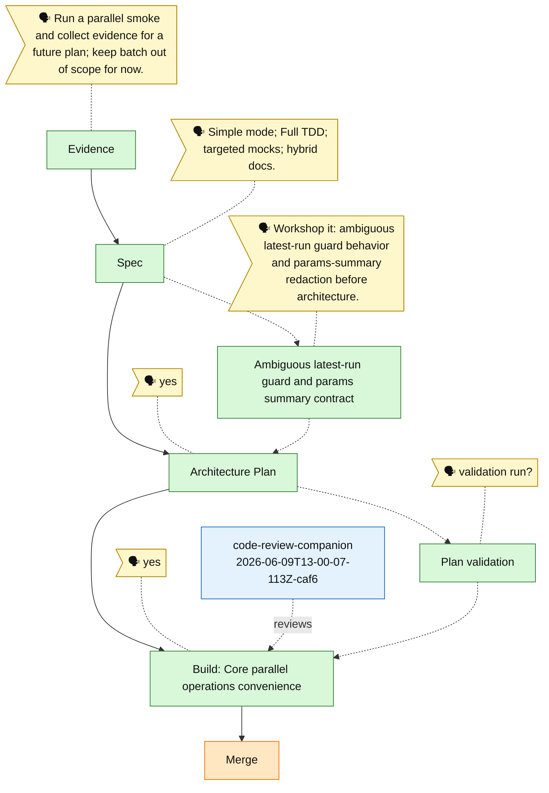

# Flow — parallel-param-smoke-parallel-operations

Generated from `the-flow.json`.

```mermaid
flowchart TD
  classDef done fill:#d9f7d9,stroke:#2e7d32,color:#111
  classDef wip fill:#ffe7c2,stroke:#ef6c00,color:#111
  classDef blocked fill:#ffd6d6,stroke:#c62828,color:#111
  classDef known fill:#dde8f3,stroke:#546e7a,color:#111
  classDef assumed fill:#f5f5f5,stroke:#9e9e9e,stroke-dasharray: 5 5,color:#555
  classDef said fill:#fff7cc,stroke:#b58900,color:#111
  classDef companion fill:#e3f2fd,stroke:#1565c0,color:#111

  research["Evidence"]:::done
  spec["Spec"]:::done
  workshop_001["Ambiguous latest-run guard and params summary contract"]:::done
  plan["Architecture Plan"]:::done
  validation_001["Plan validation"]:::done
  build["Build: Core parallel operations convenience"]:::done
  merge["Merge"]:::wip

  said_research>"🗣 Run a parallel smoke and collect evidence for a future plan; keep batch out of scope for now."]:::said
  said_spec>"🗣 Simple mode; Full TDD; targeted mocks; hybrid docs."]:::said
  said_workshop_001>"🗣 Workshop it: ambiguous latest-run guard behavior and params-summary redaction before architecture."]:::said
  said_plan>"🗣 yes"]:::said
  said_validation_001>"🗣 validation run?"]:::said
  said_build>"🗣 yes"]:::said
  companion_code_review_companion["code-review-companion\n2026-06-09T13-00-07-113Z-caf6"]:::companion
  said_research -.- research
  said_spec -.- spec
  said_workshop_001 -.- workshop_001
  said_plan -.- plan
  said_validation_001 -.- validation_001
  said_build -.- build

  research --> spec --> plan --> build --> merge
  spec -.-> workshop_001
  workshop_001 -.-> plan
  plan -.-> validation_001
  validation_001 -.-> build
  companion_code_review_companion -. reviews .-> build
```

Legend: done / wip / blocked / known / assumed; 🗣 user input; blue = companion.
