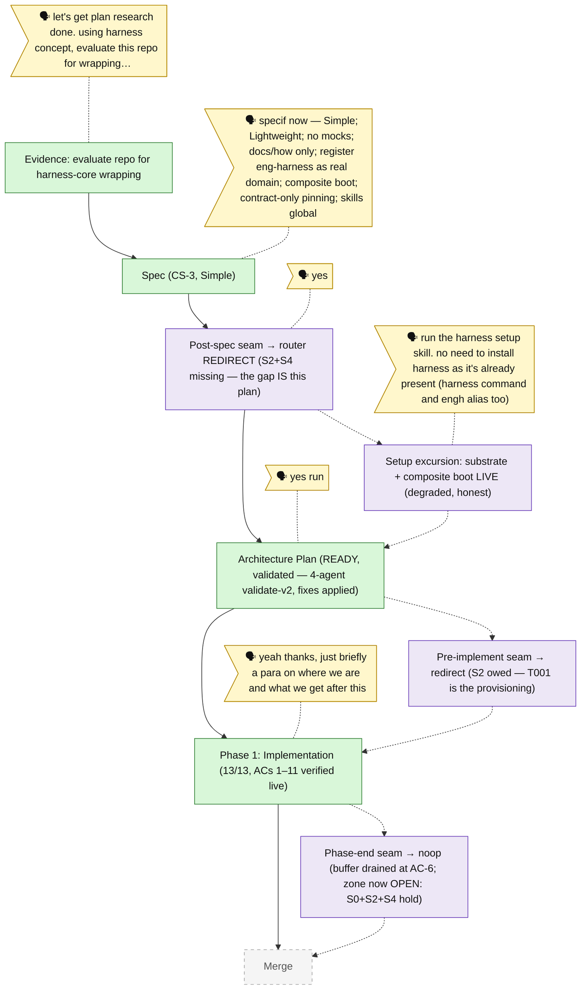

# Flow — core-harness

Generated from `the-flow.json`.

```mermaid
flowchart TD
  classDef done fill:#d9f7d9,stroke:#2e7d32,color:#111
  classDef wip fill:#ffe7c2,stroke:#ef6c00,color:#111
  classDef blocked fill:#ffd6d6,stroke:#c62828,color:#111
  classDef known fill:#dde8f3,stroke:#546e7a,color:#111
  classDef assumed fill:#f5f5f5,stroke:#9e9e9e,stroke-dasharray: 5 5,color:#555
  classDef said fill:#fff7cc,stroke:#b58900,color:#111
  classDef harness fill:#EDE7F6,stroke:#673AB7,color:#111

  research["Evidence: evaluate repo for harness-core wrapping"]:::done
  spec["Spec (CS-3, Simple)"]:::done
  backpressure_001["Post-spec seam → router REDIRECT (S2+S4 missing — the gap IS this plan)"]:::harness
  harness_setup_001["Setup excursion: substrate + composite boot LIVE (degraded, honest)"]:::harness
  plan["Architecture Plan (READY, validated — 4-agent validate-v2, fixes applied)"]:::done
  harness_preflight_001["Pre-implement seam → redirect (S2 owed — T001 is the provisioning)"]:::harness
  build["Phase 1: Implementation (13/13, ACs 1–11 verified live)"]:::done
  harness_phaseend_001["Phase-end seam → noop (buffer drained at AC-6; zone now OPEN: S0+S2+S4 hold)"]:::harness
  merge["Merge"]:::assumed

  said_research>"🗣 let's get plan research done. using harness concept, evaluate this repo for wrapping…"]:::said
  said_spec>"🗣 specif now — Simple; Lightweight; no mocks; docs/how only; register eng-harness as real domain; composite boot; contract-only pinning; skills global"]:::said
  said_backpressure_001>"🗣 yes"]:::said
  said_harness_setup_001>"🗣 run the harness setup skill. no need to install harness as it's already present (harness command and engh alias too)"]:::said
  said_plan>"🗣 yes run"]:::said
  said_build>"🗣 yeah thanks, just briefly a para on where we are and what we get after this"]:::said
  said_research -.- research
  said_spec -.- spec
  said_backpressure_001 -.- backpressure_001
  said_harness_setup_001 -.- harness_setup_001
  said_plan -.- plan
  said_build -.- build

  research --> spec --> backpressure_001 --> plan --> build --> merge
  backpressure_001 -.-> harness_setup_001 -.-> plan
  plan -.-> harness_preflight_001 -.-> build
  build -.-> harness_phaseend_001 -.-> merge
```

Legend: done / wip / blocked / known / assumed; 🗣 user input; 🟪 harness loop.
