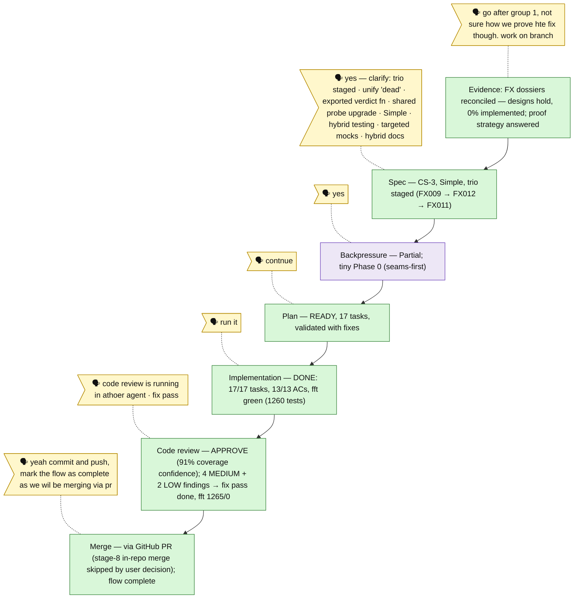

# Flow — dead-pid-liveness

Generated from `the-flow.json`.

Legend: done / wip / blocked / known / assumed; 🗣 user input; 🟪 harness loop (backpressure done pre-plan; pre-implement boot + phase-end retro drain fired inside the build — retro record at `.harness/records/retro/2026-06-11/002-025-dead-pid-liveness.md`).

Mid-review seam: issue #44 (live-pid stalled-stream — the complementary quadrant of #24) was triaged, commented, and queued as plan 026 (stall watchdog + run budgets).

Fix pass (post-APPROVE): F001 `--all` mutual exclusion (E108) · F002 race-hardened reconcile lock (lost steals → E190, never raw fs errors) · F003 forced-TTY render smoke (both dead routes, built CLI) · F004/F005 runner domain + map currency · F006 honored as the commit split. +5 tests, suite 1265/0.

**Flow complete** — merge via GitHub PR (user decision; stage-8 in-repo merge skipped). Plan-complete seam: fix-pass insights drained to `.harness/records/retro/2026-06-11/003-025-dead-pid-liveness-fix-pass.md`. Follow-up queued outside this flow: plan 026 (issue #44 stall watchdog + run budgets).
