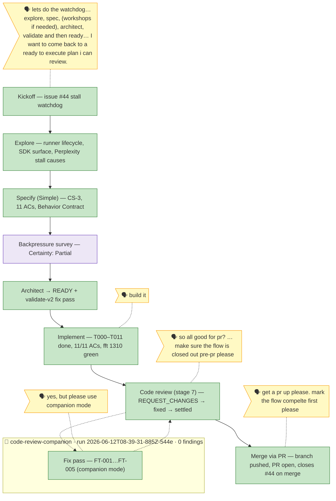

# the-flow — 026-stall-watchdog

> Generated from `the-flow.json` — do not hand-edit.

Legend: 🟩 done · 🟧 in progress · 🟥 blocked · 🟦 known next · ⬜ assumed · 🗣 user input · 🟪 harness loop · 🤝 companion

**Now**: flow COMPLETE. All milestones done (5/5). Review settled by companion supersession (disposition in `reviews/fix-tasks.md`); retro buffer drained to `.harness/records/retro/2026-06-11/004-026-stall-watchdog.md`; branch `026-stall-watchdog` pushed and PR open against `main` with `Closes #44` — final gate `just fft` exit 0 (1319 tests / 16 skipped, +51 across build + fix pass), companion farewell zero findings.
**Next**: merge the PR on GitHub — #44 closes automatically; the drafted `issue-44-comment.md` is available to post at merge. Plan-complete harness seam (`/eng-harness-flow --event plan-complete`) fires after merge.
