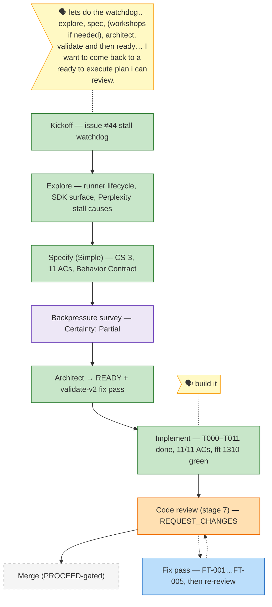

# the-flow — 026-stall-watchdog

> Generated from `the-flow.json` — do not hand-edit.

Legend: 🟩 done · 🟧 in progress · 🟥 blocked · 🟦 known next · ⬜ assumed · 🗣 user input · 🟪 harness loop

**Now**: review came back **REQUEST_CHANGES** — 1 HIGH (F001: adapter suppresses the consolidated `assistant.message` after streaming deltas, so `--max-turns` misses normal streamed turns; AC-4 at 60%), 4 MED (F002 `fireMaxTurns` init ordering, F003 manifest classification, F004 resume budget evidence, F005 `runs` passthrough evidence), 2 LOW (barrel manifest rows). F001+F002 verified real against source. Fix tasks at `reviews/fix-tasks.md`. Nothing committed.
**Next**: `/the-flow 6 implement --plan "docs/plans/026-stall-watchdog/stall-watchdog-plan.md"` (fix pass), then re-run `/the-flow 7 review`.
