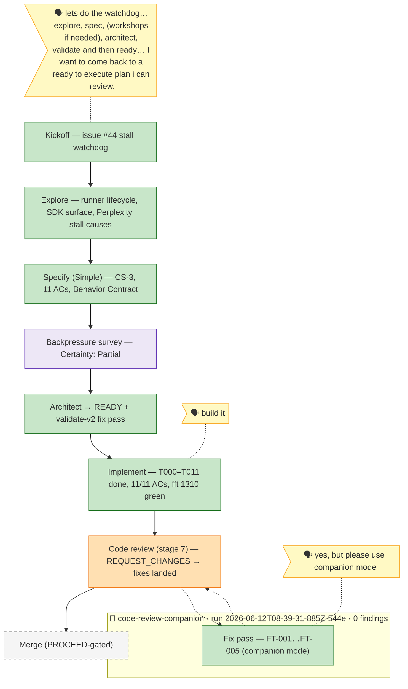

# the-flow — 026-stall-watchdog

> Generated from `the-flow.json` — do not hand-edit.

Legend: 🟩 done · 🟧 in progress · 🟥 blocked · 🟦 known next · ⬜ assumed · 🗣 user input · 🟪 harness loop · 🤝 companion

**Now**: fix pass DONE in companion mode — all review findings addressed (FT-001 `ab0be14` streamed-turn accounting, FT-002 `dd9d7a0` race-arm preinit, FT-003 `1997b3f` manifest, FT-004 `d713af9` resume budget proof, FT-005 `4b3d20f` runs terminalReason). `just fft` exit 0 — 1319 tests (+9). Companion farewell: **zero findings, six APPROVEs** across `752945f..a75d435`; magicWand = `--stop-after-summary`. Seven commits on `026-stall-watchdog`, not pushed. #44 comment still drafted-not-posted.
**Next**: `/the-flow 8 merge --plan "docs/plans/026-stall-watchdog/stall-watchdog-plan.md"` (companion supersedes a stage-7 re-run per 6c doctrine) — or re-run `/the-flow 7 review` first for a fresh artifact.
