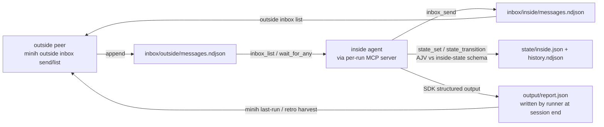

# Research Report: Companion & Coordination Reliability

**Generated**: 2026-06-13T01:20:00Z
**Research Query**: "How does the companion/coordination layer work today — inbox delivery (wait_for_any vs inbox_list), state schema vocabulary, companion lifecycle (idle budget, finalize, farewell), permission presets — seeded by issues #40 #32 #35 #36 #25 #29 #31 #27"
**Mode**: Plan-Associated (`docs/plans/027-companion-coordination/`)
**FlowSpace**: Available (used)
**Findings**: ~70 raw findings from 8 parallel scouts (IA/DC/PS/QT/IC/DE/PL/DB), synthesized below

> Harness seam (session-start): `harness boot --json` → **degraded** — lint/typecheck/build+test all pass; pre-existing `minih doctor` warnings + npm audit (1 critical / 6 high, pre-existing) — proceeded with note.

## Executive Summary

### What It Is
minih's coordination layer lets an **outside peer** (human/orchestrator via `minih outside …` CLI) exchange messages and state with an **inside agent** (the running companion) through file-backed lanes (`inbox/{outside,inside}/messages.ndjson`, `state/{inside,outside}.json`) surfaced to the agent as a per-run, minih-spawned **MCP server with 8 tools** (`inbox_list`, `inbox_send`, `inbox_ack`, `state_get`, `state_set`, `state_transition`, `wait_for_any`, `permission_status`). The companion lifecycle (idle budget, check-in protocol, farewell `output/report.json`) is **prompt-driven, not runtime-enforced**.

### Key Insights
1. **#40 has a confirmed root-cause candidate in the code**: `wait_for_any` snapshots inbox message IDs at call entry and *only emits messages not in the snapshot* (`src/runner/event-wait.ts:76-80, 191-197` — the doc comment says so explicitly). Messages queued **before** the call — e.g. pings that arrived while the companion was busy reviewing — are permanently invisible to it. `inbox_list` does an immediate full read *before* arming its watcher (`src/runner/inbox-poll.ts:114-122`), hence the parity gap. This is design-vs-usage mismatch: the primitive means "wait for *changes*", the companion uses it as "wait for *work*".
2. **#25 appears already fixed** — needs verification + closure, not a build. The companion pack now ships `permissions: preset: read-only, overrides: {shell: allow, network: allow, write: allow}` (`agents/code-review-companion/prompt.md:8-13`), and a boot-time precondition (`src/runner/permissions/coord-write-precondition.ts:156-198`) fails any coordinated run with `write: deny` loudly with **E205** *before* the agent boots (no more silent missing report.json).
3. **The lifecycle gap is the most-corroborated ask in the repo's history**: idle-budget discoverability recurs in **≥8 independent companion retros**, and a "derive the farewell report from the inbox/state ledger" magicWand appears **3× near-verbatim** (`docs/retros/code-review-companion.md`). #36 (finalize/status primitive) is the root-cause fix #35 (idle policy) builds on — the issues themselves say so.

### Quick Stats
- **Domains**: mcp (MCP server + tools), runner (lanes, event-wait, permissions, report write), cli (outside peer commands, doctor), plus the `agents/code-review-companion` pack (ungoverned by the domain system — DB-08)
- **MCP tools**: 8 (registry.md still says "six" — registry drift, fix in passing)
- **Test coverage**: strong on inbox/state/permission units (41 inbox cases; 14 write-deny cases); **no test** of the stop-window drain or wait_for_any "queued-before-call" miss
- **Prior learnings**: 13+ relevant entries across `docs/retros/code-review-companion.md` (260 lines), `docs/retros/coordination-smoke-test.md`, plan 026 companion debrief

## How It Currently Works

### Topology

- **Spawn & baked context**: `src/mcp/spawn.ts:28-71` — runner bakes runId/runDir/agentsDir + `MINIH_INBOX_DIR`/`MINIH_STATE_DIR` into a private per-run MCP server process (`minih-mcp-<runId>`); `MINIH_OUTPUT_PATH` set at `src/runner/runner.ts:507,614`. (#37 — `MINIH_PROJECT_ROOT` not exported to shell tools — lives at this seam too.)
- **Lanes**: append-only NDJSON per side (`src/runner/folder.ts:142-152`); message envelope: id, sender, type (free-form string — task/finding/progress/summary/farewell/control by convention), subject, body, ts, optional ackOf/meta.
- **inbox_list**: immediate read → filter chain (unread-via-acks → type → waitForAny → after) → if `waitMs > 0` and empty, long-poll via `fs.watch` on the lane file, settle-once (`src/runner/inbox-poll.ts:104-268`).
- **wait_for_any**: multi-source event wait (inbox + peer state + self state), **snapshot-at-entry**, emits only post-snapshot events; filter = type + not-in-snapshot (NB: *no* unread/ack filter, unlike inbox_list) (`src/runner/event-wait.ts:72-210`).
- **State**: lazy-read default `{status:'idle'…}`; AJV-validated against a **3-level schema fallback** — `agents/<slug>/state/inside-state.schema.json` → legacy path → global `src/schemas/inside-state.json` (`src/mcp/tools/state.ts:138-170`). Global enum verbatim: `idle, in-progress, paused, reviewing, complete, error`.
- **Lifecycle**: idle budget + check-in protocol implemented **in the prompt only** (plan 019: first-contact ≈20 empty polls ≈10 min; post-task ≈10 polls ≈5 min; still-needed question; then exit `idle_budget`/`no_engagement`) — `docs/how/companion-mode.md:162-203`. The runner enforces nothing; there is **no final inbox drain** between stop/idle-trigger and the report write (`runner.ts:1404-1405`).
- **Permissions**: preset matrix in `src/runner/permissions/presets.ts:53-62` (`restricted` = read+mcp only); `restricted` is the release default (plan 018 R6); coordinated runs with `write: deny` are rejected at boot with E205 unless `--allow-coord-write-deny`.

## Critical Discoveries

### 🚨 CF-01 (#40): `wait_for_any` snapshot-at-entry swallows queued work — root cause confirmed
**Where**: `src/runner/event-wait.ts:76-80` (snapshot + doc comment), `:191-197` (skip-if-in-snapshot); contrast `src/runner/inbox-poll.ts:114-122` (immediate pass before watcher).
**Mechanism**: companion loop is `wait_for_any → process task (minutes) → wait_for_any`. Pings landing during processing are inside the *next* call's entry snapshot → never delivered. Matches the #40 field data exactly (11 pings, all processed only at the farewell after a drain ping triggered an `inbox_list`). Secondary (narrower): enqueue between snapshot and watcher-arm registration. Eliminated: debounce (0ms), filter ordering.
**Fix directions for the spec**: (a) immediate-pass at entry returning already-queued *unread* matches (parity with inbox_list — requires deciding ack semantics, since wait_for_any currently has no unread filter); (b) durable read-cursor instead of per-call snapshot; (c) prompt-level fallback (companion retro itself: "prefer the documented inbox_list long-poll"). Related magicWand: `waitForAny: ['*']` wildcard so wake filters can't go deaf on new types ("root cause of the deafness bug that motivated plan 012").

### 🚨 CF-02 (#32): findings have two delivery paths and the docs promise the wrong one
**Where**: live path = `inbox_send` during session (lanes on disk); end path = SDK structured output → runner writes `output/report.json` (`runner.ts:1404-1405`), parsed post-run (`runner.ts:1818-1856`).
**Drift**: AGENTS_README/companion-mode tell orchestrators to "skim the inbox for findings"; the report schema makes `findings[]` optional and unvalidated; the companion's wake filter doesn't include `finding`; exitReason vocabulary in AGENTS_README is missing `no_engagement` (plan 019 never back-propagated). Orchestrators reading docs build for live findings and get farewell-only (plan 026's own debrief: six APPROVE summaries invisible to `outside inbox list`).
**Fix direction**: pick ONE contract and enforce it. The ledger-derived report (CF-04) makes "findings are inbox-sent live, report is assembled from the ledger" the self-consistent answer.

### 🚨 CF-03 (#25): likely already fixed — verify and close
Pack overrides write to allow (`agents/code-review-companion/prompt.md:8-13`); E205 boot gate fails coordinated write-deny runs loudly (`coord-write-precondition.ts:156-198`; 14 existing test cases). Residual work: confirm the original repro is dead, fix the doc that describes E205 as an *inbox message* (it fires before the inbox exists — DE-05), close the issue.

### 🚨 CF-04 (#36): lifecycle counters live in prompt memory — the most-asked-for primitive
3× near-verbatim magicWand: *"derive tasks received, findings sent, summaries, ackOf chains, unresolved peer requests, and final counts from the inbox/state lanes so the farewell JSON is generated from the ledger instead of manually reconstructed"* (`docs/retros/code-review-companion.md:58,67,77`). Everything needed already persists in the lanes; a `companion status` / `companion finalize` (CLI verb and/or MCP tool — consumer decision for the spec: *inside* needs finalize pre-farewell, *outside* needs status) can be computed from existing files via runner's coordination helpers (DB-04: no new cross-domain exports needed).

### 🚨 CF-05 (#35): idle budget is prompt-only, invisible, and races the shutdown window
- **Invisible**: the prompt references `input.idleBudgetMs` but no surface exposes it — the **single most recurrent retro entry (≥8 sessions)**: companions guess with empty-poll heuristics.
- **Prompt-only**: no runner enforcement; magicWand asks for a server-side idle enforcer (runner already writes the inbox files, so it knows last-activity).
- **Mid-phase stand-down**: 5–15 min commit-boundary gaps read as "done" (5 of 8 dogfood runs ended by idle stand-down; one died mid-task and was re-booted).
- **Shutdown race**: no final inbox drain inside the stop/report window (`runner.ts` write at 1404 has no lock vs late lane appends); a ping arriving then is silently stranded. No test covers this sequence (QT).
**Fix direction**: lifecycle state from CF-04 + a coordination-aware policy (e.g. briefing-declared cadence / "peer mid-phase" signal / drain-phase heartbeat magicWand) + a final drain in the stop path.

### 🚨 CF-06 (#27/#31): enum drift is real, detected, and the override seam already exists
Global enum (`src/schemas/inside-state.json:9-16`): `idle, in-progress, paused, reviewing, complete, error`. Companion prompt documents `reading, reporting, stopping, blocked` (+`reviewing` ok). AJV gate: `src/mcp/tools/state.ts:138-170`. `minih doctor` already warns (`doctor.ts:538-557`) but only catches *within-agent* drift; DE found four different enums across agents. The **3-level per-agent schema fallback already supported** means the cheap fix (ship a companion-pack schema with its full vocabulary) needs zero runtime change; the structural fix is single-sourcing prompt vocabulary + schema. **Spec decision**: widen global enum vs per-pack schema vs generated single source — workshop candidate.

### 🚨 CF-07 (#29): self-discovery surface — and it should carry more than the enum
The natural seams found: a new context/metadata MCP tool (sibling of `permission_status`, which is precedent for exactly this kind of self-discovery), the baked spawn env, or `run.json` (plan 026 just extended it with `budgets` — precedent + extension point). Given CF-05, the same surface should expose **allowedStates, coordination mode, AND idle budget/lifecycle config** — #29's scope as filed is narrower than what the retros beg for.

## Drift Catalogue (docs vs prompt vs schema vs code)

| Behavior | Source A says | Source B says | Issue |
|---|---|---|---|
| Where findings appear | AGENTS_README/companion-mode: skim inbox live | Code: report.json at session end; findings optional/unvalidated | #32 |
| State vocabulary | prompt.md: reading/reporting/stopping/blocked | inside-state.json enum: 6 values, none of those | #27/#31 |
| Idle budget | docs: "30 min" | check-in protocol exits ~17 min earlier; budget value invisible at runtime | #35/#29 |
| E205 signal | docs: arrives as inbox message | fires at boot, before inbox exists | #25 |
| exitReason vocabulary | AGENTS_README: missing `no_engagement` | plan 019 added it | #32 docs debt |
| MCP tool count | domains/registry.md: "six tools" | code: 8 tools | housekeeping |

## Prior Learnings (recurrence-ranked)

| Rank | Lesson | Recurrence | Source |
|---|---|---|---|
| 1 | Idle budget not discoverable at runtime — companions guess with poll heuristics | ≥8 sessions | code-review-companion.md:9,19,44,86,88,105,107,114,116 |
| 2 | Farewell report should be derived from the inbox/state ledger, not hand-assembled | 3× near-verbatim | code-review-companion.md:58,67,77 |
| 3 | wait_for_any missed queued tasks; trust inbox_list until proven equivalent | 2 (issue #40 run + plan 026 debrief) | #40, 026 execution.log.md |
| 4 | Wake-filter type enumeration goes deaf on new types — want `waitForAny: ['*']` | 1 + plan 012 history | code-review-companion.md:7 |
| 5 | Server-side idle enforcer / drain-phase heartbeat / first-contact timeout | 3 distinct asks | code-review-companion.md:27,41,51 |

Plan 026's debrief (execution.log.md § Companion debrief) and retro record `.harness/records/retro/2026-06-11/004-026-stall-watchdog.md` corroborate the inbox-visibility lesson from the orchestrator side.

## Domain Context

| Domain | Status | Relationship | Role in 027 |
|---|---|---|---|
| mcp | existing | modify | wait_for_any parity (CF-01), context/self-discovery tool (CF-07), possibly finalize-as-tool (CF-04) |
| runner | existing | modify | event-wait + inbox-poll primitives, stop-window drain (CF-05), report assembly, permission precondition docs |
| cli | existing | modify | `minih companion status/finalize` verbs (CF-04), doctor checks, outside ergonomics |
| adapter | existing | consume | unchanged (structured-output path only) |
| agents/code-review-companion pack | ungoverned | modify | prompt vocabulary + per-pack state schema + wake filter (CF-02/CF-06) — must move in lockstep with schema changes |

Boundary notes (DB): cli verbs can reuse runner's coordination file helpers (legal direction, no new exports); agent packs sit outside the domain system — pack/schema lockstep is an authoring-convention problem `minih doctor` should sense, not a runtime contract.

## Quality & Testing

Existing: 41 inbox tool cases; wait_for_any has unit (FakeNativeWatcher) + real-fs smoke coverage *of its current semantics*; full enum-validation and 14 write-deny permission cases; built-CLI subprocess tests for mid-wait arrival; ScriptedAdapter/FakeAgentAdapter seams; 7 `describe.skip` blocks are E2E/conditional.

Testability verdict per issue: **#40** EXISTS (unit-level via FakeNativeWatcher; an end-to-end CLI proof would want the known-missing `MINIH_FAKE_ADAPTER` seam — SUGG-001); **#32** partial (needs report-write-failure + contract fixtures); **#35** partial (no stop-window/late-ping test — BUILDABLE); **#36** BUILDABLE (pure file-derivation, highly unit-testable); **#25** EXISTS (ready); **#27/#31/#29** EXISTS (schema validation pinned; add exposure-surface tests).

## Modification Considerations

- ✅ **Safe**: new CLI verbs (envelope + registration conventions are mature — PS-01..03); per-pack state schema (fallback seam exists); doctor checks; ledger-derived status/finalize (read-only over existing files).
- ⚠️ **Caution**: `wait_for_any` semantics change — other prompts/docs may rely on "changes-only"; adding an immediate-pass needs explicit unread/ack semantics (it has none today) and must keep the single-settle guarantee (settlement-race cleanup was plan 014's hard-won core; a prior companion review specifically vetted its teardown paths).
- 🚫 **Danger**: inbox message envelope shape and report.json required fields — consumed by outside CLI, `last-run`, retro harvest, and external orchestrator skills; widen, never reshape. The global inside-state enum is shared by *all* agents — prefer per-pack override or additive widening.

## Recommendations for the Spec

1. Frame the thesis as **one contract, made reliable and observable**: messages arrive when queued (#40), findings have one declared home (#32), lifecycle is owned by durable state not prompt memory (#36→#35), vocabulary validates everywhere it's documented (#27/#31), and the agent can discover its own contract at runtime (#29 + idle budget).
2. **#25 is verify-and-close** (small AC, no build phase).
3. Sequence by dependency: #36 (ledger/lifecycle primitives) before #35 (idle policy); #27/#31 schema decision before #29 (you expose what you decided).
4. **Workshop candidate**: the enum strategy (widen global vs per-pack vs generated single-source) and wait_for_any semantics (immediate-pass + ack semantics vs durable cursor vs new tool) — both are contract decisions with multiple defensible shapes.
5. Non-goals worth stating: no transport change (file lanes stay), no breaking envelope changes, Windows untested (consistent with 026).

## External Research Opportunities

None identified — every question is answerable from this codebase and its own dogfood history. (The subsystem is bespoke; no external standard applies.)

## Appendix: Core File Inventory

| File | Purpose |
|---|---|
| `src/runner/event-wait.ts` | wait_for_any primitive (snapshot semantics — CF-01) |
| `src/runner/inbox-poll.ts` | inbox_list + shared long-poll/filter chain |
| `src/mcp/{server,types,spawn}.ts`, `src/mcp/tools/{inbox,state}.ts` | per-run MCP server, 8 tool contracts, AJV state gate |
| `src/schemas/inside-state.json` | global state enum (CF-06) |
| `src/runner/permissions/{presets,coord-write-precondition}.ts` | preset matrix, E205 boot gate (CF-03) |
| `src/runner/runner.ts:507,614,1404-1405,1818-1856` | output path baking, report write + parse (CF-02/CF-05) |
| `src/runner/folder.ts` | lane/state path helpers, frontmatter parser, 3-level schema fallback |
| `agents/code-review-companion/prompt.md` | companion lifecycle prompt (vocabulary, polling, idle heuristics) |
| `docs/how/companion-mode.md`, `AGENTS_README.md` | the contracts orchestrators actually read (drift catalogue) |

---

**Research Complete**: 2026-06-13T01:20:00Z
**Report Location**: `docs/plans/027-companion-coordination/research-dossier.md`
