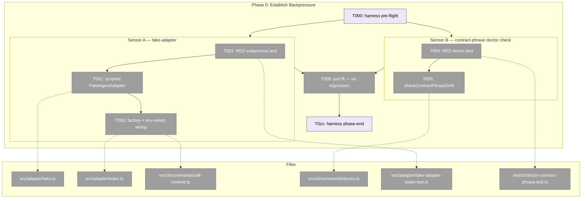
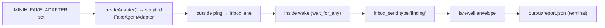
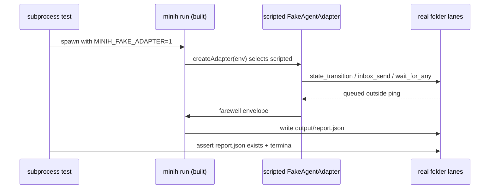

# Phase 0: Establish Backpressure — Task Dossier

**Plan**: [companion-coordination-plan.md](../../companion-coordination-plan.md) · **Phase**: 0 (optional/advisory) · **Mode**: Full · **CS**: 3
**Generated**: 2026-06-14 · **Testing**: Full TDD (RED before GREEN) · **Status**: Ready for GO

> Phase 0 is **optional/advisory** — it builds the two deterministic sensors the post-spec backpressure survey recommended, so the hardest live-behaviour (#40/#35) and docs (#32) claims become *provable* rather than eyeballed. It is **never a gate**: Phases 1–6 build on existing unit seams and do not hard-block on it. Skipping it is a recorded choice that leaves AC-3/4/5/11/13 provable at unit level and the *live end-to-end* rows inferential/dogfood-only.

---

## ⚠️ Validation Findings (validate-v2, 2026-06-14)

Three parallel agents (source-truth, cross-reference, thesis + forward-compat) cross-checked this dossier. Source-truth and cross-reference came back essentially clean — every path/line-number/existence claim verified. The thesis/forward-compat lens found a **design-level problem with Sensor A that is the plan's, not just the dossier's** — surfaced here, **decision pending** (do not implement Sensor A until resolved).

**🔴 HIGH — Sensor A (fake-adapter) cannot, as specified, prove the live #40/#35 rows.** `wait_for_any`/`event-wait` is reachable **only** through the inside-MCP server, which runs as a **spawned subprocess** (`src/mcp/tools/wait.ts:46` → `src/mcp/spawn.ts:52-56`) that **only the real `SdkCopilotAdapter` connects to** (via the Copilot SDK over stdio). A same-process `FakeAgentAdapter` replays events and *ignores* the `mcpServers` config — so a scripted fake **never invokes `wait_for_any`**; it can only write lanes **directly** (exactly what the existing `CoordinatedSmokeAdapter` does), which **bypasses the `event-wait.ts:78-80` snapshot bug #40 is about**. The headline claim — "makes live #40/#35 delivery computational" — is **not achievable with a same-process fake agent adapter**. This is a **decision** (fork below), not a patch.

**🔴 HIGH — buildability blocker for T003.** Even the call-site swap is incomplete: `createSdkRuntime` does a `GH_TOKEN` hard-exit (~`:51`) and a dynamic SDK import (~`:67-105`) **before** the adapter is constructed at `:105`. The env-branch must short-circuit **above** the token gate (and gate `new CopilotClient()` ~`:103`), or a no-`GH_TOKEN` subprocess still fails before reaching the factory. *(Folded into T003 notes.)*

**🟠 MEDIUM — no owner for the warn→fail tighten.** Sensor B defers fail-level promotion to "Phase 6", but Phase 6's tasks (6.1–6.4) only reconcile docs and *expect* the check to pass — none promotes `checkContractPhraseDrift` from `warning`→`fail`. A warning nobody is tasked to promote stays a warning forever. *(Recorded; needs a Phase 6 task when that phase is expanded.)*

**🟡 Applied inline (correctness):** the real `CheckResult` status token is **`warning`**, not `warn` (union `'pass' | 'warning' | 'fail' | 'skip'`; mirror `doctor.ts:684`) — corrected throughout. The "mostly wiring" framing for T002 softened (the lane-driving script is genuinely new logic, reusing `setQueuedRun`/event-replay + `onSessionReady` send-capture, not a free capability).

**🟡 Plan reconciliation owed:** the plan's Domain Manifest still points Phase-0 env-selection at `index.ts` (a barrel that constructs nothing). The real site is `sdk-runtime.ts:105`. Reconcile the plan manifest so the plan-level source of truth isn't self-contradictory.

> **Decision fork for Sensor A** (the live-proof claim): **(a)** re-scope it honestly to a *no-`GH_TOKEN` subprocess smoke sensor* proving a run reaches a terminal `report.json` over real lanes — still useful as a boot/smoke check — and **drop** the "makes live #40/#35 computational" claim; **(b)** build the real thing — spawn the actual inside-MCP server and drive it with a scripted **MCP client** (not a fake *agent*), a materially larger build; or **(c)** since Phase 0 is **optional** and AC-3/4/5/11/13 are unit-provable without it, **skip Phase 0** and start at Phase 1. Sensor B (contract-phrase check) is sound and survives any choice (it could fold into Phase 6 where it's consumed).

---

## Executive Briefing

**Purpose**: Stand up two sensors before the feature work — a `MINIH_FAKE_ADAPTER` scripted-adapter seam and a `contract-phrase` drift check in `minih doctor` — that convert the most consequential gaps from *inferential* to *computational*.

**What We're Building**:
1. **Fake-adapter seam** — a scripted variant of the existing `FakeAgentAdapter` selectable via the `MINIH_FAKE_ADAPTER` env var at adapter construction, so a built-CLI subprocess can drive a full coordinated run (outside ping → inside wake → finding → farewell → `output/report.json`) over **real folder lanes**, without `GH_TOKEN` or the Copilot CLI.
2. **Contract-phrase drift check** — a `checkContractPhraseDrift` doctor check (mirroring the existing `checkPromptStateVocabularyDrift`) that flags drift in the known #32 contract phrases: findings-home wording, exit-reason vocabulary (incl. `no_engagement`), state vocabulary, and the MCP tool count.

**Goals**:
- ✅ A subprocess test proves a scripted coordinated run reaches a terminal `output/report.json` when `MINIH_FAKE_ADAPTER` is set.
- ✅ The real `sdk-copilot` path is **byte-for-byte untouched** when the env var is unset.
- ✅ A doctor test proves contract-phrase drift is detected for a seeded stale phrase.
- ✅ `minih doctor` stays green (or emits a **`warning`** — never `fail`) on the current tree — Phase 0 must not fail the still-drifted docs that Phases 1/6 reconcile (see Pre-Implementation Check ⚠️).

**Non-Goals**:
- ❌ No reconciliation of the actual docs (#32) — that is Phases 1 & 6.
- ❌ No change to the live `sdk-copilot` adapter behaviour or the real run path.
- ❌ No new feature logic for #40/#35/#36 — Phase 0 only builds the sensors that *prove* later phases.
- ❌ Not a gate — descope is allowed and recorded, never blocked.

---

## Prior Phase Context

**None — Phase 0 is the first phase.** No prior-phase deliverables, dependencies, or debt to carry forward. (Phase 0 has `Depends on: None`.)

---

## Pre-Implementation Check

| File | Exists? | Domain Check | Notes |
|------|---------|-------------|-------|
| `src/adapter/fake.ts` | ✅ exists | adapter (internal) | `FakeAgentAdapter` (class @ `:46`) already takes `FakeAgentAdapterOptions` (@ `:19`) — **assess reuse first**: the scripted seam may be mostly *wiring an existing capability*, not a from-scratch build. |
| `src/adapter/index.ts` | ✅ exists | adapter (contract barrel) | **Pure re-export barrel** today (no construction logic). The factory/env-selection helper lands here as a new export; it does **not** currently select anything. |
| `src/cli/commands/sdk-runtime.ts` | ✅ exists | cli (internal) | **⚠️ DISCOVERY — the real construction site.** `new SdkCopilotAdapter(sdkClient as any)` at `:105`. The plan manifest named `index.ts`; the actual env-selection seam must be wired **here** (call the new factory instead of constructing `SdkCopilotAdapter` directly). |
| `src/cli/commands/doctor.ts` | ✅ exists | cli (internal) | `checks.push(...)` extension point confirmed; `checkPromptStateVocabularyDrift` pushed @ `:182` inside `if (coordination.enabled)`; the function itself @ `:640-687` — the precedent to mirror. |
| `test/adapter/fake-adapter-seam.test.ts` | ➕ new | adapter (test) | Precedent: `test/adapter/fake.test.ts` exists (FakeAgentAdapter test patterns). |
| `test/cli/doctor-contract-phrase.test.ts` | ➕ new | cli (test) | Precedent: `test/cli/doctor-state-vocabulary.test.ts` exists (drift-check test patterns to mirror). |

**Duplication scan**: `grep MINIH_FAKE_ADAPTER src/ test/` → **no match** (seam genuinely absent — confirmed, not a reinvention). `FakeAgentAdapter` already exists, so the scripted run capability is an *extension*, not a duplicate.

**⚠️ Sequencing hazard (read before T005)**: #32's whole premise is that the docs are *currently drifted*. A contract-phrase check that asserts the **desired** phrases are present would therefore **fail the current tree** (the reconciliation happens in Phases 1 & 6, after this). Resolve by one of: (a) emit the drift as a **`warning`**-level `CheckResult` (never `fail`) until Phase 6 reconciles, then tighten to `fail` — the real status union is `'pass' | 'warning' | 'fail' | 'skip'` (the token is `warning`, **not** `warn`; mirror `doctor.ts:684`); or (b) scope the check to **forbidden/retired** phrases that must *not* appear, with the RED test proving detection via a **seeded fixture** rather than the live tree. Either keeps `minih doctor` green today while still proving the sensor works. Record the chosen approach in the execution log.

**Harness availability** (router-only): `/eng-harness-flow` router **is installed** (`~/.agents/skills/eng-harness-flow/SKILL.md`). The implement verb will fire the `--event pre-implement` seam before task 1 and `--event phase-end` after — surfaced as T000 / T0zz below.

---

## Architecture Map



---

## Tasks

| Status | ID | Task | Domain | Path(s) | Done When | Notes |
|--------|-----|------|--------|---------|-----------|-------|
| [ ] | T000 | **Harness pre-flight** — `/eng-harness-flow --event pre-implement --phase "Phase 0: Establish Backpressure" --plan-dir docs/plans/027-companion-coordination` | — | — | Router envelope handled; boot verdict (`healthy/SLOW/UNHEALTHY/UNAVAILABLE`) narrated verbatim before any code | Harness seam (router installed) |
| [ ] | T001 | **RED**: subprocess test — a scripted `minih run` reaches a terminal `output/report.json` when `MINIH_FAKE_ADAPTER` is set | adapter | `test/adapter/fake-adapter-seam.test.ts` (new) | Test is **red for the right reason** (env var unrecognised → falls through to `sdk-copilot`, which can't run without `GH_TOKEN`) | AC-3/4/5/11/13 *live* enabler; findings 02/05; plan 026 SUGG-001 |
| [ ] | T002 | Add a **scripted** mode to `FakeAgentAdapter` (replay a fixed turn script: `state_transition` → `inbox_send type:'finding'` → inbox `wait_for_any` → farewell) driving inbox/state/wait over **real lanes** | adapter | `src/adapter/fake.ts` | A scripted adapter completes a coordinated run over real folder lanes; existing `fake.test.ts` still green | First **assess** how much `FakeAgentAdapterOptions` already supports — prefer extending over rebuilding |
| [ ] | T003 | Add `createAdapter(env)` factory to `adapter/index.ts` (returns scripted fake when `MINIH_FAKE_ADAPTER` set, else `SdkCopilotAdapter`); wire the env-branch into `sdk-runtime.ts` **above** the `GH_TOKEN` gate | adapter | `src/adapter/index.ts`, `src/cli/commands/sdk-runtime.ts` | **T001 green**; with the env var **unset** the `sdk-copilot` path is byte-unchanged (no behaviour delta) | ⚠️ construction is at `sdk-runtime.ts:105`, **not** `index.ts`. The env-branch must short-circuit **above** `createSdkRuntime`'s `GH_TOKEN` hard-exit (~`:51`) + dynamic SDK import (~`:67-105`) and skip `new CopilotClient()` (~`:103`) — else a no-token subprocess fails before reaching the factory (validate-v2 HIGH) |
| [ ] | T004 | **RED**: doctor test asserting `contract-phrase` drift is detected for a **seeded stale phrase** | cli | `test/cli/doctor-contract-phrase.test.ts` (new) | Test is red (no such check exists yet) | Mirrors `doctor-state-vocabulary.test.ts` |
| [ ] | T005 | Add `checkContractPhraseDrift(content, dir)` and push it into the `checks[]` array (~`doctor.ts:182`, beside the state-vocab check) for the known #32 phrases (findings-home, exit-reason incl. `no_engagement`, state vocab, MCP tool count) | cli | `src/cli/commands/doctor.ts` | **T004 green**; `minih doctor` stays **clean (or `warning`-level)** on the current tree | ⚠️ see Pre-Impl sequencing hazard — return `status: 'warning'` (not `'warn'`) until Phase 6, or scope to forbidden phrases; finding 08 |
| [ ] | T006 | Run `just fft` (or the targeted adapter + cli suites); confirm the two new tests pass and no existing test regresses | adapter + cli | — | New tests green; full suite green | AC-17 (partial — pinned again at plan end) |
| [ ] | T0zz | **Harness phase-end** — `/eng-harness-flow --event phase-end --plan-dir docs/plans/027-companion-coordination` | — | — | Router envelope handled at phase end | Harness seam (router installed) |

- `Status`: `[ ]` pending · `[~]` in progress · `[x]` complete · `[!]` blocked
- Harness rows (T000/T0zz) are **advisory scaffolding** — the router decides what (if anything) the harness does at each seam; never gates.

---

## Context Brief

**Key findings from plan** (the ones Phase 0 acts on):
- **Finding 02** (#40 root cause): `event-wait.ts:78-80` snapshots inbox IDs at entry. The fake-adapter seam is what makes the *live* fix provable end-to-end (the unit fix lands in Phase 2).
- **Finding 05** (ledger field availability / snapshot ordering): `snapshotCoordinationFiles` runs *after* report write and only on `agentSucceeded` — the scripted run must reach a *successful* terminal `report.json` for the seam to be a faithful e2e proof.
- **Finding 08** (doctor drift one-directional): `checkPromptStateVocabularyDrift` flags prompt-not-in-enum but not the reverse; the contract-phrase class has **no sensor at all** today. T005 adds the mirror.

**Domain dependencies** (consumed concepts/contracts):
- `adapter`: `IAgentAdapter` interface (`src/adapter/interface.ts`) — the scripted variant must satisfy it unchanged; `FakeAgentAdapter` + `FakeAgentAdapterOptions` (`fake.ts`) — the extension surface.
- `cli`: `sdk-runtime.ts` adapter construction (`:105`) — the env-selection injection point; `doctor.ts` `CheckResult[]` + `checks.push` pattern — the check-registration surface.
- `runner` (indirect): real folder lanes (`folder.ts` path helpers, `inbox/{outside,inside}/messages.ndjson`, `state/*.json`) — what the scripted adapter drives, so the subprocess test exercises the genuine coordination substrate.

**Domain constraints**:
- The scripted adapter lives entirely behind `IAgentAdapter` — **no consumer imports the fake by type**; selection is via the factory only. `cli → adapter` is the legal dependency direction (cli constructs the adapter), so wiring the factory call from `sdk-runtime.ts` does not invert any boundary.
- The env-selection must be **inert when unset**: the real `sdk-copilot` path is the default and stays byte-identical.

**Harness context** (router installed):
- **Entry point**: `/eng-harness-flow --event <seam> [--phase <id>] [--plan-dir <p>] --json` — the single door to the harness; child skills are private and never named here.
- **Pre-implement seam** (T000): fired by the implement verb before task 1 — the router's envelope (`route|redirect|noop|ambiguous`) decides what happens; the boot verdict is narrated verbatim.
- **Phase-end seam** (T0zz): fired by the implement verb after T006; the router owns drain-vs-harvest.
- **Backpressure**: `backpressure-coverage.md` (Certainty: **Partial**) is *why this phase exists* — its Recommended Phase 0 table names exactly these two sensors. Phase 0 is the act of building them.

**Reusable from prior phases**: none (first phase). Reusable from the existing tree: `test/adapter/fake.test.ts` (adapter-test harness), `test/cli/doctor-state-vocabulary.test.ts` (drift-check test shape), `FakeAgentAdapterOptions` (scripting hooks).

**Mermaid flow diagram** (what the fake-adapter seam exercises):


**Mermaid sequence diagram** (the subprocess test, T001):


---

## Discoveries & Learnings

_Populated during implementation by the implement verb._

| Date | Task | Type | Discovery | Resolution | References |
|------|------|------|-----------|------------|------------|
| 2026-06-14 | T003 | decision | Adapter construction is at `src/cli/commands/sdk-runtime.ts:105` (`new SdkCopilotAdapter(...)`), **not** `adapter/index.ts` as the plan manifest assumed. | Env-selection factory lives in `adapter/index.ts`; the **call site** to swap is `sdk-runtime.ts:105`. | Pre-Implementation Check |
| 2026-06-14 | T005 | gotcha | #32 docs are currently drifted, so a strict contract-phrase check would **fail the current tree** before Phases 1/6 reconcile it. | Return `status: 'warning'` (or scope to forbidden phrases) until Phase 6 tightens it; RED test uses a seeded fixture. | Pre-Implementation Check ⚠️ |
| 2026-06-14 | T002 | **debt (HIGH)** | validate-v2: a same-process `FakeAgentAdapter` **cannot** invoke `wait_for_any`/`event-wait` — those tools run in a spawned inside-MCP subprocess only the real SDK adapter connects to. It can only write lanes directly (like `CoordinatedSmokeAdapter`), bypassing the #40 snapshot bug. | Sensor A's live-#40/#35 claim is unachievable as a fake *agent* adapter. **Decision pending** — see ⚠️ Validation Findings fork (re-scope / bigger MCP-client build / skip Phase 0). | `wait.ts:46`, `spawn.ts:52-56`, `fake.ts:75-119` |
| 2026-06-14 | T003 | gotcha | validate-v2: `createSdkRuntime` `GH_TOKEN`-hard-exits (~`:51`) and dynamically imports the SDK (~`:67-105`) **before** the adapter is built at `:105`. | The env-branch must short-circuit above the token gate and skip `new CopilotClient()` (~`:103`). | Folded into T003 notes |
| 2026-06-14 | T005 | gotcha | validate-v2: the real `CheckResult` status token is **`warning`**, not `warn` (`'pass' \| 'warning' \| 'fail' \| 'skip'`). | Mirror `status: 'warning'` from `doctor.ts:684`. | Source-truth agent |

**Types**: `gotcha` | `research-needed` | `unexpected-behavior` | `workaround` | `decision` | `debt` | `insight`

---

## Directory Layout

```
docs/plans/027-companion-coordination/
  ├── companion-coordination-plan.md
  └── tasks/phase-0-establish-backpressure/
      ├── tasks.md            ← this dossier
      └── execution.log.md    # created by the implement verb
```

**STOP** — dossier only; no code written. Awaiting human **GO** to implement Phase 0.
