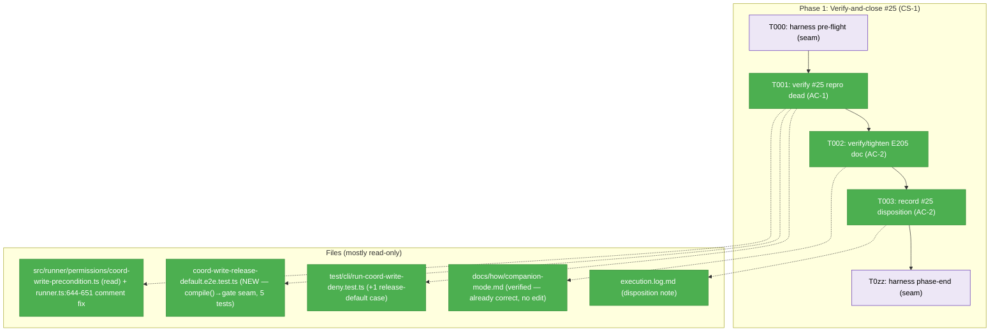
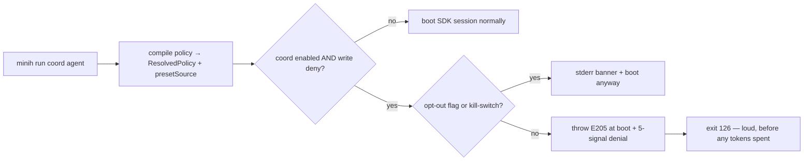
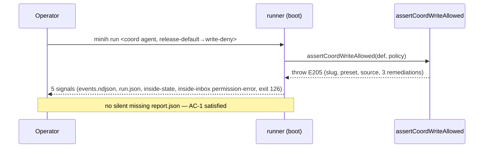

# Phase 1: Verify-and-close permission edge (#25) — Tasks

**Plan**: [companion-coordination-plan.md](../../companion-coordination-plan.md) · **Phase**: 1 · **CS**: 1
**Domain**: runner + docs · **Depends on**: None · **Generated**: 2026-06-15
**Mode**: Full (Full TDD) · **Harness**: router installed (`~/.agents/skills/eng-harness-flow`)

---

## Executive Briefing

**Purpose**: Close GitHub issue **#25** by *proving* — not rebuilding — that the E205 boot gate already kills the coordinated write-deny repro, and by reconciling the one doc the research dossier flagged as describing E205 as an *inbox message*. This is a **verify-and-close** phase: the fix (the FX008 boot precondition) shipped in plan 018; Phase 1 confirms it covers the #25 repro path, tidies any residual doc ambiguity, and records the disposition for the close comment.

**What We're Building**: Almost nothing new. The phase is dominated by *verification* of existing code + tests, one (conditional) characterisation test if a gap exists, a small doc edit only if one is warranted, and a recorded disposition note.

**Goals**:
- ✅ Prove the #25 repro is dead: a coordination-enabled agent whose write policy resolves (incl. via **release-default**) to `deny` fails **loudly at boot** with E205 — never a silent missing envelope. (AC-1)
- ✅ Confirm `companion-mode.md` unambiguously states E205 fires **at boot** (before the inbox exists); tighten only if a real ambiguity remains. (AC-2)
- ✅ Record the verified disposition (repro-is-dead evidence) for the #25 close comment. (AC-2)

**Non-Goals**:
- ❌ **No change to the precondition logic** (`coord-write-precondition.ts`) — it is correct and already covered by 14 test cases.
- ❌ **No new `contract-phrase` doctor check.** The plan's task 1.2 cited "contract-phrase check from 0.4 passes" — but **Phase 0 was dropped** and Sensor B (the contract-phrase check) now lives in **Phase 6**. That clause is struck here; doc correctness in Phase 1 is verified by eyeball + the repo-wide sweep below, not a sensor.
- ❌ No broad doc reconciliation (AGENTS_README etc.) — that is **Phase 6** + review territory.
- ❌ No change to the 5-signal denial protocol.

---

## Prior Phase Context

**None — this is the first feature phase.** (Phase 0 was dropped; see plan § Phase Index. The FX008 precondition this phase verifies shipped in **plan 018-agent-permissions**, not in a prior phase of this plan.)

---

## ⚠️ Grounding Findings (tasks-stage, 2026-06-15)

These were discovered by reading the actual source during dossier generation. They reshape the phase from "build" to "verify", and three of them are candidate corrections the plan/spec/research carried:

| # | Severity | Finding | Evidence | Effect on this phase |
|---|----------|---------|----------|----------------------|
| GF-1 | **HIGH** | **Plan path drift.** The Domain Manifest + plan task 1.1 cite `src/runner/coord-write-precondition.ts:156-198`. The file actually lives at **`src/runner/permissions/coord-write-precondition.ts`** (198 lines). | `grep E205 src/` → only `src/runner/permissions/coord-write-precondition.ts`; no `src/runner/coord-write-precondition.ts` exists | All task paths corrected to `permissions/`. |
| GF-2 | **HIGH** | **#25 repro is already pinned — including the release-default source.** Unit case **(a)** already constructs `presetSource: 'release-default'` + `write: deny` and asserts `throws E205` with structured fields. CLI case (a) asserts the E205 envelope + 5-signal coverage. | `test/runner/permissions/coord-write-precondition.test.ts:55,90`; `test/cli/run-coord-write-deny.test.ts:94` | T001 is **verify-first**; a new test is added *only* if the end-to-end release-default fall-through isn't already covered. |
| GF-3 | **HIGH** | **The doc is already correct.** `companion-mode.md:23` already says `minih run` "enforces this **at boot** via the FX008 precondition." A repo-wide sweep finds **no** doc describing E205 as *arriving as* an inbox message. The research dossier's DE-05 premise ("docs: arrives as inbox message") does not match disk. | `grep -rn E205 docs/ AGENTS_README.md README.md | grep -i 'inbox\|message\|runtime'` → only the accurate `companion-mode.md:23` + `permissions.md:137` | T002 becomes **verify**; edit only the residual nuance (the boot gate also writes one `permission-error` *inbox signal* as part of the 5-signal protocol — worth one clarifying clause so the two aren't conflated). |
| GF-4 | MED | **Dangling cross-phase dependency.** Plan task 1.2's success criterion "(contract-phrase check from 0.4 passes)" references the **dropped** Phase 0. | plan line 141; Phase 0 `🚫 DROPPED` banner | Clause removed from T002; doc correctness verified manually, drift-sensor deferred to Phase 6 (Sensor B). |
| GF-5 | **HIGH** | **The repro is LIVE, not hypothetical — and a stale comment misled the plan.** The shipping release default is **`restricted` (write-deny)**, not `yolo`. A *new* coord agent with no explicit `permissions:` (and no sidecar `lockedDefault`) resolves **via release-default** to write-deny → E205 fires at boot. (Grandfathered installs with a `yolo` `lockedDefault` keep write-allow.) | `presets.ts:138` (`minihReleaseDefault='restricted'`, "flipped from `'yolo'` to `'restricted'`" at Plan 018 R6); `restricted.write='deny'` (`presets.ts:54`); `runner.ts:671` uses it live; `runner.ts:648` "yolo" is a **stale R1 comment** | _Found by validate-v2 (Source-Truth), reversing my own first draft._ Strengthens the close (the gate guards the *current* default). T001 must prove the end-to-end fall-through — **confirmed uncovered**. |

> If T001 ever shows the **silent** missing-envelope path back (E205 *not* firing), escalate per the plan's Key-risk row — Phase 1 would become a real build. Current evidence: the gate fires loudly on the live default, so the *silent* repro is dead.

---

## ⚠️ Validation Findings (validate-v2, 2026-06-15)

Four parallel read-only agents (Source-Truth, Cross-Reference, Thesis-Alignment, Forward-Compatibility) cross-checked this dossier against disk. Outcome: **Cross-Reference CLEAN**, **Forward-Compatibility PASS (all 7 consumer rows)**, **Thesis Strong**, **Source-Truth 1 HIGH** — applied inline:

- **HIGH (fixed) — release-default fact reversed.** My first draft called the write-deny release default "hypothetical" (citing the stale `runner.ts:648` "yolo" comment). Disk says `minihReleaseDefault='restricted'`/write-deny (`presets.ts:138`). Corrected in GF-5, the Context Brief, and T001. Net effect: the repro is the **live default path**, which *strengthens* the verify-and-close.
- **Confirmed gap (sharpened) — end-to-end fall-through untested.** Unit case (a) stamps the `release-default` provenance *label* synthetically; CLI case (a) drives via *frontmatter*. **No test drives a real `compile()` release-default resolution through the boot gate.** T001 is now non-conditional: it must write that characterisation test.
- **Forward-compat (noted) — disposition framing.** T003 must frame the doc as **already correct** (≤1 clarifying clause, or none), not as "fixed a mis-describing doc" — the mis-description only ever lived in plan 027's own spec/research, never in a product doc.
- **Cosmetic — path range** `:155-198` → `:156-198` (gate function span).

---

## Pre-Implementation Check

| File | Exists? | Domain Check | Notes |
|------|---------|-------------|-------|
| `src/runner/permissions/coord-write-precondition.ts` | ✅ 198 lines | runner ✅ | **Read-only this phase.** Boot gate: `assertCoordWriteAllowed()` throws `CoordinationWriteDeniedError` (E205) when coord-enabled + write-deny + no opt-out + no kill-switch (`:155-198`). Exported via `permissions/index.ts`, called at `runner.ts:718` after policy compile. (GF-1: not at the plan's cited path.) |
| `test/runner/permissions/coord-write-precondition.test.ts` | ✅ 264 lines | runner ✅ | Cases (a)–(h): E205 throw + structured fields, message format (preset/source/slug + 3 remediations), sidecar hint, opt-out banner, kill-switch. **Case (a) uses `presetSource: 'release-default'`** (GF-2). AC-1 unit coverage present. |
| `test/cli/run-coord-write-deny.test.ts` | ✅ 255 lines | cli + runner ✅ | CLI regression: coord-enabled + read-only + no flag → E205 envelope + 5-signal coverage; AC-FX8.6 coord-disabled → no fire. AC-1 CLI coverage present. |
| `docs/how/companion-mode.md` | ✅ 327 lines | cli (docs) ✅ | `:23` already states E205 fires "at boot." (GF-3.) Candidate one-clause tighten only. |
| `docs/plans/027-companion-coordination/tasks/phase-1-.../execution.log.md` | ❌ created by implement verb | — | Holds the T003 disposition note. |

**Duplication scan**: no new concept introduced — nothing to de-dup. The precondition, error type, and message formatter all already exist in `permissions/`.

---

## Architecture Map



---

## Tasks

| Status | ID | Task | Domain | Path(s) | Done When | Notes |
|--------|-----|------|--------|---------|-----------|-------|
| [x] | T000 | **Harness pre-flight** — `/eng-harness-flow --event pre-implement --phase "Phase 1: Verify-and-close permission edge (#25)" --plan-dir docs/plans/027-companion-coordination` | — | — | Router envelope handled; boot verdict (`healthy/SLOW/UNHEALTHY/UNAVAILABLE`) narrated verbatim before any code | Harness seam (router installed) |
| [x] | T001 | **Prove the #25 repro is dead.** Confirm existing unit case (a) (stamps `presetSource:'release-default'` + write-deny → throws E205 w/ structured fields) and CLI case (a) (E205 envelope + 5-signal). **Then add the missing end-to-end characterisation test** — confirmed gap (GF-5): no test drives a real `compile()` *release-default* resolution (coord agent, no explicit `permissions:`, no sidecar) through the boot gate to write-deny → loud E205, no silent missing `report.json`. Unit case (a) only stamps the provenance *label*; CLI case (a) drives via *frontmatter*. Deciding question: "does any test drive release-default through `compile()` to write-deny at boot?" → **no → write it.** | runner | `test/runner/permissions/coord-write-precondition.test.ts`, `test/cli/run-coord-write-deny.test.ts` (read + 1 new case), `src/runner/permissions/coord-write-precondition.ts:156-198` (read), `src/runner/permissions/presets.ts:138` (read) | AC-1: a deterministic test proves the **live release-default fall-through** fires E205 loudly at boot. Citing case (a) alone does **not** discharge this — the end-to-end test is required and green. | GF-1, GF-2, GF-5. Also confirm the shipping release default still resolves write-deny (`presets.ts:138`); if a future release re-flips it, re-evaluate the repro. |
| [x] | T002 | **Verify / tighten the E205 doc.** Confirm `companion-mode.md:23` states E205 fires at boot (it does — GF-3). Edit only if a residual ambiguity remains: add ≤1 clause distinguishing the **boot gate** (refuses to start) from the **`permission-error` inbox signal** that the 5-signal protocol *also* emits — so the two are not conflated. Drop the dropped-Phase-0 "(contract-phrase check from 0.4 passes)" criterion. | docs | `docs/how/companion-mode.md` | AC-2 (doc half): the doc unambiguously describes E205 as a boot-time refusal; no doc anywhere describes it as *arriving as* an inbox message. | GF-3, GF-4. If no ambiguity is found, record "no edit needed — already correct" rather than inventing a change. |
| [x] | T003 | **Record the #25 disposition** for the GitHub close comment: a short execution-log note citing the repro-is-dead evidence (the test case names/lines from T001, **including the new fall-through test**) and the verified doc state from T002. **Frame the doc as already correct** (≤1 clarifying clause, or none) — *not* as "fixed a mis-describing doc" (the mis-description only ever lived in plan 027's own spec/research, never a product doc). Note the repro is the live default path. | docs | `docs/plans/027-companion-coordination/tasks/phase-1-verify-and-close-permission-edge/execution.log.md` | AC-2 (disposition half): a quotable close-comment summary exists with concrete test/line evidence and accurate doc framing. | The phase's deliverable that travels to GitHub. |
| [ ] | T0zz | **Harness phase-end** — `/eng-harness-flow --event phase-end --plan-dir docs/plans/027-companion-coordination` | — | — | Router envelope handled at phase end | Harness seam (router installed) |

**Testing approach (Full TDD, adapted for verify-and-close)**: the "RED" here is *characterisation* — assert the current intended behaviour. The existing unit/CLI assertions are already green for the provenance-*label* path (unit case a) and the *frontmatter* path (CLI case a); the genuinely-uncovered path — the **release-default end-to-end `compile()` fall-through to write-deny at boot** — is the one new RED→GREEN characterisation test this phase adds (GF-5). Never fabricate a failing test for ceremony — but here the gap is real and confirmed, so the test is warranted.

---

## Context Brief

**Key findings from plan (applied here)**:
- The fix already shipped (plan 018 / FX008): boot precondition refuses coord-enabled + write-deny runs with E205 + the 5-signal protocol. Phase 1 verifies, does not rebuild.
- Plan Key-risk: "If the repro still reproduces, Phase 1 becomes a real build." Current evidence (GF-2) says it does **not** reproduce.

**Domain dependencies** (concepts this phase consumes):
- `runner/permissions`: `assertCoordWriteAllowed(definition, resolvedPolicy, options)` — the boot gate (read-only); `CoordinationWriteDeniedError` (E205); `formatCoordWriteDeniedMessage()`; `presetSource` provenance (`frontmatter | sidecar | env | release-default`).
- `runner`: policy `compile()` → `ResolvedPolicy.presetSource`; release-default resolves to **`restricted` (write-deny)** per `presets.ts:138` (`minihReleaseDefault`, "flipped from `'yolo'` to `'restricted'`" at Plan 018 R6 — the `runner.ts:648` "yolo" line is a stale R1 comment). So a *new* coord agent with no explicit `permissions:` (and no sidecar `lockedDefault`) hits write-deny → E205 **on the live default path** (grandfathered installs with a `yolo` `lockedDefault` keep write-allow). The repro is **live-pinned, not hypothetical**; unit case (a) stamps the `release-default` provenance label, but the end-to-end `compile()` fall-through is the gap T001 closes (GF-5).

**Domain constraints**:
- Import direction unchanged: cli → runner → adapter. The E205 formatter is a runner export consumed by cli's exit-with-envelope path; the precondition runs entirely in runner.
- No contract change in this phase; `permissions/index.ts` exports are untouched.

**Harness context** (router installed — `~/.agents/skills/eng-harness-flow`):
- **Entry point**: `/eng-harness-flow --event <seam> [--phase <id>] [--plan-dir <p>] --json` — the single door; child skills are private and never named here.
- **Pre-implement seam** (T000): fired by the implement verb at phase start; the boot verdict is narrated verbatim from the envelope. `UNAVAILABLE` falls back to standard testing (not an error).
- **Phase-end seam** (T0zz): fired by the implement verb after all tasks.
- **Backpressure**: `backpressure-coverage.md` rates AC-1 **computational** (a deterministic test proves it) and AC-2 **ABSENT/inferential** (doc-prose correctness has no sensor — the contract-phrase sensor that would catch the *stale phrase* is **deferred to Phase 6**, Sensor B). Phase 1 therefore proves AC-1 by test and AC-2 by eyeball + the repo-wide sweep.

**Reusable from prior work** (plan 018 / FX008):
- Test fixtures: the `assertCoordWriteAllowed` unit harness (cases a–h) and the CLI regression harness (`run-coord-write-deny.test.ts`) are the templates for any new characterisation test — match their structure.

**Mermaid — the boot gate (system flow)**:


**Mermaid — the #25 verification (actor interactions)**:


---

## Discoveries & Learnings

_Seeded with tasks-stage grounding (2026-06-15); extended during implementation by the implement verb._

| Date | Task | Type | Discovery | Resolution | References |
|------|------|------|-----------|------------|------------|
| 2026-06-15 | (grounding) | decision | Plan cites `src/runner/coord-write-precondition.ts:156-198`; real path is `src/runner/permissions/coord-write-precondition.ts`. | Corrected all task paths to `permissions/`. | GF-1; `grep E205 src/` |
| 2026-06-15 | (grounding) | insight | #25 repro (release-default → write-deny → E205) already pinned by unit case (a) + CLI case (a). | T001 re-scoped to verify-first; new test only if fall-through uncovered. | GF-2; test `:55,:90` / `:94` |
| 2026-06-15 | (grounding) | insight | `companion-mode.md:23` already says E205 fires "at boot"; no doc describes it as an inbox message. | T002 re-scoped to verify; ≤1 clause tighten. | GF-3; repo-wide grep |
| 2026-06-15 | (grounding) | gotcha | Plan task 1.2 depended on the **dropped** Phase 0's contract-phrase check (0.4). | Clause struck; drift-sensor deferred to Phase 6 (Sensor B). | GF-4; plan line 141 |
| 2026-06-15 | (validation) | unexpected-behavior | Release default is **`restricted`/write-deny** (not yolo); `runner.ts:648` "yolo" is a stale R1 comment. The #25 repro is the **live default path**, not hypothetical. | Reversed my first-draft claim; corrected GF-5 + Context Brief; T001 made non-conditional (must add the end-to-end fall-through test). | GF-5; validate-v2 Source-Truth; `presets.ts:138`, `runner.ts:671` |

| 2026-06-15 | T001 | decision | `runner.ts:644-651` R1 comment still claimed agents default to `yolo`, contradicting line 671 (`releaseDefault: { preset: minihReleaseDefault }` = `restricted`). The exact GF-5 artifact that misled the plan. | Rewrote the comment to R6 reality (comment-only, zero behaviour change). Placed the new seam test in a dedicated `.e2e.test.ts` — NOT the pure-unit file (its docstring forbids `compile()` coupling). | `runner.ts:671`; `isNonDefaultPolicy:1926` |
| 2026-06-15 | T001 | insight | No test crossed the `compile()`→boot-gate seam: compile tests never feed the gate, gate tests synthesise the policy, CLI drove via frontmatter. | New `.e2e` file drives the real release-default resolution through the gate (8 tests green incl. a premise guard that reddens if the default re-flips). | GF-5; `compile.test.ts`; `coord-write-precondition.test.ts:16` |

**Types**: `gotcha` | `research-needed` | `unexpected-behavior` | `workaround` | `decision` | `debt` | `insight`

---

## Directory Layout

```
docs/plans/027-companion-coordination/
  ├── companion-coordination-plan.md
  └── tasks/phase-1-verify-and-close-permission-edge/
      ├── tasks.md          # this file
      └── execution.log.md  # created by the implement verb (holds T003 disposition)
```
