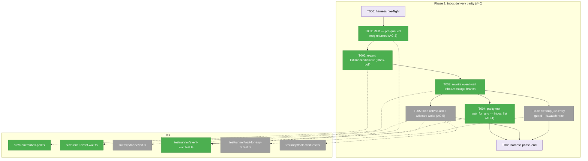
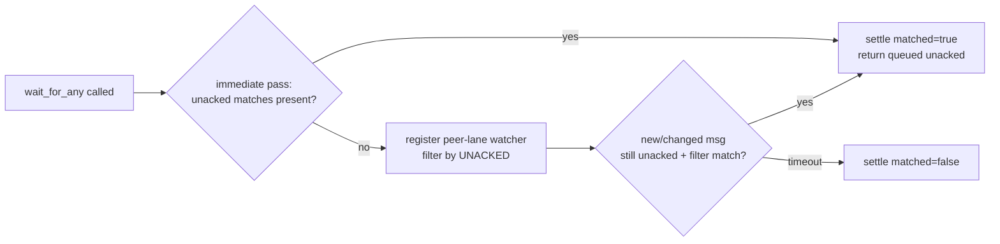
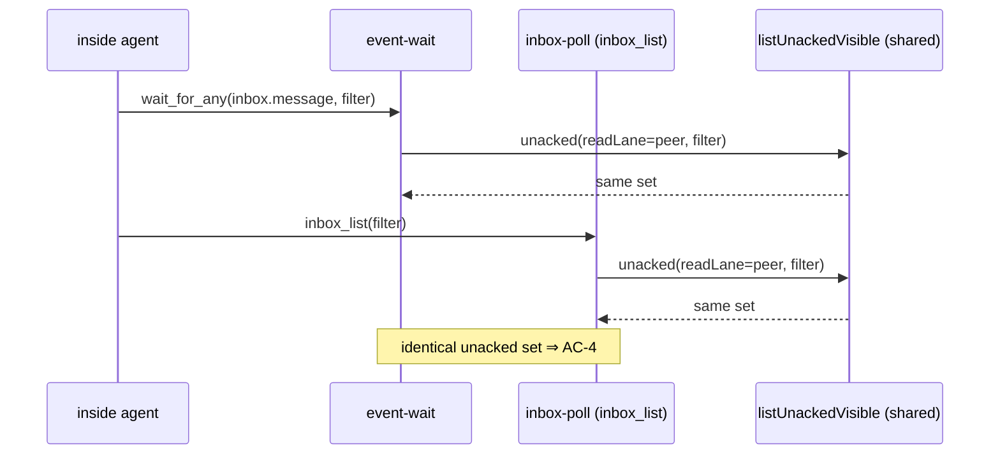

# Phase 2 — Inbox delivery parity (#40)

**Plan**: [companion-coordination-plan.md](../../companion-coordination-plan.md) · **Phase**: 2 (CS-3) · **Mode**: Full (Full TDD)
**Primary domain**: runner (`event-wait`) + mcp · **Depends on**: None *(Phase 0 dropped — the unit tests stand alone)*
**Generated**: 2026-06-15

---

## Executive Briefing

**Purpose**: Make `wait_for_any`'s `inbox.message` branch deliver messages that were **already queued before the call** — the #40 bug — by unifying it onto the same durable **unread/ack** model `inbox_list` (`pollInboxLane`) already uses, instead of its current snapshot-at-entry semantics. A companion that calls the wake primitive must receive matching unacked peer messages whether they arrived before or during the wait window, with `inbox_list` parity for the same filter, and a no-filter "any message" form so a brand-new `type` can never make it deaf.

**What we're building**:
- A single shared, **exported** unacked-set helper lifted out of `inbox-poll.ts`'s private `listVisible` (e.g. `listUnackedVisible`), consumed by *both* `pollInboxLane` and `event-wait` so the two surfaces can never drift.
- A rewritten `event-wait.ts` `inbox.message` branch: an **immediate pass** at entry (returns already-queued unacked matches, mirroring `pollInboxLane`'s `:114-122`) plus a watcher that re-reads and filters by **unacked** (not entry-snapshot). `state.peer.changed` / `state.self.changed` keep snapshot-at-entry — unchanged.
- A `cleanup()` re-entry guard (splice-and-close) hardening the plan-014 single-settle teardown, with a real-`fs.watch` timeout-vs-fire race test.

**Goals**:
- ✅ AC-3 — a message queued **before** the call is returned by `wait_for_any` (proven by a regression test the snapshot-at-entry impl fails).
- ✅ AC-4 — parity: same filter ⇒ `wait_for_any` and `inbox_list` surface the **same** unacked set; single-settle teardown preserved.
- ✅ AC-5 — wildcard wake: a no-filter form wakes on a new/unknown `type`; ack-between-waits suppresses re-delivery, no-ack re-delivers.
- ✅ One consumed-model: `event-wait` and `inbox-poll` share one exported helper (no parallel filter logic).

**Non-Goals**:
- ❌ No transport change — file lanes stay; no envelope reshape (additive only).
- ❌ No change to `state.*` watch semantics — they keep snapshot-at-entry (Workshop 001 Option A: only `inbox.message` unifies).
- ❌ No **live** end-to-end proof under a real clock/subprocess — the `MINIH_FAKE_ADAPTER` sensor that would have driven that was dropped with Phase 0 (a same-process fake adapter can't reach the spawned inside-MCP). The live #40 row stays dogfood/`plan-7` territory; **this phase's unit tests are fully computational** and stand alone.
- ❌ No `coordinationMode`/ledger work — that's Phase 4 (this phase is its parity prerequisite).

---

## Prior Phase Context

### Phase 1 — Verify-and-close permission edge (#25) · CS-1 · ✅ complete

**A. Deliverables**
- `test/runner/permissions/coord-write-release-default.e2e.test.ts` (5 tests) — drives a real `compile()` release-default resolution → `restricted`/write-deny → E205 boot gate.
- `test/cli/run-coord-write-deny.test.ts` case `(a-release-default)` — zero-permissions coord agent → E205 envelope, exit 126.
- `src/runner/runner.ts:644-651` — stale R1 "yolo default" comment corrected to R6 reality (comment-only).
- `docs/how/permissions.md:89` — inbox-lane fix (`outside` → `inside`) for the `permission-error` signal (companion-caught F001, MEDIUM).
- Commits `5ab51e1`, `57644c7`, `a7bcac5`, `181fc19`.

**B. Dependencies exported** — **None for Phase 2.** Phase 1 was verify-and-close on the permission gate; it touched `permissions/`, not the inbox/event-wait surface. Phase 2 depends on "None" in the plan and inherits nothing structural from Phase 1.

**C. Gotchas & debt carried forward**
- **The 5-signal denial protocol writes the `permission-error` message to the `inbox/inside/` lane** (`error-signal.ts:167` → `inboxLanePath(location, 'inside')`), despite the function being named `fireOutsideInboxSignal`. Relevant here: when Phase 2 reasons about which lane carries which message, the *physical* lane is what `listUnackedVisible` reads — names can mislead.
- A companion-mode debrief gotcha (MH-001): send `control:stop` promptly once the last commit is pinged — don't promise an imminent stop while still iterating, or the companion idle-budgets out and self-stops. (Process note; no code impact here.)

**D. Incomplete items** — None. Both ACs met; phase closed clean.

**E. Patterns to follow**
- **Verify against disk before trusting a premise.** Phase 1's plan premise (E205 "described as an inbox message", and the runner "yolo default" comment) was contradicted by the live tree. Phase 2 has the same shape risk: confirm the snapshot bug and the unread/ack model line-by-line (done in the Pre-Implementation Check below) before writing the fix.
- **TDD, RED-for-the-right-reason.** Phase 1's RED tests failed on the precise missing behaviour. Phase 2's 2.1 must go red specifically because a queued-before-entry message is suppressed — not for an unrelated reason.
- **Placement honesty.** Phase 1 deviated from the dossier's suggested test file when the target file's documented contract forbade the coupling. Same licence here: put the real-`fs.watch` race test where real-watch tests live (`wait-for-any-fs.test.ts`), not in the FakeNativeWatcher unit file.

---

## Pre-Implementation Check

| File | Exists? | Domain check | Notes |
|------|---------|--------------|-------|
| `src/runner/event-wait.ts` | ✅ | runner ✓ (internal) | **Modify** the `inbox.message` branch (`:176-213`) + `cleanup()` (`:87-100`). The bug: `snapshotInboxIds()` (`:78`, `:301-312`) + suppression at `:193` (`if (snapshots.inboxIdSnapshot.has(m.id)) continue;`), **and** there is **no immediate pass** — inbox only emits on a watcher fire, so a pre-queued message with no later write is never delivered at all. Findings 02 + 03. |
| `src/runner/inbox-poll.ts` | ✅ | runner ✓ (**contract**) | **Export** an unacked-set helper extracted from private `listVisible` (`:135-171`). New public export = additive **contract change** (flagged, low risk). The unread/ack model to reuse: `acknowledged` set from peer-lane `ack`/`ackOf` records (`:144-148`), `unread` filter (`:150-152`), then `type`/`waitForAny`/`after` (`:154-164`). Note the `after`-slice returns `[]` when the `after` id is absent from the filtered list (module-header contract) — a parity test seeding `after` must use a present id. |
| `src/mcp/tools/wait.ts` | ✅ | mcp ✓ (internal) | **No code change expected.** `parseInboxFilter` already yields `undefined`/`{}` → `filterTypes = null` → wildcard. Used by the 2.5 wildcard test; confirm the no-filter form is documented in the tool's behaviour. |
| `src/runner/types.ts` | ✅ | runner ✓ (contract) | Read-only — `WatchEntry`, `InboxMessage`, `EventEnvelope` shapes. No change. |
| `test/runner/event-wait.test.ts` | ✅ | test | Home for 2.1 (regression), 2.3 (state-entry unchanged), 2.5 (loop ack/no-ack). FakeNativeWatcher harness. |
| `test/runner/wait-for-any-fs.test.ts` | ✅ | test | **Home for 2.6** real-`fs.watch` timeout-vs-fire race test (close-count == N). Do **not** put it in the Fake unit file. |
| `test/runner/inbox-poll.test.ts` | ✅ | test | Regression-guard: `pollInboxLane` stays green after the `listVisible` → `listUnackedVisible` extraction. |
| `test/mcp/tools-wait.test.ts` | ✅ | test | Home for 2.5 wildcard wake test (no-filter wakes on a new/unknown `type`). |

**Duplication scan**: `grep -rn "listVisible\|listUnackedVisible" src/ test/` → `listVisible` is referenced **only** inside `inbox-poll.ts` (3 call sites); no `listUnackedVisible` exists. The export is genuinely new — no reinvention. No `docs/domains/*/domain.md` § Concepts entry duplicates an "unacked visible messages" capability.

**Contract-change flag**: `inbox-poll.ts` gains one new public export (`listUnackedVisible`). Additive, no signature change to `pollInboxLane`. Update `docs/domains/runner/domain.md` if it enumerates the inbox-poll contract (defer prose to Phase 6 reconciliation — note it here).

---

## Architecture Map



---

## Tasks

| Status | ID | Task | Domain | Path(s) | Done When | Notes |
|--------|-----|------|--------|---------|-----------|-------|
| [x] | T000 | **Harness pre-flight** — `/eng-harness-flow --event pre-implement --phase "Phase 2: Inbox delivery parity (#40)" --plan-dir docs/plans/027-companion-coordination` | — | — | Router envelope handled; boot verdict (`healthy/SLOW/UNHEALTHY/UNAVAILABLE`) narrated verbatim before any code | Harness seam (router installed) |
| [x] | T001 | **RED**: regression test — a peer message **queued before** `wait_for_any` is called is returned (subject to the type filter). Add to the FakeNativeWatcher suite: seed the peer lane, then call `waitForAny` with an `inbox.message` entry; assert the pre-existing unacked message comes back `matched:true`. **Plus a negative guard**: with a type filter set, a pre-queued message of a *non-matching* type is **not** returned. | runner | `test/runner/event-wait.test.ts` | Test is **red** against current `event-wait.ts` for the right reason: no immediate pass + entry-snapshot suppression (`:78`/`:193`) means a pre-queued message is never delivered; the negative case asserts the immediate pass still honours the filter | AC-3; finding 02. RED-for-the-right-reason — assert the message body, not just a timeout (V-gap #6) |
| [x] | T002 | Extract the private `listVisible` ack/unread logic into a named **export** `listUnackedVisible(location, readLane, peerLane?, options)` (derive `peerLane` internally as `readLane==='outside'?'inside':'outside'` if omitted — both consumers always use the opposite lane for ack records). Re-point `pollInboxLane`'s 3 internal call sites at it. | runner | `src/runner/inbox-poll.ts` | New stable export; `pollInboxLane` still green (`inbox-poll.test.ts`); filter-chain order (unread→type→waitForAny→after) byte-unchanged | **Contract change** (additive). Refines plan 2.2 sketch (`lane`→`readLane`, `filter`→`options`). **Scope its doc-comment to its real consumers (`pollInboxLane` + `event-wait`)** — do NOT imply Phase 4/5 call it: those derive ledgers/drains over raw `folder.ts` lanes (a *visible-message list* is the wrong shape for ack-chain/count work). Per finding 02 (V forward-compat) |
| [x] | T003 | Rewrite `event-wait.ts` `inbox.message` branch onto the unread/ack model: **(a)** add an immediate pass at entry that returns unacked matches already present (mirror `pollInboxLane:114-122` — settle `matched:true` if any); **(b)** the watcher re-reads and filters by **unacked** via `listUnackedVisible` (not `inboxIdSnapshot`); **(c)** delete the entry-snapshot path for inbox only; **(d)** the immediate pass must **short-circuit before** registering watchers/timeout (no dangling watcher or timer if it settles); **(e)** a torn/corrupt peer lane at the immediate pass maps deterministically to `EventWaitInboxCorruptError` (consistent with the watcher-fire path `:184-190`) — **not** the swallow-to-empty of today's `snapshotInboxIds`. `state.peer.changed`/`state.self.changed` keep snapshot-at-entry untouched. | runner | `src/runner/event-wait.ts` | T001 green; the `state.self.changed` self-write-filter test (the named regression anchor) + `state.*` watch tests unchanged; immediate-settle leaves close-count==0 / no post-settle registration; a RED test seeding a **torn peer lane at entry** rejects with `EventWaitInboxCorruptError`; single-settle teardown preserved | Workshop 001 Option A. Immediate pass fixes "queued-before, no later write" delivery; unacked watcher fixes re-delivery. (V-gaps #1 corrupt-lane, #2 settle-before-registration, #3 state regression anchor) |
| [x] | T004 | **RED→GREEN parity**: for the same filter (and for no-filter), assert `waitForAny`'s `inbox.message` result set equals `pollInboxLane`/`inbox_list`'s unacked set over the same seeded lanes. **Pin the cap contract**: `pollInboxLane` applies `limit` (default 50) + `nextAfter`, `waitForAny` has neither — the parity test must either seed **below** the limit so both surfaces return the full set, or document that `event-wait` passes the same limit; assert identical sets, not coincidentally-equal truncations. | runner | `test/runner/event-wait.test.ts` | AC-4 green — same filter ⇒ identical unacked set across both surfaces; cap behaviour pinned so a future `limit` change can't silently drift parity; teardown single-settle intact | Parity falls out of the shared helper; this test pins it so a future edit to one can't drift the other. (V-gap #5 limit/cap) |
| [ ] | T005 | **Loop + wildcard**: (i) loop test — ack a delivered message between waits ⇒ **no** re-delivery; leave it unacked ⇒ re-delivery on the next wait. (ii) wildcard test — a no-filter `inbox.message` entry wakes on a message with a brand-new/unknown `type`. | runner + mcp | `test/runner/event-wait.test.ts`, `test/mcp/tools-wait.test.ts` | AC-5 green; the MCP `wait.ts` no-filter form (`filterTypes=null`) wakes on an unknown `type` | Workshop 001 §wildcard. Confirm `wait.ts`/prompt use the no-filter form; doc the "any outside message" wake |
| [ ] | T006 | Add a `cleanup()` re-entry guard in `event-wait.ts` (splice the `watchers` array as you close, so a re-entrant `cleanup` can't double-close), and a **real-`fs.watch`** timeout-vs-fire race test asserting the watcher close-count is exactly N (no leak, no double-close). | runner | `src/runner/event-wait.ts`, `test/runner/wait-for-any-fs.test.ts` | Single-settle invariant pinned under a real watcher race; plan-014 teardown contract intact | Finding 03. Real-watch test goes in `wait-for-any-fs.test.ts`, **not** the Fake unit file |
| [ ] | T0zz | **Harness phase-end** — `/eng-harness-flow --event phase-end --plan-dir docs/plans/027-companion-coordination` | — | — | Router envelope handled at phase end (drain-vs-harvest is the router's call) | Harness seam (best-effort) |

**Whole-phase gate** (AC-17): `just fft` exits 0 with the new tests included; no regression in the existing coordination suite (`event-wait.test.ts`, `inbox-poll.test.ts`, `tools-wait.test.ts`, `wait-for-any-fs.test.ts`, `runner-event-driven.test.ts`).

---

## Context Brief

**Key findings from plan** (applied here):
- **Finding 02 (Critical)** — `event-wait.ts:78` snapshots inbox IDs at entry; `:193` suppresses snapshot IDs; **and there is no immediate pass**, so `inbox.message` only ever emits on a *change during the window*. `inbox-poll.ts` already has the durable unread/ack model but `listVisible` is private, and `wait.ts:46` delegates straight to `runner.waitForAny` (it does **not** inherit `pollInboxLane`). → export the helper (T002), rewrite the branch (T003).
- **Finding 03 (High)** — single-settle teardown guards `settled` but `cleanup()` itself isn't re-entry-guarded; AC-tests use `FakeNativeWatcher`, not real `fs.watch` under concurrent timeout+fire. → T006 splice-and-close guard + real-watch race test.

**Domain dependencies** (concepts/contracts this phase consumes — from the source, no domain.md § Concepts entry for these yet):
- `runner/inbox-poll`: unacked/visible computation (`listVisible` → exported `listUnackedVisible`) — the single ack/unread filter chain both surfaces share.
- `runner/folder`: `inboxLanePath(location, side)`, `CoordinationRunLocation` — lane path resolution.
- `runner/file-watcher`: `watchFileChanges` / `WatchFactory` — the watch primitive both `event-wait` and `inbox-poll` long-poll on.
- `runner/types`: `WatchEntry`, `InboxMessage`, `EventEnvelope`, `Side` — envelope shapes (read-only).

**Domain constraints**:
- `mcp → runner` is legal (the wait tool already imports `event-wait`); `event-wait` and `inbox-poll` are sibling runner internals — share via an explicit export, never a deep import into the other's private functions.
- Additive only: the new export must not change `pollInboxLane`'s signature or filter-chain order (LOAD-BEARING per the `inbox-poll.ts` module doc).
- Lane direction: the inside agent watches the **peer** lane (`outside`) and computes unacked from its **own** (`inside`) lane's `ack`/`ackOf` records — identical to inside `inbox_list` semantics. Keep this mapping when wiring `listUnackedVisible` into `event-wait` (readLane = peer, ack-lane = self).

**Harness context** (router installed at `~/.agents/skills/eng-harness-flow`):
- **Entry point**: `/eng-harness-flow --event <seam> [--phase] [--plan-dir] --json` — the single door; child skills never named.
- **Pre-implement seam** (T000): the implement verb fires it at phase start; boot verdict narrated verbatim. Phase 1's boot came up `degraded`/SLOW (known `minih-doctor` + `audit` warnings) and proceeded — expect the same baseline unless the tree changed.
- **Phase-end seam** (T0zz): fired after all tasks; the router decides drain-vs-harvest.
- **Backpressure**: `backpressure-coverage.md` exists (Certainty **Partial**). For Phase 2, AC-3/4/5 are **computational** at the unit level (a snapshot-at-entry impl fails 2.1; parity/loop/wildcard are deterministic). The **live** e2e row for #40 stayed inferential when Phase 0 (the `MINIH_FAKE_ADAPTER` sensor) was dropped — do not claim live-timing proof from unit tests.

**Reusable from prior phases / existing suite**:
- `test/runner/event-wait.test.ts` — `FakeNativeWatcher` harness + lane/state seeding helpers for deterministic unit tests (T001, T004, T005-loop).
- `test/runner/wait-for-any-fs.test.ts` — real-`fs.watch` test scaffolding (T006 race test).
- `test/runner/inbox-poll.test.ts` — fixtures for unacked/ack seeding; regression-guards the extraction.
- `test/mcp/tools-wait.test.ts` — MCP `wait_for_any` tool harness (T005 wildcard).

**Mermaid — delivery flow (the fix)**:


**Mermaid — parity (AC-4)**:


---

## Discoveries & Learnings

_Populated during implementation by the implement verb._

| Date | Task | Type | Discovery | Resolution | References |
|------|------|------|-----------|------------|------------|

**Types**: `gotcha` | `research-needed` | `unexpected-behavior` | `workaround` | `decision` | `debt` | `insight`

---

## Validation Findings

_`/validate-v2` ran on this dossier (2026-06-15) — 4 parallel agents (Source-Truth, Cross-Reference, Completeness+Thesis, Forward-Compatibility) on the current session model. Verdicts: Source-Truth **SOUND**, Cross-Reference **ALIGNED**, Forward-Compat **COMPATIBLE**, Completeness **5 gaps** (1 HIGH, 2 MEDIUM, 2 LOW). Thesis: understood ✓, value claim advanced ✓, proof level Implementation, evidence Adequate. All actionable findings were folded into the task table above; recorded here for posterity._

| ID | Sev | Finding | Disposition |
|----|-----|---------|-------------|
| V-1 | **HIGH** | The new immediate-pass adds a **synchronous** lane read at `waitForAny` entry. Today's only entry read (`snapshotInboxIds`, `:301-312`) **swallows** corruption (`catch { return new Set() }`); a `listUnackedVisible`-based read will **throw** on a torn lane — a new failure path no task pinned. | **FIXED** — T003(e) + a RED test for a torn peer lane at entry mapping to `EventWaitInboxCorruptError`. |
| V-2 | MEDIUM | Settle-before-registration leak: if the immediate pass settles before the watcher/timeout loop (`:132`/`:157`), the loop would still register watchers after settle → leak. | **FIXED** — T003(d) + close-count==0 / no-post-settle-registration criterion. |
| V-3 | MEDIUM | `pollInboxLane` caps results with `limit` (default 50) + `nextAfter`; `waitForAny` has neither → parity (T004) could compare a capped set vs an uncapped set. | **FIXED** — T004 pins the cap contract (seed below the limit, or pass the same limit). |
| V-4 | LOW | No negative case asserting a **filtered-out** type is not delivered by the immediate pass. | **FIXED** — added to T001. |
| V-5 | LOW | `state.*`-untouched was prose-only. | **FIXED** — T003 names the `state.self.changed` self-write-filter test as the explicit regression anchor. |
| V-6 | LOW | T002 Notes implied **Phase 4/5 reuse** `listUnackedVisible`; the plan builds those (`deriveCompanionLedger` over `folder.ts` lanes; `drainAndReadInbox` over live lanes) as **separate** helpers — a *visible-message list* is the wrong shape for ack-chain/count work. Misleading note could push an implementer into a shape mismatch. | **FIXED** — T002 Notes re-scoped to its real consumers (`pollInboxLane` + `event-wait`). |
| V-7 | LOW | T002 signature refined the plan's 3-param sketch without flagging it; `unread` filter cited `:150-151` (spans `:150-152`); `after`-absent ⇒ `[]` caveat un-noted. | **FIXED** — T002 marked "(refines plan 2.2 sketch)"; line-ref + `after` caveat corrected in the Pre-Implementation Check. |

> Net: the dossier accurately describes the code (the snapshot bug, the unread/ack model, the lane direction were all confirmed line-by-line), and the two genuine seams the new entry-read opens — a throw path and a settle-ordering leak — are now explicit RED criteria so they can't ship green-but-wrong.

## Directory layout

```
docs/plans/027-companion-coordination/
  ├── companion-coordination-plan.md
  └── tasks/phase-2-inbox-delivery-parity/
      ├── tasks.md          # this file
      └── execution.log.md  # created by the implement verb
```
