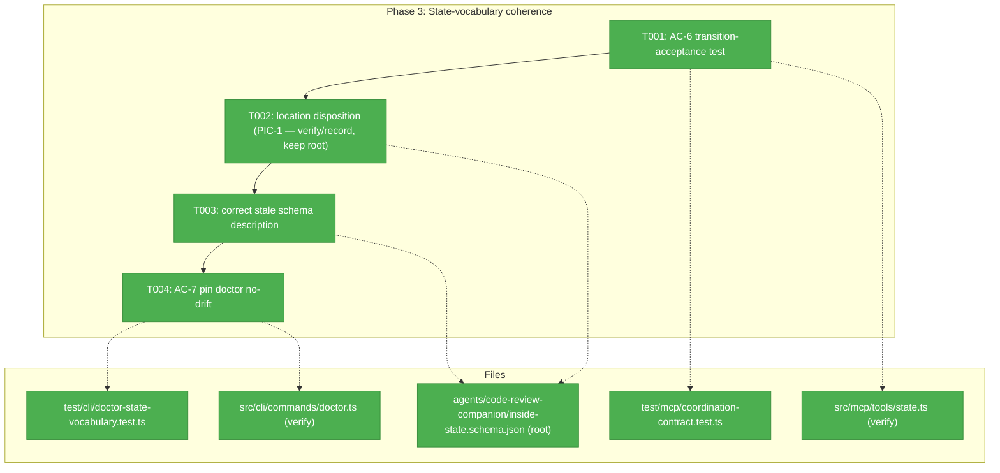
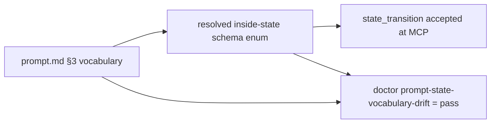
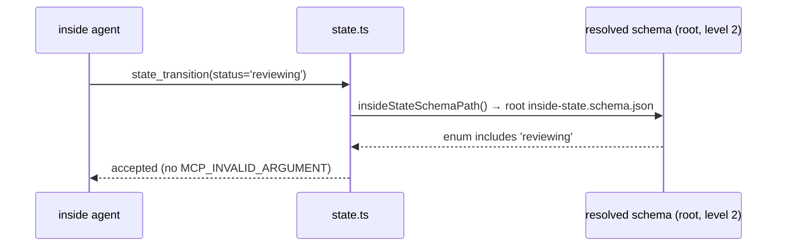

# Phase 3 — State-vocabulary coherence (#27/#31) · Tasks & Context Brief

**Plan**: [companion-coordination-plan.md](../../companion-coordination-plan.md) · **Phase**: 3 · **CS**: 2 · **Depends on**: None
**Primary domains**: pack + cli (doctor) + mcp · **Status**: dossier — awaiting human GO
**Generated**: 2026-06-15

---

## Executive Briefing

**Purpose**: Prove every status the companion prompt publishes is accepted by the schema it validates against, and that `minih doctor` reports no prompt↔schema drift. Per Key Finding 01 this is a **verify-and-pin** phase (the schema already exists and already matches), *not* a build — the same shape as Phase 1 (#25).

**What We're Building**:
- A transition-acceptance test (AC-6): every companion `state_transition` target (`idle/reading/reviewing/reporting/blocked/stopping`) is accepted by the **resolved** inside-state schema.
- A doctor-pass test (AC-7): `prompt-state-vocabulary-drift` returns `pass` for the `code-review-companion` pack.
- A corrected schema `description` (the stale "inside-state validation is not yet enforced" line, made truthful against the verified runtime).

**Goals**:
- ✅ Pin AC-6 (per-transition acceptance) and AC-7 (doctor no-drift) so a future enum/prompt edit can't silently reopen #27/#31.
- ✅ Correct the schema's stale `description` to match the verified runtime behaviour.
- ✅ Resolve the plan-vs-install conflict on schema **location** (see PIC-1) and **record the disposition** for posterity (verify-and-close style).

**Non-Goals**:
- ❌ Touching the global default schema (`src/schemas/inside-state.json`) — out of scope, byte-unchanged.
- ❌ Changing the per-pack enum (it must stay **exactly** the published set; the doctor drift check is one-directional prompt→enum, so an exact match keeps it green and leaves no enum value orphaned — Finding 08).
- ❌ Any ledger / tool / CLI work (Phase 4+). No transport or envelope change.
- ❌ **Blindly relocating the schema to `state/`** — see PIC-1; this is actively unsafe for this installable agent and the recommended disposition is to *not* relocate.

---

## ⚠️ PIC-1 — Critical plan-vs-install conflict (read before implementing T002)

> **The plan's task 3.2 ("relocate `inside-state.schema.json` → `state/…`; remove the legacy file") conflicts with the install-manifest contract for this agent. Recommended disposition: do NOT relocate. Keep the schema at agent root; reshape T002 into verify-and-record.**

**Evidence (three independent sources, all current as of 2026-06-15):**

1. **`src/runner/agent-pack/manifest.ts:15-20`** — `RUNTIME_DIR_NAMES = ['runs','inbox','state','.git']`. `validateManifest` (`:66-68`) **rejects any manifest file path that starts with a runtime dir name**, including `state/`. So `state/inside-state.schema.json` cannot appear in a pack manifest.
2. **`code-review-companion` is an installable pack** — it ships `agents/code-review-companion/agent.json` (`"version": "0.2.0"`, `"type": "minih-agent"`, `"minihVersion": ">=0.3.0"`) with an explicit `files[]` that lists **`inside-state.schema.json` at root**. Implicit-manifest synthesis (`CANONICAL_AGENT_FILES`, `manifest.ts:30-38`) also only picks up the **root** filename — a `state/`-located schema is invisible to both explicit and implicit install paths.
3. **The `agent.json` entry already documents the reason** verbatim: *"Lives at agent root because `state/` is a runtime directory (see `RUNTIME_DIR_NAMES` …) and cannot host install-payload files. The MCP `state.ts` resolver's 3-level fallback still finds root-level schemas at level 2."* `src/templates/shared-preamble.md:221` states the same rule: **installable agents MUST use the root location; only in-tree-only agents (e.g. `demo-companion`) may use `state/`.**

**Why relocating is actively harmful (not just blocked):** if the schema moves to `state/` and is dropped from the install payload, an *installed* companion resolves to the **default global enum** (`idle | in-progress | paused | reviewing | complete | error`), which lacks `reading/reviewing/reporting/blocked/stopping`. Every such `state_transition` is then silently rejected — **reintroducing the exact #27/#31 bug on installed copies** while the in-tree copy looks fine.

**Root cause of the conflict:** the plan (2026-06-14) and Workshop 002 named `state/` the "preferred convention" without accounting for the install denylist. The install rationale landed separately via `code-review-companion@0.2.0` (#30/#33). The "preferred `state/`" convention is real but applies to **in-tree-only** agents; this agent is installable, so root is correct.

**Disposition — DECIDED 2026-06-15 (Jordan): keep root, do not relocate.** (Rationale confirmed: the schema is shipped config and belongs with its sibling schemas at root; `state/` is runtime output and install-denied — moving it is the anti-pattern, not the ideal. The "`.minih` footprint" question is noted separately and does not bear on this.) The disposition:
- Keep `agents/code-review-companion/inside-state.schema.json` **at root**.
- Reshape **T002** from "relocate + remove legacy" → "**verify** the schema resolves at root (resolver level 2) and **record** that `state/` relocation is intentionally declined for this installable agent, citing the manifest denial." (Mirrors #25's verify-and-close.)
- AC-6/AC-7 are **already satisfiable at root** — no relocation is needed to make this phase green.
- Optionally amend the plan's Phase 3 Delivers/Domain-Manifest rows to drop the relocation (the flow's fix-loop).

The task table below tables both 3.2's literal instruction and the recommended alternative so the decision is explicit.

---

## Prior Phase Context

### Phase 1 — Verify-and-close permission edge (#25) · COMPLETE
- **A. Deliverables**: `test/runner/permissions/coord-write-release-default.e2e.test.ts` (5 boot-gate tests, green); amended `test/cli/run-coord-write-deny.test.ts` (release-default case); comment-only fix `src/runner/runner.ts:644-651`; lane-path doc fix `docs/how/permissions.md:89` (companion F001). AC-1/AC-2 met.
- **B. Dependencies exported**: none new (reused `assertCoordWriteAllowed`, `CoordinationWriteDeniedError` (E205), `presetSource` provenance). Reusable **test templates**: e2e characterisation + CLI-regression envelope assertion.
- **C. Gotchas & debt**: E205 was *always* correctly documented (fires at boot, not as inbox msg) — the error lived only in the plan's own research premise, so "no edit needed" was the right disposition. Release default is **live** `restricted` (write-deny), not hypothetical.
- **D. Incomplete items**: none. **Sensor B (contract-phrase doctor check)** deferred to **Phase 6** (the `0.4`/contract-phrase clauses in later phases are no-ops until then — relevant to **T003** below).
- **E. Patterns to follow**: verify-first → minimal characterisation test only if a gap is confirmed → one-line doc edit *or* an explicit "no edit needed — already correct" + a disposition note in the execution log for the GH close comment. **This is the template Phase 3 follows.**

### Phase 2 — Inbox delivery parity (#40) · COMPLETE
- **A. Deliverables**: exported `listUnackedVisible(...)` from `inbox-poll.ts`; unified `event-wait.ts` `inbox.message` branch on the unread/ack model; tests across `event-wait.test.ts`, `wait-for-any-fs.test.ts`, `tools-wait.test.ts`. Coordination suite **68/68**.
- **B. Dependencies exported**: `listUnackedVisible` + `ListFilterOptions` (Phase 4/5 build *separate* helpers over raw `folder.ts` lanes — do **not** reuse this list-shaped helper for ledger work). Not consumed by Phase 3.
- **C. Gotchas & debt**: lane-direction (readLane=peer, ack-lane=self) is load-bearing; corrupt lane now **throws** (no swallow); `cleanup()` splice-and-close re-entry guard.
- **D. Incomplete items**: none. Non-goal honoured: no live e2e (fake adapter dropped with Phase 0) — Phase 2 proof is unit-level only.
- **E. Patterns to follow**: TDD **RED-for-the-right-reason** with **discriminating** assertions (assert the message *body*, not mere presence); pin parity structurally with a unit test. Phase 3's AC-6 test should likewise assert each transition is *accepted* (not just that the call returns).

---

## Pre-Implementation Check

| File | Exists? | Domain check | Notes |
|------|---------|-------------|-------|
| `agents/code-review-companion/inside-state.schema.json` | ✅ yes (legacy/root) | pack (non-domain, DB-08) | Enum already = published set `[idle,reading,reviewing,reporting,blocked,stopping]`. Stale `description` (T003). **PIC-1: keep at root.** |
| `agents/code-review-companion/state/inside-state.schema.json` | ❌ no | pack | The plan's relocate **target**. **PIC-1: do NOT create** — `state/` is install-denied for this pack. |
| `agents/code-review-companion/agent.json` | ✅ yes | pack | Installable manifest (`v0.2.0`) listing the schema at **root**, with a comment explaining the root requirement. Source of PIC-1. |
| `agents/code-review-companion/prompt.md` | ✅ yes | pack (read-only ref) | §3 State Vocabulary table = the 6 statuses; boot/loop `state_transition status='idle'`/`'stopping'`. The drift-check source-of-truth. |
| `src/mcp/tools/state.ts` | ✅ yes | mcp | `insideStateSchemaPath` 3-level resolver (`:182-192`): `state/` → root → default. `validateInsideState` (`:150-170`) compiles + **throws** `MCP_INVALID_ARGUMENT` on mismatch, and **is invoked at `:100` from `stateTransition`** → inside-state validation **is** enforced at runtime (resolves T003's wording). No change expected. |
| `src/cli/commands/doctor.ts` | ✅ yes | cli | `checkPromptStateVocabularyDrift` (`:640-687`) + `resolveInsideStateSchemaPath` (`:574-580`, same 3-level order) + `extractPromptStateValues` (`:594-631`, scoped to "State Vocabulary" headings + `state_transition` lines). Returns `warning` on drift today (Phase 6 promotes to `fail`). **Verify-and-pin** — no change expected. |
| `test/mcp/coordination-contract.test.ts` | ✅ yes | mcp (test) | Already tests (a) preferred `state/` and (b) legacy root resolution — **extend here for AC-6** (per-transition acceptance against the resolved schema). |
| `test/cli/doctor-state-vocabulary.test.ts` | ✅ yes | cli (test) | Existing doctor-drift test home (already seeds a `state/inside-state.schema.json` fixture) — **extend here for AC-7** (pin `pass` for the companion pack). |

**Contract-change / risk flags:**
- 🔴 **PIC-1 (Critical)**: T002 relocate vs install-manifest `state/` denial — see the dedicated section above.
- 🟢 T003 resolved by validate-v2: `validateInsideState` **does** gate `state_transition` (`state.ts:100`) — validation is enforced, so the "not yet enforced" line is definitively stale. Reword to state out-of-enum transitions are rejected (don't restate the stale claim).
- 🟡 T003's "contract-phrase check passes" Done-When is a **no-op until Phase 6** (Sensor B deferred — Phase 1 finding D). Treat as "no stale phrase introduced," not "a check runs."

---

## Architecture Map



---

## Tasks

| Status | ID | Task | Domain | Path(s) | Done When | Notes |
|--------|-----|------|--------|---------|-----------|-------|
| [x] | T000 | **Harness pre-flight** — `/eng-harness-flow --event pre-implement --phase "Phase 3: State-vocabulary coherence (#27/#31)" --plan-dir docs/plans/027-companion-coordination` | — | — | Router envelope handled; boot verdict narrated verbatim before any code | Harness seam (router installed) |
| [x] | T001 | **RED→GREEN (AC-6)**: a test exercising every companion `state_transition` target (`idle/reading/reviewing/reporting/blocked/stopping`) against the **resolved** companion schema — each accepted; **plus a discriminating negative**: a truncated-enum fixture (drop one value) must reject that transition with `MCP_INVALID_ARGUMENT` | mcp | `test/mcp/coordination-contract.test.ts` (extend) | All 6 transitions accepted against the **actual 6-value** companion schema (not the file's existing 2-value `idle\|reading` fixture); the dropped-value negative proves the test fails if an enum value is dropped | AC-6; Finding 01. Likely green today — pins it. Validation IS enforced (`state.ts:100`), so the negative case really throws — assert *rejection*, not just call-return (Phase 2 discriminating-test pattern) |
| [x] | T002 | **Location disposition (PIC-1) — DECIDED: keep at root.** Verify the schema resolves at **root** (resolver level 2) and record that `state/` relocation is **declined** for this installable agent (the schema is shipped config — sibling of `output-schema.json`/`input-schema.json` at root; `state/` is install-denied runtime output). Do **not** relocate; do **not** remove the file. | pack | `agents/code-review-companion/inside-state.schema.json` · `agent.json` | Schema resolves at root; install payload still ships it; keep-root disposition recorded in execution log | **Decided 2026-06-15 (Jordan): keep root, no relocate.** Plan's Phase 3 Delivers/Domain-Manifest relocate rows are superseded |
| [x] | T003 | Correct the schema's stale `description` ("inside-state validation is not yet enforced") — it **is** enforced: `state.ts:100` calls `validateInsideState`, which **throws** `MCP_INVALID_ARGUMENT` on an out-of-enum status. Reword to state the runtime rejects out-of-enum transitions | pack | `agents/code-review-companion/inside-state.schema.json` | `description` states enforcement accurately (out-of-enum `state_transition` is rejected); no stale phrase introduced | Doc-drift. Validation confirmed enforced (validate-v2 source-truth). Contract-phrase sensor is Phase 6 (no-op now) |
| [x] | T004 | **Pin (AC-7)**: a test asserting `minih doctor`'s `prompt-state-vocabulary-drift` = `pass` (status, not `warning`/`skip`) for the `code-review-companion` pack | cli | `test/cli/doctor-state-vocabulary.test.ts` (extend) | AC-7 test green; fails if prompt or enum drift introduced | `doctor.ts:640-687`. Keep enum = published set (both-direction green, Finding 08) |
| [x] | T0z | **Harness phase-end** — `/eng-harness-flow --event phase-end --plan-dir docs/plans/027-companion-coordination` | — | — | Router envelope handled at phase end | Harness seam (router installed) |

> **Whole-plan AC-17** still applies: `just fft` exits 0 with the new tests included; no regression in the coordination suite (68/68 from Phase 2).

---

## Context Brief

**Key findings from plan (applied here):**
- **Finding 01 (Critical)**: #27/#31 is already partly fixed — the schema exists with the exact enum and resolves. → Phase 3 is verify/correct/pin. **This dossier refines it: the *relocate* sub-step is unsafe for this installable agent (PIC-1).**
- **Finding 08 (Medium)**: doctor drift-check is one-directional (prompt→enum), and returns `warning` (not `fail`) on drift today — Phase 6 promotes it. → keep the per-pack enum exactly the published set so the check stays green and no enum value is orphaned.

**Domain dependencies (concepts/contracts consumed):**
- `mcp`: inside-state resolution + validation — `insideStateSchemaPath` (3-level fallback) and `validateInsideState` in `src/mcp/tools/state.ts`.
- `cli`: `prompt-state-vocabulary-drift` doctor check — `checkPromptStateVocabularyDrift` / `extractPromptStateValues` in `src/cli/commands/doctor.ts`.
- `pack` (non-domain, DB-08): `code-review-companion` prompt §3 vocabulary + per-pack schema + `agent.json` install manifest.

**Domain constraints:**
- pack changes are governed by convention, not the domain registry (DB-08); `minih doctor` is the coherence sensor.
- Do not introduce a cli→mcp dependency: `doctor.ts` deliberately **re-implements** the 3-level resolver rather than importing it (`doctor.ts:567-568`). Keep that.
- `state/` is install-denied (`RUNTIME_DIR_NAMES`) — root is the installable-agent location.

**Harness context (router installed):**
- **Entry point**: `/eng-harness-flow --event <seam> [--phase <id>] [--plan-dir <p>] --json` — single door; child skills never named.
- **Pre-implement seam** (T000): fired by the implement verb before any code; verdict narrated verbatim (`healthy / SLOW / UNHEALTHY / UNAVAILABLE`).
- **Phase-end seam** (T0z): fired at phase end; router owns drain-vs-harvest.
- **Backpressure**: `backpressure-coverage.md` (Certainty: Partial). AC-6/AC-7 are computational (deterministic tests).

**Reusable from prior phases:**
- Phase 1 verify-and-close template (verify-first → minimal test → doc edit *or* "no edit needed" + disposition note). T002/T003 follow it directly.
- Phase 2 discriminating-test discipline (assert the meaningful value, not mere presence) for T001.
- Existing fixtures: `test/mcp/coordination-contract.test.ts` (both schema locations) and `test/cli/doctor-state-vocabulary.test.ts` (drift fixture) — extend, don't recreate.

**Mermaid flow (system states):**


**Mermaid sequence (resolution + validation):**


---

## Discoveries & Learnings

_Populated during implementation by the implement verb._

| Date | Task | Type | Discovery | Resolution | References |
|------|------|------|-----------|------------|------------|
| 2026-06-15 | T001 | insight | `stateTransition` validates `next` (`state.ts:100`) **before** the no-op short-circuit (`:102`), so even `idle→idle` validates the target against the enum — which is why the all-6 acceptance loop genuinely exercises validation regardless of the prior status. | Test reads the real shipped schema at root; loop asserts each `to`. | `state.ts:100,102` |
| 2026-06-15 | T002 | decision | PIC-1 keep-root verified end-to-end: root file present, **no** `state/` copy, listed in `agent.json` install payload. Relocation would drop it from the payload → installed copies fall back to the default enum → reintroduces #27/#31. | No relocation; recorded keep-root. | `agent.json:32`; `manifest.ts` `RUNTIME_DIR_NAMES` |
| 2026-06-15 | T003 | insight | "not yet enforced" was definitively stale — `validateInsideState` is invoked by both `stateTransition` (`:100`) and `stateSet` (`:81`) and throws `MCP_INVALID_ARGUMENT` (`:166`); proven live by T001 case (e). | Reworded to enforcement-as-fact. | `state.ts:81,100,166`; `types.ts:55` |
| 2026-06-15 | T004 | insight | AC-7 is pinned against the **real** pack (`path.resolve('agents')`), not a synthetic fixture — so it goes RED the moment prompt and enum diverge in the shipped companion. | doctor drift = `pass` for `code-review-companion`. | `doctor.ts:640-687` |

**Types**: `gotcha` | `research-needed` | `unexpected-behavior` | `workaround` | `decision` | `debt` | `insight`

---

## Directory layout

```
docs/plans/027-companion-coordination/
  ├── companion-coordination-plan.md
  └── tasks/phase-3-state-vocabulary-coherence/
      ├── tasks.md            # this file
      └── execution.log.md    # created by the implement verb
```

---

## Validation Record — tasks dossier (validate-v2, 2026-06-15)

**Verdict: ✅ VALIDATED** (Implementation-ready for T001/T003/T004; T002 decision-blocked on PIC-1 by design).

**Thesis**: give an implementable, source-accurate Phase-3 plan AND catch any blocker that would make the plan's literal tasks ship the #27/#31 bug. Proof target = Implementation; PIC-1 held to Validated Evidence (source-match).

| Agent (lens) | Result | Headline |
|---|---|---|
| Source-Truth | ✅ 9/9 claims CONFIRMED | PIC-1 rock-solid. **New fact**: `validateInsideState` invoked at `state.ts:100` → inside-state validation **is** enforced (the schema's "not yet enforced" is definitively stale). |
| Cross-Reference | ✅ all CONFIRMED · **1 HIGH plan gap** | Task mapping 3.0–3.z → T000–T0z clean; ACs match spec; prior-phase context accurate. The plan **never mentions `RUNTIME_DIR_NAMES`** — PIC-1 is a genuine plan gap, correctly surfaced (not a unilateral rewrite). |
| Completeness + Forward-Compat | ✅ ADVANCING · 2 actionable | FC matrix: keep-root disposition **fully satisfies** Phase 4 (`coordination_status`) + Phase 6 (`allowedStates`) via resolver level-2; relocate would break installed copies. Flagged the AC-6 discrimination gap. |
| Thesis Alignment | ✅ Yes / Strong | No thesis drift, no proxy, **no non-goal creep** — flagging-for-Jordan vs rewriting is the right restraint. Value claim Partially (T002 decision-dependent). |

**Forward-Compatibility — Outcome alignment** (verbatim from the FC agent): *The companion's state vocabulary is coherent so the human-view workbench renders state and the companion is never silently "deaf"; installed copies must not regress.* ✅ **ADVANCING** — the keep-root disposition keeps the 6-value enum resolvable by both `state.ts` and `doctor.ts` at level 2; Phase 4/6 inherit a stable, installable-safe vocabulary.

**Thesis Verdict**: understood **Yes** (source: this dossier §Executive Briefing + plan Phase 3 / Finding 01); value claim advanced **Partially** (T001/T003/T004 ready; T002 decision-blocked); proof Target=Implementation, Actual=source-verified + decision-blocked; evidence **Strong**; main risk = PIC-1 decision dependency (correctly escalated with evidence + options).

**Fixes applied this pass** (markdown artifact → applied directly):
1. **T003** — removed the "verify-then-word" hedge; validation **is** enforced (`state.ts:100`), so T003 now states the runtime rejects out-of-enum transitions. Pre-Impl `state.ts` row + risk flag updated to match.
2. **T001** — strengthened to require **all 6** transitions accepted against the **actual 6-value** companion schema (not the file's existing 2-value fixture) **plus a discriminating negative** (dropped-enum value → `MCP_INVALID_ARGUMENT`), so the test genuinely fails if an enum value is dropped.
3. **Wording** — clarified the doctor check is one-directional (prompt→enum, `warning` not `fail` today) so "stays green" isn't read as a bidirectional sensor.

**No fixes required for PIC-1** — independently confirmed correct by all four agents; left as a flagged decision for Jordan (the recommended disposition: keep schema at root, reshape T002 to verify-and-record).

---

**STOP** — dossier only; no code changed. PIC-1 decided (keep root, no relocate). Awaiting human GO to implement Phase 3.
