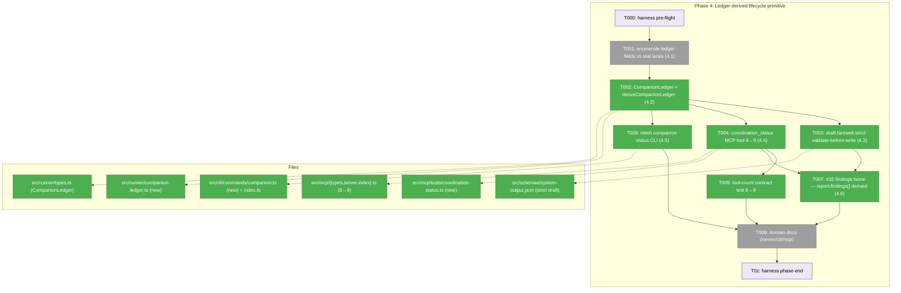
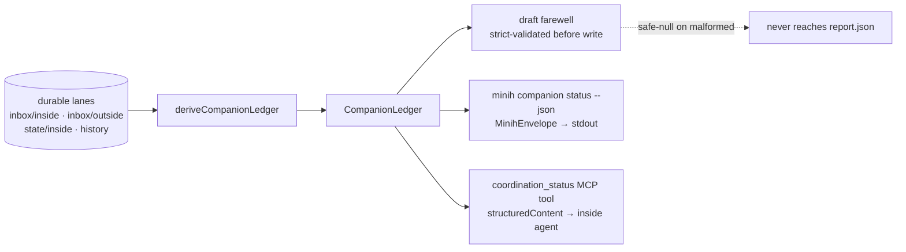
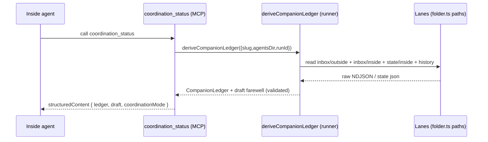

# Phase 4 Tasks — Ledger-derived lifecycle primitive (#36 + #32 findings home)

**Plan**: [companion-coordination-plan.md](../../companion-coordination-plan.md) · **Phase**: 4 · **CS**: 4 (large — the crown jewel)
**Depends on**: Phase 2 (delivery parity / unread-ack model) · Phase 3 (state vocabulary, keep-root)
**Generated**: 2026-06-15 · **Status**: dossier ready — awaiting human GO

---

## Executive Briefing

- **Purpose**: Stand up the single durable lifecycle primitive the whole plan converges on. One pure runner deriver computes companion lifecycle state from the durable inbox/state lanes; one outside CLI surface (`minih companion status`) and one inside MCP tool (`coordination_status`) read it; the draft farewell envelope is assembled and **strictly validated before it can be written**. This is the #36 ledger and the #32 findings-home contract realised in code.
- **What We're Building**:
  1. `CompanionLedger` type + `deriveCompanionLedger(location)` — a **pure** function over raw lanes (no SDK, no spawn).
  2. `coordination_status` MCP tool (inside) — mirrors `permission-status.ts`; returns the ledger summary + a schema-valid draft farewell; pins the `coordinationMode` value set. Tool count 8 → 9.
  3. `minih companion status [--json]` CLI verb (outside) — same deriver, `MinihEnvelope` output.
  4. A strict draft-validation step that closes the `system-output.json` `additionalProperties:true` write-before-validate gap (finding 04).
  5. The singular #32 findings contract: findings flow live via `inbox_send type:'finding'`; `report.findings[]` is **derived** from the ledger.
- **Goals**:
  - ✅ Lifecycle accounting is **derived from the durable ledger**, never reconstructed from prompt memory (the design all three companion magicWands independently re-derived, P1+P2+P3).
  - ✅ A malformed draft farewell is **safe-nulled and never reaches `report.json`**.
  - ✅ Two surfaces (CLI outside, MCP inside) read **one** deriver — no divergent accounting.
  - ✅ `coordinationMode` enum is **pinned from its real frontmatter source**, not invented.
  - ✅ `just fft` exits 0 with the new tests; coordination suite stays green (AC-17).
- **Non-Goals**:
  - ❌ Idle-budget policy / shutdown drain (#35) — that is **Phase 5**, which consumes this ledger.
  - ❌ The self-discovery trio surfaced on `coordination_status` (`allowedStates` + `coordinationMode` + `idleBudgetSec` in one call) and full docs reconciliation — that is **Phase 6** (Phase 4 lays the tool down; Phase 6 fills the trio).
  - ❌ The `contract-phrase` doctor sensor — it does **not exist** (Phase 0 dropped; built in Phase 6). Phase 4 proves AC-10's **structural** half (report.findings[] derived; singular contract declared); the doc-agreement-via-sensor half defers to Phase 6.
  - ❌ Reusing `listUnackedVisible` — the ledger derives over raw lanes (see PIC-A).
  - ❌ A `minih companion finalize` verb — deferred per Workshop 003 Q2 (LEAN: ship `status` now, add `finalize` only if wanted).
  - ❌ Any transport change, any breaking envelope reshape (additive only).

---

## Prior Phase Context

> Synthesised from parallel reviews of Phases 1–3 (`tasks.md` + `execution.log.md` + the shipped source).

### Phase 1 — Verify-and-close permission edge (#25) · DONE

- **A. Deliverables**: `test/runner/permissions/coord-write-release-default.e2e.test.ts` (5 tests, the real-`compile()`→gate seam pattern); `run-coord-write-deny.test.ts` +1 release-default CLI case; comment-only fix at `runner.ts:644-651` (stale "yolo default" → R6 `restricted`); `permissions.md:89` lane fix (inside, not outside). No production logic changed.
- **B. Exported / reusable**: `assertCoordWriteAllowed` (`permissions/coord-write-precondition.ts:155-198`) → throws E205; `minihReleaseDefault = 'restricted'` (`permissions/presets.ts:138`); the `.e2e.test.ts` **resolution-seam test pattern** (drive real `compile()`, not a synthesised policy) + a **premise-guard** test that reddens if an upstream default re-flips.
- **C. Gotchas**: `fireOutsideInboxSignal` writes to the **inside** lane despite its name — *trust the physical lane (`inboxLanePath(location,'inside')`), never the function name*. Inline comments in `runner.ts` policy area drift from reality — verify against `presets.ts`/`runner.ts` source.
- **D. Incomplete**: none. (Contract-phrase sensor deferred to Phase 6 — doc correctness carries no automated guard yet.)
- **E. Patterns for Phase 4**: derive from the **durable ledger**, not prompt memory; import direction `cli → runner` (a new MCP tool/deriver lives in runner, the CLI verb consumes it); test the real seam, not a synthetic stand-in.

### Phase 2 — Inbox delivery parity (#40) · DONE *(direct dependency)*

- **A. Deliverables**: `inbox-poll.ts` extracted `listUnackedVisible` + `ListFilterOptions`; `event-wait.ts` `inbox.message` branch unified on the unread/ack model; cleanup re-entry guard. Commits `f86a0b9`…`812e468`.
- **B. Exported / reusable**: `listUnackedVisible(location, readLane, options, peerLane?, limit?): PollInboxResult` (**synchronous**). **⚠ But this is NOT the ledger's tool** — see PIC-A. What Phase 4 reuses is the **model** at `inbox-poll.ts:170-178`: `acknowledged = Set(peerLane msgs where type==='ack' && ackOf).map(m=>m.ackOf)`, then `readMessages.filter(m => !acknowledged.has(m.id))`.
- **C. Gotchas**: the inbox-poll lane parser is **strict** — a seeded fixture message must set `sender` to match the lane it sits in, end the file with `\n`, and carry required string fields `id/sender/type/subject/body/ts`. Corruption **throws** `InboxPollError('INBOX_POLL_CORRUPT')` (no swallow). "Consumed" = an `ack` record exists, **not** "was returned once" (durable-unread semantics).
- **D. Incomplete**: live e2e of #40 stays dogfood-only (the `MINIH_FAKE_ADAPTER` sensor was dropped with Phase 0). No `coordinationMode`/ledger work yet — that's this phase.
- **E. Patterns for Phase 4**: lane read shape (`readLaneFile`-style: missing/empty file ⇒ `[]`; torn ⇒ throw); lane direction (inside agent reads the **outside** peer lane and acks on its **own** inside lane); seed fixtures below the 50 limit; `test/runner/event-wait.test.ts` + `test/runner/inbox-poll.test.ts` are the seeding templates.

### Phase 3 — State-vocabulary coherence (#27/#31) · DONE *(direct dependency)*

- **A. Deliverables**: contract test (T001, `984b504`) + description fix (T003, `3190952`) + doctor pin (T004, `8c6ae4b`). **Schema lives at agent ROOT** — `agents/code-review-companion/inside-state.schema.json` (there is **no** `state/` dir); enum is exactly `[idle, reading, reviewing, reporting, blocked, stopping]`.
- **B. Exported / reusable**: the validated 6-value inside-state enum, resolvable at root via `insideStateSchemaPath` level 2 (`state.ts:182-192`); `validateInsideState` **is enforced** (`state.ts:81` stateSet, `:100` stateTransition, throws `MCP_INVALID_ARGUMENT` at `:166`); the doctor `prompt-state-vocabulary-drift` check.
- **C. Gotchas**: **PIC-1 keep-root** (Jordan, 2026-06-15) — `state/` ∈ `RUNTIME_DIR_NAMES` (`agent-pack/manifest.ts:15-20`, install-denied); relocating drops the schema from the install payload → installed companions fall back to the default enum → reintroduces #27/#31. **The plan's Phase 3 "relocate" rows are superseded** — Phase 4 must read the schema at **root**.
- **D. Incomplete**: none. Contract-phrase sensor + doctor warn→fail promotion deferred to Phase 6.
- **E. Patterns for Phase 4**: contract tests read the **REAL shipped** schema/pack (not a synthetic fixture); discriminating assertions (assert the actual rejection on bad input, not a bare call-return); validation runs **before** any short-circuit.

---

## Pre-Implementation Check

| File | Exists? | Domain | Notes |
|------|---------|--------|-------|
| `src/runner/types.ts` | ✅ modify | runner | `CompanionLedger` joins the coordination block (~line 367, after `CoordinationFrontmatter`); export from `src/runner/index.ts` `from './types.js'` block. `InboxMessage` (305-318) has every field the ledger needs. |
| `src/runner/companion-ledger.ts` | 🆕 new | runner | Pure `deriveCompanionLedger(location)`. Reads raw lanes via `folder.ts` helpers + own NDJSON parse (PIC-A). |
| `src/cli/commands/companion.ts` | 🆕 new | cli | `minih companion status [--json]`. No `companion` CLI sibling exists yet — mirror the `permissions` (`agent-permissions.ts`) or `runs.ts` parent+child pattern. |
| `src/cli/index.ts` | ✅ modify | cli | Add `import { registerCompanionCommand }` + invocation in the 75-102 block. |
| `src/mcp/tools/coordination-status.ts` | 🆕 new | mcp | Mirror `permission-status.ts` (handler takes only `context`, returns `{content, structuredContent}`). |
| `src/mcp/tools/permission-status.ts` | ✅ read (mirror) | mcp | THE template. `permissionStatus(context): McpToolResult<PermissionStatusResult>` (147 lines). |
| `src/mcp/types.ts` | ✅ modify | mcp | `MCP_TOOL_NAMES` (6-15) + `TOOL_CONTRACTS` (167-354): add `coordination_status` (8→9). `permission_status` contract (344-353) is the template. |
| `src/mcp/server.ts` | ✅ modify | mcp | Dispatch switch (88-111) is **exhaustive over `McpToolName`, no `default`** — adding to `MCP_TOOL_NAMES` is required to compile (PIC-D). |
| `src/mcp/index.ts` | ✅ modify | mcp | Barrel. (Note PIC-E: `permissionStatus` set **no** barrel precedent — plan still asks to export; do it for test importability.) |
| `src/schemas/system-output.json` | ✅ read + strict sub-schema | runner | Top-level `additionalProperties:true`, `required:["summary","retrospective"]`. Strict draft sub-schema closes finding 04. |
| `src/runner/inbox-poll.ts` | ✅ read (model only) | runner | Reuse the unread/ack **model** (`:170-178`), NOT `listUnackedVisible` (PIC-A). |
| `src/runner/folder.ts` | ✅ read | runner | `inboxLanePath(location,side)`, `stateFilePath(location,side)`, `historyPath(location)` — all barrel-exported. |
| `src/cli/output.ts` | ✅ read | cli | `MinihEnvelope` (111-121) + `formatSuccess`/`exitWithEnvelope` (`formatSuccess` injects the required `timestamp`). |
| `agents/code-review-companion/prompt.md` | ✅ read (verify) | pack | #32 findings-home source-of-truth (`coordination: enabled` at `:6`; `type:'finding'` + the `findings[]` item shape live in the prompt example). **Read-only in Phase 4** — prompt idle/findings wording edits are Phase 5/6. |

### Pre-Implementation Check flags (PIC) — read before coding

- **PIC-A — the ledger derives over RAW lanes, not `listUnackedVisible`.** That export's own doc comment (`inbox-poll.ts:149-160`) says it is *"NOT for ledger/drain consumers, which derive over raw `folder.ts` lanes — a visible-message list is the wrong shape for ack-chain/count work,"* and it isn't barrel-exported anyway. `deriveCompanionLedger` reads `inboxLanePath`/`stateFilePath`/`historyPath` directly and parses NDJSON itself (the inbox-poll parser is module-private). **Reuse the unread/ack model, not the function.** This refines plan KF02/KF05's "reuse the export" wording.
- **PIC-B — `coordinationMode` has no source today.** No `coordinationMode`/`CoordinationMode` anywhere in `src/`. The only frontmatter signal is the binary `coordination.enabled` flag (`CoordinationFrontmatter`, `types.ts:362-366`; string-form `coordination: enabled` shipped by every agent). **Pin the enum to `'enabled' | 'disabled'`** (the string form the parser already accepts). Do not invent richer modes — they have no source (Phase 6 inherits this pin, doesn't re-invent it).
- **PIC-C — the 8→9 tool-count test is `test/mcp/types.test.ts`.** It hard-asserts the exact 8-element `MCP_TOOL_NAMES` array (31-46) and the title *"defines the eight inside coordination tools."* This array + title MUST be updated to nine. `server-dispatch.test.ts:53` and `server.test.ts:44` assert against `MCP_TOOL_NAMES` derivatively and auto-pass. `coordination-contract.test.ts` is behavioural (no count).
- **PIC-D — `server.ts` dispatch has no `default` case** and is exhaustive over `McpToolName`; forgetting the `case 'coordination_status':` is a TS compile error, not a silent miss.
- **PIC-E — barrel export of the new tool.** The plan's Domain Manifest lists `src/mcp/index.ts` as "export the new tool," but `permissionStatus` is imported directly in `server.ts` with no barrel export. Decision: **add the barrel export** (the plan asks for it and it makes the tool importable from unit tests); note this is a deliberate deviation from the permission-status precedent.
- **PIC-F — CLI tests run against `dist/`.** `test/cli/*.test.ts` `execFileSync('node', ['dist/cli/index.js', …])`. A `npm run build` (or `just …`) precedes any green `companion` CLI test.
- **PIC-G — Phase 3 shipped keep-root.** Read the companion schema at **root**, never `state/`. And the `contract-phrase` doctor check Phase 4.6 "drift check" references does **not** exist until Phase 6 — Phase 4 satisfies AC-10's structural half only.
- **PIC-H — report draft validation gap (finding 04).** `system-output.json` is `additionalProperties:true` and `validator.ts` runs **after** `report.json` is written. The strict draft sub-schema (T003) validates the draft **before** it is offered/written; a malformed draft is safe-nulled and never persisted.
- **PIC-I — the deriver function needs its OWN barrel line.** `export type { CompanionLedger } from './types.js'` carries the **type**; `deriveCompanionLedger` (a runtime fn) needs a separate `export { deriveCompanionLedger } from './companion-ledger.js'` in `src/runner/index.ts` (follow an existing runtime-export line). Without it, T004 (MCP tool) and T006 (CLI verb) cannot import the deriver and the cross-domain wiring silently breaks.
- **PIC-J — downstream field-name contract.** Phase 5 (AC-11) destructures `ledger.idleElapsedMs` + `ledger.unresolvedPeerRequests` by exact name, and `unresolvedPeerRequests` already exists as a `system-output.json` `retrospective.coordination` key. Name the `CompanionLedger` fields that way in T001/T002 (loose prose like "idle streak" is a *count* — the wrong shape vs an ms duration); Phase 4 is the sole author of these names.

---

## Architecture Map



---

## Tasks

| Status | ID | Task | Domain | Path(s) | Done When | Notes |
|--------|-----|------|--------|---------|-----------|-------|
| [x] | T000 | **Harness pre-flight** — `/eng-harness-flow --event pre-implement --phase "Phase 4: Ledger-derived lifecycle primitive (#36 + #32 findings home)" --plan-dir docs/plans/027-companion-coordination` | — | — | Router envelope handled; boot verdict narrated verbatim (`healthy/SLOW/UNHEALTHY/UNAVAILABLE`) before any code | _Harness seam (router installed)._ Known baseline warns: minih-doctor + npm-audit (1 crit/6 high). |
| [x] | T001 | **Enumerate ledger fields against real lanes** — for each `CompanionLedger` field (`reviewedIds`/`ackedIds`, finding/summary counts, ackOf chains, `unresolvedPeerRequests`, `idleElapsedMs` = ms since the last inbound `ts`, `lastTaskId`, current state, `statePublished`) confirm derivability from `InboxMessage` + state files; flag any gap → minimal additive persistence | runner | `src/runner/types.ts` (read), lanes | Field-map recorded in execution log; gaps flagged (recon expects **none** — all fields lane-derivable from `InboxMessage`) | Finding 05. **Use the downstream consumers' exact field names** — Phase 5 (AC-11) reads `idleElapsedMs` + `unresolvedPeerRequests`; `unresolvedPeerRequests` also matches the existing `system-output.json` `retrospective.coordination` key. Ground the deriver before building it. |
| [x] | T002 | **`CompanionLedger` type + `deriveCompanionLedger(location)`** (RED→GREEN over seeded lane fixtures): pure fn reading `inboxLanePath`/`stateFilePath`/`historyPath`; returns `reviewedIds`/`ackedIds`, finding/summary counts, ackOf chains, **`unresolvedPeerRequests`**, **`idleElapsedMs`** (ms since last inbound `ts`), `lastTaskId`, current state, `statePublished` | runner | `src/runner/companion-ledger.ts` (new), `src/runner/types.ts`, `src/runner/index.ts` | **AC-8** green; pure (no SDK/spawn); reuses the unread/ack **model** not `listUnackedVisible` (PIC-A); fixtures set `sender` to match lane, trailing `\n`; **`deriveCompanionLedger` gets its OWN `export { deriveCompanionLedger } from './companion-ledger.js'` line in `index.ts`** — the `export type {…} from './types.js'` block carries the `CompanionLedger` **type** only, not the runtime fn (PIC-I) | Workshop 003. Throw-on-corrupt convention (not swallow). Seed below the 50 cap. Field names are the downstream contract (Phase 5/6). |
| [x] | T003 | **Draft farewell — strict validate before offer/write** (RED→GREEN): assemble a draft envelope from the ledger, validate against `system-output.json` **and** a strict draft sub-schema **before** it is offered or written; a malformed draft is **safe-nulled and never reaches `report.json`**; `parseReport` returns safe-null on corrupt | runner | `src/runner/companion-ledger.ts`, `src/schemas/system-output.json` (strict sub-check) | **AC-9** green; injected malformed draft proven to never persist (closes the `additionalProperties:true` write-before-validate gap) | Finding 04. Draft needs `summary`(≥20) + `retrospective.{workedWell(≥10),confusing(≥10),magicWand(≥20)}` — the ledger pre-fill stub must satisfy the minLengths or it self-fails as a false-malformed; ledger pre-fills `retrospective.coordination.{peerUpdatesSent,unresolvedPeerRequests,statePublished}`. |
| [x] | T004 | **`coordination_status` MCP tool** (mirror `permission-status.ts`): build `CoordinationRunLocation` from context, return ledger summary + draft envelope; **pin `coordinationMode` enum = `'enabled'\|'disabled'`** (PIC-B); register in `types.ts` (`MCP_TOOL_NAMES` + `TOOL_CONTRACTS`), `server.ts` (dispatch case), `index.ts` (export, PIC-E). 8 → 9 tools | mcp | `src/mcp/tools/coordination-status.ts` (new), `src/mcp/types.ts`, `src/mcp/server.ts`, `src/mcp/index.ts` | Tool unit test green (`.structuredContent` asserted, hand-built `McpServerContext`); `coordinationMode` enum fixed | Workshop 003 — this is the single self-discovery surface (Phase 6 fills the `allowedStates`/`idleBudgetSec` trio). Must add to `MCP_TOOL_NAMES` to compile (PIC-D). |
| [x] | T005 | **Update the tool-count contract test 8→9** — `test/mcp/types.test.ts` hard array + title "eight"→"nine"; confirm `server-dispatch.test.ts`/`server.test.ts` (derivative) still green | mcp | `test/mcp/types.test.ts` | The three tool-list assertions pass with `coordination_status` present | PIC-C. The count lives in `types.test.ts`, not `coordination-contract.test.ts`. |
| [x] | T006 | **`minih companion status [--json]` CLI verb** over the same deriver; `registerCompanionCommand(program)` (parent `companion` + child `status`, mirror `commands/runs.ts`); `MinihEnvelope` output (`{command:'companion.status', status, data:{…ledger…}}`) | cli | `src/cli/commands/companion.ts` (new), `src/cli/index.ts` | CLI integration test asserts a conforming envelope on stdout (against `dist/`, PIC-F) | Workshop 003; `cli→runner` is legal. Human table → stderr (TTY only); envelope → stdout. |
| [x] | T007 | **Settle #32 findings home (structural)**: findings sent live via `inbox_send type:'finding'`; the deriver returns `findings[]` and the report assembler copies it into `report.findings[]` **pre-write** (derived, not separately authored); **add a `findings[]` property to `system-output.json`** (item shape from `prompt.md`: `severity`/`file`/`category`/`issue`/`recommendation`) so "schema agrees structurally" is enforceable, not asserted | mcp + pack | `src/runner/companion-ledger.ts`, `src/schemas/system-output.json`, `agents/code-review-companion/prompt.md` (read/verify) | **AC-10** structural half green: `findings[]` has **one declared schema home**, and a test asserts the derived `report.findings[]` validates against it | Workshop 003. `system-output.json` declares **no** `findings[]` today (it lived only in the prompt example) — declaring it here is what makes the singular-home contract real. The doc-agreement-via-`contract-phrase`-check half **defers to Phase 6** (sensor not built yet, PIC-G). |
| [ ] | T008 | **Domain docs** — add `CompanionLedger`/`deriveCompanionLedger` concept to `runner/domain.md`; `minih companion` verb to `cli/domain.md`; `coordination_status` (+ tool count 8→9) to `mcp/domain.md` § Concepts/Composition/History | docs | `docs/domains/{runner,cli,mcp}/domain.md` | New public contracts reflected; § History rows added | plan-6 domain step. (Registry-wide tool-count reconciliation completes in Phase 6.3.) |
| [ ] | T0z | **Harness phase-end** — `/eng-harness-flow --event phase-end --plan-dir docs/plans/027-companion-coordination` | — | — | Router envelope handled at phase end (router owns drain-vs-harvest; buffer drain stays deferred to plan-complete per this plan's cadence) | _Harness seam._ |

- `Status`: `[ ]` pending · `[~]` in progress · `[x]` complete · `[!]` blocked
- **Whole-phase gate AC-17**: `just fft` exits 0 with the new tests; coordination suite no regression.

---

## Context Brief

### Key findings from plan (acted on this phase)

- **Finding 04 (High) — report draft validation gap**: `system-output.json` is `additionalProperties:true` and validates **after** `report.json` is written → T003 strict draft sub-schema validates **before** offer/write.
- **Finding 05 (High) — ledger field availability + snapshot ordering**: all #36 fields are lane-derivable, but `snapshotCoordinationFiles` runs after report write and only on success → the ledger reads live lanes **before** teardown. T001 confirms field-by-field; Phase 5 owns the drain ordering.
- **Finding 02 (Critical, from P2)**: the unread/ack model lives in `inbox-poll.ts` — the ledger mirrors that model over **raw** lanes (PIC-A).
- **Finding 01 (Critical, from P3)**: companion schema ships at **root** (keep-root); read it there (PIC-G).
- **Finding 07 (Med/High)**: adding `coordination_status` makes the real tool count **9** — registry-wide reconciliation is Phase 6.3; this phase updates the mcp domain doc + the `types.test.ts` count.

### Domain dependencies (concepts/contracts this phase consumes)

- `runner`: lane path helpers — `inboxLanePath(location, side)`, `stateFilePath(location, side)`, `historyPath(location)` (from `folder.ts`); `CoordinationRunLocation = {slug, agentsDir, runId}`; `InboxMessage = {id, sender, type, subject, body, ts, ackOf?, meta?}`; the unread/ack model pattern (`inbox-poll.ts:170-178`).
- `mcp`: `McpServerContext` (`context.ts:15-26` — `runId/agentSlug/agentsDir/runDir/…`); `permissionStatus` envelope shape (`{content:[{type:'text',text}], structuredContent}`); `McpToolError(code,msg)`; `McpToolResult<T>`; `MCP_TOOL_NAMES` / `TOOL_CONTRACTS`.
- `cli`: `MinihEnvelope` + `formatSuccess`/`exitWithEnvelope` (`output.ts`); `commands/runs.ts` parent+child registration template.
- `pack`: companion `prompt.md` (coordination frontmatter `coordination: enabled`; findings/state wording — read/verify only).

### Domain constraints

- **Import direction**: `cli → runner` (CLI verb consumes the deriver); `mcp → runner` (tool builds `CoordinationRunLocation` from context, calls the deriver). Never invert. The deriver is **pure** runner — no MCP/CLI imports, no SDK, no spawn.
- **Additive only**: no transport change, no breaking envelope reshape. `coordination_status` is the **9th** tool; existing 8 unchanged.
- **Pin from source, don't invent**: `coordinationMode` enum = the binary frontmatter source (`'enabled'|'disabled'`).
- **Throw on corrupt, safe-null on absent**: missing/empty lane ⇒ `[]`; torn lane ⇒ throw (P2 convention); malformed draft ⇒ safe-null, never written.

### Harness context (router installed)

- **Entry point**: `/eng-harness-flow --event <seam> [--phase <id>] [--plan-dir <p>] --json` — the single door; child skills never named.
- **Pre-implement seam** (T000): fired by the implement verb before task 1; verdict narrated verbatim. Known baseline = degraded/SLOW (minih-doctor + npm-audit warns; hard sensors lint/typecheck/build/test clean).
- **Phase-end seam** (T0z): fired after all tasks; observe-buffer drain stays **deferred to plan-complete** per this plan's established cadence.
- **Backpressure**: `backpressure-coverage.md` rated this work **Partial**; AC-8/9/10/17 are computational (deterministic tests). The *live* e2e residual behind #36 is dogfood (the fake-adapter sensor was dropped) — Phase 4's proof is unit/structural, which is honest and sufficient for the ledger primitive.

### Reusable from prior phases

- Lane-seeding fixtures + the read/parse contract: `test/runner/event-wait.test.ts`, `test/runner/inbox-poll.test.ts`, `test/runner/run-inventory.test.ts` (mkdtemp tmp root, `makeRunDir(slug,runId)`, seed lanes, assert struct).
- MCP tool unit harness: `test/mcp/state.test.ts` / `test/mcp/coordination-contract.test.ts` `buildContext` (hand-built `McpServerContext`, assert `.structuredContent`).
- CLI integration harness: `test/cli/runs.test.ts` (`execFileSync` on `dist/cli/index.js`, parse envelope).
- The real-shipped-schema test discipline + discriminating assertions (P3).

### Mermaid — system flow (deriver → two surfaces)



### Mermaid — sequence (inside agent reads its own ledger)



---

## Discoveries & Learnings

_Populated during implementation by the implement verb._

| Date | Task | Type | Discovery | Resolution | References |
|------|------|------|-----------|------------|------------|

**Types**: `gotcha` | `research-needed` | `unexpected-behavior` | `workaround` | `decision` | `debt` | `insight`

---

## Directory layout

```
docs/plans/027-companion-coordination/
  ├── companion-coordination-plan.md
  └── tasks/phase-4-ledger-derived-lifecycle-primitive/
      ├── tasks.md            # this file
      └── execution.log.md    # created by the implement verb
```

> STOP — dossier only. No code changes. Awaiting human GO to implement Phase 4.
