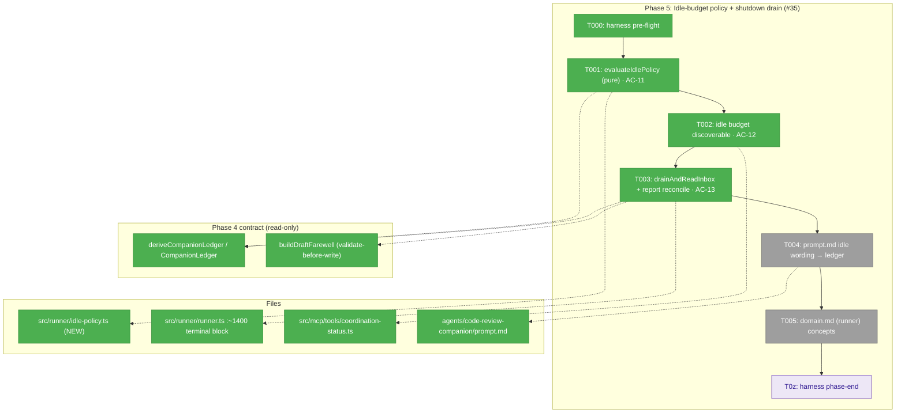
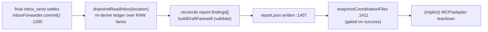
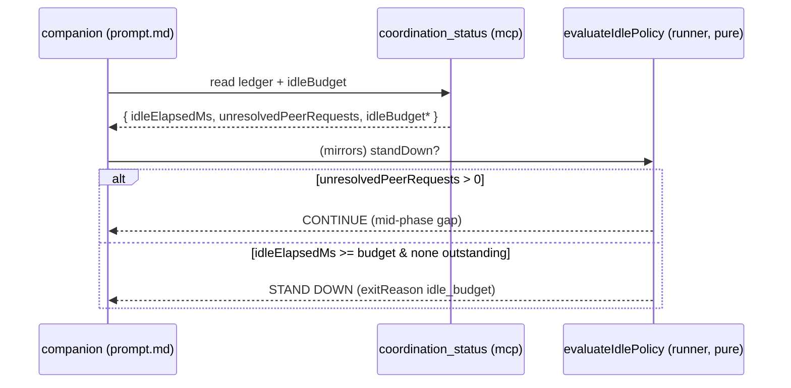

# Phase 5 — Idle-budget policy + shutdown drain (#35)

**Plan**: [companion-coordination-plan.md](../../companion-coordination-plan.md)
**Phase**: Phase 5 of 6 · **CS**: 3 · **Mode**: Full (Full TDD)
**Domains**: runner (idle policy + drain), pack (prompt wording), mcp (budget surfaced on `coordination_status`)
**Depends on**: **Phase 4** (the `deriveCompanionLedger` ledger primitive — DONE, reconciled `f0bd6a0`)
**Generated**: 2026-06-15 · grounded by 4 prior-phase reviews + a live-code recon of the Phase 5 targets

---

## Executive Briefing

**Purpose**: Make the companion's idle / stand-down decision read **durable ledger state** instead of a prompt-counted integer poll-streak, make the configured idle budget **discoverable at runtime**, and guarantee a peer message landing in the **shutdown / report-write window is captured, not stranded** — by re-deriving the ledger over the live lanes immediately before `report.json` is written.

**What we're building**:
1. A **pure idle-policy function** in the runner (`evaluateIdlePolicy`) that decides stand-down from `idleElapsedMs` (falling back to run-elapsed when no peer has spoken) + `unresolvedPeerRequests` + the configured budget + an absolute run-timeout ceiling — deterministic and unit-testable, so even a never-spoke dead peer still terminates.
2. The configured **idle budget surfaced at runtime** on the existing `coordination_status` MCP tool (sourced from `params.idleBudgetMs`).
3. A **`drainAndReadInbox(location)`** step — a fresh `deriveCompanionLedger` re-read over the **raw** lanes at the pre-report-write point — wired into the runner's terminal sequence, with a late-message-injection test (AC-13).
4. `agents/code-review-companion/prompt.md` idle wording rewritten from **integer poll-streak** → **ledger-driven posture**.

**Goals**:
- ✅ AC-11 — idle/stand-down is ledger-driven; a mid-phase gap (work still outstanding) does **not** prematurely stand the companion down.
- ✅ AC-12 — the configured idle budget is discoverable at runtime.
- ✅ AC-13 — a late ping in the shutdown/report-write window is captured, proven by an injection test.
- ✅ AC-17 — `just fft` exits 0 with the new tests; no regression in the coordination suite.

**Non-Goals**:
- ❌ The **live end-to-end** idle/drain proof under a real clock — that depended on the **dropped** Phase 0 fake-adapter; it stays dogfood / `plan-7` territory (proof-tier honesty, plan §AC).
- ❌ The **full self-discovery trio** (`allowedStates` + `coordinationMode` + `idleBudgetSec`) and the registry tool-count fix — **Phase 6** (AC-14/16). Phase 5 owns only the **idle-budget** field on the tool.
- ❌ Touching `state.*` watches, the `wait_for_any` unread/ack model, or the single-settle teardown invariant (Phase 2 territory — preserve).
- ❌ Any transport change or breaking envelope reshape (additive only).

---

## Prior Phase Context

> Synthesized from the four completed phases. Phase 4 (the ledger contract Phase 5 consumes) and Phase 2 (lane-read mechanics the drain inherits) are the load-bearing ones; Phases 1 & 3 are verify-and-close.

### Phase 4 — Ledger-derived lifecycle primitive (#36 + #32) · **the dependency**

**A. Deliverables**: NEW `src/runner/companion-ledger.ts` (pure deriver + draft-farewell machinery); `CompanionLedger`/`CompanionFinding`/`CompanionAckChain`/`CompanionDraftFarewell` types in `types.ts`; `coordination_status` MCP tool (8→9); `minih companion status` CLI; `report.findings[]` added to `system-output.json`. Reconciled in `f0bd6a0` (companion F001–F004).

**B. Dependencies exported (the contract Phase 5 consumes)** — `deriveCompanionLedger(location, opts: { now?: number } = {}): CompanionLedger`, **barrel-exported** from `src/runner/index.ts` (runtime line ~57 + type line ~309). `CompanionLedger` fields, verbatim:

| Field | Type | Semantics Phase 5 relies on |
|---|---|---|
| `coordinationMode` | `'enabled'\|'disabled'` | pinned from frozen `prompt.md` frontmatter |
| `state` | `string\|null` | inside-state status; `null` if unpublished |
| `statePublished` | `boolean` | state file present OR history non-empty |
| `reviewedIds` | `string[]` | **completion** evidence (summary.ackOf→task), NOT receipt |
| `ackedIds` | `string[]` | receipt set (`ackedIds ⊇ reviewedIds`) |
| `findingsCount` | `number` | inside `finding` **message** count (≥ `findings.length`) |
| `summariesCount` | `number` | inside `summary` message count |
| `progressCount` | `number` | inside `progress` message count (F003) |
| `unresolvedPeerRequests` | `number` | inbound where type ∉ {ack,briefing} AND id ∉ receipt-acks — **the "work outstanding" signal** |
| `idleElapsedMs` | `number\|null` | `max(0, now − max(inbound ts))`; **`null` = no inbound yet** (distinct from `0`) |
| `lastTaskId` | `string\|null` | last appended inbound `task` id |
| `findings` | `CompanionFinding[]` | parsed (body-or-meta), contentless dropped |
| `ackChains` | `CompanionAckChain[]` | resolved request chains (F001) |

Plus `buildDraftFarewell(ledger): CompanionDraftFarewell | null` (safe-null on invalid), `assembleDraftFarewell`, `validateDraftFarewell` (never throws), `CompanionLedgerError` (code `COMPANION_LEDGER_CORRUPT`). The deriver accepts an **injectable clock** (`opts.now`) — Phase 5 idle tests must pass `{ now }`.

**C. Gotchas Phase 5 must respect**:
- Use `unresolvedPeerRequests` for "work outstanding" and `reviewedIds` for "completed" — **never `ackedIds`** (a task is acked on *arrival*, before review).
- `idleElapsedMs === null` is a real state (no inbound) — branch on it, don't treat as `0`.
- `findingsCount ≥ findings.length` by design (count = coordination metric; array = content metric).
- Reads **throw `CompanionLedgerError`** on a torn lane (no swallow), `[]` on absent — the drain must wrap in try/catch and choose a deliberate shutdown-window disposition.
- The validate-before-write guarantee holds **only** through `buildDraftFarewell`/`validateDraftFarewell` — bypassing them reopens finding-04.

**D. Deferred to Phase 5/6**: idle policy + report-write drain (this phase); the self-discovery trio (`allowedStates`, `idleBudgetSec`) and `contract-phrase` doctor sensor (Phase 6).

**E. Patterns**: the deriver reads **RAW `folder.ts` lanes** (`inboxLanePath`/`stateFilePath`/`historyPath`), pure (no SDK/MCP/CLI imports), `cli→runner` / `mcp→runner` direction only. Test style: `mkdtemp` + `coordinationRunLocation(slug, agentsDir, 'run-1')` + `appendMsg`/`msg` helpers + injected `now`.

### Phase 2 — Inbox delivery parity (#40) · **lane-read mechanics**

- Exported `listUnackedVisible(location, readLane, options, …)` from `inbox-poll.ts` — **but its doc-comment explicitly forecloses Phase 5**: *"NOT for ledger/drain consumers, which derive over raw `folder.ts` lanes — a visible-message list is the wrong shape for ack-chain/count work."* → **The drain does NOT call `listUnackedVisible`.**
- Consumed-model: a message is "consumed" only when the **peer lane** emits an `ack` (`type==='ack' && ackOf===id`) — a read never consumes. Lanes are durable and re-deliver unacked messages.
- Invariants to preserve: single-settle teardown; `cleanup()` splice-and-close re-entry guard; torn lane → `EventWaitInboxCorruptError` (no swallow); `state.*` watches untouched.
- **Naming trap** (also from Phase 1): `fireOutsideInboxSignal` writes to the **inside** lane. Trust `inboxLanePath(location, side)`, never the helper name.

### Phase 1 — Verify-and-close permission edge (#25) · **motivating observation**

- E205 boot-gate behaviour (write-deny release default → loud boot failure) is verified; the 5-signal denial protocol is load-bearing — don't weaken.
- **MH-001 (companion debrief)**: the companion *idled out and self-stopped via idle-budget, writing its own farewell*, when a promised `control:stop` was delayed. **This is the real-world motivation for Phase 5** — treat it as the canonical scenario the idle policy + drain must handle gracefully.

### Phase 3 — State-vocabulary coherence (#27/#31)

- **Final schema location (PIC-1, Jordan-decided): keep at agent ROOT** `agents/code-review-companion/inside-state.schema.json` (NOT `state/` — that dir is install-denied). Allowed enum `[idle, reading, reviewing, reporting, blocked, stopping]`.
- `validateInsideState` IS enforced (`state.ts:81/100`, throws `MCP_INVALID_ARGUMENT`) — Phase 5's `stopping`/shutdown transitions pass through this gate.
- Doctor drift check is **one-directional** (prompt→enum) and returns `warning` today (Phase 6 promotes to `fail`). Keep prompt wording (T005) within the published vocabulary.

---

## Pre-Implementation Check

| File | Exists? | Domain | Check / Notes |
|------|---------|--------|---------------|
| `src/runner/idle-policy.ts` | **NEW** | runner | T001 — pure `evaluateIdlePolicy(ledger, opts)`; no SDK/spawn (mirror `companion-ledger.ts` purity) |
| `src/runner/companion-ledger.ts` | yes | runner | consumed read-only by T001/T003 (`deriveCompanionLedger`, `buildDraftFarewell`) — **do not modify** |
| `src/runner/index.ts` | yes | runner | T001 — barrel-export `evaluateIdlePolicy` + types (separate runtime/type lines, PIC-I) |
| `src/runner/runner.ts` | yes | runner | T003 — call `drainAndReadInbox` after `inboxForwarder.commit()`, before the report-write fallback + `snapshotCoordinationFiles` (anchor to **symbols**, not digits); compute `runElapsedMs` for T001's ceiling; record `idleBudgetMs` into `run.json` budgets (T002); **contract change risk — careful** |
| `src/runner/coordination-drain.ts` | **NEW** | runner | T003 — `drainAndReadInbox(location, { now? })`: re-derive over raw lanes + overwrite-only-findings reconcile; barrel-export |
| `src/mcp/tools/coordination-status.ts` | yes | mcp | T002 — add `idleBudgetSec` to the tool result; **`MINIH_PARAMS` does NOT reach the MCP subprocess** (A2) — read budget from `run.json`/disk or thread a new env key |
| `src/mcp/spawn.ts` / `src/mcp/context.ts` | yes | mcp | T002 (only if the env path is chosen) — thread `MINIH_IDLE_BUDGET_MS` + a context budget field; avoid entirely via the `run.json` disk-read |
| `agents/code-review-companion/input-schema.json` | yes | pack | T002 — `idleBudgetMs` (min 60000, default 1800000) is the budget source; verify, no change expected |
| `agents/code-review-companion/prompt.md` | yes | pack | T005 — rewrite idle wording (`emptyPollStreak`/poll thresholds → ledger posture); **keep state vocabulary within enum** |
| `src/schemas/system-output.json` | yes | runner | `report.findings[]` already present (Phase 4 T007) — **no schema work**; T003 populates it via `buildDraftFarewell` |

---

## ⚠️ PIC Reconciliations (plan prose vs the shipped tree — read before implementing)

Phase 4 had 8 such reconciliations; Phase 5 has **six**. Each corrects a plan assumption against what actually shipped. (Source: live-code recon, 2026-06-15.)

- **PIC-P5-A — The idle policy is a NEW pure runner function; AC-11 tests the *function*, not agent behaviour.** The plan says "idle/stand-down decisions driven by `idleElapsedMs` + `unresolvedPeerRequests`" and calls AC-11 *unit-testable*. **But there is zero runner-side idle logic today** — the entire policy is integer poll-streak prose in `prompt.md` (`emptyPollStreak`, `firstContactPollThreshold: 20`, `replyWaitPolls: 4`; *"no clock arithmetic — only integer counters"*). Reconciliation: introduce a **pure `evaluateIdlePolicy(ledger, { idleBudgetMs, now? })`** that encodes the decision deterministically; AC-11's RED→GREEN exercises *it*. The prompt (T005) is rewritten to consult the ledger and mirror the policy in prose. The live agent-behaviour proof stays dogfood (Phase 0 dropped) — consistent with the plan's proof-tier note. **Signature correction (validate-v2 A1):** the ceiling cannot be read off the ledger — `CompanionLedger.idleElapsedMs` measures time since the last *inbound* and is `null` for a peer that never spoke (exactly the dead-peer case). So `evaluateIdlePolicy` takes **`{ idleBudgetMs, runElapsedMs, timeoutSec, now? }`**: effective idle = `idleElapsedMs ?? runElapsedMs` (no inbound ⇒ idle since boot), and an absolute backstop `runElapsedMs >= timeoutSec*1000` stands down regardless of outstanding work. The runner computes `runElapsedMs` from the run start it already tracks.

- **PIC-P5-B — `drainAndReadInbox` = re-derive the ledger over RAW lanes; do NOT use `listUnackedVisible`.** Two doc-comments forbid drain consumers from `listUnackedVisible` (`inbox-poll.ts:149-160`, `companion-ledger.ts:11-13`). The drain is simply `deriveCompanionLedger(location, { now })` re-read at the pre-report-write point — already battle-tested, already throws-on-corrupt. AC-13's late-injection test asserts a message appended *after* the final forward is reflected in the re-derived ledger.

- **PIC-P5-C — Realistic terminal ordering: the drain is disk-only; MCP teardown is implicit.** The plan's sequencing step "(5) MCP session teardown" is **SDK-owned and implicit** (no explicit runner call — the inside MCP closes when `adapter.run()` resolves, *before* the runner's outer report-write block). So the drain cannot be "before MCP teardown" in the literal sense — but it doesn't need to be: it is a **pure disk re-read** of durable lanes, which persist regardless of MCP lifecycle. **Load-bearing constraint** (pin in code comments + the AC-13 test): drain **AFTER** the final `inboxForwarder.commit()` (`runner.ts:1285-1286`) and **BEFORE** the `report.json` fallback write (`:1407`) and `snapshotCoordinationFiles` (`:1411`). Insert in the outer terminal block just before `:1407`.

- **PIC-P5-D — `report.findings[]` schema home already exists (Phase 4 T007).** No schema work. The drain populates findings through `buildDraftFarewell` (validate-before-write), never re-authored.

- **PIC-P5-E — Idle budget source + the plumbing gap (validate-v2 A2).** `idleBudgetMs` (input-schema: min 60000, default 1800000 = 30 min) is the budget; the run wall-clock cap (`timeout: 7200` → `budgets.timeoutSec`) is the absolute ceiling. **The original "already flows via `MINIH_PARAMS`" assumption is WRONG**: `coordination_status` runs in the inside-MCP subprocess, and `spawn.ts:52-68` forwards only `MINIH_CONTEXT/INBOX_DIR/STATE_DIR` + `MINIH_MCP_*` — `MINIH_PARAMS` (set on the runner's own env at `runner.ts:627`) never reaches it, and `McpServerContext` has no budget field. So AC-12 is a real plumbing task (T002): **either** record `idleBudgetMs` into `run.json` `budgets` at run start and have the tool read it off disk via the location (preferred — parallels the ledger's disk-read), **or** thread a new `MINIH_IDLE_BUDGET_MS` env key through `spawn.ts`+`context.ts`. Surface on the result as **`idleBudgetSec`** (Phase-6 trio name — ms→sec at the surface, no later rename). **Phase 6** adds `allowedStates`; Phase 5 must not (5↔6 seam collision).

- **PIC-P5-F — `report.findings[]` reconcile: overwrite-only-findings, agent-report-only (validate-v2 A3).** The agent normally writes `report.json` itself; the runner write (`fs.writeFileSync(outputPath, agentResult.output)`) is a **fallback that writes the raw SDK string** — nothing populates `report.findings[]` today, and the fallback does **not** call `buildDraftFarewell`. Disposition (decided here, not deferred): the drain **parses the agent-authored report and overwrites ONLY `report.findings[]`** with `ledger.findings` (the #32-derived home), **preserving** the agent's `summary`/`retrospective`. `buildDraftFarewell` returns a *whole* draft — do NOT splice the whole thing over an agent-authored report, only its `findings`. If the report is **absent or unparseable**, log + skip — never fabricate an envelope into the raw-string fallback (out of scope for Phase 5). Re-validate before write.

- **PIC-P5-G — Torn-lane during the shutdown drain: tolerate, never fail the run (validate-v2 A4).** `deriveCompanionLedger` throws `CompanionLedgerError` on a torn NDJSON line, and the shutdown window is exactly when a concurrent write may leave a half-written tail. The terminal block already converts failures into a `failed`/exit-1 result, so an unguarded throw would flip an otherwise-successful run to failed on a benign torn tail. Disposition: the drain wraps the derive in try/catch; `CompanionLedgerError` → log + skip the findings reconcile (degrade to the agent's report as-authored), **never fail the run**.

---

## ✅ Validation (validate-v2, 2026-06-15) — 4 read-only agents vs the shipped tree (`f0bd6a0`)

- **Source-Truth — SOUND**: all 8 grounded claims CONFIRMED; terminal-sequence symbols exact (`inboxForwarder.commit()` 1285, report-write ~1408, `snapshotCoordinationFiles` ~1413 — code comments anchor to **symbols**, not digits, since the file shifts).
- **Cross-Reference — ALIGNED**: every plan sub-task 5.1–5.4 has a task home; AC-11/12/13/17 mapped correctly; Phase-4 dependency verified DONE; the 5↔6 trio split is clean (Phase 6 owns `allowedStates`, plan §6.1).
- **Completeness + Thesis — GAPS (2 CRITICAL, 2 HIGH, 2 MED) → ALL FOLDED IN**:
  - **A1 (CRITICAL)** — ceiling can't read off the ledger (`idleElapsedMs===null` for a never-spoke peer) → **T001 signature** now takes `runElapsedMs`+`timeoutSec`, effective-idle falls back to run-elapsed.
  - **A2 (CRITICAL)** — `MINIH_PARAMS` never reaches the MCP subprocess → **T002 rescoped** to real plumbing (run.json disk-read or a new env key), surfaced as `idleBudgetSec`.
  - **A3 (HIGH)** — `report.findings[]` populated nowhere today; reconcile must **overwrite-only-findings** on the agent report → **PIC-P5-F** disposition decided.
  - **A4 (HIGH)** — torn-lane mid-shutdown must **tolerate, never fail the run** → **PIC-P5-G** added.
  - **A5 (MED)** — **T003 Done-When** now requires an **ordering discriminator** test (RED if the drain is misplaced).
  - **A6 (MED)** — **T004** now pins the `null`/first-contact branch in the prompt.
  - Thesis verdict: understood YES, no drift / no non-goal-creep; the folds close the *proof-mismatch* risk (AC-11 dead-peer + AC-12 non-default discriminator).
- **Forward-Compatibility — validator died mid-run** (terminal error, 0 tool calls; not re-spawned). Its core question (idleBudget**Ms**↔idleBudget**Sec** Phase-6 compatibility) is covered by Cross-Reference (5↔6 split aligned) + the A2 fold — **T002 now commits to `idleBudgetSec`** (the Phase-6 trio name), so no later rename.

---

## Architecture Map



---

## Tasks

| Status | ID | Task | Domain | Path(s) | Done When | Notes |
|--------|-----|------|--------|---------|-----------|-------|
| [x] | T000 | **Harness pre-flight** — `/eng-harness-flow --event pre-implement --phase "Phase 5: Idle-budget policy + shutdown drain (#35)" --plan-dir docs/plans/027-companion-coordination` | — | — | Router envelope handled; boot verdict narrated verbatim before any code | _Harness seam_ (router installed) |
| [x] | T001 | **RED→GREEN: `evaluateIdlePolicy(ledger, { idleBudgetMs, runElapsedMs, timeoutSec, now? })`** — pure decision fn. Effective idle = `idleElapsedMs ?? runElapsedMs` (no inbound ⇒ idle since boot). Stand down when **either** (a) backstop `runElapsedMs >= timeoutSec*1000` (terminates a never-spoke dead peer, overrides outstanding work), **or** (b) `unresolvedPeerRequests === 0 && effectiveIdle >= idleBudgetMs`. Mid-phase gap (`unresolvedPeerRequests > 0`, under backstop) → **continue**. Returns `{ standDown, exitReason: 'idle_budget' \| 'no_engagement' \| null, reason }` (existing exit vocab). Barrel-export. | runner | `src/runner/idle-policy.ts` (NEW), `src/runner/index.ts`, `test/runner/idle-policy.test.ts` (NEW) | AC-11 via 4 discriminators: (i) unacked outstanding past budget, under backstop → **continue** (fails a naive budget impl); (ii) idle-past-budget, zero unresolved → **stand down** `idle_budget`; (iii) **never-spoke `idleElapsedMs===null`, `runElapsedMs>=idleBudgetMs` → stand down** `no_engagement` (fails an idle-only impl — A1); (iv) `runElapsedMs>=timeoutSec*1000` → stand down regardless. Pure fn. | PIC-P5-A; **A1 fix** — ceiling needs run-elapsed (ledger has no wall-clock) |
| [x] | T002 | **Idle budget discoverable — NON-TRIVIAL plumbing (A2)**: `MINIH_PARAMS` does **not** reach the inside-MCP subprocess (`spawn.ts:52-68` forwards only `MINIH_CONTEXT/INBOX_DIR/STATE_DIR` + `MINIH_MCP_*`; `McpServerContext` has no budget field). Choose ONE: **(pref)** record `idleBudgetMs` into `run.json` `budgets` at run start (`params.idleBudgetMs ?? input-schema default`) and have `coordination_status` read it off disk via the location; OR thread a new `MINIH_IDLE_BUDGET_MS` env key through `spawn.ts`+`context.ts`. Surface as **`idleBudgetSec`** (Phase-6 trio name — ms→sec, no later rename). | runner + mcp + pack | `src/runner/runner.ts`, `src/mcp/tools/coordination-status.ts`, `src/mcp/spawn.ts`/`context.ts` (if env path), `test/mcp/coordination-status.test.ts` | AC-12 via a **non-default** discriminator: a run configured with a non-default `idleBudgetMs` makes the tool return *that* value (not the schema default) | PIC-P5-E (rewritten); **A2 fix** — was mis-scoped trivial |
| [x] | T003 | **RED→GREEN: `drainAndReadInbox(location, { now? })`** — re-derive over the **raw** live lanes (`deriveCompanionLedger`), wired into `runner.ts` AFTER `inboxForwarder.commit()` and BEFORE report-write + `snapshotCoordinationFiles` (anchor to **symbols**, not digits). **Findings reconcile (A3)**: parse the agent-authored `report.json`, **overwrite ONLY `report.findings[]`** with `ledger.findings`, preserve the agent's `summary`/`retrospective`, re-validate, write back; absent/unparseable → log + skip (never fabricate). **Torn-lane (A4)**: wrap the derive in try/catch — `CompanionLedgerError` → log + skip, **never fail the run**. | runner | `src/runner/coordination-drain.ts` (NEW), `src/runner/runner.ts`, `src/runner/index.ts`, `test/runner/*` | AC-13 via **ordering discriminator (A5)**: inject a message **between** `commit()` and report-write → assert it lands in `report.findings[]`; a drain placed after report-write would miss it (test goes RED if misplaced). No double-settle; teardown + single-settle intact; torn tail does not fail the run. | PIC-P5-B/C/D/F/G; drain ≠ `listUnackedVisible` |
| [x] | T004 | **Rewrite `prompt.md` idle wording** — replace integer poll-streak (`emptyPollStreak`, `firstContactPollThreshold`, `replyWaitPolls`) with **ledger-driven** stand-down: consult `coordination_status` (`idleElapsedMs`, `unresolvedPeerRequests`, `idleBudgetSec`) and mirror `evaluateIdlePolicy`. **Pin the first-contact case (A6)**: `idleElapsedMs === null` (no inbound yet) is distinct from `0` — the deleted `firstContactPollThreshold` path lived exactly here; the prose must not stand down on `null` except via the absolute backstop. Keep state vocabulary within the published enum. | pack | `agents/code-review-companion/prompt.md` | Prompt matches the runtime policy incl. the `null`/first-contact branch; states within `[idle…stopping]`; `minih doctor` prompt-state-vocabulary-drift stays `pass` | one-directional doctor check; contract-phrase check is a no-op until Phase 6 |
| [ ] | T005 | **Domain doc touch-up** — add the `evaluateIdlePolicy` + `drainAndReadInbox` concepts to `docs/domains/runner/domain.md` § Concepts/History (light; full reconciliation is Phase 6 AC-16). | runner (docs) | `docs/domains/runner/domain.md` | Runner domain doc names the new idle-policy + drain concepts | plan-6 domain step; Phase 6 owns registry-wide reconciliation |
| [ ] | T0z | **Harness phase-end** — `/eng-harness-flow --event phase-end --plan-dir docs/plans/027-companion-coordination` | — | — | Router envelope handled at phase end (router owns drain-vs-harvest) | _Harness seam_ |

> **Whole-phase gate (AC-17)**: `just fft` exits 0 with the new tests included; the existing coordination suite stays green.

---

## Context Brief

**Key findings from plan (Phase 5 rows)**:
- **Finding 05** — ledger reads must happen against the **live** lanes before teardown (snapshot runs after report-write, only on success). → T003 orders the drain before report-write.
- **Finding 06** — there is no guaranteed hook that re-reads the inbox after the last `inbox_send` but before report-write. → T003 *is* that hook (`drainAndReadInbox`).
- **Sequencing contract (plan §Phase 5)** — restated to reality in **PIC-P5-C**: drain after final forward-commit, before report-write + snapshot; MCP teardown is implicit, drain is disk-only.

**Domain dependencies (concepts/contracts this phase consumes)**:
- `runner`: `deriveCompanionLedger(location, { now? })` → `CompanionLedger` (idle/drain inputs); `buildDraftFarewell(ledger)` (validate-before-write); `CompanionLedgerError` (corrupt-lane). All barrel-exported.
- `runner/folder`: `coordinationRunLocation(slug, agentsDir, runId)` — the `location` shape every call site passes (the runner builds the same inside `snapshotCoordinationFiles`).
- `mcp`: `coordination_status` tool result wrapper (T002 extends it).
- `pack`: `input-schema.json` `idleBudgetMs`; `prompt.md` idle posture.

**Domain constraints**:
- Pure runner logic stays import-direction-clean (`cli→runner`, `mcp→runner`, never inverted); idle-policy/drain are pure (`node:fs`/`folder.ts` + type-only `types.ts`), no SDK/MCP/CLI imports.
- Do **not** call `listUnackedVisible` from the drain (doc-comment foreclosed) — re-derive over raw lanes.
- Do **not** touch `state.*` watches, the `wait_for_any` model, or single-settle teardown.

**Harness context** (router installed — `/eng-harness-flow`):
- **Pre-implement seam** (T000): fired by the implement verb at phase start; verdict narrated verbatim (`healthy/SLOW/UNHEALTHY/UNAVAILABLE`).
- **Phase-end seam** (T0z): fired at phase end; the router owns drain-vs-harvest (this plan's cadence defers the observe-buffer drain to plan-complete).
- **Backpressure**: `backpressure-coverage.md` (Certainty: Partial). AC-11/13 are computational at **unit** level; the live e2e residual is dogfood (Phase 0 fake-adapter dropped — never silently upgrade that tier).

**Reusable from prior phases**:
- Phase 4 ledger test fixtures (`test/runner/companion-ledger.test.ts`): `mkdtemp` + `coordinationRunLocation` + `appendMsg`/`msg` + injected `now` — the exact seed-then-inject-`now` style T001/T003 tests follow.
- Phase 1 e2e/characterisation pattern (`*.e2e.test.ts` for compile-coupled flows) and the discriminating-negative discipline (assert the RED fails for the *right* reason).

**Mermaid — terminal-sequence drain insertion (the load-bearing ordering)**:


**Mermaid — idle-policy decision**:


---

## Discoveries & Learnings

_Populated during implementation by the implement verb._

| Date | Task | Type | Discovery | Resolution | References |
|------|------|------|-----------|------------|------------|

**Types**: `gotcha` | `research-needed` | `unexpected-behavior` | `workaround` | `decision` | `debt` | `insight`

---

```
docs/plans/027-companion-coordination/
  ├── companion-coordination-plan.md
  └── tasks/phase-5-idle-budget-policy-shutdown-drain/
      ├── tasks.md
      └── execution.log.md   # created by the implement verb
```

STOP — dossier produced. Awaiting human GO to implement.
