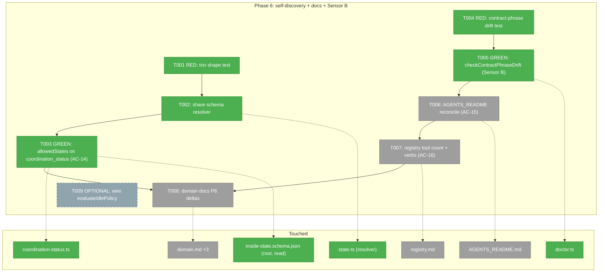
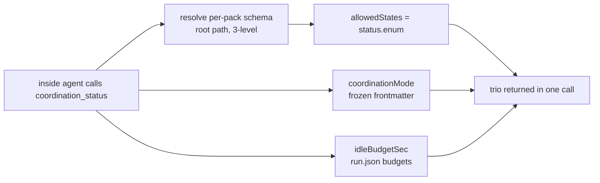
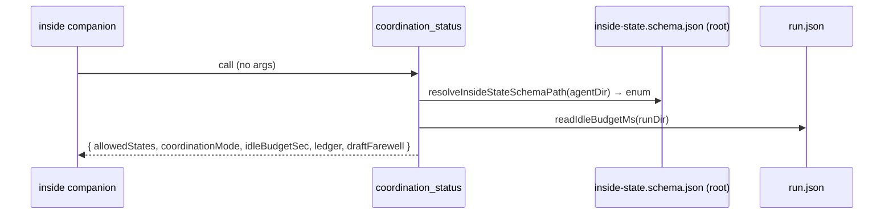

# Phase 6 — Runtime self-discovery + docs reconciliation (#29 + #32 docs)

**Plan**: [companion-coordination-plan.md](../../companion-coordination-plan.md)
**Phase**: 6 of 6 (**final**) · **CS**: 3 · **Mode**: Full
**Depends on**: Phase 3 (vocabulary chosen) · Phase 5 (idle budget exists) · Phase 4 (the `coordination_status` tool + `coordinationMode` enum this phase extends)
**Created**: 2026-06-15
**Status**: Tabled — awaiting GO (no code yet)

---

## Executive Briefing

- **Purpose**: Make the inside agent able to read its own coordination metadata in one call (the self-discovery trio), reconcile the remaining docs to the singular contract, and stand up the contract-phrase drift sensor (Sensor B) that was folded out of the dropped Phase 0 — so the pack's published phrases can't silently drift from the docs. This is the **last** phase; after it the plan is review/merge-ready.
- **What we're building**:
  1. `allowedStates` added to the `coordination_status` MCP tool so the trio (`allowedStates` + `coordinationMode` + `idleBudgetSec`) returns in **one** call (AC-14).
  2. `checkContractPhraseDrift` in `minih doctor` (**Sensor B**, mirrors `checkPromptStateVocabularyDrift`), returning `'fail'` on drift (promoted from `'warning'` because the docs it guards are reconciled in this same phase).
  3. Surgical docs reconciliation: the two surviving stale "six tools" claims → nine; `no_engagement` added to the AGENTS_README exit-reason enums (AC-15/16); new Phase-6 contracts noted in the domain docs.
- **Goals**:
  - ✅ The trio is returned by `coordination_status` in one call, `allowedStates` resolved from the live per-pack schema (root path, per PIC-1).
  - ✅ `minih doctor` hard-fails on a stale contract phrase; passes clean on the real companion pack.
  - ✅ `registry.md` + `AGENTS_README.md` reflect the real tool count (9) and the full exit-reason vocabulary.
  - ✅ `just fft` exits 0 with the new tests (AC-17).
- **Non-goals**:
  - ❌ Inventing a richer `coordinationMode` enum — it stays the pinned binary `'enabled' | 'disabled'` (Phase 4 PIC; do not widen).
  - ❌ Relocating the per-pack state schema to `state/` — **superseded by PIC-1** (that dir is install-denied; schema stays at the agent root).
  - ❌ Full prose reconciliation of every doc — the contract-phrase check guards the *known* phrases; broad prose review is `plan-7`/review territory (proof-tier honesty, per the plan).
  - ❌ Live end-to-end / real-clock proof — the Phase-0 fake-adapter was dropped; live idle/drain rows stay dogfood/review.

---

## Architect / recon corrections (read before implementing)

The stage-5 recon (4 parallel read-only passes over the current tree) found the plan's Phase 6 table **over-scoped the docs work** — Phases 4/5 already did much of it — and **mis-stated two assumptions**. Honest deltas:

| Plan said | Reality on disk (2026-06-15) | Effect on Phase 6 |
|---|---|---|
| 6.1 adds the full trio | `idleBudgetSec` (Phase 5) **and** `coordinationMode` (Phase 4) already on `coordination_status` | 6.1 narrows to **adding `allowedStates`** + asserting the trio together |
| schema relocated to `state/inside-state.schema.json` (manifest rows 51–52, tasks 3.2) | **PIC-1 kept it at the agent root** `agents/code-review-companion/inside-state.schema.json` (`state/` ∈ install-denied `RUNTIME_DIR_NAMES`) | `allowedStates` resolves via the **existing 3-level resolver**, never a hardcoded `state/` path |
| 6.3 fixes "six"→count in `registry.md` **and** `mcp/domain.md` | `mcp/domain.md` already says **"nine"** + lists `coordination_status` (Phase 4/P7) | 6.3 narrows to `registry.md:7` only (+ verify mcp/domain.md) |
| 6.2 reconciles AGENTS_README **and** companion-mode.md | `companion-mode.md` already carries the full exit-reason vocab + ledger-driven idle + findings home | 6.2 narrows to **AGENTS_README** (`six`→nine; add `no_engagement` to two enum examples); companion-mode.md = verify-only |
| 6.4 updates runner/cli/mcp domain docs | runner/cli/mcp domain docs already carry CompanionLedger/deriveCompanionLedger, the `minih companion` verb, and `coordination_status` (Phase 4/5) | 6.4 narrows to the **new Phase-6 deltas**: `allowedStates` (mcp), `checkContractPhraseDrift` (cli), P6 History rows |
| Sensor B guards 4 phrase classes incl. **MCP tool count** (plan lines 112/242/281) | A per-agent doctor check can't string-scan arbitrary docs (AGENTS_README/registry) for tool-count without false positives | Sensor B (T005) is scoped to the **3 pack-internal** classes (exit-reason, findings-home, state-vocab description); **tool-count drift stays a deterministic file edit (T006/T007) + `minih doctor` pass — NOT the contract-phrase sensor.** A recorded narrowing of the automated check, not an omission |

**Carried-forward decision (not in the plan's Phase 6 scope):** Phase 5 left `evaluateIdlePolicy` **built + unit-tested but unwired** into the runner loop — a never-spoke peer exits via the run-timeout backstop (`timeout`) rather than a graceful `no_engagement`. The runner has `runElapsedMs` and can derive the ledger, so the wiring is small. It's **runner behaviour, not self-discovery/docs**, so it's the contingent task at the end of this dossier (`T009`) — surfaced for an explicit GO, not a default Phase-6 task.

### Verify the recon facts before narrowing (trust-but-verify)

The recon-corrections table reflects the tree at **2026-06-15**. A task that *narrows* (verify-only, "already correct") rests on a fact still holding — a rebase could move it. Before narrowing, confirm each; if one diverges, escalate rather than silently narrow:
- `coordination-status.ts` `CoordinationStatusResult` already carries `coordinationMode` + `idleBudgetSec`; `allowedStates` is absent.
- `agents/code-review-companion/inside-state.schema.json` resolves at the **root** (no `state/` dir).
- `docs/domains/mcp/domain.md` already says "nine"; `docs/how/companion-mode.md` already carries the full exit-reason vocab incl. `no_engagement`.
- The stale spots that **do** need editing are exactly: `AGENTS_README.md:529` ("six"), `:764`/`:887` (exitReason missing `no_engagement`), `registry.md:7` ("six").

### AC → task mapping (Phase 6)

| AC | Tasks | Verified by |
|----|-------|-------------|
| **AC-14** | T001 · T002 · T003 | `coordination_status` returns `{allowedStates, coordinationMode, idleBudgetSec}` in one call (T001 test green) |
| **AC-15** | T004 · T005 · T006 | `checkContractPhraseDrift` = `pass` on the real pack **and** `minih doctor` exits 0; AGENTS_README carries the full exit-reason vocab incl. `no_engagement` |
| **AC-16** | T007 | `registry.md` lists the real nine tools + the `minih companion status` verb |
| **AC-17** | T001 · T004 (the new tests) | `just fft` exits 0 with the new `test/mcp/coordination-status.test.ts` + `test/cli/doctor-contract-phrase.test.ts` cases; coordination suite green |

---

## Prior Phase Context (Phases 1–5)

Synthesized from the phase execution logs. Weighted toward Phases 3/4/5 (Phase 6's direct dependencies).

### Phase 1 — Verify-and-close permission edge (#25) · CS-1
- **Deliverables**: E205-boot-gate characterisation tests; `companion-mode.md` E205-at-boot doc fix; recorded #25 close disposition.
- **Exported**: none structural (verify-and-close). **Pattern**: verify-first → "no edit needed — already correct" disposition; verify the premise against disk before building.
- **Gotcha**: `fireOutsideInboxSignal` writes to the **inside** lane despite its name — trust `inboxLanePath(location,'inside')`, not the function name.
- **Carried to P6**: Sensor B (contract-phrase check) was first deferred here.

### Phase 2 — Inbox delivery parity (#40) · CS-3
- **Deliverables**: `listUnackedVisible(...)` exported from `inbox-poll.ts`; `event-wait` `inbox.message` branch on the unread/ack model; `cleanup()` splice-and-close re-entry guard + real-`fs.watch` race test. Coordination suite green.
- **Exported**: `listUnackedVisible` — **but explicitly NOT for ledger/drain reuse** (doc-comment + PIC forbid it; the ledger derives over raw `folder.ts` lanes).
- **Gotcha**: inbox-poll parser is **strict** (throws on corrupt); a message is "consumed" only when the peer emits an `ack` record — a read never consumes (so the Phase-5 drain can re-read the same lanes).

### Phase 3 — State-vocabulary coherence (#27/#31) · CS-2
- **Deliverables**: 6 transition-acceptance tests; doctor-drift=`pass` test; schema description corrected to fact ("enforced", not "not yet enforced").
- **Exported**: the validated **6-value enum** `[idle, reading, reviewing, reporting, blocked, stopping]`; **schema at agent ROOT** (PIC-1); `validateInsideState` is enforced at `state.ts:81`/`:100` (throws out-of-enum).
- **Gotcha / PIC-1 (load-bearing)**: relocating the schema to `state/` would drop it from the install payload → installed companions fall back to the default enum → reopens #27/#31. **Keep it at root.** Doctor check is one-directional (prompt→enum), `warning` not `fail`.

### Phase 4 — Ledger-derived lifecycle primitive (#36 + #32) · CS-4 (the contract Phase 6 extends)
- **Deliverables**: `deriveCompanionLedger(location,{now?})` + `CompanionLedger`/`CompanionFinding`/`CompanionAckChain`/`CompanionDraftFarewell` types; the `coordination_status` MCP tool (9th, mirrors `permission-status.ts`); `minih companion status [--json]`; `report.findings[]` schema home; strict draft validation.
- **Exported (load-bearing for P6)**: `coordinationMode: 'enabled'|'disabled'` pinned (do **not** widen); `coordination_status` returns `{agentSlug, coordinationMode, ledger, draftFarewell, idleBudgetSec}` today; `MCP_TOOL_NAMES`/`TOOL_CONTRACTS` hard-asserted at **9**; tool is barrel-exported for test importability (PIC-E deviation).
- **Gotcha**: `idleElapsedMs === null` (no inbound yet) is real, distinct from `0`; reads throw `CompanionLedgerError` on torn lanes; draft only via `buildDraftFarewell`/`validateDraftFarewell`.

### Phase 5 — Idle-budget policy + shutdown drain (#35) · CS-3
- **Deliverables**: `evaluateIdlePolicy` (pure); `drainAndReadInbox` + `reconcileReportFindings`; `idleBudgetSec` on `coordination_status` (read from `run.json` budgets via `readIdleBudgetMs`); `DEFAULT_IDLE_BUDGET_MS = 1_800_000`; prompt idle wording → ledger-driven. 3 companion MEDIUMs reconciled (F001 drift test, F002 observable torn-lane, F003 schema-doc).
- **Exported**: `evaluateIdlePolicy(ledger,{idleBudgetMs,runElapsedMs,timeoutSec,now?})→{standDown,exitReason:'idle_budget'|'no_engagement'|null,reason}`; `readIdleBudgetMs(runDir)`; `DEFAULT_IDLE_BUDGET_MS`.
- **Gotcha**: `MINIH_PARAMS` doesn't reach the inside-MCP subprocess → budget is read from `run.json` on disk (A2). Use `unresolvedPeerRequests` for "work outstanding", `reviewedIds` for "completed" — never `ackedIds`.
- **Carried to P6 (decision)**: **`evaluateIdlePolicy` is unwired** into the runner terminal path — see optional T009.

---

## Pre-Implementation Check

| File | Exists? | Domain | Notes |
|------|---------|--------|-------|
| `src/mcp/tools/coordination-status.ts` | ✅ modify | mcp | Add `allowedStates: string[]` to `CoordinationStatusResult` (~`:26-42`) + body; trio assembled here. `coordinationMode`/`idleBudgetSec` already present. |
| `src/mcp/tools/state.ts` | ✅ modify | mcp | Extract the private 3-level resolver `insideStateSchemaPath` (~`:182-192`) into a shared mcp-internal export so `coordination-status.ts` reuses one resolution path (intra-domain). |
| `src/mcp/types.ts` | ✅ read-only | mcp | `MCP_TOOL_NAMES`/`TOOL_CONTRACTS` already = **9**; no count change (the contract test stays green). |
| `src/mcp/index.ts` | ✅ read-only | mcp | Tool already exported; no change. |
| `src/cli/commands/doctor.ts` | ✅ modify | cli | NEW `checkContractPhraseDrift` mirroring `checkPromptStateVocabularyDrift` (`:640-687`); push into `checks[]` after `:182` inside `if (coordination.enabled)`. Return-union `'pass'\|'warning'\|'fail'\|'skip'` (`:29`); a single `'fail'` → non-zero exit (`:343`). doctor's own `resolveInsideStateSchemaPath` (`:574-580`) stays — different (cli) domain. |
| `agents/code-review-companion/inside-state.schema.json` | ✅ read-only | pack | **Root path (PIC-1)** — the `allowedStates` source: `.properties.status.enum` = the 6 values. |
| `agents/code-review-companion/prompt.md` | ✅ read-only | pack | Sensor B reads it for the exit-reason / findings-home phrase assertions. (Phase 5 already made idle wording ledger-driven.) |
| `agents/code-review-companion/output-schema.json` | ✅ read-only | pack | Exit-reason enum source of truth (must include `no_engagement`) for the contract-phrase check. |
| `AGENTS_README.md` | ✅ modify | docs | `:529` "six MCP tools" → nine; add `no_engagement` to exitReason enums at `~:764` and `~:887` (AC-15). |
| `docs/domains/registry.md` | ✅ modify | docs | `:7` "six backend-safe inbox/state tools" → nine; add `minih companion status` verb + `coordination_status` cross-ref (AC-16). |
| `docs/domains/mcp/domain.md` | ✅ verify | docs | Already "nine" + lists `coordination_status` — add `allowedStates` to its contract entry; else verify-only. |
| `docs/domains/cli/domain.md` | ✅ modify | docs | Add `checkContractPhraseDrift` to the doctor-checks concept + P6 History. |
| `docs/domains/runner/domain.md` | ✅ verify | docs | CompanionLedger/idle-policy already documented (P4/P5) — verify; add P6 History only if a runner change lands (T009). |
| `docs/how/companion-mode.md` | ✅ verify | docs | Already carries full exit-reason vocab + ledger-driven idle + findings home — verify-only; edit only if the contract-phrase check reveals residual drift. |
| `test/mcp/coordination-status.test.ts` | ✅ modify | test | Add the AC-14 shape test (`allowedStates` resolved + trio together). |
| `test/cli/doctor-contract-phrase.test.ts` | 🆕 create | test | NEW — RED→GREEN for Sensor B; mirror `test/cli/doctor-state-vocabulary.test.ts` structure (incl. the "real pack passes" case). |

**Harness**: router installed (`/eng-harness-flow`) — the implement verb fires the pre-implement seam before any code and the phase-end seam after. Verdicts narrated verbatim (`healthy/SLOW/UNHEALTHY/UNAVAILABLE`).

---

## Architecture Map



---

## Tasks

| Status | ID | Task | Domain | Path(s) | Done When | Notes |
|--------|-----|------|--------|---------|-----------|-------|
| [x] | T6.0 | **Harness pre-flight** — `/eng-harness-flow --event pre-implement --phase "Phase 6: Runtime self-discovery + docs reconciliation (#29 + #32 docs)" --plan-dir docs/plans/027-companion-coordination` | — | — | Router envelope handled; boot verdict narrated verbatim before any code | _Harness seam_ |
| [x] | T001 | **RED**: extend `coordination-status` test to assert the returned shape carries `allowedStates: string[]` (the resolved per-pack enum), alongside `coordinationMode` + `idleBudgetSec` — the trio in one call | mcp | `/Users/jordanknight/substrate/minih/test/mcp/coordination-status.test.ts` | Test red for the right reason (`allowedStates` absent today) | AC-14; Workshop 003 §trio |
| [x] | T002 | Extract the 3-level resolver from `state.ts` into a shared **mcp-internal** module `src/mcp/tools/inside-state-schema.ts`, exporting `insideStateSchemaPath(context)` (keep the existing name + signature verbatim); `state.ts` re-imports it; `coordination-status.ts` imports it (1-line) for T003 | mcp | `/Users/jordanknight/substrate/minih/src/mcp/tools/state.ts`, `/Users/jordanknight/substrate/minih/src/mcp/tools/inside-state-schema.ts` (new), `/Users/jordanknight/substrate/minih/test/mcp/inside-state-schema.test.ts` (new) | Existing `state.ts`/`state_transition` tests stay green; resolver keeps the **preferred(`state/`)→legacy(root)→default** fallback so the companion's **root** schema is found (PIC-1); new test pins the fallback order | Intra-domain (mcp→mcp); doctor keeps its own cli resolver |
| [x] | T003 | **GREEN**: add `allowedStates: string[]` to `CoordinationStatusResult` + tool body — resolve schema via T002 helper, read `.properties.status.enum` (default `[]` if unresolved); confirm `coordinationMode`/`idleBudgetSec` already present → trio returned together | mcp | `/Users/jordanknight/substrate/minih/src/mcp/tools/coordination-status.ts`, `/Users/jordanknight/substrate/minih/src/mcp/index.ts` | T001 green; trio in one call; **`coordinationMode` stays `'enabled'\|'disabled'`** (not widened) | AC-14; do not invent a richer mode enum (Phase 4 PIC) |
| [x] | T004 | **RED**: new doctor test for `checkContractPhraseDrift` — seed a stale companion pack and assert `'fail'`; assert `'pass'` for the real `agents/code-review-companion/` pack | cli | `/Users/jordanknight/substrate/minih/test/cli/doctor-contract-phrase.test.ts` (new) | Test red (no such check yet). **Three stale sub-cases, each → `'fail'`**: (1) `output-schema.json` exitReason enum missing `no_engagement`; (2) `prompt.md` findings-home wording absent (no `inbox_send type:'finding'` + ledger-derived `report.findings`); (3) `inside-state.schema.json` description reverted to "not yet enforced". Real pack → `'pass'` | Mirror `test/cli/doctor-state-vocabulary.test.ts` incl. the real-pack case; fixture mutates the pack's `prompt.md` + `output-schema.json` |
| [x] | T005 | **GREEN — Sensor B**: build `checkContractPhraseDrift(promptContent, agentDir)` mirroring `checkPromptStateVocabularyDrift` (`:640-687`); push into `checks[]` after `:182` inside `if (coordination.enabled)` | cli | `/Users/jordanknight/substrate/minih/src/cli/commands/doctor.ts` | T004 green; the **three pack-internal assertions** implemented (exit-reason incl. `no_engagement` ↔ output-schema enum · findings-home wording · state-vocab description); returns **`'fail'`** on drift (promoted from `'warning'`), `'pass'` clean, `'skip'` if artifacts absent; real pack passes; `minih doctor` still exits 0 on the current tree | Per finding 08; warn→fail because docs reconciled this phase. **Tool-count drift is NOT this sensor** — T006/T007 + doctor pass (recon row 5) |
| [ ] | T006 | Reconcile `AGENTS_README.md` to the singular contract: `:529` "six MCP tools" → **nine** (list all nine); add `no_engagement` to the exitReason enums at `~:764` and `~:887` | docs | `/Users/jordanknight/substrate/minih/AGENTS_README.md` | Contract-phrase check + `minih doctor` pass; phrases current | AC-15; companion-mode.md verified already-correct (verify-only) |
| [ ] | T007 | Housekeeping: `docs/domains/registry.md:7` "six backend-safe inbox/state tools" → **nine** (list tools); add the `minih companion status` verb + `coordination_status` cross-reference. Verify `mcp/domain.md` already says nine | docs | `/Users/jordanknight/substrate/minih/docs/domains/registry.md`, `/Users/jordanknight/substrate/minih/docs/domains/mcp/domain.md` | AC-16: registry reflects the real count + new tools/verbs | Per finding 07 |
| [ ] | T008 | Domain-doc P6 deltas: add `allowedStates` to `mcp/domain.md` `coordination_status` entry; add `checkContractPhraseDrift` to `cli/domain.md` doctor-checks concept; P6 History rows in mcp/cli (+ runner if T009 lands). runner/cli already carry the ledger/verb (verify) | docs | `/Users/jordanknight/substrate/minih/docs/domains/mcp/domain.md`, `/Users/jordanknight/substrate/minih/docs/domains/cli/domain.md`, `/Users/jordanknight/substrate/minih/docs/domains/runner/domain.md` | Domain docs reflect the new contracts; History updated | plan-6 domain step |
| [ ] | T6.z | **Harness phase-end** — `/eng-harness-flow --event phase-end --plan-dir docs/plans/027-companion-coordination` | — | — | Router envelope handled at phase end (router owns drain-vs-harvest) | _Harness seam_ |

**Whole-plan exit criterion** — **AC-17**: `just fft` exits 0 with the new tests included (`test/mcp/coordination-status.test.ts`, `test/mcp/inside-state-schema.test.ts`, `test/cli/doctor-contract-phrase.test.ts`); no regression in the coordination suite. (Run by the implement verb at phase close; not a separate task row.)

### Contingent task — decide at GO (not part of the default Phase-6 build)

T001–T008 + the two harness seams are the complete default phase. The row below is surfaced for an **explicit GO only**; it is **runner behaviour, out of the plan's Phase-6 scope** (self-discovery + docs), and changes nothing unless you ask for it.

| Status | ID | Task | Domain | Path(s) | Done When | Notes |
|--------|-----|------|--------|---------|-----------|-------|
| [ ] | T009 | **OPTIONAL** — wire `evaluateIdlePolicy` into the runner terminal loop so a never-spoke peer exits gracefully `no_engagement` instead of hard `timeout`; RED→GREEN over the runner path (oracle + drain already exist) | runner | `src/runner/runner.ts`, `test/runner/*` | Never-spoke peer exit reason is `no_engagement`; existing idle-policy tests stay green | Carried-forward from Phase 5 |

---

## Context Brief

### Key findings from plan (Phase-6-relevant)
- **Finding 07** — MCP tool count drift: docs said "six"; real post-Phase-4 count is **9**. → T007 (now narrowed to `registry.md` + `AGENTS_README.md`; `mcp/domain.md` already fixed).
- **Finding 08** — doctor drift check is one-directional and the contract-phrase class had no sensor. → T005 (Sensor B). Keep the per-pack enum exactly the published set so both checks stay green.

### Sensor B scope (decided — three pack-internal assertions)
The contract-phrase check guards exactly these **pack-internal** phrases (mirrors the per-agent shape of `checkPromptStateVocabularyDrift`, which takes `(promptContent, agentDir)`) — this is the settled scope, not an implement-time choice:
1. **Exit-reason vocabulary** — the prompt's stated exit reasons include `no_engagement` and match `output-schema.json`'s enum (`stop_requested | idle_budget | no_engagement | timeout | error`). *(The core assertion.)*
2. **Findings-home wording** — the prompt states findings are sent live via `inbox_send type:'finding'` and `report.findings[]` is derived from the ledger.
3. **State-vocab description** — the schema description is the corrected "enforced" phrasing, not the stale "not yet enforced" (Phase 3 fixed it; the sensor pins it).

**Tool-count and cross-doc prose** (AGENTS_README/registry) are reconciled by **T006/T007 + the `minih doctor` pass** — a deterministic file edit verified by review — **never string-scanned from a per-agent check** (recorded as recon row 5). This keeps Sensor B deterministic and false-positive-free; widening it to scan arbitrary docs would be a separate PIC, not this phase.

### Domain dependencies (consumed)
- `runner`: `deriveCompanionLedger`, `CompanionLedger`, `readIdleBudgetMs`, `DEFAULT_IDLE_BUDGET_MS`, `evaluateIdlePolicy` (T009) — all barrel-exported from `src/runner/index.ts`.
- `mcp`: `coordination_status` tool + `CoordinationStatusResult`; the inside-state schema resolver (T002).
- `pack`: the companion's root `inside-state.schema.json` (enum), `output-schema.json` (exit reasons), `prompt.md` (phrases).

### Domain constraints
- `cli → runner` and `mcp → runner` imports are legal; `mcp ↔ cli` are NOT — keep the schema-resolver extraction **intra-mcp** (T002); doctor.ts keeps its own cli-domain resolver.
- Do not touch the global default `src/schemas/inside-state.json`; do not widen `coordinationMode`.

### Harness context (router installed)
- **Entry**: `/eng-harness-flow --event <seam> [--phase <id>] [--plan-dir <p>] --json` — single door; children never named.
- **Pre-implement** (T6.0) and **phase-end** (T6.z) seams fired by the implement verb; router owns what happens.
- **Backpressure**: `backpressure-coverage.md` rated **Partial**; Sensor B (T005) is the surviving deterministic sensor it recommended — standing it up here closes the recommended Phase-0 item on the docs it guards.

### Reusable from prior phases
- Test fixtures: `mkdtemp` + seeded lane fixtures + injected `now` clock (Phase 4/5); `test/cli/doctor-state-vocabulary.test.ts` structure incl. the real-pack pass case (Phase 3); `coordination_status` tool test harness (Phase 4).

### System flow (AC-14 trio)





---

## Discoveries & Learnings

_Populated during implementation by the implement verb._

| Date | Task | Type | Discovery | Resolution | References |
|------|------|------|-----------|------------|------------|
| 2026-06-15 | T6.0 | gotcha | First pre-implement boot was **UNHEALTHY** — `biome check .` failed on a **formatter diff in the flight-plan `the-flow.json`** written the prior turn (not a source file). `just fft` runs `lint` before `format`, so it never self-heals → blocks AC-17 regardless of phase work. | `biome format --write the-flow.json`; re-boot → degraded (lint ✓). Surfaced to human (UNHEALTHY protocol) → "fix lint, then build". | T6.0 |
| 2026-06-15 | T005 | decision | Sensor B fires for **every** coordinated agent, but `demo-companion` has an `exitReason` enum **without** `no_engagement`. A blanket "must include no_engagement" would wrongly fail it and break `minih doctor` exit-0. | Assertion 1 = **parity** (`no_engagement` in BOTH prompt + enum, or NEITHER). Assertions 2/3 scoped to the companion contract shape (findings array / per-pack schema desc). All real agents pass/skip. | recon row 5 |
| 2026-06-15 | T005 | gotcha | The companion `prompt.md` farewell-envelope **example** (line 282) listed `stop_requested \| idle_budget \| timeout \| error` — omitting `no_engagement` that its own `output-schema.json` enum + prose declare. | Reconciled the example to include `no_engagement` (the exact exit-reason contract phrase Sensor B guards). Sensor passes via substring parity either way; fix is internal-consistency hygiene. | T005 |

**Types**: `gotcha` · `research-needed` · `unexpected-behavior` · `workaround` · `decision` · `debt` · `insight`

---

## Directory layout

```
docs/plans/027-companion-coordination/
  ├── companion-coordination-plan.md
  └── tasks/phase-6-runtime-self-discovery-docs-reconciliation/
      ├── tasks.md
      └── execution.log.md   # created by the implement verb
```

STOP — no code edited. Awaiting human GO.

---

## Validation Record (2026-06-15)

### Validation Thesis

**Raison d'être**: Give the implement agent an actionable, source-grounded task list for the final phase of plan 027 — surfacing the self-discovery trio (AC-14), Sensor B (contract-phrase doctor check), and the narrowed docs reconciliation (AC-15/16) — while honestly correcting the plan's over-scoped/superseded assumptions so the implementer doesn't build the wrong thing.

**Value claim**: Implementation is cheaper/safer because the agent knows the trio is 2/3 done, won't relocate the schema (PIC-1), won't widen `coordinationMode`, builds Sensor B mirroring the existing check, and won't re-fix already-correct docs.

**Artifact promise**: The implement verb executes with minimal clarification — real paths/line-refs, correct dependency order, RED→GREEN tasks, ACs mapped to tasks.

**Intended beneficiaries**: implement agent (primary), reviewer (AC mapping), future maintainers (recon-corrections table).

**Proof target**: Implementation.

**Evidence standard**: source-code match (verified), AC coverage, dependency correctness, test-file existence.

**Thesis source**: `companion-coordination-plan.md` §Phase 6 + §Acceptance Criteria (AC-14/15/16/17) + user request.

**Thesis verdict**: Advanced (after fixes) — proof-level tightening (T002 signature, Sensor B phrase set, AC mapping, recon-verify note) lifted it from orientation-to-implementation to clean Implementation.

**Main thesis risk**: A recon fact going stale on a future rebase — mitigated by the trust-but-verify checklist now in the dossier.

---

| Agent | Lenses Covered | Thesis Axes | Issues | Verdict |
|-------|---------------|-------------|--------|---------|
| Source Truth | Concept Documentation, Technical Constraints, System Behavior, Hidden Assumptions | Evidence Sufficiency | recon table verified ~100% accurate; 0 open | ✅ |
| Cross-Reference + Completeness | Integration & Ripple, Edge Cases, Domain Boundaries, Concept Documentation, Deployment & Ops | Downstream Usefulness, Review Compression | 1 (Sensor-B tool-count narrowing) fixed; AC coverage complete | ⚠️ → ✅ |
| Thesis Alignment | Thesis Alignment, Evidence Sufficiency, Proof-Level Fit | Implementation Readiness, Proof-Level Fit | 2 HIGH (T002/Sensor-B vagueness) + non-goal creep fixed | ⚠️ → ✅ |
| Forward-Compatibility | Forward-Compatibility, Deployment & Ops, Security | Safety to Change, Contract Integrity | 4 LOW (path/fixture specificity) fixed; PASS all consumers | ✅ |

### Forward-Compatibility Matrix

| Consumer | Requirement | Failure Mode | Verdict | Evidence |
|----------|-------------|--------------|---------|----------|
| Implement verb (stage 6) | Accurate paths/line-refs; RED→GREEN with testable Done-When; clear T009 stance | encapsulation lockout / shape mismatch | ✅ | All paths absolute & verified; T001/T004/T005 RED states explicit; T009 moved to contingent section |
| Merge stage (stage 8) | AC→task mapping for AC-14/15/16/17; AC-17 `just fft` gate | test boundary | ✅ | §AC → task mapping added; AC-17 names the three new test files |
| Plan's inherited promise (§Phase 6) | Honest deltas; no silent stale-plan follow | contract drift | ✅ | Recon-corrections table supersedes the relocate rows with PIC-1 evidence; Phase 3 log confirms |

**Thesis alignment**: Value claim advanced at Implementation proof level after fixes; main residual risk is a recon fact going stale on a future rebase, mitigated by the trust-but-verify checklist.

**Outcome alignment**: The dossier as written advances "make it reliable and self-describing" by surfacing the self-discovery trio (`allowedStates` + `coordinationMode` + `idleBudgetSec`) in one call and standing up Sensor B (contract-phrase drift check) to guard the docs it reconciles in this phase.

**Standalone?**: No — the implement verb (stage 6) is a concrete downstream consumer of this dossier's shape.

Overall: ⚠️ VALIDATED WITH FIXES
