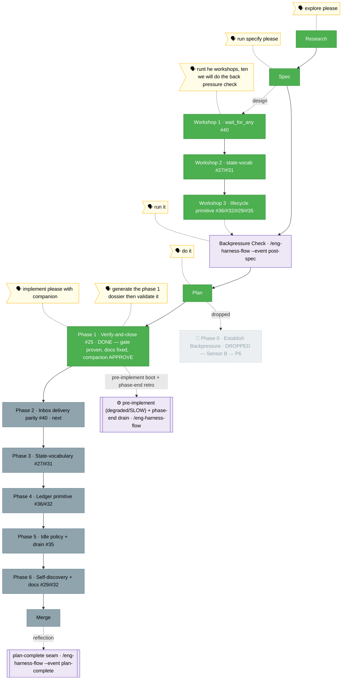

<!-- 🔄 RENDERED from the-flow.json — regenerate, never hand-edit this file as the primary. -->
# Flight plan — companion-coordination

**Plan**: companion-coordination · **Mode**: Full · **Phases**: 6 (1–6; Phase 0 dropped after validate-v2)
**Rail**: `[the-flow] ◆─◆─◆─[◆─◇─◇─◇─◇─◇]─◇`   ·   **now**: Phase 1 (#25) complete · **next**: Phase 2 (#40) tasks

**Legend**: 🟩 done · 🟧 in progress · 🟦 known future (designed) · ⬜╴assumed future (dashed) · 🟨 🗣 verbatim user input · 🟪 harness seams (violet — routed via `/eng-harness-flow`)

_Generated from `the-flow.json`. **Phase 1 (#25) is COMPLETE — verify-and-close shipped with the live `code-review-companion`.** AC-1: a new `.e2e` characterisation test drives a real `compile()` release-default resolution (`restricted`/write-deny) through the FX008 boot gate to **E205**, plus a CLI no-permissions repro case — **8/8 targeted tests green**; the stale `runner.ts` "yolo default" comment was corrected to the R6 reality. AC-2: `companion-mode.md` already said "at boot" (no edit); the companion caught a real **MEDIUM (F001)** — `permissions.md` named the wrong physical inbox lane for the `permission-error` signal (`outside`→`inside`) — fixed; the #25 close-comment disposition is recorded. **Companion verdict APPROVE, 0 HIGH/CRITICAL**; its magicWand independently re-derived **Phase 4** (`coordination_status`/`deriveCompanionLedger`). The pre-implement boot came up `degraded`/SLOW (a biome format diff in this very flight-plan JSON — formatted, then proceeded) and the phase-end seam buffered SUGG-001 + COORD-001/MH-001 for the retro. Commits: `5ab51e1` · `57644c7` · `a7bcac5` · `181fc19`. Next: **Phase 2 (#40)** — inbox delivery parity — generate its tasks dossier (stage 5)._
