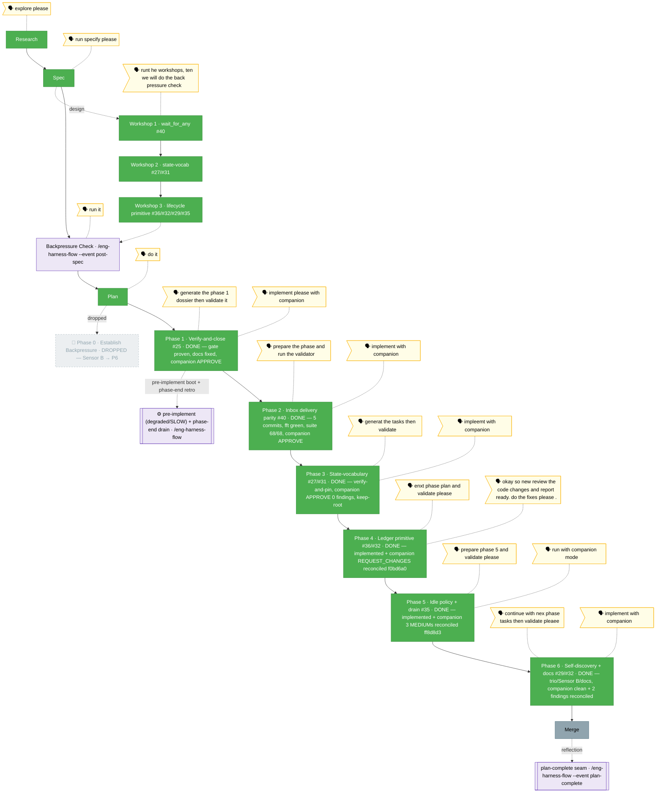

<!-- 🔄 RENDERED from the-flow.json — regenerate, never hand-edit this file as the primary. -->
# Flight plan — companion-coordination

**Plan**: companion-coordination · **Mode**: Full · **Phases**: 6 (1–6; Phase 0 dropped after validate-v2)
**Rail**: `[the-flow] ◆─◆─◆─[◆─◆─◆─◆─◆─◆]─◇`  ·  research · spec · plan · build 6/6 · [merge]   ·   **now**: Phase 6 IMPLEMENTED + COMPLETE (`--companion`, the final build) — trio/AC-14, Sensor B/AC-15, docs/AC-15/16; companion reviewed every commit, exited clean, 2 findings reconciled; `just fft` exit 0 (1386 passed) · **next**: all 6 phases done → plan **code-complete** → **merge** (stage 8; review SKIPPABLE — companion reviewed every commit); merge executes only on typed `PROCEED`

**Legend**: 🟩 done · 🟧 in progress · 🟦 known future (designed) · ⬜╴assumed future (dashed) · 🟨 🗣 verbatim user input · 🟪 harness seams (violet — routed via `/eng-harness-flow`)

_Generated from `the-flow.json`. **Phase 1 (#25) COMPLETE** (verify-and-close with the live companion; AC-1 gate proven by a release-default→E205 `.e2e` test 8/8 green, stale `runner.ts` comment fixed, companion-caught `permissions.md` lane fix F001, APPROVE 0 HIGH/CRITICAL; commits `5ab51e1`·`57644c7`·`a7bcac5`·`181fc19`). **Phase 2 (#40) COMPLETE** — implemented with the live companion (5 commits `f86a0b9`·`ff0a1f2`·`95be231`·`eff457e`·`812e468`): exported `listUnackedVisible` from inbox-poll and unified `event-wait`'s `inbox.message` branch on the unread/ack model (immediate pass + unacked watcher) so a message queued **before** the call is now delivered (#40); the two validate-v2 seams shipped as explicit RED criteria — V-1 torn-lane → `EventWaitInboxCorruptError` (no swallow), V-2 immediate-pass short-circuits before registration; `inbox_list` parity (AC-4), wildcard wake runner+MCP (AC-5), `cleanup()` splice-and-close re-entry guard + real-fs.watch close-count race (T006). `just fft` green; coordination suite **68/68**; one unrelated `agent-pack/extractor` flake cleared on re-run. Companion: **0 findings** (clean APPROVE-equivalent — it explicitly checked the lane direction + corrupt-lane path); its **magicWand independently re-derived Phase 4** (the `coordination_status` ledger tool), same as Phase 1's companion. The original tasks dossier (`tasks/phase-2-inbox-delivery-parity/tasks.md`) was a 6-task TDD dossier — export `listUnackedVisible` from `inbox-poll`; unify `event-wait`'s `inbox.message` branch onto the unread/ack model (immediate pass + unacked watcher); `inbox_list` parity; wildcard wake; `cleanup()` re-entry guard. `validate-v2` (4 agents) returned **Source-Truth SOUND · Cross-Reference ALIGNED · Forward-Compat COMPATIBLE · Completeness 5 gaps** — all folded into the table. The standout catch: the new synchronous immediate-pass opens a **corrupt-lane throw path** (V-1, HIGH — today's `snapshotInboxIds` swallows corruption) and a **settle-before-registration leak** (V-2), now explicit RED criteria; and a misleading "Phase 4/5 reuse this export" note was corrected (those derive over raw `folder.ts` lanes). Source claims confirmed line-by-line (snapshot bug `:78`/`:193`; `listVisible` private `:135-171`). **Phase 3 tasks TABLED + validate-v2'd** (2026-06-15, `generat the tasks then validate`): the State-vocabulary coherence (#27/#31) dossier (`tasks/phase-3-state-vocabulary-coherence/tasks.md`) — T001 AC-6 transition-acceptance test (all 6 statuses + a discriminating dropped-enum negative), T002 schema-location disposition, T003 stale-description fix, T004 AC-7 doctor no-drift pin; prior-phase review (P1+P2) + Pre-Implementation Check done. **validate-v2 (4 read-only agents) = ✅ VALIDATED** — source-truth 9/9 CONFIRMED, cross-reference clean (+1 HIGH plan gap), Outcome **ADVANCING**, Thesis **Strong / no non-goal creep**. **PIC-1 (CRITICAL, all-4-agent-confirmed)**: the plan's task 3.2 "relocate schema root → `state/`" is **install-unsafe** for this installable agent — `state` ∈ `RUNTIME_DIR_NAMES` (`manifest.ts:15-20`, install-denied); `code-review-companion` ships its schema at **root** via `agent.json` (v0.2.0) with a comment explaining exactly this; relocating would drop the schema from the install payload → installed companions fall back to the **default** enum → **reintroduces #27/#31** on installed copies. The plan never mentions `RUNTIME_DIR_NAMES` (genuine gap). **Recommended disposition**: keep schema at root, reshape T002 to verify-and-record (optional plan fix-loop on Phase 3 Delivers/Domain-Manifest). Also resolved: `validateInsideState` IS enforced (`state.ts:100`) → T003's description fix is definitive. **PIC-1 decided 2026-06-15 (Jordan): keep schema at root, no relocate** — T002 reshaped to verify-and-record; the "`.minih` footprint" idea noted as a separate future question. **Phase 3 IMPLEMENTED with the companion** (2026-06-15, `impleemt with companion`): verify-and-pin landed — T001 AC-6 transition-acceptance test (all 6 published statuses accepted against the **real shipped** schema at root + a discriminating dropped-enum negative → `MCP_INVALID_ARGUMENT`; 5/5), T002 keep-root **verified** (schema at root, no `state/` copy, in the `agent.json` install payload — no relocation), T003 stale "not yet enforced" description **corrected** (`validateInsideState` is enforced @ `state.ts:100`/`:81`, throws `MCP_INVALID_ARGUMENT`; enum unchanged), T004 AC-7 doctor `prompt-state-vocabulary-drift=pass` **pinned against the real `code-review-companion` pack** (14/14). `just fft` → exit 0 (no format drift); AC-17 met. Commits `984b504`·`3190952`·`8c6ae4b` (T002 no diff). Companion (run …317Z-ef6a): briefed once, pinged at all 3 commits + drain → **0 findings, clean APPROVE** on every commit + final sweep (its final review independently re-confirmed "only root schema, no `state/`" = PIC-1 keep-root); its **magicWand re-derived Phase 4 for the 3rd time** (coordination_status ledger). Phase-end seam routes drain (buffer non-empty) — **deferred to plan-complete** per cadence; `SUGG-003` captured. #27/#31 pinned closed. **Phase 4 tasks TABLED (stage 5) + validate-v2'd** (2026-06-15, `enxt phase plan and validate please`): the crown-jewel ledger-primitive dossier (`tasks/phase-4-ledger-derived-lifecycle-primitive/tasks.md`, 10 tasks T000–T0z) — `deriveCompanionLedger` over **raw** lanes (AC-8), draft farewell strict-validated-before-write (AC-9), `coordination_status` MCP tool 8→9 + pinned `coordinationMode` enum, `minih companion status` CLI, `report.findings[]` schema home (#32/AC-10), domain docs. Grounded by 3 prior-phase reviews + a codebase recon; **8 PIC reconciliations** vs the shipped tree (headline **PIC-A**: the ledger derives over **raw `folder.ts` lanes**, NOT the Phase-2 `listUnackedVisible` export — its own doc-comment forbids ledger consumers — correcting the plan's "reuse the export" wording). **validate-v2 (4 read-only agents)**: Source-Truth **SOUND** · Cross-Reference **ALIGNED** · Completeness **GAPS (2 HIGH)** · Forward-Compat **2 FAIL** — every finding folded in (added `report.findings[]` to `system-output.json`; renamed ledger fields to the consumer contract `idleElapsedMs`+`unresolvedPeerRequests`; added the `deriveCompanionLedger` runtime barrel-export note). Depends on Phase 2 + Phase 3 (both done). **Phase 4 (#36/#32) COMPLETE** — implemented with the companion (commits `37bdbc8`·`4ce612c`·`e779363`·`c3ed91d`); the companion issued **REQUEST_CHANGES** (4 findings F001–F004, 3 HIGH/1 MED; recorded `f87fc4d`) — **reconciled in `f0bd6a0`**: F004 body-only finding parsing + safe-null `toFinding`, F002 `reviewedIds`=completion-summary semantics, F001 `CompanionAckChain`/`ackChains` from both lanes, F003 `progressCount`→`peerUpdatesSent` (a self-proving fold — the companion's own 4 findings were all `meta=NONE` body-only, the exact shape F004 fixes); tsc 0, suite **1359 passed**/16 skipped, `just fft` green. **Phase 5 (#35) tasks TABLED + validate-v2'd** (2026-06-15, `prepare phase 5 and validate please`): the idle-budget-policy + shutdown-drain dossier (`tasks/phase-5-idle-budget-policy-shutdown-drain/tasks.md`, 6 tasks T000–T0z) — `evaluateIdlePolicy` pure fn (AC-11), idle budget discoverable on `coordination_status` (AC-12), `drainAndReadInbox` + overwrite-only-findings reconcile (AC-13), prompt ledger-driven rewrite, domain docs. Grounded by **4 prior-phase reviews + a live-code recon**; **6 PIC reconciliations** vs the shipped tree — headline: **no runner-side idle logic exists** (it's integer poll-streak prose in `prompt.md`), the drain **re-derives over RAW lanes** (`listUnackedVisible` foreclosed by two doc-comments), and **MCP teardown is implicit** so the drain is disk-only between `commit()` and report-write. **validate-v2 (4 agents)**: Source-Truth **SOUND** · Cross-Reference **ALIGNED** · Completeness **2 CRITICAL + 2 HIGH + 2 MED → ALL FOLDED** (A1 ceiling needs `runElapsedMs`+`timeoutSec` — the ledger has no wall-clock; A2 `MINIH_PARAMS` never reaches the MCP subprocess → real plumbing; A3 overwrite-only-findings; A4 torn-lane tolerate; A5 ordering discriminator; A6 first-contact null) · Forward-Compat validator **died mid-run** (its idleBudget-naming question covered by Cross-Ref + the A2 `idleBudgetSec` fold). Depends on Phase 4 (done). **Phase 5 (#35) COMPLETE** — implemented with the live companion (commits `a1e49af`·`de9cd16`·`65ae2d5`·`538c65e`·`2c7bdb3`, fix-pass `ff8d8d3`): `evaluateIdlePolicy` (AC-11, pure, 8 discriminating tests incl. the never-spoke A1 case), `idleBudgetSec` discoverable on `coordination_status` (AC-12 — A2 plumbing, `MINIH_PARAMS` proven NOT to reach the inside-MCP subprocess so the budget is recorded into `run.json`), `drainAndReadInbox` + overwrite-only-findings reconcile wired into the runner terminal block after the final inbox commit (AC-13, ordering discriminator; torn lane tolerated → never fails the run), `prompt.md` rewritten integer-poll-streak → ledger-driven (doctor `prompt-state-vocabulary-drift` pass), runner domain docs. The companion (run …`f932`) reviewed every commit → **APPROVE T001 + APPROVE_WITH_NOTES T002/T003/T004**, honoured `control:stop` (exit `stop_requested`), and raised **3 MEDIUM findings ALL reconciled** in `ff8d8d3` (F001 `DEFAULT_IDLE_BUDGET_MS`↔input-schema drift test; F002 reconcile returns `{wrote,reason}` + runner emits an observable `stderr.log` diagnostic for torn-lane/draft-invalid; F003 input-schema enable-flag contract doc + `replyWaitPolls` deprecated). `just fft` exit 0 (**1376 passed**/16 skipped/0 failed); `tsc` clean. **⚠️ Carried forward (Phase-6/follow-up): `evaluateIdlePolicy` is tested but UNWIRED into the runner loop** — a never-spoke peer exits via the run-timeout backstop (`timeout`) rather than a graceful `no_engagement`; the runner has `runElapsedMs` + can derive the ledger, so it could call the policy directly. **Phase 6 (#29/#32 docs) tasks TABLED + validate-v2'd** (2026-06-15, `continue with nex phase tasks then validate pleaee`): the FINAL-phase dossier (`tasks/phase-6-runtime-self-discovery-docs-reconciliation/tasks.md`, T001–T008 + 2 harness seams + contingent T009) — add `allowedStates` to `coordination_status` so the self-discovery trio returns in one call (AC-14; `coordinationMode`+`idleBudgetSec` already there from P4/P5), build **Sensor B** `checkContractPhraseDrift` in doctor (folded from the dropped Phase 0; warn→fail; 3 pack-internal phrase classes), and the **narrowed** docs reconciliation (AGENTS_README `six`→nine + `no_engagement` in two exitReason enums = AC-15; registry tool count = AC-16). A stage-5 **4-pass recon** found the plan's Phase-6 table over-scoped — Phases 4/5 already reconciled `mcp/domain.md` + `companion-mode.md` + runner/cli domain docs — and **PIC-1** (schema stays at agent **root**, `state/` is install-denied) supersedes the plan's relocate rows. **validate-v2 (4 read-only agents) = ⚠️ VALIDATED WITH FIXES**: Source-Truth confirmed the recon table **~100% accurate** vs disk; Cross-Reference flagged the **Sensor-B tool-count narrowing** (now recorded as recon row 5 — tool-count stays a deterministic file edit, not the per-agent sensor); Thesis lifted **orientation→Implementation** via 5 tightenings (exact Sensor-B phrase set enumerated in T004/T005, T002 resolver path+signature mandated, T009 moved to a contingent section, AC→task mapping + trust-but-verify checklist added); Forward-Compat **PASS** all consumers (PIC-1 honored, install payload safe, inside-only). Next: **Phase 6 implement (stage 6)** — the final build; a `/compact` seam is natural first (heavy validate turn), optionally `--companion` for a live reviewer on the last phase; **decide contingent T009** (wire `evaluateIdlePolicy` into the runner loop — the Phase-5 carried-forward gap) at GO. **Phase 6 (#29/#32 docs) COMPLETE** — implemented with the live companion (`implement with companion`): **T001–T003** added `allowedStates` to `coordination_status` so the self-discovery trio `{allowedStates, coordinationMode, idleBudgetSec}` returns in **one call** (AC-14) + extracted the shared `insideStateSchemaPath` mcp resolver from `state.ts` (PIC-1 root path preserved); **T004–T005** built **Sensor B** `checkContractPhraseDrift` in doctor (`no_engagement` *parity* + findings-home + state-desc; warn→**fail**; `minih doctor` still exits 0 — parity keeps `demo-companion` + other coordinated agents passing); **T006–T008** reconciled the docs (`AGENTS_README` + `registry` `six`→nine + `no_engagement`; mcp/cli domain deltas; runner verify-only). Pre-implement boot was **UNHEALTHY** (lint = a biome format diff in this flight-plan's own `the-flow.json`) → Jordan chose *fix-then-build* → formatted → degraded → proceeded. The live companion (run …`18-22-48`…) reviewed every commit + the drain, exited `stop_requested` clean, and sent **2 findings — both reconciled**: MEDIUM `domain-map.md` still said "six" (missed in the T007 sweep), LOW a stale `doctor.ts` resolver comment (T002 moved the fn). `just fft` exit 0 (**1386 passed**/16 skipped); commits `741be73`·`dcae0f8`·`9014777`·`d79785d`. Contingent **T009 NOT taken** (no GO). **All 6 phases done → the plan is code-complete; next is merge (stage 8), review skippable (companion reviewed every commit). The observe buffer drains at plan-complete.**_
