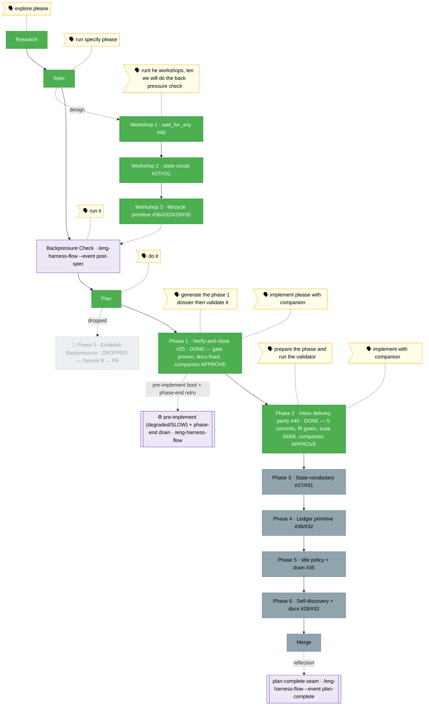

<!-- 🔄 RENDERED from the-flow.json — regenerate, never hand-edit this file as the primary. -->
# Flight plan — companion-coordination

**Plan**: companion-coordination · **Mode**: Full · **Phases**: 6 (1–6; Phase 0 dropped after validate-v2)
**Rail**: `[the-flow] ◆─◆─◆─[◆─◆─◇─◇─◇─◇]─◇`   ·   **now**: Phase 2 (#40) DONE — companion clean, fft green · **next**: Phase 3 (#27/#31) tasks

**Legend**: 🟩 done · 🟧 in progress · 🟦 known future (designed) · ⬜╴assumed future (dashed) · 🟨 🗣 verbatim user input · 🟪 harness seams (violet — routed via `/eng-harness-flow`)

_Generated from `the-flow.json`. **Phase 1 (#25) COMPLETE** (verify-and-close with the live companion; AC-1 gate proven by a release-default→E205 `.e2e` test 8/8 green, stale `runner.ts` comment fixed, companion-caught `permissions.md` lane fix F001, APPROVE 0 HIGH/CRITICAL; commits `5ab51e1`·`57644c7`·`a7bcac5`·`181fc19`). **Phase 2 (#40) COMPLETE** — implemented with the live companion (5 commits `f86a0b9`·`ff0a1f2`·`95be231`·`eff457e`·`812e468`): exported `listUnackedVisible` from inbox-poll and unified `event-wait`'s `inbox.message` branch on the unread/ack model (immediate pass + unacked watcher) so a message queued **before** the call is now delivered (#40); the two validate-v2 seams shipped as explicit RED criteria — V-1 torn-lane → `EventWaitInboxCorruptError` (no swallow), V-2 immediate-pass short-circuits before registration; `inbox_list` parity (AC-4), wildcard wake runner+MCP (AC-5), `cleanup()` splice-and-close re-entry guard + real-fs.watch close-count race (T006). `just fft` green; coordination suite **68/68**; one unrelated `agent-pack/extractor` flake cleared on re-run. Companion: **0 findings** (clean APPROVE-equivalent — it explicitly checked the lane direction + corrupt-lane path); its **magicWand independently re-derived Phase 4** (the `coordination_status` ledger tool), same as Phase 1's companion. The original tasks dossier (`tasks/phase-2-inbox-delivery-parity/tasks.md`) was a 6-task TDD dossier — export `listUnackedVisible` from `inbox-poll`; unify `event-wait`'s `inbox.message` branch onto the unread/ack model (immediate pass + unacked watcher); `inbox_list` parity; wildcard wake; `cleanup()` re-entry guard. `validate-v2` (4 agents) returned **Source-Truth SOUND · Cross-Reference ALIGNED · Forward-Compat COMPATIBLE · Completeness 5 gaps** — all folded into the table. The standout catch: the new synchronous immediate-pass opens a **corrupt-lane throw path** (V-1, HIGH — today's `snapshotInboxIds` swallows corruption) and a **settle-before-registration leak** (V-2), now explicit RED criteria; and a misleading "Phase 4/5 reuse this export" note was corrected (those derive over raw `folder.ts` lanes). Source claims confirmed line-by-line (snapshot bug `:78`/`:193`; `listVisible` private `:135-171`). Next: **Phase 3 tasks** (stage 5) — table the State-vocabulary coherence (#27/#31) dossier: verify/relocate the per-pack inside-state schema (root → preferred `state/`), correct its stale "not enforced" description, pin `doctor` = no drift. Verify-and-close shape (KF01: the pack already ships the schema); depends on None. A `/compact` seam is natural first._
