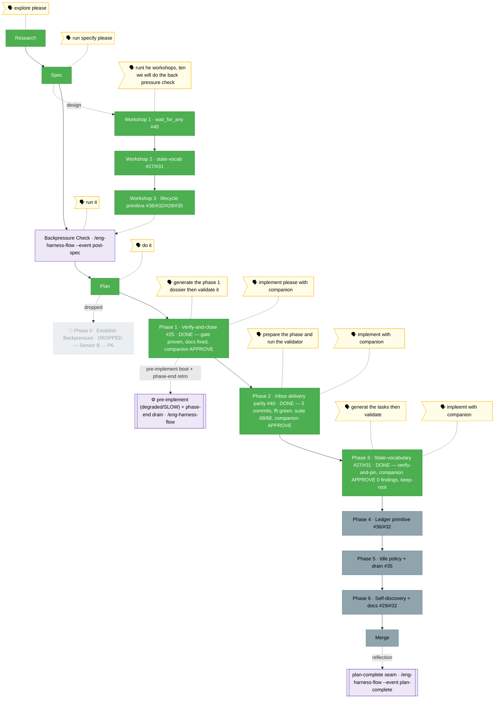

<!-- 🔄 RENDERED from the-flow.json — regenerate, never hand-edit this file as the primary. -->
# Flight plan — companion-coordination

**Plan**: companion-coordination · **Mode**: Full · **Phases**: 6 (1–6; Phase 0 dropped after validate-v2)
**Rail**: `[the-flow] ◆─◆─◆─[◆─◆─◆─◇─◇─◇]─◇`   ·   **now**: Phase 3 (#27/#31) IMPLEMENTED ✅ — verify-and-pin, companion clean APPROVE (0 findings) · **next**: Phase 4 tasks (stage 5) — coordination_status ledger primitive

**Legend**: 🟩 done · 🟧 in progress · 🟦 known future (designed) · ⬜╴assumed future (dashed) · 🟨 🗣 verbatim user input · 🟪 harness seams (violet — routed via `/eng-harness-flow`)

_Generated from `the-flow.json`. **Phase 1 (#25) COMPLETE** (verify-and-close with the live companion; AC-1 gate proven by a release-default→E205 `.e2e` test 8/8 green, stale `runner.ts` comment fixed, companion-caught `permissions.md` lane fix F001, APPROVE 0 HIGH/CRITICAL; commits `5ab51e1`·`57644c7`·`a7bcac5`·`181fc19`). **Phase 2 (#40) COMPLETE** — implemented with the live companion (5 commits `f86a0b9`·`ff0a1f2`·`95be231`·`eff457e`·`812e468`): exported `listUnackedVisible` from inbox-poll and unified `event-wait`'s `inbox.message` branch on the unread/ack model (immediate pass + unacked watcher) so a message queued **before** the call is now delivered (#40); the two validate-v2 seams shipped as explicit RED criteria — V-1 torn-lane → `EventWaitInboxCorruptError` (no swallow), V-2 immediate-pass short-circuits before registration; `inbox_list` parity (AC-4), wildcard wake runner+MCP (AC-5), `cleanup()` splice-and-close re-entry guard + real-fs.watch close-count race (T006). `just fft` green; coordination suite **68/68**; one unrelated `agent-pack/extractor` flake cleared on re-run. Companion: **0 findings** (clean APPROVE-equivalent — it explicitly checked the lane direction + corrupt-lane path); its **magicWand independently re-derived Phase 4** (the `coordination_status` ledger tool), same as Phase 1's companion. The original tasks dossier (`tasks/phase-2-inbox-delivery-parity/tasks.md`) was a 6-task TDD dossier — export `listUnackedVisible` from `inbox-poll`; unify `event-wait`'s `inbox.message` branch onto the unread/ack model (immediate pass + unacked watcher); `inbox_list` parity; wildcard wake; `cleanup()` re-entry guard. `validate-v2` (4 agents) returned **Source-Truth SOUND · Cross-Reference ALIGNED · Forward-Compat COMPATIBLE · Completeness 5 gaps** — all folded into the table. The standout catch: the new synchronous immediate-pass opens a **corrupt-lane throw path** (V-1, HIGH — today's `snapshotInboxIds` swallows corruption) and a **settle-before-registration leak** (V-2), now explicit RED criteria; and a misleading "Phase 4/5 reuse this export" note was corrected (those derive over raw `folder.ts` lanes). Source claims confirmed line-by-line (snapshot bug `:78`/`:193`; `listVisible` private `:135-171`). **Phase 3 tasks TABLED + validate-v2'd** (2026-06-15, `generat the tasks then validate`): the State-vocabulary coherence (#27/#31) dossier (`tasks/phase-3-state-vocabulary-coherence/tasks.md`) — T001 AC-6 transition-acceptance test (all 6 statuses + a discriminating dropped-enum negative), T002 schema-location disposition, T003 stale-description fix, T004 AC-7 doctor no-drift pin; prior-phase review (P1+P2) + Pre-Implementation Check done. **validate-v2 (4 read-only agents) = ✅ VALIDATED** — source-truth 9/9 CONFIRMED, cross-reference clean (+1 HIGH plan gap), Outcome **ADVANCING**, Thesis **Strong / no non-goal creep**. **PIC-1 (CRITICAL, all-4-agent-confirmed)**: the plan's task 3.2 "relocate schema root → `state/`" is **install-unsafe** for this installable agent — `state` ∈ `RUNTIME_DIR_NAMES` (`manifest.ts:15-20`, install-denied); `code-review-companion` ships its schema at **root** via `agent.json` (v0.2.0) with a comment explaining exactly this; relocating would drop the schema from the install payload → installed companions fall back to the **default** enum → **reintroduces #27/#31** on installed copies. The plan never mentions `RUNTIME_DIR_NAMES` (genuine gap). **Recommended disposition**: keep schema at root, reshape T002 to verify-and-record (optional plan fix-loop on Phase 3 Delivers/Domain-Manifest). Also resolved: `validateInsideState` IS enforced (`state.ts:100`) → T003's description fix is definitive. **PIC-1 decided 2026-06-15 (Jordan): keep schema at root, no relocate** — T002 reshaped to verify-and-record; the "`.minih` footprint" idea noted as a separate future question. **Phase 3 IMPLEMENTED with the companion** (2026-06-15, `impleemt with companion`): verify-and-pin landed — T001 AC-6 transition-acceptance test (all 6 published statuses accepted against the **real shipped** schema at root + a discriminating dropped-enum negative → `MCP_INVALID_ARGUMENT`; 5/5), T002 keep-root **verified** (schema at root, no `state/` copy, in the `agent.json` install payload — no relocation), T003 stale "not yet enforced" description **corrected** (`validateInsideState` is enforced @ `state.ts:100`/`:81`, throws `MCP_INVALID_ARGUMENT`; enum unchanged), T004 AC-7 doctor `prompt-state-vocabulary-drift=pass` **pinned against the real `code-review-companion` pack** (14/14). `just fft` → exit 0 (no format drift); AC-17 met. Commits `984b504`·`3190952`·`8c6ae4b` (T002 no diff). Companion (run …317Z-ef6a): briefed once, pinged at all 3 commits + drain → **0 findings, clean APPROVE** on every commit + final sweep (its final review independently re-confirmed "only root schema, no `state/`" = PIC-1 keep-root); its **magicWand re-derived Phase 4 for the 3rd time** (coordination_status ledger). Phase-end seam routes drain (buffer non-empty) — **deferred to plan-complete** per cadence; `SUGG-003` captured. #27/#31 pinned closed. Next: **Phase 4 tasks (stage 5)** — the crown-jewel `coordination_status` ledger primitive (#36+#32, CS-4); a `/compact` seam is natural first._
