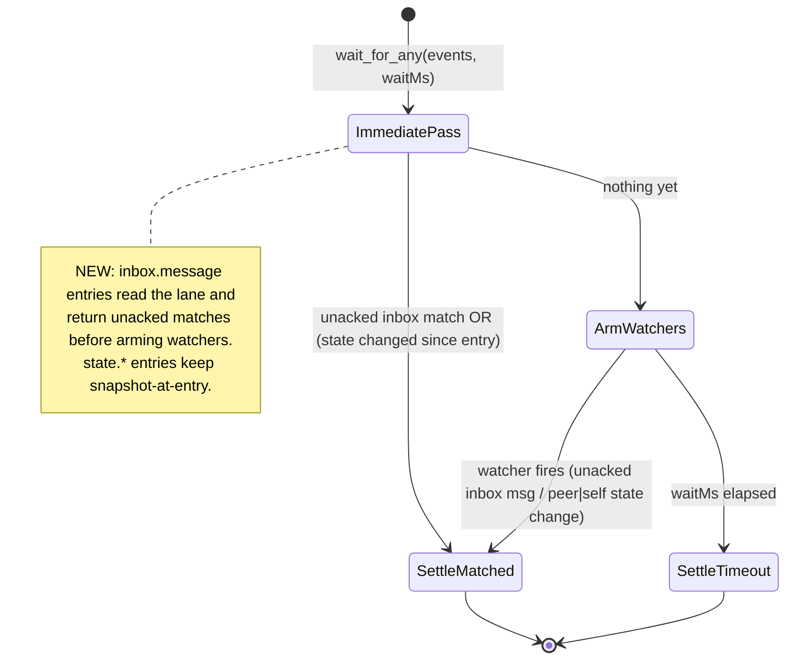

# Workshop: wait_for_any Delivery Semantics

**Type**: State Machine / API Contract
**Plan**: 027-companion-coordination
**Spec**: [companion-coordination-spec.md](../companion-coordination-spec.md)
**Created**: 2026-06-14
**Status**: Review

**Value Thesis**: Pins down *one* "already-consumed" model for the coordination inbox so a companion can no longer be deaf to work that was queued while it was busy (#40). Settling this before architecture turns a subtle concurrency bug with three plausible fixes into a single contract the build can execute against with a regression test.
**Target Proof Level**: Contract Ready
**Current Proof Level**: Preferred Direction

**Selected Value Axes**:
- **Knowability**: makes the hidden divergence between `wait_for_any` and `inbox_list` explicit — the root of #40.
- **Safety to Change**: the recommended fix preserves plan-014's single-settle teardown invariant (a prior companion review specifically vetted those paths).
- **Agent Readiness**: the resulting contract lets a companion "wake me for any outstanding work" reliably, with no two-step dance.
- **Cross-Domain Coordination**: the primitive lives in `runner`, is surfaced by `mcp`; both must agree on the consumed-model.

**Related Documents**:
- `docs/plans/014-wait-for-any-events/workshops/001-event-taxonomy-and-envelope.md` (origin of the primitive)
- Research dossier CF-01

**Domain Context**:
- **Primary Domain**: runner (`src/runner/event-wait.ts`, `src/runner/inbox-poll.ts`)
- **Related Domains**: mcp (tool contract for `wait_for_any` / `inbox_list`)

---

## Purpose

Decide how `wait_for_any` should treat inbox messages that were **already queued** when the call begins, so the coordination inbox has a single, coherent "what counts as unconsumed" model. This drives Phase 1 of the plan.

## Fresh Entrant Outcome

A fresh agent should reach **Contract Ready**: understand exactly why `wait_for_any` misses queued work today, the three candidate models, the chosen contract, and the regression test that proves it.

## Key Questions Addressed

- Why does `wait_for_any` miss queued messages that `inbox_list` returns? (#40)
- Should the fix introduce ack/unread semantics, a durable cursor, or a new tool?
- How do we avoid infinite re-delivery in a poll loop without re-introducing the snapshot bug?
- What happens to `state.peer.changed` / `state.self.changed` entries — do they change too?

---

## The Two Consumed-Models (root cause, made explicit)

Both primitives long-poll the same peer lane file. They differ **only** in what they consider "already seen":

| | `inbox_list` (`pollInboxLane`) | `wait_for_any` (`waitForAny`) |
|---|---|---|
| Consumed-model | **Durable unread/ack** | **Per-call snapshot-at-entry** |
| Immediate pass at entry? | **Yes** — `listVisible()` reads the full lane *before* arming the watcher (`inbox-poll.ts:114`) | **No** — snapshots all message IDs at entry, emits only post-snapshot arrivals (`event-wait.ts:78,193`) |
| "Already seen" set | messages whose id is in a peer `type:'ack'` record's `ackOf` (`inbox-poll.ts:144-152`) | every message id present in the lane at call entry (`event-wait.ts:301-312`) |
| Survives across calls? | **Yes** — ack records are on disk | **No** — snapshot is in-memory, rebuilt every call |
| Result for a busy companion | a message queued during the previous task is **unacked → returned** on the next immediate pass | a message queued during the previous task is **in the entry snapshot → never emitted** |

**This is the #40 mechanism, exactly.** The companion loop is `wait_for_any → process task (minutes) → wait_for_any`. Pings that arrive during processing sit in the lane when the *next* `wait_for_any` snapshots it, so they are classified "already seen" and never fire. They only surface when the companion finally calls `inbox_list` (the drain ping), whose unread model returns them. The field data (11 pings seen only at farewell) matches this precisely.

Note the asymmetry is **not** a filter-order bug (both share the filter chain) and **not** debounce (0ms). It is purely the consumed-model.

## Why the snapshot exists at all (the constraint any fix must respect)

The snapshot is not gratuitous — it prevents **infinite re-delivery**. Without *some* "already consumed" notion, a `wait_for_any` in a loop would re-return the same old messages on every immediate pass forever. So the fix cannot simply "drop the snapshot and return everything" (Option D below). It must replace the per-call snapshot with a consumed-model that (a) includes pre-existing-but-unconsumed messages and (b) still suppresses already-processed ones across calls.

`inbox_list` already solves exactly this with the **unread/ack** model. The cleanest fix is to make `wait_for_any` borrow it.

## Decision Space

| Option | Description | Pros | Cons | Decision |
|--------|-------------|------|------|----------|
| **A. Unify on unread/ack** | `wait_for_any`'s `inbox.message` entries do an immediate pass returning **unacked** matching messages (like `inbox_list`), then watch for more unacked arrivals. The "consumed" set becomes durable acks, not the per-call snapshot. `state.*` entries stay changes-only. | Full parity with `inbox_list` (#40's literal ask: "no class visible to one but not the other"); reuses an existing, tested model; companion already calls `inbox_ack`; minimal new concepts | `wait_for_any` gains an ack dependency for inbox entries; companion must ack diligently or loop re-delivers (which is *correct* — unacked = unprocessed) | **Selected** |
| **B. Durable read-cursor / watermark** | Persist a per-side "last consumed message id/ts"; `wait_for_any` returns everything after the cursor + new arrivals, advancing it. | Clean "consume" semantics independent of acks | New persistent state + ownership question (who advances it?); creates a *second* "read" notion alongside `inbox_list`'s unread → two models again, re-opening the divergence #40 is about | Rejected |
| **C. Document changes-only + prompt two-step** | Leave the primitive; tell companions to call `inbox_list` (unread) first, then `wait_for_any` for new arrivals. | Zero risk to the primitive | Every companion author must get the dance right; deafness class persists; the companion's own retro already flagged this as a workaround, not a fix | Rejected (as the *primary* fix; retained as defensive prompt guidance) |
| **D. Drop snapshot, return all matches at entry** | Immediate pass returns every matching message present at entry. | Simplest diff | Re-introduces infinite re-delivery in loops — strictly worse | Rejected |

## Preferred Direction — Option A (unify on unread/ack)

### Contract

1. **`inbox.message` entries gain an immediate pass.** On entry, `wait_for_any` reads the peer lane and computes the unacked matching set (reusing `inbox_list`'s `unread` semantics — peer `type:'ack'` records define "read"). If non-empty, settle immediately with `matched: true` (do **not** arm watchers first — same as `inbox_list`'s immediate return).
2. **The watcher filters by unacked, not by entry-snapshot.** Replace the per-call `inboxIdSnapshot` membership test (`event-wait.ts:193`) with the unread/ack test. A message fires if it matches the type filter **and** is not yet acked.
3. **`state.peer.changed` / `state.self.changed` are unchanged.** A state *change* has no durable "unread" concept; "changed since I started waiting" is the correct, intended semantic, and the self-write filter stays. Snapshot-at-entry remains right for state entries. (So the fix is scoped to the `inbox.message` branch only.)
4. **Re-delivery is governed by acks.** The companion acks what it has consumed (`inbox_ack`, already in its toolset). An unacked message *should* be re-delivered — that is the desired behaviour, not a bug. Document this as the companion's responsibility.
5. **Single-settle preserved.** The immediate-pass settles via the same `settle()` guard; watchers are only armed if the immediate pass found nothing. Teardown invariants from plan 014 are untouched.

### Wildcard wake filter (AC-5, folds in here)

Add a documented "any outside message" form so a companion can't go deaf when a new `type` is invented (the recurring magicWand: `waitForAny: ['*']`). Concretely: an `inbox.message` entry with **no `filter.types`** already means "any type" in `wait_for_any` (the code sets `filterTypes = null` → matches all — `event-wait.ts:178`). The fix is to **document** that omitting `filter.types` = wake for any message, and ensure the companion prompt uses the no-filter form instead of enumerating types. (No new wildcard token needed — absence of filter already is the wildcard; the bug was prompt convention, not the primitive.)

### State Machine View

### Consumer audit (Safety to Change)

`wait_for_any` consumers today: the inside MCP server (`src/mcp/tools/*`) via the tool dispatch. The outside CLI uses `pollInboxLane` directly (not `wait_for_any`). The only behavioural change is "inbox entries now also return already-queued unacked messages" — strictly *more* delivery, never less, and gated by the type filter. No consumer relies on "a queued message is suppressed"; if any did, it would itself be a #40-class bug. Risk: a companion that never acks will now re-receive on every loop — acceptable and correct, but call it out in the prompt + docs.

## Evidence Ledger

| Evidence | Location | Supports | Status |
|----------|----------|----------|--------|
| Snapshot-at-entry code | `event-wait.ts:78, 191-197, 301-312` | root cause | Validated (read) |
| Immediate-pass + unread model | `inbox-poll.ts:114, 144-152` | the model to adopt | Validated (read) |
| No-filter = match-all already | `event-wait.ts:178` | wildcard is free | Validated (read) |
| Single-settle teardown | `event-wait.ts:87-107` | invariant to preserve | Validated (read) |

## Validation / Acceptance

Reaches Contract Ready when the build has:
- A RED regression test: messages queued **before** the call are returned by `wait_for_any` (a snapshot-based impl fails it).
- A parity test: same filter → `wait_for_any` and `inbox_list` surface the same unacked set.
- A loop test: with `inbox_ack` between waits, no re-delivery; without ack, re-delivery (documented behaviour).
- A wildcard test: a new/unknown `type` wakes a no-filter `inbox.message` entry.
- A state-entry test: `state.peer.changed` still fires only on post-entry change (unchanged).

## Open Questions

- **Q1: Should the immediate-pass cap apply (limit)?** `wait_for_any` has no `limit` today. **LEAN**: return all unacked matches in the window (consistent with event delivery being "all events that fired"); revisit only if volume is a problem.
- **Q2: Do we need an explicit `['*']` token for symmetry with how authors think?** **LEAN**: no — document no-filter = any; optionally accept `['*']` as an alias for ergonomics if the workshop reviewer prefers it.
