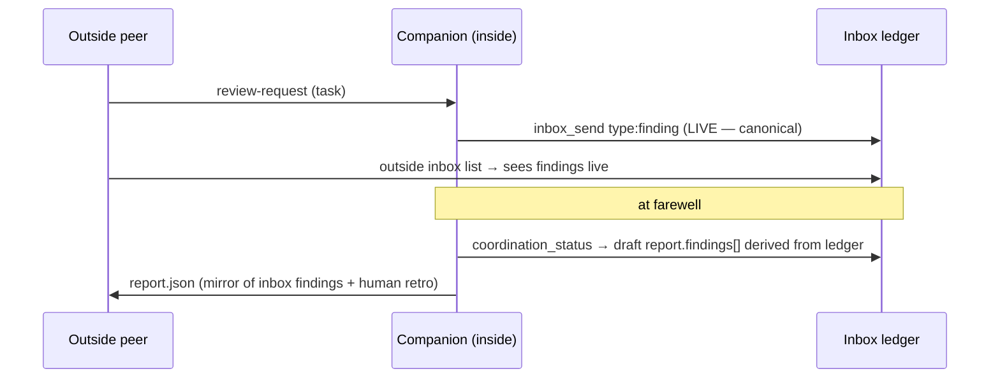

# Workshop: Companion Lifecycle Primitive

**Type**: CLI Flow / API Contract
**Plan**: 027-companion-coordination
**Spec**: [companion-coordination-spec.md](../companion-coordination-spec.md)
**Created**: 2026-06-14
**Status**: Review

**Value Thesis**: Moves the companion's lifecycle state out of fragile prompt memory and into a primitive that derives it from the durable inbox/state ledger (#36) — the most-corroborated ask in the repo (3× near-verbatim magicWand, ≥8 idle-budget retros). Settling the surface and the derivation contract now lets Phases 3–5 build against a fixed shape, and makes the #32 findings-home decision concrete.
**Target Proof Level**: Contract Ready
**Current Proof Level**: Preferred Direction

**Selected Value Axes**:
- **Agent Readiness**: the inside agent gets a prefilled, schema-valid farewell skeleton instead of hand-reconstructing counts and `ackOf` chains.
- **Operator Usability**: the outside peer gets a `companion status` view to drive idle/stop decisions (#35) without reading run-dir files (dogfood-safe).
- **Knowability**: makes the #32 findings-home contract explicit and self-consistent.
- **Cost / Attention Reduction**: kills the per-run manual bookkeeping that 7 of 8 dogfood runs complained about.

**Related Documents**: Research dossier CF-02/CF-04/CF-05/CF-07; `src/schemas/system-output.json`; `docs/retros/code-review-companion.md`

**Domain Context**:
- **Primary Domain**: cli (`minih companion …` verbs) + runner (ledger derivation over lanes)
- **Related Domains**: mcp (inside self-discovery / draft tool), measurement (counters as metrics — consume only)

---

## Purpose

Decide the **surface** and **derivation contract** for a companion lifecycle primitive: what it computes from the ledger, who calls it (inside vs outside), how it assembles the draft farewell, where findings live (#32), and how it carries the self-discovery trio (#29) and idle budget (#35).

## Fresh Entrant Outcome

Reach **Contract Ready**: know exactly which fields are derivable from which lane files, the command/tool shapes, the findings-home contract, and the test fixtures that prove it.

## Key Questions Addressed

- What lifecycle state can be derived purely from the inbox/state lanes?
- CLI verb, MCP tool, or both — and which side calls which?
- Where do findings live (#32): inbox, report, or both?
- How does the primitive carry #29 (allowedStates/mode/idle budget) and feed #35's idle policy?

---

## What's derivable from the ledger (evidence-first)

The lanes already persist everything the recurring magicWand asks for. Sources:
- **Outside lane** (`inbox/outside/messages.ndjson`): tasks/review-requests/questions/control/briefing the peer sent.
- **Inside lane** (`inbox/inside/messages.ndjson`): the companion's `findings`, `summary`, `progress`, `ack`, `farewell`, each with `ts`, optional `ackOf`.
- **State** (`state/inside.json` + `state/history.ndjson`): current status + transition timeline.

| Lifecycle field | Derivation | Notes |
|---|---|---|
| `tasksReceived` | count outside messages of task-like types (`task`, `review-request`) | type set is the contract decision in WS-001's wildcard discussion |
| `reviewedTaskIds` / `acked` | inside `type:'ack'` records' `ackOf` (+ findings whose `ackOf` points at a task) | mirrors `inbox_list` unread model |
| `findingsSent` | count inside `type:'finding'` | **the #32 source of truth** |
| `summariesSent` | count inside `type:'summary'` | |
| `peerUpdatesSent` | count inside `progress`+`finding`+`summary` | maps to `system-output.json` `coordination.peerUpdatesSent` |
| `unresolvedPeerRequests` | outside requests with no matching inside `ack`/reply `ackOf` | maps to `coordination.unresolvedPeerRequests` |
| `lastTaskId` / `lastOutsideMessageTs` | max-ts outside message | feeds idle policy (#35) |
| `statePublished` | `state/history.ndjson` non-empty | maps to `coordination.statePublished` |
| `idleElapsedMs` | now − `lastOutsideMessageTs` | **time-based**, replaces the prompt's integer poll-streak |
| `ackChains` | `ackOf` graph across both lanes | for report reconstruction |

> The one thing **not** purely derivable is the prompt's integer empty-poll streak — but it shouldn't be: #35's fix is to drive idle decisions from `idleElapsedMs` + `unresolvedPeerRequests` (durable, ledger-derived) rather than a counter held in context.

## Decision Space — Surface

| Option | Description | Pros | Cons | Decision |
|--------|-------------|------|------|----------|
| **A. Outside CLI only** (`minih companion status/finalize <slug> --run <id>`) | Operator-facing verbs over the ledger. | Reuses runner coordination helpers (legal cli→runner direction, no new exports — DB-04); dogfood-safe; great for #35 operator decisions | The *inside* agent can't easily call CLI from within its SDK session for a pre-farewell draft (needs shell; companion has `shell:allow` but it's awkward and dogfood-discouraged) | Partial |
| **B. Inside MCP tool only** (`report_draft` / `coordination_status`) | Inside-agent-facing tool returning the ledger summary + draft envelope + self-discovery trio. | Exactly what the inside agent needs pre-farewell; sibling to `permission_status` (precedent); carries #29 naturally | Operator (outside) gets nothing for #35 visibility | Partial |
| **C. Both — split by consumer** | `minih companion status` (outside CLI, operator visibility) **and** an inside MCP tool (e.g. `coordination_status` returning summary + draft + allowedStates/mode/idleBudget). Both read the **same** runner-side ledger deriver. | Each consumer gets its native surface; one deriver, two thin surfaces; folds in #29 and #35 cleanly | Two surfaces to build + test | **Selected** |

## Preferred Direction — Option C (one deriver, two surfaces)

### Shared core (runner)

A pure function in `runner` — `deriveCompanionLedger(location): CompanionLedger` — reads the lanes/state and returns the table above. Highly unit-testable against seeded fixtures (no SDK, no spawn). Both surfaces call it.

### Outside surface — CLI

```
$ minih companion status code-review-companion --run 2026-06-13T...-544e

┌──────────────────────────────────────────────────────────────┐
│ companion status — code-review-companion                     │
│   state: reviewing   (since 00:03:12)                        │
│   tasks received:        6    reviewed/acked:   5            │
│   findings sent:         2    summaries:        6            │
│   unresolved requests:   1                                   │
│   last outside msg:      00:01:40 ago                        │
│   idle budget:           300s   (idle elapsed: 100s)        │
└──────────────────────────────────────────────────────────────┘
```
```
$ minih companion status code-review-companion --run <id> --json
{ "command": "companion-status", "status": "ok",
  "data": { "state": "reviewing", "tasksReceived": 6, "reviewedTaskIds": [...],
    "findingsSent": 2, "summariesSent": 6, "unresolvedPeerRequests": 1,
    "lastOutsideMessageTs": "...", "idleBudgetSec": 300, "idleElapsedMs": 100000 } }
```
Follows the `MinihEnvelope` convention (`src/cli/output.ts`); registered as `registerCompanionCommand(program)` in `src/cli/index.ts` with a parent `companion` command + `status` child (and `finalize` if a CLI finalize is also wanted for operator-side report assembly).

### Inside surface — MCP tool

A new tool (sibling of `permission_status`), e.g. `coordination_status`, returning **three things in one call**:
1. **Ledger summary** (the table above) — so the agent knows its own counts.
2. **Draft farewell envelope** — a schema-valid `system-output.json` skeleton with `summary` stub, `retrospective.coordination.{peerUpdatesSent,unresolvedPeerRequests,statePublished}` prefilled, and `findings[]` derived from inside `type:'finding'` messages. The agent only writes `summary`, `retrospective.workedWell/confusing/magicWand`.
3. **Self-discovery trio (#29)**: `allowedStates` (from the resolved inside-state schema — ties to WS-002), `coordinationMode`, `idleBudgetSec` (#35's discoverability — the ≥8-retro ask).

> Folding #29 + #36 + the #35 budget read into **one** inside tool is the high-leverage move: it answers "what am I, what have I done, and what's my draft" in a single dogfood-safe call, mirroring how `permission_status` answers "what am I allowed to do."

### #32 — Findings home (the contract this settles)

**Decision: live-inbox is the source of truth; the report mirrors it.**
- Findings are sent **live** via `inbox_send type:'finding'` at the commit boundary (the observable, documented path — fixes the orchestrator's "skim the inbox" expectation).
- The farewell `report.json` `findings[]` is **derived** from those inbox messages by the draft tool — never hand-assembled, never a second independent source.
- Docs (AGENTS_README + companion-mode.md) state exactly this one contract. This kills the CF-02 drift: the inbox is canonical *during* the run, the report is a faithful end-of-run mirror.



### #35 — Idle policy reads the ledger (downstream of this primitive)

With `idleElapsedMs` + `unresolvedPeerRequests` available, Phase 4 replaces the prompt's integer empty-poll streak with ledger-driven decisions, and the configured `idleBudgetSec` becomes discoverable via the inside tool. The stop-window drain (a runner change) reads the ledger one last time before the report write so a late ping isn't stranded. (Detailed in the plan, not this workshop.)

## Decision Space — finalize ownership

| Who assembles the draft | Verdict |
|---|---|
| Inside MCP tool returns the draft; agent edits + writes | **Selected** — agent owns its retrospective voice; counts are derived |
| Runner auto-writes the full report at session end | Rejected — erases the agent's retrospective synthesis; report becomes counts-only |
| Outside CLI `finalize` writes the report | Optional add-on for operator-side reconstruction of an abandoned run; not the primary path |

## Evidence Ledger

| Evidence | Location | Supports | Status |
|----------|----------|----------|--------|
| Report schema (summary+retrospective; coordination counters; findings unschema'd) | `src/schemas/system-output.json` | draft target + #32 gap | Validated |
| `permission_status` self-introspection tool | `src/mcp/types.ts:344-353` | precedent for inside `coordination_status` | Validated |
| CLI envelope + registration conventions | `src/cli/output.ts`, `src/cli/index.ts` | CLI surface shape | Validated (scout) |
| Inbox envelope (`ackOf`, `type`, `ts`) | `inbox-poll.ts:337-376` | derivation fields | Validated |
| coordination retrospective block | `system-output.json:40-65` | prefill targets | Validated |

## Validation / Acceptance

Contract Ready when:
- `deriveCompanionLedger` returns every field in the table from seeded lane fixtures (unit).
- The inside tool returns a `system-output.json`-valid draft (schema-validated test) with `findings[]` mirroring seeded inside `type:'finding'` messages.
- `minih companion status --json` emits a conforming `MinihEnvelope` over the same deriver.
- The self-discovery trio returns the **resolved** (per-pack, WS-002) `allowedStates`, the coordination mode, and `idleBudgetSec`.
- A drift check confirms docs describe the single findings contract.

## Open Questions

- **Q1: Tool name** — `coordination_status` vs `companion_status` vs split `report_draft` + `self_describe`. **LEAN**: one tool `coordination_status` (summary + draft + trio) to minimise surface; revisit if it gets unwieldy.
- **Q2: Does `companion finalize` exist as a CLI verb too, or only the inside tool?** **LEAN**: ship `minih companion status` (outside) + the inside tool now; add CLI `finalize` only if operator-side reconstruction of abandoned runs is wanted (cheap follow-on, same deriver).
- **Q3: task-like type set for `tasksReceived`** — depends on WS-001's wildcard/type decision; keep the set in one shared constant.
