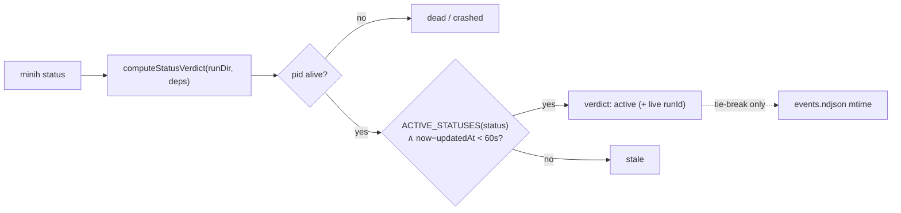

# Phase 1: Run-discovery fail-open (A/B/C) — Tasks & Context Brief

**Plan**: [companion-mode-reliability-plan.md](../../companion-mode-reliability-plan.md) · **Mode**: Full · **Phase**: 1 of 5
**Generated**: 2026-06-16
**Status**: Ready for GO — no code changes yet.

---

## Executive Briefing

**Purpose**: Make every run-read-path answer "is this run active?" the same way, so an orchestrating agent can learn a live `runId` the moment it boots a companion — instead of getting `null`, an empty list, or a misleading error during the run's boot/active window. This is the unifying fix behind defects A, B, and C.

**What We're Building**:
- Defect **A** — `computeStatusVerdict` (`status.ts`) stops falling to `unknown` for a live run with an empty `events.ndjson`; it adopts the same predicate the resolver/inventory already use (active = `ACTIVE_STATUSES`(status) ∧ pid alive ∧ `now − updatedAt` < 60s; `events.ndjson` is only an `active`-vs-`stale` tie-break).
- Defect **B** — `runs list --all` actually broadens the result set (today it's a no-op flag); a bounded best-effort heal-on-read marks stale dead-pid `active` orphans `crashed` so they can't drop or mislabel a genuinely live run.
- Defect **C** — `history` / `last-run` resolve any agent `minih list` resolves from the same cwd (no spurious `E121` when `prompt.md` exists); first **locate** the surface that emits the `{runId:null, …}` symptom, then fix/reframe it and pin it with a test.

**Goals**:
- ✅ A freshly-booted, still-running run reads `verdict:"active"` with its live `runId` (AC-A).
- ✅ `runs list` / `--active` include a live run; `--all` measurably broadens; stale dead-pid orphans don't mask a live run (AC-B).
- ✅ `history` / `last-run` resolve the same agents `minih list` does; the boot-detection surface returns the live `runId` during the active window (AC-C).
- ✅ Fail-open never masks a genuinely stalled/dead run — `updatedAt` freshness still drops a hung run to `stale`/`dead` (Plan 025/026 semantics preserved).

**Non-Goals**:
- ❌ The UTC `runId` migration and `MINIH_PROJECT_ROOT` fix (those are **Phase 2**).
- ❌ The findings read-path command (**Phase 3**), terminal classification (**Phase 4**), companion longevity (**Phase 5**).
- ❌ Adding a new liveness seam — the injectable `isProcessAlive` seam already exists at all three read-paths (Finding 03); reuse it.
- ❌ Building a `minih stop` producer or wiring `evaluateIdlePolicy` (out of scope; #49).

---

## Prior Phase Context

None — this is Phase 1. (Phases 1–4 are independent and may be implemented in any order; this dossier targets Phase 1.)

---

## Pre-Implementation Check

| File | Exists? | Domain | Create/Modify | Notes |
|------|---------|--------|---------------|-------|
| `src/cli/commands/status.ts` | ✅ | cli | modify | A — `computeStatusVerdict` falls to `unknown` at ~208–216; adopt resolver predicate. Also a `terminalReason` consumer at :415 (Phase 4 concern; **don't touch render here**) |
| `src/runner/run-inventory.ts` | ✅ | runner | modify | B — `--all` declared but never read (:26); liveness truth; `compareRows` (:268–273) for sort context |
| `src/runner/run-resolver.ts` | ✅ | runner | modify | B — heal-on-read of stale dead-pid orphans (:304–324 skips them today) |
| `src/runner/reconcile-lock.ts` | ✅ | runner | modify/reuse | B — reuse `withReconcileLock`/`ReconcileLockHeldError` for best-effort heal |
| `src/cli/commands/runs.ts` | ✅ | cli | modify | B — `--all` plumbing into the inventory |
| `src/cli/commands/history.ts` | ✅ | cli | modify | C — resolution reframe (no spurious `E121`) |
| `src/cli/commands/last-run.ts` | ✅ | cli | modify | C — resolution reframe |
| `src/runner/peer-activity.ts` | ✅ | runner | investigate | C — holds `selfReportedState`/`currentlyRunningTool`; but `runId` appears nowhere here (Finding 05) |
| `src/mcp/tools/coordination-status.ts` | ✅ | mcp | investigate (read-only first) | C — **suspect** emitter of `{runId:null, …}`; edit only if it is the symptom source |
| `src/runner/human-view-model.ts` | ✅ | runner | investigate (read-only) | C — suspect surface; its if-chain switches on `manifest.status`, not `terminalReason` (no edit expected) |
| `src/runner/run-eligibility.ts` | ✅ | runner | reference | `isProcessAliveDefault(pid,{kill})` (:50–62) — the injectable seam, threaded as `isProcessAlive` |
| `test/cli/status-verdict.test.ts` | ✅ | cli | extend | A — direct `computeStatusVerdict` + faked pid/clock pattern |
| `test/runner/run-inventory.test.ts` | ✅ | runner | extend | B — liveness, `--all`, sort fixtures |
| `test/runner/run-resolver.test.ts` | ✅ | runner | extend | B — `FAKE_LIVE_PID`/`FAKE_DEAD_PID` + `isProcessAlive` heal-on-read |

**Contract-change flags**: none in Phase 1 — all files are `internal`. (No domain contract surface changes; `run-eligibility.ts` is referenced, not modified.)
**Duplication check**: no new liveness/heal concept is introduced — the predicate and `withReconcileLock` already exist; this phase *converges* consumers onto them.
**Harness availability**: ✅ Router installed (`~/.agents/skills/eng-harness-flow/SKILL.md`). The implement verb fires the pre-implement seam (T000) before any code and the phase-end seam (T009) after.

---

## Architecture Map


---

## Tasks

| Status | ID | Task | Domain | Path(s) | Done When | Notes |
|--------|-----|------|--------|---------|-----------|-------|
| [x] | T000 | **Harness pre-flight** — `/eng-harness-flow --event pre-implement --phase "Phase 1: Run-discovery fail-open (A/B/C)" --plan-dir docs/plans/028-companion-mode-reliability` | — | — | Router envelope handled; boot verdict (`healthy/SLOW/UNHEALTHY/UNAVAILABLE`) narrated verbatim before any code | ✅ Boot `error` but only lint/biome (known gap); typecheck+build+test green → baseline OK; override logged |
| [x] | T001 | **Investigate C (spike)** — locate the surface emitting `{runId:null, selfReportedState, currentlyRunningTool}`; confirm `peer-activity.ts` vs `mcp/tools/coordination-status.ts` vs `human-view-model.ts`; record the file:line finding + chosen fix shape in the execution log | runner/mcp | (read-only) | ✅ **No core surface emits the symptom**; `resolveAgent`≡`listAgents().find()` so no spurious-E121 divergence → **AC-C fallback**: characterize + document | Plan 1.1; decision recorded in exec log + Discoveries |
| [ ] | T002 | **RED** — failing test: `computeStatusVerdict(runDir,{isProcessAlive:live, now})` returns `verdict:"active"` + the live `runId` for a run with `status:"active"`, fresh `updatedAt`, **empty/absent `events.ndjson`** | cli | `/Users/jordanknight/substrate/minih/test/cli/status-verdict.test.ts` | Test fails against current `status.ts` (falls to `unknown`) | Plan 1.2; mirror existing `status-verdict.test.ts` fixture |
| [ ] | T003 | **GREEN** — `computeStatusVerdict` adopts the resolver predicate at `status.ts:~208–216`: after the pid-alive gate, return `active` when `ACTIVE_STATUSES.has(status)` ∧ recent `updatedAt`, even with no `events.ndjson`; use `events.ndjson` mtime only as the `active`-vs-`stale` tie-break | cli | `/Users/jordanknight/substrate/minih/src/cli/commands/status.ts` | T002 passes; `minih status "$SLUG" \| jq -r '.data \| select(.verdict=="active") \| .runId'` yields the live runId (AC-A) | Plan 1.3; Workshop D1-A. **Do not touch the `:415` `terminalReason` render (Phase 4).** |
| [ ] | T004 | **RED** — failing tests: `runs list` / `--active` include a live-pid run; `--all` returns a measurably broader set than default | runner | `/Users/jordanknight/substrate/minih/test/runner/run-inventory.test.ts` | Tests fail (`--all` is a no-op today) | Plan 1.4; mirror `run-inventory.test.ts` |
| [ ] | T005 | **GREEN** — wire `--all` in the inventory filter (default = active/recent bounded window; `--all` = full history incl. completed/crashed, bounded by `--limit`); confirm liveness reports `alive` for a running pid; plumb `--all` from `runs.ts` | runner/cli | `/Users/jordanknight/substrate/minih/src/runner/run-inventory.ts`, `/Users/jordanknight/substrate/minih/src/cli/commands/runs.ts` | T004 passes; AC-B met; no silent no-op flag remains | Plan 1.5; Workshop D3-A |
| [ ] | T006 | **RED** — failing tests: (a) a stale dead-pid `active` orphan does not drop/mislabel a live run — the orphan is healed to `crashed` on an inventory read (or, fallback, skipped); (b) **the swallow contract** — a heal that throws a *non-lock* error (write error / torn manifest mid-heal) still returns the live run un-healed, no exception propagates to the read | runner | `/Users/jordanknight/substrate/minih/test/runner/run-resolver.test.ts` | Live run still resolves; orphan no longer shows as `unhealed-dead`; a thrown heal error does not surface to the caller | Plan 1.6; the 025 dead-pid no-regression guard |
| [ ] | T007 | **GREEN** — bounded heal-on-read: when a read sees an `ACTIVE_STATUS` manifest with a dead pid, mark it `crashed` inside `withReconcileLock`; **catch `ReconcileLockHeldError` → skip + read proceeds**; wrap the whole heal in try/catch so **any** failure is swallowed and the read returns. Fallback to D2-A (skip-but-don't-heal) if lock-safety is fiddly — record the choice in the execution log | runner | `/Users/jordanknight/substrate/minih/src/runner/run-resolver.ts`, `/Users/jordanknight/substrate/minih/src/runner/run-inventory.ts`, `/Users/jordanknight/substrate/minih/src/runner/reconcile-lock.ts` | T006 (a)+(b) pass; a stall fixture confirms a hung run still drops to `stale`/`dead` (no Plan 026 regression) | Plan 1.7; Findings 03, 04 |
| [ ] | T008 | **RED→GREEN** — `history`/`last-run` resolve any agent that `minih list` resolves from the same cwd (no spurious `E121` when `prompt.md` exists); fix/reframe C's surface per T001; test pins the corrected behaviour | cli | `/Users/jordanknight/substrate/minih/src/cli/commands/history.ts`, `/Users/jordanknight/substrate/minih/src/cli/commands/last-run.ts`, *(+ C symptom surface from T001)* | AC-C met; the boot-detection surface returns the live `runId` during the active window | Plan 1.8; Finding 05. If T001 finds no core surface emits the symptom, AC-C is met by the `E121` reframe + a documented finding (AC-C fallback) |
| [ ] | T009 | **Harness phase-end** — `/eng-harness-flow --event phase-end --plan-dir docs/plans/028-companion-mode-reliability` | — | — | Router envelope handled at phase end | Harness seam (plan 1.z); advisory |

**Legend** — Status: `[ ]` pending · `[~]` in progress · `[x]` complete · `[!]` blocked.
**Sequencing note**: T001 (the C spike) runs first so T008 has a named target; T002–T003 (A), T004–T005 (B-list), T006–T007 (B-heal) are otherwise independent RED→GREEN pairs and can interleave. The two harness seams bracket the phase.

---

## Context Brief

**Key findings from plan (action required)**:
- **Finding 03** — the pid-liveness probe `isProcessAlive` is already injectable at all three read-paths (`run-resolver.ts:305`, `run-inventory.ts:205`, `status.ts` `StatusVerdictDeps`). **Action**: thread it through any new heal/probe path; A/B tests feed a fake live pid + empty `events.ndjson`. Do **not** add a new seam.
- **Finding 04** — `withReconcileLock({agentsDir, staleAfterMs, isProcessAlive})` exists (`wx` first-write-wins, throws `ReconcileLockHeldError`/`RECONCILE_LOCK_HELD`). **Action**: wrap heal-on-read in it; catch the lock error → skip the heal, read proceeds.
- **Finding 05** — defect C's literal symptom source is **unidentified**; `runId` appears nowhere in `peer-activity.ts`. **Action**: T001 investigates and names the surface before any edit (fixing `peer-activity.ts` alone may miss it).
- **Finding 10** — test substrate is ready (vitest, `/test/` mirror, on-disk `mkdtemp` fixtures, controllable pid via injected `isProcessAlive`); no shared fake-run-folder helper — each test inlines its own seed.

**Domain dependencies** (concepts this phase consumes):
- `runner`: run-eligibility (`isProcessAliveDefault`) — fake live/dead pids in tests; the canonical predicate (`ACTIVE_STATUSES` + pid + `updatedAt` freshness) already in `collectActiveRuns`/`run-inventory`; the reconcile lock (`withReconcileLock`) — safe heal-on-read.
- `cli`: `computeStatusVerdict` (`status.ts`) — the read-path being converged; `runs`/`history`/`last-run` command surfaces.
- `mcp`: `coordination-status.ts` — read-only investigation target for C (edit only if it is the symptom source; cross-domain — keep to its public surface).

**Domain constraints**:
- All Phase 1 files are `internal` — no public contract changes. Don't widen any export.
- `mcp` is a separate domain: read `coordination-status.ts` first; edit it only if T001 proves it is C's emitter.
- Fail-open must **preserve** Plan 025/026 staleness semantics — `updatedAt` freshness still drops a hung run to `stale`/`dead`. T007 carries the explicit no-regression stall fixture.

**Harness context** (router installed):
- **Entry point**: `/eng-harness-flow --event <seam> [--phase <id>] [--plan-dir <p>] --json` — the single door; child skills are private and never named.
- **Pre-implement seam** (T000): fired by the implement verb at phase start; envelope `decision` acted on; boot verdict narrated verbatim (`healthy/SLOW/UNHEALTHY/UNAVAILABLE`); `UNAVAILABLE` → standard testing.
- **Phase-end seam** (T009): fired at phase end; the router owns drain-vs-harvest.
- **Backpressure**: no `backpressure-coverage.md` for this plan (build path chosen directly); the substrate is already deterministic (injectable `isProcessAlive`/`now`, on-disk fixtures, plain-JSON manifests) so coverage for this phase is effectively Strong without a Phase 0.

**Reusable from prior work** (no prior *phase* in this plan, but existing patterns to mirror):
- `test/cli/status-verdict.test.ts` — direct `computeStatusVerdict` call with faked `isProcessAlive`/`now` (A).
- `test/runner/run-inventory.test.ts` — inventory liveness/sort fixtures (B).
- `test/runner/run-resolver.test.ts` — `FAKE_LIVE_PID`/`FAKE_DEAD_PID` + `isProcessAlive` (B heal-on-read).
- `test/cli/companion-status.test.ts` — subprocess + inside/outside lane pattern (reference; F's mirror, used next in Phase 3).

**System flow** (the A read-path being converged):


**Heal-on-read interaction** (B):
```mermaid
sequenceDiagram
    participant Reader as inventory/resolver read
    participant Lock as withReconcileLock
    participant Manifest as run.json
    Reader->>Reader: see ACTIVE_STATUS + dead pid
    Reader->>Lock: acquire (wx, first-write-wins)
    alt lock held by another
        Lock-->>Reader: ReconcileLockHeldError → skip heal, read proceeds
    else acquired
        Lock->>Manifest: mark crashed
        Note over Lock,Manifest: any throw here is swallowed;\nread still returns the live run
    end
    Reader-->>Reader: live run resolves; orphan no longer unhealed-dead
```

---

## Discoveries & Learnings

_Populated during implementation by the implement verb._

| Date | Task | Type | Discovery | Resolution | References |
|------|------|------|-----------|------------|------------|
| 2026-06-16 | T000 | gotcha | `harness boot` reports overall `error` driven solely by the `lint` sensor (biome not installed); typecheck + build+test pass clean | Documented day-one biome gap (governance doc); proceeded with green baseline; friction captured `DL-001` | Boot envelope |
| 2026-06-16 | T001 | decision | Defect C's literal `{runId:null, peer-fields}` symptom is emitted by **no core surface**; `resolveAgent`≡`listAgents().find()` (folder.ts:737) so history/last-run already share `list`'s resolution | **AC-C fallback**: pin consistency with a characterization test (T008) + document the symptom as external/older-build. No core production edit for the C symptom | Finding 05; AC-C fallback |
| 2026-06-16 | T000 | insight | Live defect-D in the wild: companion runId `2026-06-16T13-50-25-287Z` vs real UTC `03:52` (Sydney local-as-Z) | Captured `INS-001`; fixed in Phase 2 (task 2.2) | Finding 08 |

**Types**: `gotcha` | `research-needed` | `unexpected-behavior` | `workaround` | `decision` | `debt` | `insight`

---

## Directory layout

```
docs/plans/028-companion-mode-reliability/
  ├── companion-mode-reliability-plan.md
  └── tasks/phase-1-run-discovery-fail-open-a-b-c/
      ├── tasks.md            # this file
      └── execution.log.md    # created by the implement verb
```

**STOP** — no code changes yet. Awaiting GO to implement (Phase 1, optionally with `--companion`).
