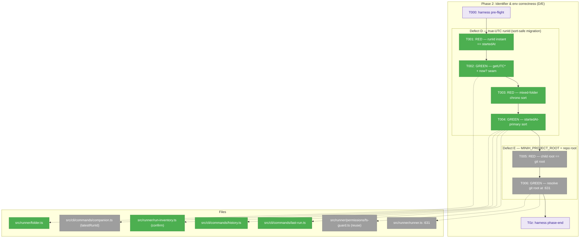
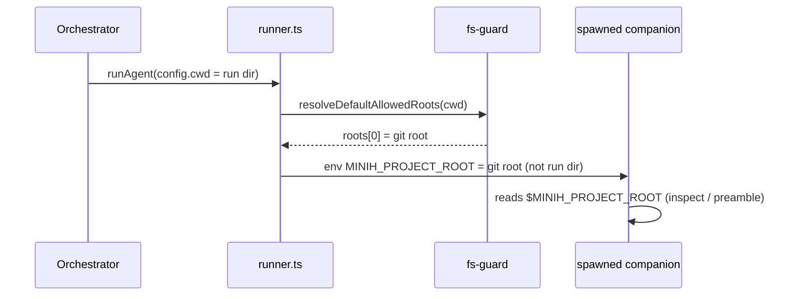

# Phase 2 — Identifier & env correctness (D/E)

**Plan**: [companion-mode-reliability-plan.md](../../companion-mode-reliability-plan.md) (v1.1.1, READY) · **Phase**: 2 of 5 · **Mode**: Full TDD
**Domain**: runner (cli consumers) · **Depends on**: None (independent of Phase 1)
**Branch**: `028-companion-mode-reliability`

---

## Executive Briefing

**Purpose**: Make every emitted run identifier encode **true UTC** (defect D) and make a spawned child's `MINIH_PROJECT_ROOT` point at the **repo root** (defect E). Two small, independent correctness fixes — but D is identity-affecting, so it ships as a *sort-safe format migration*, not a naïve getter swap.

**What we're building**:
- **D** — `createRunFolder` builds the `runId` from `getUTC*` getters (today it uses local-time getters then appends a misleading `Z`), plus an optional `now?` clock seam so a test can pin an exact runId. Because the `runId` string *is* the run-folder name and **four** "newest run" selectors sort by it lexicographically — the three Finding 01 names (`run-inventory`, `last-run`, `history`) **plus `companion latestRunId`** (validation-surfaced; Phase 3 reuses it) — every selector must sort **primarily by `startedAt` (ISO)** with `runId` as a tie-break only; otherwise old (local-as-`Z`) and new (true-UTC) folders interleave and a stale run can surface as "newest".
- **E** — `runner.ts:631` sets `MINIH_PROJECT_ROOT` to the **resolved git root** (via `resolveDefaultAllowedRoots`), not `config.cwd` (which, for a companion spawned into its run dir, is the run dir).

**Goals**:
- ✅ A `runId` parses to the **same UTC instant** as that run's `run.json.startedAt` (AC-D).
- ✅ A mix of old local-as-`Z` and new true-UTC folders sorts **chronologically** across all four selectors — `runs list`, `last-run`, `history`, `companion latestRunId`.
- ✅ Historical folders keep their names and still resolve/render (no on-disk migration).
- ✅ A spawned child's `MINIH_PROJECT_ROOT` equals the resolved project root (AC-E); fs-guard boundaries unchanged.

**Non-Goals**:
- ❌ No renaming / rewriting of existing on-disk run folders (the migration is *sort-order only*, identity is preserved).
- ❌ No new clock seam, and no touch to the liveness predicate/`isProcessAlive` — reuse the established `now?` clock-injection pattern only (Finding 03); D is a pure format/sort change.
- ❌ No change to fs-guard *permission* boundaries — the child re-derives its own roots from its cwd; `MINIH_PROJECT_ROOT` is informational (read by `inspect.ts` + the child preamble), not a permission source (Finding 07).
- ❌ Defects A/B/C (Phase 1, done), F (Phase 3), G (Phase 4), longevity (Phase 5).

---

## Prior Phase Context

### Phase 1 — Run-discovery fail-open (A/B/C) · **complete** (5 commits, 1396 passed / 16 skipped / 0 failed)

**A. Deliverables**
- `src/cli/commands/status.ts` (A) — `computeStatusVerdict` gained a fail-open branch after the pid-alive gate (`ACTIVE_STATUSES`(status) ∧ fresh `updatedAt` → `active`; `events.ndjson` mtime is a tie-break only); added a local `ACTIVE_STATUSES = {starting, active, completing}`.
- `src/runner/run-inventory.ts` (B) — wired `--all` (was a silent no-op): default = active-or-recent (`selectActiveOrRecent`/`isLiveRow`), `--all` = full history bounded by `--limit`; added best-effort heal-on-read of dead-pid `active` orphans (`healDeadPidOrphan` under `withReconcileLock`, injectable `healOrphan` seam).
- Tests: `status-verdict.test.ts` (+4, A), `run-inventory.test.ts` (+4, B), `folder.test.ts` (+2, C parity).
- **No** production edits to `run-resolver` / `history` / `last-run` / `peer-activity` / `coordination-status` (C resolved via the AC-C fallback).

**B. Dependencies exported (relevant to Phase 2)**
- `compareRows` (`run-inventory.ts:333-338`) already sorts by `startedAt ?? updatedAt` first, `runId` as tie-break — **task 2.4 confirms this path is already sort-safe** and `last-run.ts` / `history.ts` / `companion.ts` (`latestRunId`) need the fix. (Line was `:268-273` in the plan; Phase 1's additions shifted it — re-verified `:333-338`.)
- The injectable **clock seam** (`now`) is established — task 2.1/2.2 reuse only the `now?` clock-injection idiom (do **not** add a new seam — Finding 03). Phase 2 does **not** touch the liveness predicate or `isProcessAlive` (D is a pure format/sort change; the predicate was Phase 1's).
- `ACTIVE_STATUSES` now exists in **three** private copies (`status.ts`, `run-inventory.ts:16`, `run-resolver.ts:38`) — Phase 2 touches sort + env, **not** the predicate, so leave the triplication (it's tracked as retro DL-002, a separate refactor candidate).

**C. Gotchas & debt**
- **INS-001 — a LIVE defect-D sighting in the Phase 1 dogfood**: the companion booted with `runId 2026-06-16T13-50-25-287Z` while real wall-clock UTC was `03:52` — local Sydney time (UTC+10) mislabeled `Z`. **This is exactly the bug task 2.2 fixes**, observed in the wild — concrete validation the defect is real and current.
- **F001 / DL-003 — run the format gate before every commit**: Phase 1 skipped `just fft` and committed 3 unformatted files; the companion caught it. Now encoded (`fft` reordered to **format-before-lint**, commit `f04dc5d`). Phase 2: run `just fft` before **each** commit.
- Defect C's literal `{runId:null,…}` symptom is emitted by **no core surface** (external/older build). Phase 2 edits `history.ts`/`last-run.ts` (the sort) — these must **preserve the resolution parity** that Phase 1's characterization tests (`folder.test.ts`) lock.

**D. Incomplete items**: none — Phase 1 fully landed. Carry-forwards (not Phase 2's job): DL-002 (shared-constant refactor, optional), a pre-commit `fft` hook (open suggestion), SUGG-001 (open-findings command → Phase 3).

**E. Patterns to follow**
- Full TDD RED→GREEN per task; run the affected suite after each task and `tsc --noEmit` at phase end.
- On-disk `mkdtemp` run fixtures; inject `now`/`isProcessAlive` rather than mocking time globally.
- Mirror an existing test file (no shared fake-run-folder helper exists — each test inlines its seed).
- Per task: update the Tasks table + Architecture Map + execution log before starting the next.

---

## Pre-Implementation Check

| File | Exists? | Domain | Action | Notes |
|------|---------|--------|--------|-------|
| `src/runner/folder.ts` | ✅ | runner | **modify** | `createRunFolder:750-759` — swap local getters → `getUTC*`; add optional `now?: () => Date`. `runId` shape regex unchanged. |
| `src/runner/run-inventory.ts` | ✅ | runner | **confirm only** | `compareRows:333-338` already sorts `startedAt`-first: `const at = a.startedAt ?? a.updatedAt ?? ''; … bt.localeCompare(at) … : b.runId.localeCompare(a.runId)`. Task 2.4 confirms + adds a mixed-folder regression; no logic change expected. |
| `src/cli/commands/last-run.ts` | ✅ | cli | **modify** | `:55-58` sorts dir entries by `b.name.localeCompare(a.name)` and reads **no** timestamp — must read `startedAt` from `run.json`/`completed.json` first. |
| `src/cli/commands/history.ts` | ✅ | cli | **modify** | `:50-53` same `.name`-sort pattern — same fix (read `startedAt` first, `.name` as tie-break). |
| `src/cli/commands/companion.ts` | ✅ | cli | **modify** | **(validation-surfaced)** `latestRunId:108-119` is a *third* "newest run" selector, sorting folder names by `b.localeCompare(a)` (`:119`) — used by `companion status` (`:55`) and inherited by Phase 3's `findings`. Same `.name`-sort bug; must match the `startedAt`-primary order or Phase 3 picks a stale run during the mixed-folder window. |
| `src/runner/runner.ts` | ✅ | runner | **modify** | `:631` `MINIH_PROJECT_ROOT = config.cwd ?? process.cwd()` → resolved git root. (Env list `MINIH_ENV_KEYS:304` already includes the key — no list change.) |
| `src/runner/permissions/fs-guard.ts` | ✅ | runner | **reference** | `resolveDefaultAllowedRoots(cwd):100-162` walks up to `.git` → repo root (realpath'd); reuse it. No edit. |
| `src/cli/commands/inspect.ts` | ✅ | cli | **verify** | `:206` reads `MINIH_PROJECT_ROOT` (`repoRoot`) — confirm it tolerates the corrected (git-root) value. No edit expected. |
| `src/templates/shared-preamble.md` | ✅ | _docs | **verify** | `:12,:25` document `$MINIH_PROJECT_ROOT` as "project root path" — corrected value matches the doc's intent. No edit expected. |
| `test/runner/folder.test.ts` | ✅ | runner | **modify** | `createRunFolder` block `:317-349` only regex-shape-asserts — add the UTC-instant == `startedAt` assertion (2.1). |
| `test/runner/run-inventory.test.ts` | ✅ | runner | **modify** | add the mixed old/new-folder chronological-sort regression (2.3). |
| `test/cli/last-run-history-sort.test.ts` | ❌ | cli | **create** | No `last-run`/`history` test exists today — add a small CLI test pinning the `startedAt`-primary sort across both (2.3/2.4). |
| `test/runner/runner.test.ts` | ✅ | runner | **modify** | mirror the env-capture pattern `:515-552` — capture `process.env.MINIH_PROJECT_ROOT` mid-run for a run-dir-like `config.cwd` inside a fake git repo (2.5). |

**Harness availability**: the `/eng-harness-flow` router is installed (it fired through all of Phase 1) — the implement verb fires the pre-implement seam (T000) before any code and the phase-end seam (T0z) after.

---

## Architecture Map



---

## Tasks

| Status | ID | Task | Domain | Path(s) | Done When | Notes |
|--------|-----|------|--------|---------|-----------|-------|
| [x] | T000 | **Harness pre-flight** — `/eng-harness-flow --event pre-implement --phase "Phase 2: Identifier & env correctness (D/E)" --plan-dir docs/plans/028-companion-mode-reliability` | — | — | Router envelope handled; boot verdict (`healthy/SLOW/UNHEALTHY/UNAVAILABLE`) narrated verbatim before any code | _Harness seam_ (plan 2.0) |
| [x] | T001 | **RED (D)** — failing test: `createRunFolder(agent,{now})` produces a `runId` whose timestamp parses to the **same UTC instant** as the run's `startedAt`; no local-time value suffixed `Z`. Pin via injected `now` returning a fixed `Date`. | runner | `/Users/jordanknight/substrate/minih/test/runner/folder.test.ts` | Test fails against current local getters (runId encodes local hour, not UTC) | Finding 08; extend `createRunFolder` block `:317-349` |
| [x] | T002 | **GREEN (D)** — `folder.ts:750-759` use `getUTCFullYear/Month/Date/Hours/Minutes/Seconds/Milliseconds`; add optional `now?: () => Date` param to `createRunFolder` (`:746`, default `new Date()`). Keep the `…Z-<suffix>` shape; the `Z` is now truthful. **Optional param** → the existing caller in `runner.ts` (`createRunFolder(definition)`) compiles unchanged. | runner | `/Users/jordanknight/substrate/minih/src/runner/folder.ts` | T001 passes; AC-D (equal UTC instants) met; existing shape-regex test still green; `runner.ts` caller untouched | Finding 08 |
| [x] | T003 | **RED (D)** — failing test: a mix of **old** (local-as-`Z`) and **new** (true-UTC) run folders sorts chronologically by `startedAt` across **all four** "newest run" selectors — `runs list` (`run-inventory`), `last-run`, `history`, **and `companion`'s `latestRunId`** (newest-first, no stale folder surfacing as newest). Plus a **scoped grep** confirming **no consumer parses a timestamp back out of a runId/folder name**: `grep -rE "Date\.parse\([^)]*runId|runId[^=]*\.split\('T'\)" src/ test/` returns no functional hit (Finding 01 asserts none; pass = empty or comment-only). | runner/cli | `/Users/jordanknight/substrate/minih/test/runner/run-inventory.test.ts`, `/Users/jordanknight/substrate/minih/test/cli/last-run-history-sort.test.ts` (new) | Tests fail wherever a path sorts primarily by the runId/folder-name string (incl. `companion latestRunId`); grep is empty | Finding 01 |
| [x] | T004 | **GREEN (D)** — make `startedAt` (ISO) the **primary** sort key, runId tie-break only, across **every** "newest run" selector. **Confirm** `run-inventory.ts compareRows:333-338` already does this (no change expected). **Fix** the three `.name`-sorters: `last-run.ts:55-58`, `history.ts:50-53`, **and `companion.ts latestRunId:108-119`** (`:119` `b.localeCompare(a)`) — each reads `startedAt` from `run.json`/`completed.json` first, `.name` (= runId) as tie-break. **Fallback precedence (explicit):** `run.json.startedAt` if present → else `completed.json.startedAt` if present → else (file missing OR field null/absent) the folder `.name`. Old local-as-`Z` folders keep their names and still resolve. | runner/cli | `/Users/jordanknight/substrate/minih/src/cli/commands/last-run.ts`, `/Users/jordanknight/substrate/minih/src/cli/commands/history.ts`, `/Users/jordanknight/substrate/minih/src/cli/commands/companion.ts`, `/Users/jordanknight/substrate/minih/src/runner/run-inventory.ts` (confirm) | T003 passes; no stale run surfaces as "newest" in any of the four selectors; historical folders keep names; resolution parity (Phase 1 chars) intact | Finding 01; the three `.name` sorts need a manifest read; `companion.ts` is validation-surfaced (Phase 3 reuses `latestRunId`) |
| [ ] | T005 | **RED (E)** — failing test: a spawned child's `MINIH_PROJECT_ROOT` equals the **resolved project root** (git root), not the run dir. Construct a fake repo (`<tmp>/.git` marker), drive `runAgent` with `config.cwd` set to a run-dir-like subdir (`<tmp>/runs/<id>`), capture `process.env.MINIH_PROJECT_ROOT` in the `onEvent` callback (mirror `runner.test.ts:515-552`), assert it equals `realpath(<tmp>)`. | runner | `/Users/jordanknight/substrate/minih/test/runner/runner.test.ts` | Test fails (currently the captured value is the run-dir cwd) | Finding 07; env-capture pattern `:515-552` |
| [ ] | T006 | **GREEN (E)** — `runner.ts:631` set `MINIH_PROJECT_ROOT` to the resolved root. **Recommended (minimal):** `resolveDefaultAllowedRoots(config.cwd ?? process.cwd()).roots[0]` (imported from `./permissions/fs-guard.js`; walks up to `.git`, realpath'd). **Alt (DRY):** reorder to reuse `resolvedPolicy.canonicalRoots[0]` (compiled at `:685-692`) — avoids a second git-root walk. Then **verify (concretely)** the env-var readers don't assume `MINIH_PROJECT_ROOT` is a child of cwd or at a fixed depth: grep `inspect.ts` + `shared-preamble.md` for `path.relative(`/`path.resolve(` against it (expect none — both just surface the value) and confirm `inspect.ts:206` passes it through unmodified. | runner | `/Users/jordanknight/substrate/minih/src/runner/runner.ts`, (verify) `/Users/jordanknight/substrate/minih/src/cli/commands/inspect.ts`, `/Users/jordanknight/substrate/minih/src/templates/shared-preamble.md` | T005 passes; AC-E met; readers confirmed depth-agnostic; fs-guard permission boundaries unchanged (child re-derives its own roots) | Finding 07 |
| [ ] | T0z | **Harness phase-end** — `/eng-harness-flow --event phase-end --plan-dir docs/plans/028-companion-mode-reliability` | — | — | Router envelope handled at phase end (drain/harvest is the router's call) | _Harness seam_ (plan 2.z) |

`Status`: `[ ]` pending · `[~]` in progress · `[x]` complete · `[!]` blocked.

---

## Context Brief

**Key findings from plan (Phase 2-relevant)**:
- **Finding 01 (Critical)** — the `runId` string IS the folder name and is a load-bearing lexicographic sort key (`run-inventory.ts:256/272`, `last-run.ts:58`, `history.ts:53`). Switching D to true UTC shifts the embedded hour for new folders → old/new interleave. **Action**: format migration — fix getters **and** sort primarily by `startedAt`. No parser reads the timestamp back out of a name (identity safe); only sort order breaks.
- **Finding 07 (High)** — `MINIH_PROJECT_ROOT` is **not** consumed by fs-guard root resolution (the child re-derives roots from its own cwd), so changing it does not move permission boundaries. Real readers: `inspect.ts:206` + the child preamble. Correct source: `resolveDefaultAllowedRoots` at `fs-guard.ts:100-162`.
- **Finding 08 (High)** — clock not injectable in the runId builder (`folder.ts:750` uses `new Date()` + local getters then appends `"Z"`); the test only regex-shape-asserts, so a UTC-vs-local regression is invisible. **Action**: UTC getters + optional `now?` so the test pins an exact instant.

**Domain dependencies (consumed, not changed)**:
- `runner`: `resolveDefaultAllowedRoots(cwd)` (`permissions/fs-guard.ts`) — git-root discovery + realpath; the correct `MINIH_PROJECT_ROOT` source.
- `runner`: `compareRows` (`run-inventory.ts:333-338`) — already `startedAt`-primary; the precedent the **three** `.name`-sorters (`last-run`, `history`, `companion latestRunId`) must match.
- `cli`: `companion.ts latestRunId:108-119` — a fourth "newest run" selector (used by `companion status:55`, inherited by Phase 3 `findings`); validation surfaced it as an unfixed `.name`-sorter — folded into T004.
- `runner`: the `FakeAgentAdapter` + `runAgent(fake, def, config, onEvent, agentsDir)` env-capture harness (`runner.test.ts:515-552`) — the substrate for the E test.

**Domain constraints**:
- runner is `internal`/`contract`; no cross-domain import direction changes. The cli consumers (`last-run`, `history`) read runner on-disk artifacts (`run.json`/`completed.json`) — already their pattern.
- No `run.json` schema gate (plain `JSON.parse`, `schemaVersion===1` only) — reading `startedAt` adds no migration.

**Harness context** (router installed):
- **Entry point**: `/eng-harness-flow --event <seam> [--phase <id>] [--plan-dir <p>] --json` — single door; child skills never named.
- **Pre-implement seam** (T000): fired by the implement verb at phase start; verdict narrated verbatim.
- **Phase-end seam** (T0z): fired by the implement verb at phase end; router decides drain-vs-harvest.
- **Backpressure**: not run for this plan (build path chosen directly); substrate is already deterministic (injectable `now`/`isProcessAlive`, on-disk fixtures) so coverage is effectively Strong without a Phase 0.

**Reusable from Phase 1**:
- The `now?` clock-injection idiom (used in `status-verdict`/`run-inventory` tests) — directly reused for T001.
- On-disk `mkdtemp` run-folder seeding inlined per test (no shared helper) — copy the seed shape.
- **Lesson F001**: run `just fft` (format-before-lint) before **every** commit.

**System flow (D — the sort-safe migration)**:


**Spawn sequence (E — corrected root)**:


---

## Discoveries & Learnings

_Populated during implementation by the implement verb._

| Date | Task | Type | Discovery | Resolution | References |
|------|------|------|-----------|------------|------------|

**Types**: `gotcha` · `research-needed` · `unexpected-behavior` · `workaround` · `decision` · `debt` · `insight`

---

## Directory layout

```
docs/plans/028-companion-mode-reliability/
  ├── companion-mode-reliability-plan.md
  └── tasks/phase-2-identifier-env-correctness-d-e/
      ├── tasks.md            # this file
      └── execution.log.md    # created by the implement verb
```

**STOP** — dossier only; no code edited. Awaiting human GO to implement.

---

## Validation Record (2026-06-16)

### Validation Thesis

**Raison d'être**: Give an implement agent everything to fix defect D (local-time runId mislabeled `Z`) and E (`MINIH_PROJECT_ROOT` = run dir) test-first, without re-deriving source locations, the sort-migration hazard, or the test substrate.

**Value claim**: Implementation is faster + safer — no re-discovery that runId is a load-bearing sort key (F01), that `resolveDefaultAllowedRoots` is the correct root source (F07), or that the env-capture test pattern already exists; the old/new folder interleaving hazard is flagged before code.

**Artifact promise**: The implement verb can execute Phase 2 from the task table; every file:line is real; every task is RED→GREEN with a measurable Done-When mapping to AC-D/AC-E.

**Intended beneficiaries**: the implement agent (primary), the stage-7 reviewer, downstream Phase 3 (reuses `latestRunId`) and Phase 5 (UTC runId + `updatedAt` predicate).

**Proof target**: Implementation. **Evidence standard**: source-code (file:line) match, test-substrate match, AC traceability.

**Thesis source**: `companion-mode-reliability-plan.md` Phase 2 block + Findings 01/07/08 + AC-D/AC-E.

**Thesis verdict**: Advanced (after fixes). **Main thesis risk** (now mitigated): an implementer might step outside the dossier to confirm `compareRows` sorts `startedAt`-first — closed by inlining its body + correcting the line ref.

| Agent | Lenses Covered | Thesis Axes | Issues | Verdict |
|-------|---------------|-------------|--------|---------|
| Source Truth | Concept Documentation, Hidden Assumptions, Technical Constraints, Evidence Sufficiency | Implementation Readiness | 1 CRITICAL (stale `compareRows` line) fixed · 1 MEDIUM (`now?` caller) fixed · 8 refs PASS | ⚠️→✅ |
| Cross-Reference + Completeness | Integration & Ripple, Edge Cases, Deployment/Ops, Hidden Assumptions, Proof-Level Fit | AC Traceability, Migration Safety | 0 (clean — 1:1 plan↔dossier, all AC clauses covered) | ✅ |
| Thesis Alignment | Thesis Alignment, Proof-Level Fit, Evidence Sufficiency | Implementation Readiness, Evidence Sufficiency | 3 MEDIUM (assumption leakage / pseudocode) + 3 LOW — addressed | ⚠️→✅ |
| Forward-Compatibility | Forward-Compatibility, Domain Boundaries, Contract Integrity | Downstream Usefulness, Contract Integrity | 1 HIGH (`latestRunId` shape mismatch) fixed · 3 MEDIUM clarified | ❌→✅ |

**Lens coverage**: 11/15 (≥9 floor met). Thesis Alignment ✅ · Forward-Compatibility ✅ (not STANDALONE — the implement verb + Phase 3/5 consume this).

### Forward-Compatibility Matrix

| Consumer | Requirement | Failure Mode | Verdict | Evidence |
|----------|-------------|--------------|---------|----------|
| implement verb (stage 6) | measurable Done-When + correct file:line | encapsulation lockout | ✅ (after fix) | stale `compareRows:268-273`→`333-338`; `now?` caller noted; fallback precedence + grep scope made explicit |
| Phase 3 (findings read-path) | a "latest run" selector consistent with the fixed sorters | shape mismatch | ✅ (after fix) | `companion.ts latestRunId:108-119` (`b.localeCompare(a)`) folded into T004 — was unfixed; now all four selectors sort `startedAt`-primary |
| Phase 5 (longevity) | UTC runId + the `updatedAt` predicate to build on | contract drift | ✅ | D is format/sort-only, no predicate touch; heartbeat targets `updatedAt` (Phase 1) — unaffected. *Carry-forward (Phase 5's own dossier): pin "Phase 1 AC-A test still passes with heartbeat off".* |

**Thesis alignment**: Value claim **advanced** at the **Implementation** proof target; the main risk (an unproven `compareRows` assumption) is closed by inlining its body and correcting the line ref.

**Outcome alignment** (Forward-Compatibility Agent, verbatim, pre-fix): *"Assessed against the VPO Outcome 'identifiers and the child project root are correct' — the dossier partially advances it: ✅ Defect D's UTC migration is sort-safe within Phase 2's tasks; ✅ Defect E's MINIH_PROJECT_ROOT fix is correctly targeted and fs-guard-safe; ❌ Shape mismatch with Phase 3 (companion.ts:latestRunId not synchronized); ⚠️ Tasks 2.3/2.4 interpretation gaps."* → **Resolved by fixes**: `latestRunId` folded into T004, the 2.3 grep scope + 2.4 fallback precedence made explicit — the dossier now fully advances the Outcome.

**Standalone?**: No — the implement verb consumes this next; Phase 3 reuses `latestRunId`; Phase 5 builds on the UTC runId.

**Overall**: ⚠️ VALIDATED WITH FIXES (1 CRITICAL + 1 HIGH + MEDIUM/LOW found and fixed; tree of changes is dossier-only, source verified).
