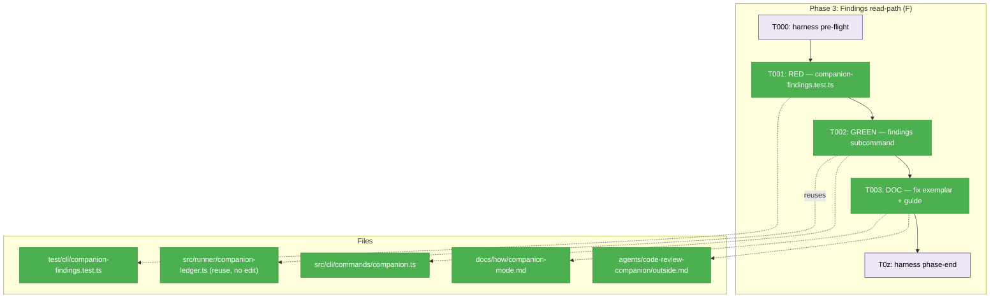
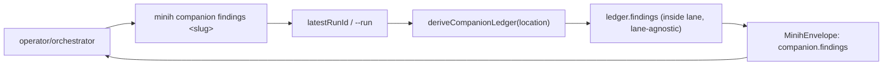

# Phase 3 — Findings read-path (F)

**Plan**: [companion-mode-reliability-plan.md](../../companion-mode-reliability-plan.md) (v1.1.1) · **Mode**: Full TDD · **Primary domain**: cli (+ docs)
**Phase objective**: A companion's `finding`/`summary` output is readable through **one documented operator command regardless of lane**, and the docs point there.
**Defect**: #50 **F** — findings written to the inside lane are invisible to the documented operator read-path (`outside.md` tells operators to `jq` the *outside* lane).

---

## Executive Briefing

- **Purpose**: Add `minih companion findings <slug>` — a read-only CLI surface over the existing, lane-agnostic companion ledger — so an operator (or orchestrating agent) reads a companion's findings with one command instead of hand-`jq`-ing the wrong inbox lane. Then correct the exemplar and guide that currently point operators at the outside lane.
- **What we're building**: One new `commander` subcommand (`findings <slug>`) on the existing `companion` parent command in `src/cli/commands/companion.ts`, mirroring the sibling `status <slug>` action almost exactly (same `--run`/`--json`/`latestRunId` plumbing, same `MinihEnvelope` output). Its `data` carries `ledger.findings` (already parsed lane-agnostically by `deriveCompanionLedger`). Plus a new regression test and two doc edits.
- **Goals**:
  - ✅ `minih companion findings <slug> [--run <id>] [--json]` emits a `companion.findings` envelope whose `data` surfaces the companion's structured findings (HIGH severity visible) and summary, sourced from `deriveCompanionLedger().findings`.
  - ✅ The command resolves the newest run by `startedAt` (reuse Phase 2's `latestRunId`) — never a stale local-as-`Z` folder.
  - ✅ `agents/code-review-companion/outside.md` no longer tells operators to `jq` the outside lane for findings.
  - ✅ `docs/how/companion-mode.md` documents the findings read-path.
- **Non-Goals**:
  - ❌ No new ledger API — `deriveCompanionLedger().findings` already exists and parses the inside lane (Finding 02). Do **not** re-author finding parsing.
  - ❌ No change to `companion status`, the ledger deriver, or the inbox lanes.
  - ❌ No new error codes — reuse `RUN_NOT_FOUND` / `INBOX_CORRUPT` exactly as `status` does.
  - ❌ Not the terminal-classification work (defect G, Phase 4) or longevity (Phase 5).

---

## Prior Phase Context

### Phase 1 — Run-discovery fail-open (A/B/C) · COMPLETE

- **A. Deliverables**: `computeStatusVerdict` fail-open (`src/cli/commands/status.ts`); `--all` wiring + best-effort `healDeadPidOrphan` on read (`src/runner/run-inventory.ts`); C resolved as a characterization-parity lock (no core surface emits the `runId:null` symptom — Finding 05 fallback). Full suite 1396 pass / 0 fail.
- **B. Dependencies exported (relevant to P3)**: the injectable `isProcessAlive`/`now` seam pattern and the subprocess-vs-`dist` CLI integration-test pattern (P3 mirrors the latter). `ACTIVE_STATUSES` is now triplicated (debt DL-002) — **not** touched by P3.
- **C. Gotchas/debt**: defect-C's literal symptom is not emitted by current core (locked via characterization test); `ACTIVE_STATUSES` triplication is a future-refactor candidate.
- **D. Incomplete**: none.
- **E. Patterns to follow**: RED→GREEN with explicit AC guards; on-disk `mkdtemp` fixtures, each test inlines its own seed (no shared fake-run helper). Don't add a new liveness seam.

### Phase 2 — Identifier & env correctness (D/E) · COMPLETE

- **A. Deliverables**: `createRunFolder` true-UTC getters + `now?` seam (`folder.ts`); new exported helpers `runStartedAt(runDir)` + `sortRunIdsNewestFirst(runsDir, runIds)`; `startedAt`-primary sort swept across **all ~11** latest/default run selectors (the live companion caught the migration was incomplete beyond the 4 named); `MINIH_PROJECT_ROOT` = resolved git root (`runner.ts`). Full suite 1404 pass / 0 fail.
- **B. Dependencies exported (CRITICAL for P3)**: **`companion.ts`'s `latestRunId(agentsDir, slug)` was already rewired in Phase 2** to call `sortRunIdsNewestFirst` (lines 113–123). P3's `findings` subcommand **reuses that same `latestRunId` function verbatim** for `--run`-default resolution — no new resolution logic. `sortRunIdsNewestFirst`/`runStartedAt` are exported via `src/runner/index.js`.
- **C. Gotchas/debt**: a test once leaked `TZ="undefined"` by re-assigning an originally-unset env var — restore env with an explicit `delete` branch, not assignment. `last-run`/`history` have no `--json` flag (they always emit JSON via `printEnvelope`); **`companion status` DOES take `--json`** (suppresses the human stderr table) — P3's `findings` mirrors `status`, so it keeps `--json`.
- **D. Incomplete**: none.
- **E. Patterns to follow**: shared helper, not duplicated sort logic; mirror the `companion` parent/child subcommand structure exactly; trust source order, don't re-sort.

---

## Pre-Implementation Check

| File | Exists? | Domain | Check | Notes |
|------|---------|--------|-------|-------|
| `src/cli/commands/companion.ts` | ✅ exists | cli (internal) | correct tree (`src/cli/commands/`) | **Modify** — add `companion.command('findings <slug>')` next to `status`. `latestRunId` + envelope helpers already imported. |
| `test/cli/companion-findings.test.ts` | ❌ new | cli (internal) | mirror tree (`test/cli/`) | **Create** — clone `test/cli/companion-status.test.ts` (subprocess vs `dist/`). |
| `src/runner/companion-ledger.ts` | ✅ exists | runner (contract) | reference only | **No edit** — `deriveCompanionLedger(location).findings` is the read API (Finding 02). cli→runner import is legal. |
| `agents/code-review-companion/outside.md` | ✅ exists | _docs | n/a | **Modify** — replace the raw-`jq` outside-lane findings instruction (the "Skim the inbox between commits" block, plan-cited `:88–96`) with `minih companion findings`. |
| `docs/how/companion-mode.md` | ✅ exists | _docs | n/a | **Modify** — add a findings read-path note (sits naturally near "§ 3 Review at every commit boundary" / "§ 4 Drain"). |

**Duplication scan**: `minih companion` already exists with a `status` subcommand; the ledger already exposes `findings`. This phase is **reuse, not new infrastructure** (Finding 02) — no concept duplication. No contract changes (the new subcommand is additive; the ledger API is untouched).

**Harness**: routing available via `/eng-harness-flow` (router installed at `~/.agents`) — the implement verb fires the pre-implement seam (T000) before any code and the phase-end seam (T0z) after.

---

## Architecture Map



---

## Tasks

| Status | ID | Task | Domain | Path(s) | Done When | Notes |
|--------|-----|------|--------|---------|-----------|-------|
| [x] | T000 | **Harness pre-flight** — `/eng-harness-flow --event pre-implement --phase "Phase 3: Findings read-path (F)" --plan-dir docs/plans/028-companion-mode-reliability` | — | — | Router envelope handled; boot verdict (`healthy/SLOW/UNHEALTHY/UNAVAILABLE`) narrated verbatim before any code | Harness seam (router installed); omit if router absent |
| [x] | T001 | **RED** — create `test/cli/companion-findings.test.ts` (clone the `companion-status` subprocess-vs-`dist` harness). Seed a run with an **inside-lane `finding`** carrying a **parseable HIGH** severity — **NOT** the bare `body:'b'` from `companion-status.test.ts` (⚠️ `toFinding` drops a finding when severity/file/category/recommendation are all absent → `findingsCount:1` but **empty `findings[]`**, so a clone would assert vacuously). Use either a JSON `meta: { severity:'HIGH', file:'src/x.ts', category:'bug', recommendation:'…' }` or a labelled body (`severity: HIGH\nfile: …\ncategory: …\nrecommendation: …`). Also seed an inside `summary` (ackOf a task) so `summariesCount` is non-zero. **Assert** (this pins AC-F's clauses): envelope `command === "companion.findings"`, `status === "ok"`, `data.findings` contains the HIGH finding with `severity === "HIGH"`, **and the summary surface** — `data.summariesCount >= 1` **and** `data.draftFarewell` is non-null with a non-empty `summary` string. Add a "defaults to newest run" case, a `RUN_NOT_FOUND (E171)` case, **and an `INBOX_CORRUPT (E148)` case** (seed torn inside-lane JSON to trigger `CompanionLedgerError`) — mirror `status` + cover T002's try/catch. | cli | `test/cli/companion-findings.test.ts` | Test **fails** because no `findings` subcommand exists today (commander errors on the unknown subcommand) | Plan 3.1; mirror `test/cli/companion-status.test.ts`; AC-F (a HIGH finding **and** summary visible). Build `dist/` first (integration test runs against `dist/cli/index.js`). |
| [x] | T002 | **GREEN** — add `companion.command('findings <slug>')` to `src/cli/commands/companion.ts`, mirroring the `status` action: same `--run`/`--json` options, `runId = opts.run ?? latestRunId(...)`, the `RUN_NOT_FOUND` guards, `deriveCompanionLedger(location)` in a `try/catch` mapping `CompanionLedgerError → INBOX_CORRUPT`. **Emit (pinned shape):** `formatSuccess('companion.findings', { slug, runId, findings: ledger.findings, summariesCount: ledger.summariesCount, draftFarewell })` where `draftFarewell = buildDraftFarewell(ledger)` — exactly as `status` does (both already imported). Optional human stderr table (TTY, suppressed by `--json`). | cli | `src/cli/commands/companion.ts` | T001 passes; `minih companion findings <slug> --json \| jq '.data.findings'` yields the companion's findings **and** `jq '.data.summariesCount'` / `jq '.data.draftFarewell.summary'` surface the summary; AC-F command path met | Plan 3.2; Finding 02 (reuse `deriveCompanionLedger().findings`, no new ledger API). **Summary surface PINNED (validate-v2):** AC-F wants `finding` **and** `summary` visible. The ledger exposes `summariesCount` (the metric) but **no** raw summaries array; the *summary content* lives in `draftFarewell.summary` (built by `buildDraftFarewell(ledger)`, already emitted by `status`). So surface both — count + `draftFarewell` — with **no new ledger API**. |
| [x] | T003 | **DOC** — (a) in `agents/code-review-companion/outside.md`, replace the raw-`jq`-on-the-outside-lane findings instruction (the "Skim the inbox between commits" block / plan-cited `:88–96`) with `minih companion findings <slug> --run "$RUN_ID"`; (b) extend `docs/how/companion-mode.md` with a "findings read-path" note (near § 3 Review / § 4 Drain) documenting the command. | _docs | `agents/code-review-companion/outside.md`, `docs/how/companion-mode.md` | Exemplar no longer points operators at the outside lane for findings; guide documents the read path | Plan 3.3; AC-F doc clause. Keep the `--unread` *skim* affordance if still useful, but make `findings` the documented findings read-path. |
| [x] | T0z | **Harness phase-end** — `/eng-harness-flow --event phase-end --plan-dir docs/plans/028-companion-mode-reliability` | — | — | Router envelope handled at phase end (drain-vs-harvest is the router's call) | Harness seam; omit if router absent |

**Suite expectation**: full `vitest run` green (≈1404+ pass / 0 fail) + `tsc --noEmit` clean before phase-complete.

---

## Context Brief

**Key findings from plan (P3-relevant)**:
- **Finding 02 (Critical → de-risks P3)**: Defect F is **reuse, not new infra**. `minih companion` exists with `status <slug>` over the pure `deriveCompanionLedger`; the ledger already carries `findings: CompanionFinding[]` parsed lane-agnostically from the inside lane (`companion-ledger.ts`). `outside.md` currently tells operators to `jq` the outside lane. → mirror the `status` action; emit `ledger.findings`; fix the docs.
- **Finding 10**: test substrate is ready — mirror `test/cli/companion-status.test.ts` (subprocess + inside/outside lane seeding). No shared fake-run helper; inline the seed.

**Domain dependencies (concepts/contracts this phase consumes)**:
- `runner` (contract): **companion ledger derivation** — `deriveCompanionLedger(location): CompanionLedger` returning `.findings` (`CompanionFinding[]` — each with `severity`/`file`/`category`/`issue`/`recommendation`; a finding with none of these is dropped by `toFinding`), `.findingsCount`, `.summariesCount`. Reuse via the legal `cli → runner` import (already imported in `companion.ts`).
- `runner` (contract): **summary surface** — `buildDraftFarewell(ledger): CompanionDraftFarewell | null` returning `.summary` (prose) + `.findings`; the only no-new-API path to summary *content* (the ledger exposes only `summariesCount`). Already imported in `companion.ts` and emitted by `status`.
- `runner` (contract): **newest-run resolution** — `sortRunIdsNewestFirst` (via `latestRunId` in `companion.ts`), `startedAt`-primary (Phase 2). No new resolution.
- `cli` (internal): **envelope helpers** — `formatSuccess`/`formatError`/`exitWithEnvelope`/`ErrorCodes` (`../output.js`), `coordinationRunLocation`/`coordinationRunDir`.

**Domain constraints**:
- `cli → runner` import direction only (no runner→cli). The new subcommand stays in `src/cli/commands/`.
- Additive only — do not alter `status`, the ledger, error codes, or inbox lanes. No public-contract change.

**Harness context** (router installed at `~/.agents`):
- **Entry point**: `/eng-harness-flow --event <seam> [--phase <id>] [--plan-dir <p>] --json` — the single door; child skills never named.
- **Pre-implement seam** (T000): fired by the implement verb before task 1; verdict narrated verbatim.
- **Phase-end seam** (T0z): fired after all tasks; the router owns drain-vs-harvest.
- **Backpressure**: not run for this plan (build path chosen directly) — the substrate is deterministic (injectable seams, on-disk fixtures, subprocess integration test), so coverage is effectively Strong for this phase without a Phase 0.

**Reusable from prior phases**:
- The `companion-status.test.ts` subprocess-vs-`dist` harness (`run()`, `append()`, `seedRun()`), inside/outside lane seeding, envelope-shape assertions.
- `latestRunId` (already `startedAt`-correct from Phase 2) — call as-is.

**Flow diagram (operator findings read-path)**:


**Sequence diagram (subcommand action)**:
```mermaid
sequenceDiagram
    participant CLI as companion findings
    participant R as runner (companion-ledger)
    participant O as output (envelope)
    CLI->>CLI: runId = opts.run ?? latestRunId(agentsDir, slug)
    CLI->>R: deriveCompanionLedger(location)
    R-->>CLI: CompanionLedger { findings, summariesCount, ... }
    CLI->>R: buildDraftFarewell(ledger)
    R-->>CLI: draftFarewell { summary, findings, ... }
    CLI->>O: formatSuccess('companion.findings', { slug, runId, findings, summariesCount, draftFarewell })
    O-->>CLI: exitWithEnvelope (stdout JSON; stderr table if TTY & !--json)
```

---

## Discoveries & Learnings

_Populated during implementation by the implement verb._

| Date | Task | Type | Discovery | Resolution | References |
|------|------|------|-----------|------------|------------|

**Types**: `gotcha` | `research-needed` | `unexpected-behavior` | `workaround` | `decision` | `debt` | `insight`

---

## Directory layout

```
docs/plans/028-companion-mode-reliability/
  ├── companion-mode-reliability-plan.md
  └── tasks/phase-3-findings-read-path-f/
      ├── tasks.md           # this file
      └── execution.log.md   # created by the implement verb
```

---

## Validation Record (2026-06-16)

### Validation Thesis

**Raison d'être**: Defect F of #50 — a companion writes findings to the **inside** lane, but the documented operator read-path (`outside.md`) tells operators to `jq` the **outside** lane, so real findings (incl. a HIGH that shipped unreviewed in the incident) are invisible. This dossier turns the plan's Phase-3 F-fix into an actionable, source-grounded task list.

**Value claim**: An operator/orchestrator reads a companion's findings (and summary) with one documented command instead of hand-`jq`-ing the wrong lane; the implementer builds it without re-deriving the ledger API.

**Artifact promise**: The implementer can build Phase 3 with minimal clarification — exact file, the `status` action to mirror, the reuse API (`deriveCompanionLedger().findings` + `buildDraftFarewell`), the test to clone, the doc edits, the AC-F bar.

**Intended beneficiaries**: the Phase-3 implementer (immediate); operators/orchestrating agents (runtime); the #50 closure (AC-meta).

**Proof target**: Implementation. **Evidence standard**: source/line/signature match, a RED test that fails for the right reason and asserts a *parseable* HIGH finding + summary surface, AC-F command measurability, reuse grounded in the real ledger API.

**Thesis source**: `companion-mode-reliability-plan.md` v1.1.1 Phase 3 block + AC-F + Findings 02/10; `companion-mode-reliability-spec.md` defect-F goal.

**Thesis verdict**: Advanced (after fixes — the summary surface and the parseable-finding seed are now pinned; pre-fix it was *partially advanced* with the "and summary" clause deferred).

**Main thesis risk**: (resolved) the implementer could have emitted `summariesCount` (a count) instead of summary *content*, meeting a narrow reading but failing AC-F's intent — now pinned to `summariesCount` + `draftFarewell.summary`.

---

| Agent | Lenses Covered | Thesis Axes | Issues | Verdict |
|-------|---------------|-------------|--------|---------|
| Source Truth | Concept Documentation, Technical Constraints, Hidden Assumptions, Edge Cases | Evidence Sufficiency | 1 MED (vacuous finding seed) + 1 LOW (summary shape) → **fixed** | ✅ source claims all accurate |
| Cross-Reference + Completeness | Integration & Ripple, Edge Cases, Hidden Assumptions, Domain Boundaries | Downstream Usefulness | 1 HIGH (AC-F "summary" unpinned) + 1 MED (no INBOX_CORRUPT case) → **fixed** | ⚠️ → ✅ |
| Thesis Alignment | Thesis Alignment, Evidence Sufficiency, Proof-Level Fit | Proof-Level Fit, Implementation Readiness | 2 MED (summary shape / assumption leakage) → **fixed** | ⚠️ → ✅ |
| Forward-Compatibility | Forward-Compatibility, Deployment & Ops, Integration & Ripple | Downstream Usefulness, Contract Integrity | 1 HIGH (summary shape mismatch) + 1 MED (test boundary) → **fixed** | ⚠️ → ✅ |

**Lens coverage**: 11/15 (Thesis Alignment ✓, Forward-Compatibility ✓ — not STANDALONE).

### Forward-Compatibility Matrix

| Consumer | Requirement | Failure Mode | Verdict | Evidence |
|----------|-------------|--------------|---------|----------|
| Phase-3 implement verb | exact file, mirror action, reuse API, AC bar | encapsulation lockout | ✅ (was CONDITIONAL) | `companion.ts` named, mirrors `status`, reuses `deriveCompanionLedger().findings`; emitted shape now pinned in T002 |
| AC-F acceptance check | HIGH finding **and** summary visible; outside.md fixed; guide documents path | shape mismatch | ✅ (was FAIL) | T001 now asserts `findings[HIGH]` + `summariesCount>=1` + `draftFarewell.summary`; T003 owns both doc clauses |
| #50 closure (AC-meta) | F disposition accurate; findings readable | contract drift | ✅ | root-cause read-path fixed (new command) + exemplar corrected; secondary "summary" clause now covered |
| Runtime operator/orchestrator | one documented command, stable contract | contract drift | ✅ | `minih companion findings <slug>` stable; shape locked before docs (T003) |
| Phase 4 (terminal classification) | Phase 3 independent; no cross-dependency | — | ✅ PASS | plan line 103: "Phases 1–4 … are independent"; Phase 3 reads only `deriveCompanionLedger`, never Phase 4's `terminalReason` |

**Thesis alignment**: Value claim now fully advanced at the **Implementation** proof level — the RED test pins a *parseable* HIGH finding plus the summary surface, so the "operator reads findings + summary via one command" claim is backed by a non-vacuous test; residual risk is the implementer keeping the `draftFarewell` shape consistent with the docs (T003).

**Outcome alignment** (echoed verbatim from the Forward-Compatibility agent, pre-fix): *"The dossier advances the value statement partially but incompletely … As written, the dossier is buildable but AC-F incomplete."* — **resolved** by the T001/T002 pin (summary surface = `summariesCount` + `draftFarewell.summary`) and the parseable-finding-seed fix; AC-F's "finding **and** summary" clause is now owned by a measurable Done-When.

**Standalone?**: No — downstream consumers exist (the implement verb, the AC-F check, #50 closure, runtime operators).

**Overall**: ⚠️ VALIDATED WITH FIXES
