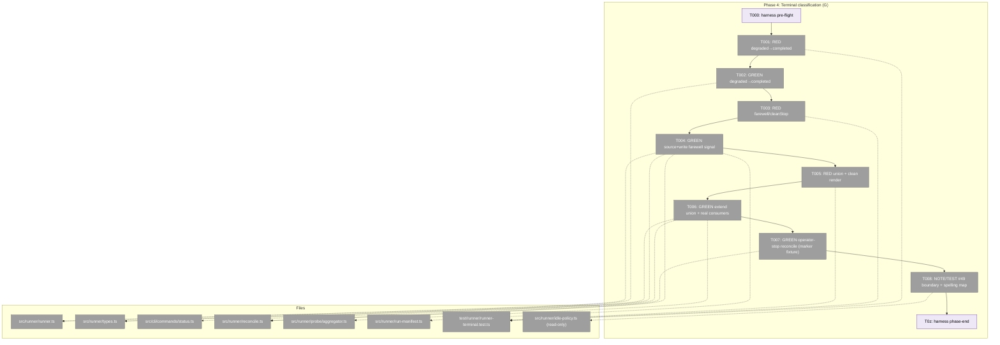
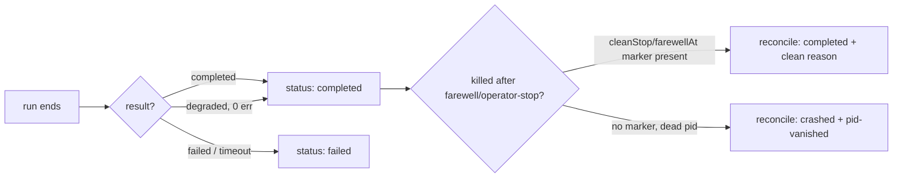
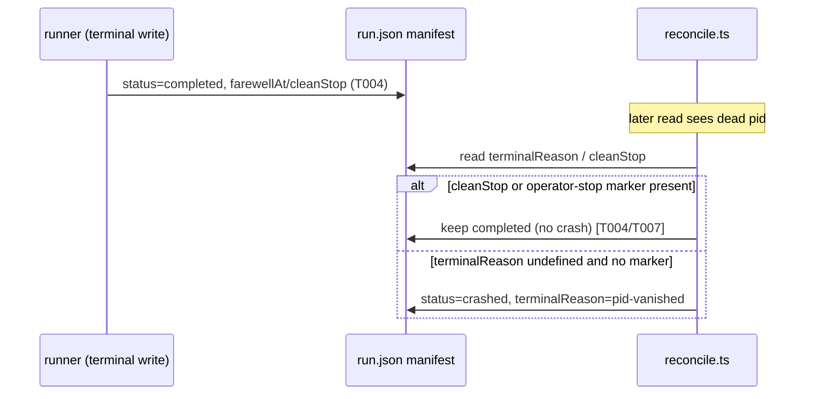

# Phase 4: Terminal classification (G) — Tasks & Context Brief

**Plan**: [companion-mode-reliability-plan.md](../../companion-mode-reliability-plan.md) · **Mode**: Full · **Phase**: 4 of 5
**Domain**: runner · **Depends on**: None (independent of Phases 1–3) · **Coordinates with**: #49 (idle trigger)
**Generated**: 2026-06-16

---

## Executive Briefing

- **Purpose**: A run that ended *cleanly* — a sent farewell, an operator stop, or an idle stand-down — must be recorded with a terminal state **distinct from a crash**. Today a clean-but-schema-nit run collapses into `manifest.status:'failed'`, and any `terminalReason` renders red as a failure. This phase fixes the terminal *vocabulary* and *write path*; it does **not** wire the idle *trigger* (that is #49).
- **What We're Building**:
  1. `result:'degraded'` → `manifest.status:'completed'` (the `completed.json.result` still reads `degraded`).
  2. A **farewell-observed signal** the runner can act on (none exists today — it must be *sourced* first), written as `farewellAt`/`cleanStop` on the manifest and honoured by reconcile so a post-farewell `pid-vanished` is **not** a crash.
  3. The `terminalReason` union extended with `operator-stop` / `idle-budget` / `no-engagement`, and the **real** consumers (`status.ts` render, `probe/aggregator.ts`) updated so the new reasons render as *clean*, not failure.
  4. A documented 028↔#49 boundary + the underscore-vs-hyphen reason-spelling map.
- **Goals**:
  - ✅ A degraded run is recorded `completed` (not `failed`); velocity behaviour for degraded is unchanged.
  - ✅ A farewelled/operator-stopped run reconciles to `completed`, not `crashed`.
  - ✅ New clean `terminalReason` members exist, are recordable, and render without `chalk.red`.
  - ✅ The #49 boundary and reason-spelling map are written down; #49 is unblocked, not done here.
- **Non-Goals**:
  - ❌ Wiring `evaluateIdlePolicy` into the runner loop (the idle *trigger* is #49; Finding 09 — it is dead code today).
  - ❌ A `minih stop` command / marker-writing producer (out of scope; reconcile only *honours* a marker if present — record as follow-up).
  - ❌ Any `measurement`-domain edit (the velocity guard stays keyed on `result==='completed'`; Workshop Q1).
  - ❌ Any zod/JSON-schema migration (manifest is plain `JSON.parse`, `schemaVersion===1`; a TS-union edit suffices).

---

## Prior Phase Context

### Phase 1 — Run-discovery fail-open (A/B/C) ✅
- **A. Deliverables**: `computeStatusVerdict()` fail-open branch (`status.ts`); `--all` wiring + `healDeadPidOrphan()` heal-on-read (`run-inventory.ts`); C pinned by characterization test (no production edit — symptom not emitted by core).
- **B. Dependencies exported (relevant to P4)**: `healDeadPidOrphan()` already writes `status:'crashed'` + **`terminalReason:'pid-vanished'`** under `withReconcileLock`, swallowing lock-held/write errors. Canonical liveness predicate = `ACTIVE_STATUSES(status) ∧ pidAlive ∧ now−updatedAt<60s`. **P4 must not let a clean terminal be re-healed to crashed** — the reconcile preservation invariant (only writes `pid-vanished` when `terminalReason === undefined`) is the hook.
- **C. Gotchas & debt**: `ACTIVE_STATUSES` now triplicated (`run-inventory.ts`, `run-resolver.ts`, `status.ts`) — DL-002, a future hoist; not P4's job. Heal is best-effort/fail-open by design.
- **D. Incomplete**: None. Suite 1396/0 at phase end.
- **E. Patterns**: injected `isProcessAlive(pid,{kill})` + injected `now`; on-disk `mkdtemp` fixtures, each test inlines its own seed; **run `npx biome format --write` before each commit** (a format violation bit T000).

### Phase 2 — Identifier & env correctness (D/E) ✅
- **A. Deliverables**: `createRunFolder` UTC getters + optional `now?:()=>Date` seam (`folder.ts`); `MINIH_PROJECT_ROOT` = git root (`runner.ts:631`); `startedAt`-primary sort across **~11 selectors** via new `runStartedAt()` / `sortRunIdsNewestFirst()` helpers (`folder.ts`, exported through `runner/index.ts`).
- **B. Line-drift flag (CRITICAL for P4)**: the Phase 2 logs do **not** claim to have shifted P4's anchors — **but they have moved anyway** (verified live, see Pre-Implementation Check): the degraded-collapse the plan calls `runner.ts:1590` is now the `updateManifest` ternary at **`runner.ts:1597-1598`**; `status.ts:415` render is now **`status.ts:441-442`**. Re-anchor against current source, never the plan's stale line numbers.
- **C. Gotchas & debt**: `run.json` may exist without `startedAt` (plain `JSON.parse`); manifests are tolerant-parsed. **No on-disk migration** — old folders keep their names.
- **D. Incomplete**: None. Suite 1404/0. DL-001 (scope-completeness: static validation missed the full selector sweep; the live companion caught it) carried as a recommendation.
- **E. Patterns**: clock injection via optional `now?` param (reuse, don't add seams); mixed-old/new fixture regression; env-capture via `onEvent` + fake git repo (`runner.test.ts:515-552`); **`just fft` (format-before-lint) before every commit**; first commit format+lint, second logic.

### Phase 3 — Findings read-path (F) ✅
- **A. Deliverables**: `minih companion findings <slug>` (`companion.ts`); fixed `outside.md`, `companion-mode.md` §3a, `AGENTS_README.md`.
- **B. Dependencies exported (relevant to P4 task T004)**: `deriveCompanionLedger(location)` → `.findings`/`.findingsCount`/`.summariesCount`; **`buildDraftFarewell(ledger)` → `.summary` + `.findings`** (`companion-ledger.ts`). These are the *companion-side* farewell-draft primitives — but **note**: a *draft* farewell is not the *runner-observed* "farewell was sent" signal P4 task T004 needs (see Watch-out below). `latestRunId` via `sortRunIdsNewestFirst` (Phase 2) — reuse as-is.
- **C. Gotchas & debt**: **8KB `outside.md` doctor cap** + **dist-bundle staleness** — doc edits only fail in the *full* suite after commit (DL-001 a pre-commit doc-budget sensor). P4 is code-heavy, so lower risk, but if P4 touches any bundled doc, `npm run build` re-bundles `dist/AGENTS_README.md` (byte-equality test).
- **D. Incomplete**: None. Suite 1408/0.
- **E. Patterns**: subprocess-vs-`dist` integration harness cloned from `companion-status.test.ts` (`run()`/`append()`/`seedRun()`); **rebuild `dist/` before RED integration tests**; seed *parseable* fixtures (a finding with all of severity/file/category/recommendation absent is silently dropped by `toFinding`); mirror-not-reinvent a sibling action; no new error codes.

---

## Pre-Implementation Check

Verified live against current source (anchors re-confirmed after Phase 1/2 edits — **the plan's line numbers are stale; these are correct**):

| File | Exists? | Domain | Anchor (verified) | Notes |
|------|---------|--------|-------------------|-------|
| `src/runner/runner.ts` | ✅ modify | runner | `1525-1529` resultStatus; **`1597-1598`** manifest-status ternary; `1535` velocity guard | The collapse: `status: resultStatus === 'completed' ? 'completed' : 'failed'` — `degraded` falls to `'failed'`. `completed.json.result` (1547) already reads `degraded`. Retro-harvest branch (1619-1622) *already* treats degraded as non-failed. |
| `src/runner/types.ts` | ✅ modify | runner (contract) | union **`575-581`**; mirror `terminalReason?` at `679` (`LiveRunManifest['terminalReason']`) | Add `operator-stop`/`idle-budget`/`no-engagement`. May add `farewellAt?`/`cleanStop?` manifest fields here (T004). The `679` mirror inherits the union automatically. |
| `src/cli/commands/status.ts` | ✅ modify | cli | render **`441-442`** (`chalk.red(terminalReason)`) | Red-renders **any** reason. Must not red-render the 3 clean reasons (dim/neutral instead). |
| `src/runner/reconcile.ts` | ✅ modify | runner | `107-110` write; **`109` preservation invariant** (`manifest.terminalReason === undefined`); tolerant-parse `128-152` | Honour a `cleanStop`/`farewellAt` marker (and `operator-stop`) → reconcile to `completed`, not `crashed`. The invariant already protects a set `terminalReason`; `cleanStop` needs explicit honouring when reason is unset. |
| `src/runner/probe/aggregator.ts` | ✅ confirm | runner | `terminalReason: string \| null` at `48`; only special-cases `=== 'permission-denied'` (`121`, `191`) | New clean reasons pass through as plain strings — **tolerated already**; T005 test confirms no choke. |
| `src/runner/idle-policy.ts` | ✅ read-only | runner | `exitReason: 'idle_budget' \| 'no_engagement'` at `40`, `70-72` | **Underscore** spelling. The union uses **hyphen**. T008 documents the `exitReason → terminalReason` map; idle-policy stays unwired (Finding 09). |
| `src/runner/companion-ledger.ts` | ✅ read | runner | `buildDraftFarewell` `~496`; draft `~425` | Candidate *source* for the farewell-observed signal (T004) — but it's a draft primitive; the runner needs a *sent-farewell* marker (see T004 Watch-out). |
| `src/runner/run-manifest.ts` | ✅ modify (likely) | runner | `updateManifest`; `updatedAt` advance | Where `farewellAt`/`cleanStop` get persisted onto the manifest. |
| `test/runner/runner-terminal.test.ts` | 🆕 create | runner | — | New test file for T001/T003/T005 (mirror `test/runner/runner.test.ts` fixture shape). |

**Contract-change flag**: `types.ts` `terminalReason` is the domain's `contract`-classified file (Domain Manifest). Extending a string union is additive (no migration) but is a public-surface change — note in domain.md History.

**Harness availability**: the `/eng-harness-flow` router is installed (Phases 1–3 fired its seams). T000/T0z below are the pre-implement / phase-end seam rows.

---

## Architecture Map



---

## Tasks

| Status | ID | Task | Domain | Path(s) | Done When | Notes |
|--------|-----|------|--------|---------|-----------|-------|
| [x] | T000 | **Harness pre-flight** — `/eng-harness-flow --event pre-implement --phase "Phase 4: Terminal classification (G)" --plan-dir docs/plans/028-companion-mode-reliability` | — | — | Router envelope handled; boot verdict narrated verbatim before any code | Harness seam (plan 4.0). Fired by the implement verb. |
| [x] | T001 | **RED** — failing test: a clean run with a schema nit (`result:'degraded'`, 0 errors) records `manifest.status:'completed'` (not `failed`) while `completed.json.result` still reads `degraded` | runner | `test/runner/runner-terminal.test.ts` (new) | Test fails against the current `runner.ts:1597-1598` collapse (degraded → `failed`) | Plan 4.1; Workshop D1-A. Mirror `runner.test.ts` fixture shape. |
| [x] | T002 | **GREEN** — at `runner.ts:1597-1598` map `result:'degraded'` → `manifest.status:'completed'` (`completed.json.result` at 1547 still reads `degraded`). **Decision (Workshop Q1, locked here): leave the velocity guard at `runner.ts:1535` keyed on `resultStatus==='completed'` — a degraded run still skips velocity; `measurement` untouched.** | runner | `src/runner/runner.ts` | T001 passes; AC-G (degraded) met; velocity behaviour for degraded unchanged (recorded, no measurement edit) | Plan 4.2; Finding 06. One-line ternary widen: `=== 'completed' \|\| === 'degraded'`. |
| [x] | T003 | **RED** — failing test: a `farewell`-sent, 0-error run that is then killed records `completed` (not `crashed`/`pid-vanished`); a `cleanStop`/`farewellAt` marker is honoured by reconcile | runner | `test/runner/runner-terminal.test.ts` | Test fails (no farewell signal read today; reconcile would mark it `crashed`) | Plan 4.3; Workshop D2-A. |
| [x] | T004 | **GREEN** — **first define + source the farewell-observed signal the runner can act on** (no `farewell`/`cleanStop`/`farewellAt` reference exists in `runner.ts`/`reconcile.ts` today — verified). **Spike first (record the decision in the execution log before coding): pick ONE of three candidate sources** — (a) a marker file the inside-MCP writes to the run dir on a *sent* `farewell` (e.g. `<runDir>/.cleanStop.json`), (b) a runner-side read of the coordination ledger at terminal-write to detect a sent farewell, (c) a control-channel signal. **Confirm the chosen source's *lifecycle* (is it readable at the moment the runner writes terminal state?) — if no producer exists today, T004 also adds that producer.** Then pin the manifest fields in `types.ts` (provisional: `farewellAt?: number` (Unix ms), `cleanStop?: boolean`) on both `LiveRunManifest` and the `679` mirror, persist them via `run-manifest.ts`, and make `reconcile.ts:106-111` honour them so a post-farewell `pid-vanished` ≠ crash. **Effort: larger than a line edit — the signal must be sourced before it can be written.** | runner | `src/runner/runner.ts`, `src/runner/reconcile.ts`, `src/runner/run-manifest.ts`, `src/runner/types.ts` | T003 passes; the farewell-observed signal is **named + sourced + lifecycle-confirmed** (recorded in the execution log); `farewellAt`/`cleanStop` field names+types pinned in `types.ts`; reconcile records `completed` for a marked run | Plan 4.4; Workshop D2; Finding 06. ⚠️ See Watch-out below — `buildDraftFarewell` is a *draft*, not the sent-farewell marker. |
| [x] | T005 | **RED** — failing test: `terminalReason` accepts `operator-stop`/`idle-budget`/`no-engagement`, and the **real** consumer renders them cleanly — `status.ts:441-442` does not `chalk.red` a clean reason; `probe/aggregator.ts` tolerates them | runner | `test/runner/runner-terminal.test.ts` | Test fails on the current union (members absent) and the unconditional red-render | Plan 4.5; Workshop D4; Finding 06. |
| [x] | T006 | **GREEN** — extend the `terminalReason` union in `types.ts:575-581` with `operator-stop`/`idle-budget`/`no-engagement`; update the **real** consumers: `status.ts:441-442` renders clean reasons non-red (dim/neutral), `probe/aggregator.ts` confirmed tolerant. The `status`-switching if-chains (`run-inventory.ts:198-204`, `run-resolver.ts:416-419`, `human-view-model.ts:501-507`) need **no** change — they branch on `manifest.status` (reuses `completed`) | runner | `src/runner/types.ts`, `src/cli/commands/status.ts`, `src/runner/probe/aggregator.ts` | T005 passes; new reasons render clean, not failure; `tsc` clean (union mirror at `types.ts:679` inherits automatically); the union extension noted in `runner` `domain.md` § History (contract change) | Plan 4.6a; Finding 06. Build a small clean-reason set in `status.ts` to drive the render branch. |
| [x] | T007 | **GREEN** — operator-stop: `reconcile.ts` honours a `terminalReason:'operator-stop'` + cleanStop marker **if present** (tested with a hand-written marker fixture). **Scope: 028 lands the union member + reconcile honouring only — no `minih stop` producer exists, so the marker-writing command surface is follow-up** (record in the plan's Deferred section) | runner | `src/runner/reconcile.ts`, `test/runner/runner-terminal.test.ts` | A marker-fixture run reconciles to `completed`+`operator-stop`, not `crashed` | Plan 4.6b; Workshop D3/Q2. Producer out of scope. |
| [x] | T008 | **NOTE/TEST** — pin the 028↔#49 boundary: 028 makes the reasons recordable; #49 wires `evaluateIdlePolicy`. **Reason-spelling seam (verified):** `idle-policy.ts:40,70` emits underscore `idle_budget`/`no_engagement`; this union uses hyphen `idle-budget`/`no-engagement` (consistent with siblings `pid-vanished`/`stalled-stream`) — #49 maps `exitReason → terminalReason`. Document that map (in the execution log + plan boundary note). A test asserts the union members exist and are recordable; **no** test assumes the runner triggers an idle stand-down | runner | `test/runner/runner-terminal.test.ts`, execution log, plan § Related/Deferred | Boundary + spelling-map documented in **the execution log AND the plan's § Related/Deferred boundary note** (no new file); a test pins the recordable union; #49 unblocked, not done here | Plan 4.7; Finding 09; spec Non-Goal. Phase 5 task 5.5 owns the never-spoke-arm test; this phase only lands the recordable members. |
| [ ] | T0z | **Harness phase-end** — `/eng-harness-flow --event phase-end --plan-dir docs/plans/028-companion-mode-reliability` | — | — | Router envelope handled at phase end (drain-vs-harvest is the router's call) | Harness seam (plan 4.z). Fired by the implement verb. |

- `[ ]` pending · `[~]` in progress · `[x]` complete · `[!]` blocked

---

## Context Brief

**Key findings from plan (relevant to this phase)**:
- **Finding 06 (High)** — the exhaustiveness risk is the new *status*, not the new *reason*. The `status`-switching if-chains already handle the reused `completed`; the only `terminalReason` consumers that need editing are `status.ts` (render) and `probe/aggregator.ts`. No zod gate on `run.json`. → drives T006's scoping.
- **Finding 09 (High)** — `evaluateIdlePolicy` is dead code (no runner-loop caller). 028 lands vocabulary + write path only; the trigger is #49. → forbids any AC/test assuming runtime idle stand-down (T008).
- **Finding 01 (Critical)** — runId sort safety (Phase 2, done). Relevant only as a reminder that manifest reads are tolerant and there is no schema migration here.

**Domain dependencies (consumed)**:
- `runner`: `updateManifest` / manifest write path (`run-manifest.ts`); `reconcile.ts` preservation invariant; the `CompletedMetadata['result']` and `terminalReason` types (`types.ts`).
- `runner` (read-only): `idle-policy.ts` `exitReason` vocabulary (spelling map source); `companion-ledger.ts` `buildDraftFarewell` (candidate farewell-signal source — see Watch-out).
- `cli`: `status.ts` is the only cli consumer touched (render).

**Domain constraints**:
- All edits stay in `runner` + one `cli` render; no cross-domain import added; `measurement` is **not** touched (velocity guard unchanged).
- `types.ts` is contract-classified — additive union change, but log it in domain.md History.
- Manifest stays plain JSON (`schemaVersion===1`); no schema/zod work.

**Harness context** (router installed):
- **Entry point**: `/eng-harness-flow --event <seam> [--phase <id>] [--plan-dir <p>] --json` — single door; child skills never named.
- **Pre-implement seam** (T000): fired by the implement verb before T001; boot verdict (`healthy/SLOW/UNHEALTHY/UNAVAILABLE`) narrated verbatim.
- **Phase-end seam** (T0z): fired after T008; router decides drain-vs-harvest. The observe buffer already carries **DL-001** (harvest-blind-to-records gap) from Phase 3 — it will surface at this drain.
- No `backpressure-coverage.md` in the plan dir (the post-spec survey wasn't run for 028) — standard testing + this phase's RED/GREEN sensors cover the criteria.

**Reusable from prior phases**:
- On-disk `mkdtemp` run-fixture seeding (each test inlines its own seed — no shared factory).
- Injected `now` / `isProcessAlive` seams; `onEvent` + fake-git-repo env capture (`runner.test.ts:515-552`) for any spawn-path assertion.
- `npx biome format --write` / `just fft` before each commit (P1/P2 lesson); first commit format+lint, second logic.

**⚠️ Watch-out — the farewell-observed signal (T004 is the phase's hard part)**:
A grep confirms **no** `farewell`/`farewellAt`/`cleanStop` reference exists in `runner.ts` or `reconcile.ts`. `companion-ledger.ts`'s `buildDraftFarewell` produces a *draft* the companion overwrites at farewell — it is **not** evidence the farewell was *sent*. The runner has no in-process knowledge of an inside-MCP `farewell` send (the inside MCP is a spawned subprocess — see memory: a same-process fake adapter can't drive the inside MCP). So T004 must **first decide + record** where the "farewell was sent" truth comes from (the three candidates in T004: a marker file the inside-MCP writes on send / a ledger read on terminal-write / a control-channel signal) **before** writing `farewellAt`/`cleanStop`. Two traps to check during the spike: (1) **lifecycle** — is the source readable at the instant the runner writes terminal state? A ledger written only *after* the run ends can't feed an at-exit write. (2) **producer existence** — if the chosen source has no writer today (e.g. the inside-MCP doesn't emit a marker yet), T004 must *add that producer too*, not just consume it. Pin the fields provisionally as `farewellAt?: number` (Unix ms) + `cleanStop?: boolean` on `LiveRunManifest` (the `679` mirror inherits). Do not assume a symbol exists — source it, confirm its lifecycle, log the decision, then implement.

**Mermaid — terminal-classification flow (after this phase)**:


**Mermaid — reconcile honouring sequence**:


---

## Discoveries & Learnings

_Populated during implementation by the implement verb._

| Date | Task | Type | Discovery | Resolution | References |
|------|------|------|-----------|------------|------------|

**Types**: `gotcha` | `research-needed` | `unexpected-behavior` | `workaround` | `decision` | `debt` | `insight`

---

## Directory Layout

```
docs/plans/028-companion-mode-reliability/
  ├── companion-mode-reliability-plan.md
  └── tasks/phase-4-terminal-classification-g/
      ├── tasks.md          # this file
      └── execution.log.md  # created by the implement verb
```
