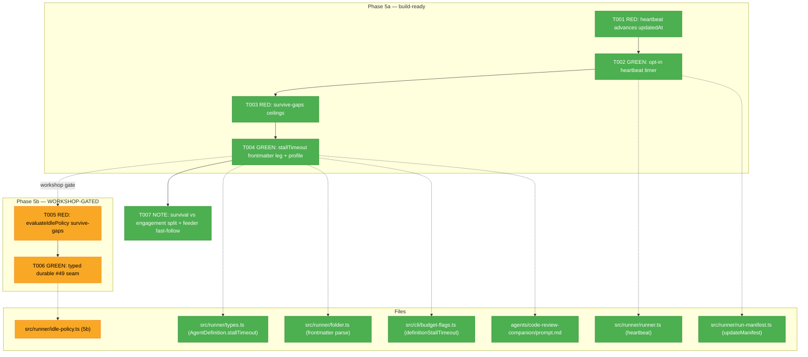
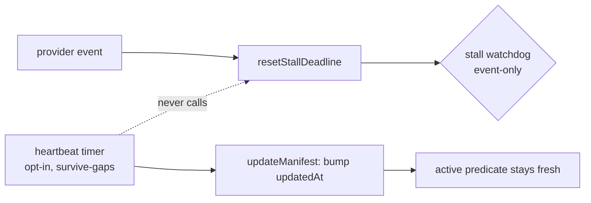
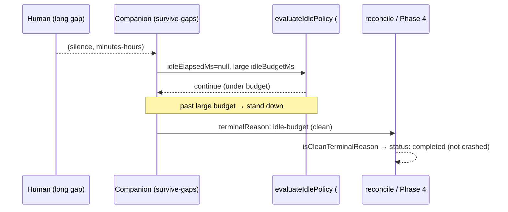

# Phase 5: Companion longevity through human gaps — Tasks

**Plan**: [companion-mode-reliability-plan.md](../../companion-mode-reliability-plan.md)
**Phase**: Phase 5 — Companion longevity through human gaps (#50 follow-up — user-directed scope extension)
**Generated**: 2026-06-16
**Mode**: Full · **Depends on**: nothing hard (heartbeat targets `run.json.updatedAt`, which Phase 1 task 1.3 converged the verdict onto — build **last**)

> ⚠️ **Two halves — read before building.** This phase has a hard internal seam:
> - **5a (build-ready now)** — tasks T001–T004: heartbeat + `stallTimeout` frontmatter leg + ceiling-raising profile. No contract #49 must honour. **Green to build.**
> - **5b (workshop-gated)** — tasks T005–T006: the idle-policy *engagement* compose. It **changes `evaluateIdlePolicy`'s contract** (what counts as engagement), which #49 must honour. **Do NOT build T005/T006 until the engagement-definition workshop lands** (plan § Phase 5 "Open (workshop 5b)"). The dossier carries them for completeness; the gate is real.

---

## Executive Briefing

**Purpose**: Keep a `code-review-companion` *alive* across long human-in-the-loop gaps (minutes → hours) so it isn't idle/stall/timeout-killed before reviewable work lands. This is the **survival half** of the #50 follow-up — it does **not**, on its own, make the companion *see* new commits (that's the deferred engagement half, Finding 12).

**What We're Building**:
1. An **opt-in runner-side heartbeat** — a timer that advances `run.json.updatedAt` independent of provider events, so the Phase-1 active predicate (pid-alive ∧ recent `updatedAt`) keeps reporting `active` while a survive-gaps companion waits quietly. Default runs keep their strict staleness signal.
2. The **frontmatter→config leg for `stallTimeout`** — the per-run `--stall-timeout` override already exists; the gap is that agent frontmatter can't set it. Plus a **survive-gaps profile** that raises the three ceilings (`stallTimeout`, `idleBudgetMs`, `timeout`) together.
3. (5b, gated) A **durable, typed compose-seam** into `evaluateIdlePolicy` so #49's future idle trigger *cannot* be written ignorant of the survive-gaps posture — committing to `budgets.idleBudgetMs` and/or a named `IdlePolicyInput` field (decided in the workshop). `evaluateIdlePolicy` **stays unwired** — Phase 5 lands the seam, #49 wires the trigger.

**Goals**:
- ✅ A quietly-waiting survive-gaps companion reads `active` via the Phase-1 `updatedAt` predicate (AC-H).
- ✅ Companion frontmatter can carry `stallTimeout`; a survive-gaps profile raises all three ceilings together.
- ✅ The stall watchdog (event-based) and default-run staleness are **provably unaffected** by the heartbeat.
- ✅ (5b) The #49 seam is a typed, durable field — never a bare default; a survive-gaps stand-down records a **clean Phase-4 reason** (`idle-budget`/`no-engagement`), not a crash.
- ✅ The survival/engagement split + the cheap commit-feed substrate are documented as a fast-follow.

**Non-Goals**:
- ❌ Making the companion *see* new commits (the engagement half — deferred `git log`-cursor → `outside inbox send` feeder, Finding 12). Longevity is **necessary, not sufficient** to close the reported incident.
- ❌ Wiring `evaluateIdlePolicy` into the runner loop — that's #49's scope. Phase 5 only lands the typed seam.
- ❌ Changing default-run behaviour. The heartbeat is **opt-in**; default runs keep the strict `updatedAt`-freshness signal Phase 1/Plan 026 rely on.
- ❌ A `minih stop` / `operator-stop` producer (Phase 4 follow-up, out of scope here).

---

## Prior Phase Context

### Phase 1 — Run-discovery fail-open (A/B/C) · COMPLETE
- **A. Deliverables**: `computeStatusVerdict` fail-open branch (`src/cli/commands/status.ts`); `--all` wired + `healDeadPidOrphan` (`src/runner/run-inventory.ts`).
- **B. Exported (load-bearing for Phase 5)**: the **run-active predicate** `active = ACTIVE_STATUSES(status) ∧ pid-alive ∧ (now − updatedAt < 60s)`, with `ACTIVE_STATUSES = {starting, active, completing}` (**idle excluded**). `updatedAt` freshness is the gating condition; `events.ndjson` is a tie-break only. **The heartbeat targets exactly this `updatedAt`.**
- **C. Gotchas**: staleness window is **hardcoded 60s** (`status.ts`, `run-inventory.ts`, `run-resolver.ts`) — the heartbeat interval must comfortably beat it. `ACTIVE_STATUSES` is triplicated (debt DL-002).
- **D. Incomplete**: none.
- **E. Patterns**: faked `isProcessAlive(pid,{kill})` + controllable `now()` for RED/GREEN; heal-on-read wraps in blanket try/catch (swallow non-lock errors).

### Phase 2 — Identifier & env correctness (D/E) · COMPLETE
- **A. Deliverables**: true-UTC runId (`folder.ts` `getUTC*` + optional `now?` injection on `createRunFolder`); `MINIH_PROJECT_ROOT = resolveDefaultAllowedRoots(...).roots[0]` (`runner.ts:637`); `startedAt`-primary sort across ~11 selectors.
- **B. Exported (relevant)**: `createRunFolder(def, opts?: { now?: () => Date })` clock seam; `runStartedAt`, `sortRunIdsNewestFirst` (`runner/index.ts`). **No AgentDefinition change** — task T004 is the first to touch the frontmatter→AgentDefinition leg since.
- **C. Gotchas**: **F001 TZ leak** — restoring an unset env var by assignment writes `TZ="undefined"`; use an explicit `delete` branch. Live INS-001 confirmed defect-D was current.
- **D. Incomplete**: none.
- **E. Patterns**: clock injection via `now?: () => Date`; **`just fft` (biome format) before every commit**; env-capture test via `onEvent` callback (`runner.test.ts:515-552`).

### Phase 3 — Findings read-path (F) · COMPLETE
- **A. Deliverables**: `minih companion findings <slug>` subcommand (`src/cli/commands/companion.ts`) over `deriveCompanionLedger(location).findings`.
- **B. Exported (relevant)**: `deriveCompanionLedger(location): CompanionLedger` → `.findings`, `.findingsCount`, `.summariesCount`; `buildDraftFarewell(ledger).summary`. Phase 5's T007 NOTE cites these when documenting the survival-vs-engagement split.
- **C. Gotchas**: a finding with all four fields absent is dropped (vacuous-finding trap) — seed tests with labelled bodies.
- **D. Incomplete**: none.
- **E. Patterns**: reuse a sibling action over inventing API; subprocess-vs-`dist/` test harness; additive-only contracts; `cli → runner` import direction only.

### Phase 4 — Terminal classification (G) · CODE COMPLETE (T0z phase-end seam pending; fix uncommitted as of dossier time)
- **A. Deliverables**: `terminalReason` union extended with `operator-stop | idle-budget | no-engagement`; `CLEAN_TERMINAL_REASONS` + `isCleanTerminalReason()` (single source of truth, `types.ts`, exported via `runner/index.ts`); `LiveRunManifest.cleanStop?: boolean` + `farewellAt?: number`; reconcile honours a dead-pid PROBE with `cleanStop===true` OR a clean `terminalReason` → `status:'completed'` (`reconciledClean` bucket); C-F001 active-phase producer stamps `cleanStop:true` at the `'completing'` transition.
- **B. Exported (load-bearing for Phase 5 T006)**: the clean reasons + predicate. A survive-gaps stand-down (#49's future producer) writes `terminalReason:'idle-budget'`/`'no-engagement'` on a still-PROBE manifest and **reconcile already honours it as clean**. Phase 5 only has to spell the reason consistently.
- **C. Gotchas**: **spelling seam** — `idle-policy.ts` uses underscores (`no_engagement`); the union uses hyphens (`no-engagement`). #49 maps `exitReason → terminalReason`; T006 must keep the map honest.
- **D. Incomplete**: **T0z (harness phase-end seam) still pending**; the C-F001 runner.ts fix + its test are not yet committed; observe buffer carries DL-001 (Phase 3 harvest-blind-to-records) + a dogfood note.
- **E. Patterns**: simulate a finalization-window kill by mocking `node:fs` to throw on the `completed.json` write (distinct from `fs/promises` manifest writes); single-source-of-truth union prevents cross-file drift.

---

## Pre-Implementation Check

> ⚠️ **Plan line-anchor corrections (Phase 2 line drift + a wrong path in the plan).** Re-anchored against live source 2026-06-16:

| File | Exists? | Domain | Notes / re-anchor |
|------|---------|--------|-------------------|
| `src/runner/run-manifest.ts` | ✅ modify | runner | `updateManifest(runDir, patch)` at **L108** (not :218); merges via `applyPatch` (L202). Heartbeat (T002) bumps `updatedAt` through this. |
| `src/runner/runner.ts` | ✅ modify | runner | Stall watchdog `resetStallDeadline` at **L998** (plan said :990); fired on provider events (L1038, L1260); `stallTimeoutMs` from `budgets.stallTimeoutSec` (L981-982). Heartbeat must **not** call `resetStallDeadline`. Timer lives in the run lifecycle; cleared on terminal/cleanup. |
| `src/runner/types.ts` | ✅ modify | runner | `AgentDefinition` at **L12-50** (has `timeout?`, **no `stallTimeout`** — T004 adds it). `stallTimeout?: number` at **L83 is on `AgentRunConfig`** (per-run config), confirming the per-run override already exists. `AgentRunConfig.idleBudgetMs?` at L614. |
| `src/runner/folder.ts` | ✅ modify | runner | Frontmatter parser `parseFrontmatter` (L289-340) parses `timeout` via regex **L334-336**, returns `{description,tags,model,reasoning,timeout}` at **L340**. `listAgents` builds AgentDefinition (L668+, L698/712); `resolveAgent` (L737). T004 mirrors the `timeout` path for `stallTimeout`. |
| `src/cli/budget-flags.ts` | ✅ modify | cli | ⚠️ **`resolveEffectiveBudgets` is here at L72, NOT `src/runner/budget-flags.ts:87-93`** (plan path wrong). Signature `(commandName, flags, definitionTimeout?)`; `stallTimeout` branch currently has **no frontmatter fallback** (`?? DEFAULT_STALL_TIMEOUT_SEC`). T004 adds a 4th `definitionStallTimeout?` param + threads it. Callers: `run.ts:274`, `resume.ts:623`. |
| `src/runner/idle-policy.ts` | ✅ modify (5b) | runner | `evaluateIdlePolicy(ledger, opts: IdlePolicyInput)` at **L62**; `IdlePolicyInput` (L22) = `idleBudgetMs`, `runElapsedMs`, `timeoutSec`. Never-spoke arm: `neverSpoke = idleElapsedMs===null` (L67), `effectiveIdleMs = idleElapsedMs ?? runElapsedMs` (L68), stand-down at L93. `DEFAULT_IDLE_BUDGET_MS = 1_800_000`. **5b only.** |
| `agents/code-review-companion/prompt.md` | ✅ modify | agents | Frontmatter has `timeout: 7200`, `coordination: enabled`, **no `stallTimeout`**. T004 adds the survive-gaps `stallTimeout`. |
| `test/runner/run-resolver.test.ts` | ✅ reuse | runner (test) | clock-injection template for T001. |
| `test/runner/companion-longevity.test.ts` | ❌ create | runner (test) | new — T001/T003 (5a); T005 (5b, gated). |

**Harness availability**: `/eng-harness-flow` router **installed** — the implement verb fires the pre-implement seam before any code (T000) and the phase-end seam after (T0z). Verdicts narrated verbatim (`healthy/SLOW/UNHEALTHY/UNAVAILABLE`).

**No existing `surviveGaps` / heartbeat symbol** — both are net-new (confirmed by grep).

---

## Architecture Map



---

## Tasks

> **Two task tables below.** The first is **buildable now** (5a + phase scaffolding). The second is **⛔ workshop-gated** — the implement verb must not queue it after T004. This split is the structural gate, not advisory prose.

### Tasks — buildable now (5a + phase scaffolding)

| Status | ID | Task | Domain | Path(s) | Done When | Notes |
|--------|-----|------|--------|---------|-----------|-------|
| [x] | T000 | **Harness pre-flight** — `/eng-harness-flow --event pre-implement --phase "Phase 5: Companion longevity through human gaps" --plan-dir docs/plans/028-companion-mode-reliability` | — | — | Router envelope handled; boot verdict narrated verbatim before any code | _Harness seam_ · doctor=degraded (only `biome` not on PATH; runs via `just fft`) — non-blocking |
| [x] | T001 | **RED (5a)** — failing test: a run with **no provider events** for longer than the heartbeat interval still advances `run.json.updatedAt` on the timer, so the AC-A predicate (pid-alive ∧ recent `updatedAt`) still reports `active`. Use clock injection. | runner (test) | `test/runner/companion-longevity.test.ts` | Test fails today (`updatedAt` advances only on events) | Plan 5.1; Finding 11; mirror `test/runner/run-resolver.test.ts` clock injection |
| [x] | T002 | **GREEN (5a)** — add an **opt-in** runner-side heartbeat: a timer bumping `run.json.updatedAt` via `updateManifest` (`run-manifest.ts:108`) on a configurable interval, decoupled from provider events; **only when the survive-gaps profile is active** (default runs keep the strict staleness signal). It **never** calls `resetStallDeadline` (`runner.ts:998`). **Clear the timer on terminal/cleanup** (no leaked interval). Interval must comfortably beat the hardcoded 60s staleness window. | runner | `src/runner/runner.ts`, `src/runner/run-manifest.ts` | T001 passes; a survive-gaps run reads `active` while quiet. **Three named regressions**: (a) a run **without** the survive-gaps profile has **no** heartbeat timer — `updatedAt` advances only on provider events and the run goes `stale` past the 60s window (default-run invariant); (b) the heartbeat **never calls `resetStallDeadline`** — a survive-gaps run with no events still fires `stalled-stream` at its stall budget (watchdog unaffected); (c) the timer is **cleared on terminal/cleanup** (fake-timer assertion — no leaked interval). | Plan 5.2; Finding 11; validation Claim 3/5, T4; **load-bearing invariant — assert (a) explicitly** |
| [x] | T003 | **RED (5a)** — failing test: a companion with the survive-gaps profile gets large/disabled `stallTimeout`, large `idleBudgetMs`, large `timeout`; a simulated >300s model pause does **not** fire `stalled-stream`. | runner (test) | `test/runner/companion-longevity.test.ts` | Test fails today (frontmatter can't carry `stallTimeout`) | Plan 5.3; Finding 11 |
| [x] | T004 | **GREEN (5a)** — close the **frontmatter→config leg** (the per-run `--stall-timeout` override already works): (1) add `stallTimeout?: number` to `AgentDefinition` (`types.ts:12-50`); (2) parse it in `parseFrontmatter` (`folder.ts:334-340`, mirror the `timeout` regex) and thread through `listAgents`/`resolveAgent`; (3) add a `definitionStallTimeout?` 4th param to `resolveEffectiveBudgets` (**`src/cli/budget-flags.ts:72`**) used as the `stallTimeout` fallback, and pass `definition.stallTimeout` from callers (`run.ts:274`, `resume.ts:623`); (4) wire a **survive-gaps profile** raising the three ceilings together; (5) set an explicit survive-gaps `stallTimeout` (e.g. `0` = disabled, or a large value) in the companion frontmatter, **and assert in a test that the frontmatter value reaches `budgets.stallTimeoutSec`**. Wall-clock `timeout` stays the ultimate backstop. **Field names: `stallTimeout` (config) / `stallTimeoutSec` (budgets).** | runner / cli / agents | `src/runner/types.ts`, `src/runner/folder.ts`, `src/cli/budget-flags.ts`, `src/cli/commands/run.ts`, `src/cli/commands/resume.ts`, `agents/code-review-companion/prompt.md` | T003 passes; companion frontmatter carries `stallTimeout` **and a test proves it reaches `budgets.stallTimeoutSec`**; `--stall-timeout 0` still works | Plan 5.4 (re-scoped by validation T3); ⚠️ corrected path |
| [x] | T007 | **NOTE / DOC** — document that longevity is the **survival half**; the **engagement half** (companion actually seeing new commits) needs the deferred `git log`-cursor → `outside inbox send` feeder (Finding 12 — durable inbox already delivers). Recommend the feeder as a **fast-follow** (its own small plan), not an open-ended "if needed". | docs | `docs/how/companion-mode.md` (or plan § Related/Deferred) | The survival/engagement split + the cheap feeder substrate are documented | Plan 5.7; Finding 12; validation T1 |
| [ ] | T0z | **Harness phase-end** — `/eng-harness-flow --event phase-end --plan-dir docs/plans/028-companion-mode-reliability` | — | — | Router envelope handled at phase end (drain-vs-harvest is the router's call) | _Harness seam_ |

> **T0z note**: the phase-end seam fires after the **5a** build (T000–T004 + T007). **5b (T005/T006) is a separate, post-workshop implement run** — it does not block closing the 5a portion of the phase.

### Tasks — 5b · ⛔ WORKSHOP-GATED (do NOT build until the engagement-definition workshop lands)

> **Hard gate — not advisory.** T005/T006 **change `evaluateIdlePolicy`'s contract**, which #49 must honour. The implement verb must **NOT** queue these after T004. Building them requires, first: `/the-flow 2c workshop "Phase 5b: survive-gaps engagement definition + #49 idle-trigger seam"`. The fork to resolve (plan § Phase 5 "Open"): does survive-gaps **redefine engagement** (expecting-a-commit counts as outstanding work → a named `IdlePolicyInput` field) **or** just **enlarge `idleBudgetMs`**?
>
> **Defensible minimum #49 can rely on TODAY, regardless of the workshop**: `budgets.idleBudgetMs` is already a durable, run.json-recorded input read via `readIdleBudgetMs` (Plan 027 #35). The workshop only decides whether to **add a named field on top** — it never removes this floor.

| Status | ID | Task | Domain | Path(s) | Done When | Notes |
|--------|-----|------|--------|---------|-----------|-------|
| [ ] | T005 | **RED (5b — ⛔ workshop-gated)** — failing test: `evaluateIdlePolicy` under the survive-gaps posture returns `continue` across a long idle gap, **including the never-spoke arm** (`idleElapsedMs===null` ⇒ `effectiveIdleMs=runElapsedMs` — the actual incident), standing down only past the (large) budget; assert the posture is read from a **durable typed input**. **Fixture**: ledger `idleElapsedMs:null` + `runElapsedMs` < large survive-gaps `idleBudgetMs` ⇒ `continue`; then `runElapsedMs` ≥ budget ⇒ stand-down with `no_engagement`. The never-spoke arm is a **fixed requirement** (the #50 incident), **not** a workshop variable. | runner (test) | `test/runner/companion-longevity.test.ts`, `src/runner/idle-policy.ts:62-110` | Pins the compose + the named #49 seam before the trigger is wired; never-spoke arm covered | Plan 5.5; validation T6. **BLOCKED until the 5b workshop lands.** |
| [ ] | T006 | **GREEN (5b — ⛔ workshop-gated)** — implement the survive-gaps compose as a **named, durable input** to `evaluateIdlePolicy`: commit to `budgets.idleBudgetMs` as the floor (#49 reads it today via `readIdleBudgetMs`), **and/or** add a typed `surviveGaps`/`expectingWork` field to `IdlePolicyInput` — the **named-field choice is the 5b workshop's decision**, the floor is not. Own the **reason-spelling map** here: assert in a test that `idle-policy.ts`'s underscore `idle_budget`/`no_engagement` map to the hyphen `terminalReason` members `idle-budget`/`no-engagement` (the map #49 applies in `exitReason → terminalReason`). **`evaluateIdlePolicy` stays unwired** — Phase 5 lands the typed seam, #49 wires the trigger and cannot ignore the posture. A survive-gaps stand-down records a **clean Phase-4 reason**. | runner | `src/runner/idle-policy.ts` | T005 passes; the #49 seam is a typed durable field/floor (not a bare default); a test asserts the underscore→hyphen map; `budgets.idleBudgetMs` works as the floor even if no named field is added; clean terminal composes with Phase 4 | Plan 5.6; Finding 09; validation T5/T7. **BLOCKED until the 5b workshop lands.** |

---

## Context Brief

**Key findings from plan**:
- **Finding 11** (heartbeat / premature death): a heartbeat proves the **process** is alive, not that the **agent** is progressing — so the stall watchdog (provider-event-based, **not** reset by the heartbeat — verified `runner.ts:998` event-only) stays the progress guard, and wall-clock `timeout` is the ultimate backstop. The per-run `--stall-timeout` override already exists; the gap is only the frontmatter→config leg.
- **Finding 12** (survival vs engagement): longevity keeps the companion alive *to be driven*; it does not feed it commits. The engagement half is a deferred `git log`-cursor feeder over the existing durable inbox. **AC-H proves the companion stays alive, not that a review happened.**
- **Finding 09** (#49 composition): the load-bearing survive-gaps lever is the **durable `budgets.idleBudgetMs`** number (a typed input #49 already reads via `readIdleBudgetMs`). Phase 5 lands the typed seam; #49 wires the trigger.

**Domain dependencies** (concepts/contracts this phase consumes):
- `runner`: the run-active predicate + 60s staleness window (Phase 1) — the heartbeat's `updatedAt` target; `updateManifest`/`applyPatch` merge-write (`run-manifest.ts`); the stall watchdog `resetStallDeadline` (`runner.ts:998`) — left untouched; `CLEAN_TERMINAL_REASONS`/`isCleanTerminalReason()` + `cleanStop`/`farewellAt` (Phase 4) — the clean stand-down record (5b).
- `cli`: `resolveEffectiveBudgets` precedence chain (`src/cli/budget-flags.ts:72`).
- `agents`: companion frontmatter contract (`AgentDefinition` fields parsed in `folder.ts`).

**Domain constraints**:
- Default-run behaviour must not change — heartbeat is **opt-in** (survive-gaps profile only). This is the load-bearing invariant: Phase 1/Plan 026 staleness depends on it.
- The heartbeat must **never** reset the stall deadline — keep them decoupled (assert in test).
- `cli → runner` / `agents` import direction only; no contract change in 5a. The **only** contract change is 5b's `IdlePolicyInput` (hence the gate).
- Spelling: `idle-policy.ts` underscores → `terminalReason` hyphens; keep the #49 map honest (Phase-4 seam).

**Harness context** (router installed):
- **Entry point**: `/eng-harness-flow --event <seam> [--phase <id>] [--plan-dir <p>] --json` — the single door; child skills never named.
- **Pre-implement seam**: fired by the implement verb at phase start (T000); envelope decides what happens; boot verdict narrated verbatim.
- **Phase-end seam**: fired by the implement verb at phase end (T0z); the router owns drain-vs-harvest. Note Phase 4's observe buffer still carries **DL-001** + a dogfood note awaiting drain.
- **Backpressure**: no `backpressure-coverage.md` in this plan dir — none cited.

**Reusable from prior phases**:
- Clock injection (`now?: () => Date`) + faked `isProcessAlive` for RED/GREEN (Phases 1/2).
- `just fft` (biome format) before every commit; explicit `delete` for env-var restore (avoid the `TZ="undefined"` leak, Phase 2 F001).
- `deriveCompanionLedger`/`buildDraftFarewell` for the T007 doc (Phase 3).
- Finalization-window-kill test technique + single-source-of-truth reason union (Phase 4).

**Mermaid — heartbeat vs watchdog (the two decoupled timers)**:


**Mermaid — survive-gaps stand-down (5b, gated) composing with Phase 4**:


---

## Discoveries & Learnings

_Populated during implementation by the implement verb._

| Date | Task | Type | Discovery | Resolution | References |
|------|------|------|-----------|------------|------------|
| 2026-06-16 | T002 | gotcha | A run takes one early startup `updatedAt` write even with no provider events, so "default updatedAt frozen == startedAt" is too strict for the (a) regression. | Assert the *delta*: default stops advancing well before the gap ends (<60ms into a 120ms gap); survive-gaps keeps advancing past it. | `companion-longevity.test.ts` (a) |
| 2026-06-16 | T002 | insight | After `stop()`, a write scheduled by the last pre-stop heartbeat tick can still settle (`updateManifest` is async). Not a leak — `updateManifest` serializes per-runDir, so the runner's terminal write always lands after any in-flight heartbeat write. | (c) test waits one interval post-stop before snapshotting the frozen value; production clears the heartbeat in the `finally` before the terminal writes. | `run-manifest.ts`, `runner.ts:1378` |

**Types**: `gotcha` | `research-needed` | `unexpected-behavior` | `workaround` | `decision` | `debt` | `insight`

---

## Directory Layout

```
docs/plans/028-companion-mode-reliability/
  ├── companion-mode-reliability-plan.md
  └── tasks/phase-5-companion-longevity-human-gaps/
      ├── tasks.md            # this file
      └── execution.log.md    # created by the implement verb
```

---

## Validation Record (2026-06-16)

### Validation Thesis

**Raison d'être**: Give an implementer a correctly-anchored, buildable Phase-5 breakdown that makes a code-review companion *survive* long human-in-the-loop gaps — while hard-stopping the contract-changing 5b half until its engagement-definition workshop lands.

**Value claim**: Implementation becomes safer (the 5a/5b gate is explicit and structural), cheaper (every anchor re-verified against live source — no re-derivation), and clearer (the survival≠engagement honesty is preserved so AC-H isn't overclaimed as closing the incident).

**Artifact promise**: An implementer can build 5a (T001–T004) end-to-end with minimal clarification, knows exactly which files/lines/symbols to touch, and is structurally prevented from building 5b (T005/T006) before the workshop.

**Intended beneficiaries**: the implement verb (primary), the human operator (knows the gate), #49 (the durable typed seam it must honour), future maintainers.

**Proof target**: Implementation for 5a; Decision/Contract-gated for 5b.

**Evidence standard**: source-anchor match, RED/GREEN test-first structure, named contracts (`updateManifest`, `resolveEffectiveBudgets`, `evaluateIdlePolicy`, `CLEAN_TERMINAL_REASONS`), the typed #49 seam (`budgets.idleBudgetMs` floor).

**Thesis source**: plan § Phase 5 ("workshop the engagement definition + the #49 seam before building 5b"; "longevity is necessary, not sufficient"); phase objective; AC-H.

**Thesis verdict**: Advanced.

**Main thesis risk**: If T002 ships without the named default-run-unchanged regression, the Phase-1/Plan-026 `updatedAt`-staleness invariant could be silently violated by a future refactor — closed by the T002 Done-When fix below.

---

| Agent | Lenses Covered | Thesis Axes Covered | Issues | Verdict |
|-------|---------------|---------------------|--------|---------|
| Source Truth | Factual Accuracy, Hidden Assumptions, Concept Documentation | Evidence Sufficiency, Implementation Readiness | 0 | ✅ clean — all 8 anchors verified |
| Cross-Reference + Completeness | Integration & Ripple, Edge Cases, System Behavior, Hidden Assumptions | Evidence Sufficiency, Proof-Level Fit | 2 MEDIUM (T002 assertion form, T002 timer-cleanup) — fixed | ⚠️ → ✅ |
| Thesis Alignment | Thesis Alignment, Proof-Level Fit, Evidence Sufficiency | Thesis Alignment, Safety to Change | 1 HIGH (T002 named test), 1 MEDIUM (T004 proof), 1 LOW — HIGH+MEDIUM fixed | ⚠️ → ✅ |
| Forward-Compatibility | Forward-Compatibility, Contract Integrity, Cross-Domain Coordination, Deployment & Ops | Contract Integrity, Cross-Domain Coordination | 2 HIGH (gate advisory, #49 shape open), 3 MEDIUM, 1 LOW — HIGH+coupled MEDIUM fixed | ⚠️ → ✅ |

**Lens coverage**: 11/15 (Thesis Alignment ✓ mandatory; Forward-Compatibility ✓ mandatory — not STANDALONE).

### Forward-Compatibility Matrix (post-fix)

| Consumer | Requirement | Failure Mode | Verdict | Evidence |
|----------|-------------|--------------|---------|----------|
| #49 idle-trigger PR | Typed, durable compose-seam #49 cannot ignore | Contract drift / shape mismatch | ✅ (post-fix) | Defensible minimum now pinned in T006 + the 5b banner: `budgets.idleBudgetMs` is durable, recorded to run.json, read via `readIdleBudgetMs` today; the named-field is the only workshop-deferred part. |
| implement verb (stage 6) | No build-now task depends on a gated task | Encapsulation lockout / lifecycle ownership | ✅ (post-fix) | 5b moved to a separate `⛔ WORKSHOP-GATED` table with a hard-gate note; 5a anchors verified clean by Source Truth. |
| 5b workshop (engagement question) | Open fork stated crisply enough to resolve | Cross-domain coordination | ✅ | Banner states the fork verbatim (redefine engagement → named `IdlePolicyInput` field vs enlarge `idleBudgetMs`). |
| Phase-4 reconcile | Clean `terminalReason` members exist + spelling consistent | Contract drift | ✅ | `CLEAN_TERMINAL_REASONS` (`idle-budget`/`no-engagement`, hyphen) verified in `types.ts`; T006 now owns + tests the underscore→hyphen map. |

**Thesis alignment**: Value claim advanced (Yes) at Implementation proof for 5a / Decision-gated for 5b; main thesis risk — T002's default-run-unchanged invariant must ship as a named regression (now required by the Done-When).

**Outcome alignment**: *"The dossier advances the outcome if the 5b workshop completes and T006 lands a concrete `IdlePolicyInput` seam"* — the two forward-compat gaps the agent flagged (advisory gate, open #49 shape) are now closed: the gate is structural and the `budgets.idleBudgetMs` floor is pinned as #49's defensible minimum.

**Standalone?**: No — downstream consumers exist (the implement verb, #49, the 5b workshop, Phase-4 reconcile).

Overall: ⚠️ VALIDATED WITH FIXES
