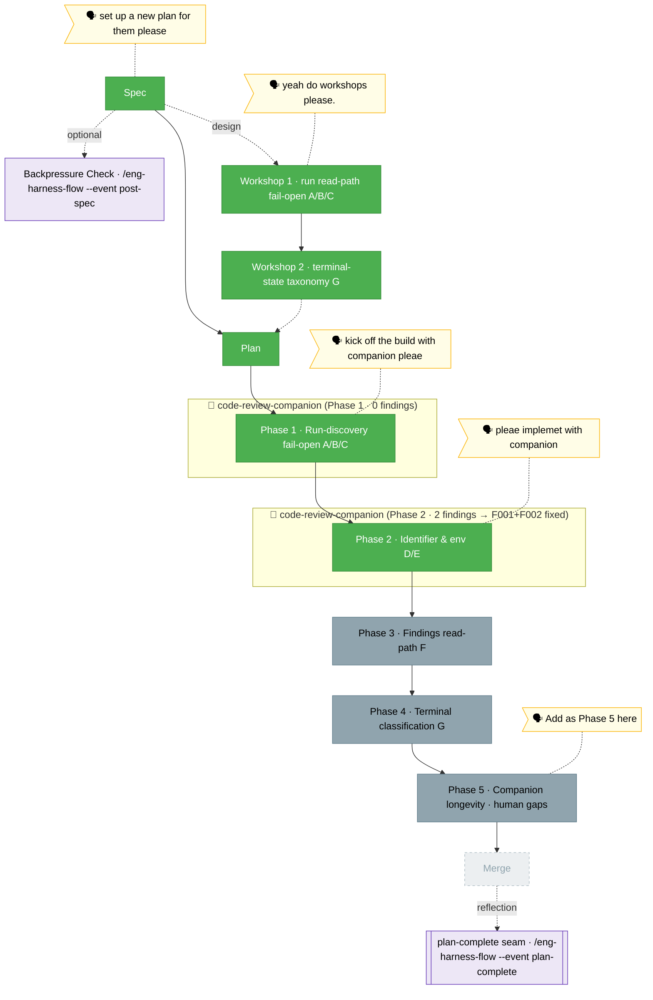

<!-- 🔄 RENDERED from the-flow.json — regenerate, never hand-edit this file as the primary. -->
# the-flow — companion-mode-reliability (plan 028)

**Plan**: companion-mode-reliability · **Mode**: Full · **Phases**: 5 (4 defect-fix + 1 user-added longevity)
**Rail**: `[the-flow] ◆─◆─◆─[◆─◆─◇─◇─◇]─◇`   ·   **now**: Phase 2 COMPLETE (D/E) — built `--companion`; defect D's sort migration now spans ALL ~11 selectors · **next**: Phase 3 tasks (findings read-path, F)

**Legend**: 🟩 done · 🟧 in progress · 🟥 blocked · 🟦 known future (designed) · ⬜╴assumed future (dashed) · 🟨 🗣 verbatim user input · 🟪 harness seams (violet — routed via `/eng-harness-flow`)

_Generated from `the-flow.json`. **Phase 1 (run-discovery fail-open, A/B/C) COMPLETE** — 5 commits, suite green. **Phase 2 (identifier & env, D/E) COMPLETE** — built with a live `code-review-companion`, 6 commits, full suite **1404 pass / 0 fail**, tsc clean. Defect **D**: `createRunFolder` emits true-UTC runIds (`getUTC*` + injectable `now?`), and every "newest/latest run" selector now sorts by `startedAt` (true UTC) via the shared `sortRunIdsNewestFirst` helper. The live companion earned its keep: `validate-v2` scoped the sort fix to **4** selectors, but the companion — reviewing each commit — caught that the migration was incomplete (`findRunSession` + a ~7-surface sweep), so on the human's "fix them all" call defect D now closes across **all ~11** latest/default selectors. Defect **E**: `MINIH_PROJECT_ROOT` = resolved git root (was the run dir). Phase-end retro drained 4 entries (incl. the companion's run-selector-audit magicWand). **Next: Phase 3 tasks (findings read-path, F)** — add `minih companion findings` over the existing ledger; then 4–5, then merge._
