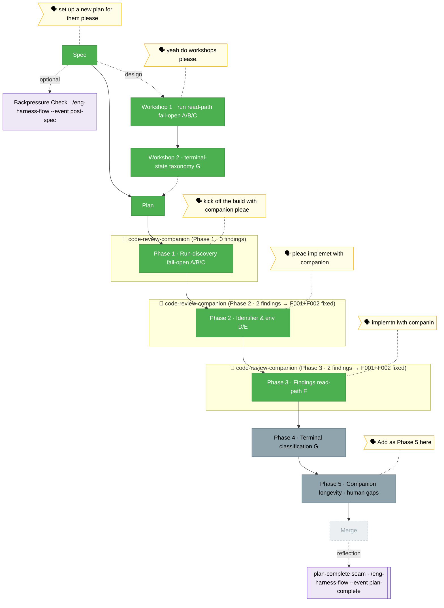

<!-- 🔄 RENDERED from the-flow.json — regenerate, never hand-edit this file as the primary. -->
# the-flow — companion-mode-reliability (plan 028)

**Plan**: companion-mode-reliability · **Mode**: Full · **Phases**: 5 (4 defect-fix + 1 user-added longevity)
**Rail**: `[the-flow] ◆─◆─◆─[◆─◆─◆─◇─◇]─◇`   ·   **now**: Phase 3 COMPLETE (defect F) — `minih companion findings` built `--companion`; 2 companion findings fixed; suite 1408/0 · **next**: Phase 4 tasks (terminal classification G)

**Legend**: 🟩 done · 🟧 in progress · 🟥 blocked · 🟦 known future (designed) · ⬜╴assumed future (dashed) · 🟨 🗣 verbatim user input · 🟪 harness seams (violet — routed via `/eng-harness-flow`)

_Generated from `the-flow.json`. **Phase 1 (A/B/C) COMPLETE** — 5 commits, suite green. **Phase 2 (D/E) COMPLETE** — built with a live `code-review-companion`, 6 commits, full suite **1404 pass / 0 fail**; defect **D** (true-UTC runId + `startedAt`-primary sort across all ~11 selectors — the companion caught the migration was incomplete beyond the 4 named) and **E** (`MINIH_PROJECT_ROOT` = resolved git root) closed. **Phase 3 (findings read-path, F) COMPLETE** — built with a live `code-review-companion` (cmp3), 5 commits, full suite **1408 pass / 0 fail**, `tsc` clean, `minih doctor` 0 failures. `minih companion findings <slug>` reads a companion's findings + summary over the lane-agnostic `deriveCompanionLedger().findings` + `buildDraftFarewell` (no new ledger API); `outside.md`, `docs/how/companion-mode.md` (§3a), and `AGENTS_README.md` corrected to that read-path. The live companion raised **2 MEDIUM** contract-drift findings (F001/F002 — adjacent guides still taught `cat report.json`); both fixed. **Dogfood moment**: `minih companion findings` (the command this phase built) surfaced 2 findings + 4 summaries that a raw inbox-lane `jq` skim reported as 0 — defect F reproduced and fixed in the same session. Phase-end retro drained 2 entries (DL-001 a pre-commit doc-budget sensor, MW-001 a companion contract-drift sweep). **Next: Phase 4 tasks** (terminal classification G); then Phase 5, merge._
