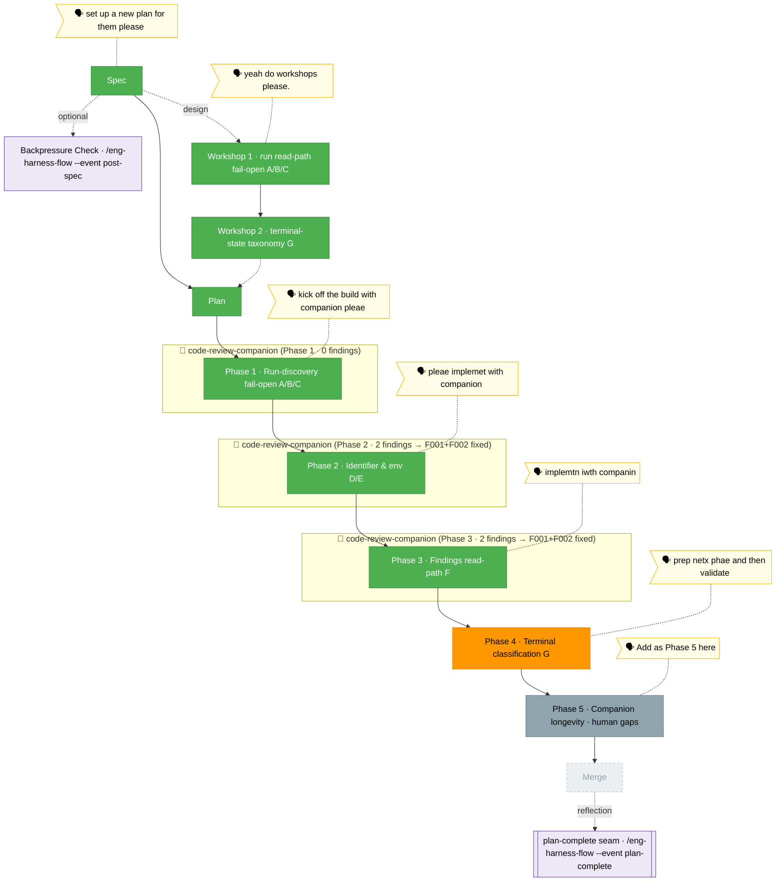

<!-- 🔄 RENDERED from the-flow.json — regenerate, never hand-edit this file as the primary. -->
# the-flow — companion-mode-reliability (plan 028)

**Plan**: companion-mode-reliability · **Mode**: Full · **Phases**: 5 (4 defect-fix + 1 user-added longevity)
**Rail**: `[the-flow] ◆─◆─◆─[◆─◆─◆─◐─◇]─◇`   ·   **now**: Phase 4 tasks PREPPED + VALIDATED (defect G) — T000–T0z, anchors re-verified live (1597-1598/441-442, not the plan's stale 1590/415); 4-agent thesis-aware pass clean · **next**: Phase 4 implement (terminal classification G)

**Legend**: 🟩 done · 🟧 in progress · 🟥 blocked · 🟦 known future (designed) · ⬜╴assumed future (dashed) · 🟨 🗣 verbatim user input · 🟪 harness seams (violet — routed via `/eng-harness-flow`)

_Generated from `the-flow.json`. **Phases 1–3 COMPLETE** (A–F), each built with a live `code-review-companion`; full suite **1408 pass / 0 fail**, `tsc` clean, `minih doctor` 0 failures. **Phase 4 (terminal classification, G) — TASKS PREPPED + VALIDATED, implement pending.** `tasks.md` expands plan tasks 4.0–4.z into **T000–T0z** RED/GREEN pairs: T001/T002 collapse `result:'degraded'` → `manifest.status:'completed'` (velocity guard unchanged); T003/T004 source + write a **farewell-observed signal** (the hard task — none exists in `runner.ts`/`reconcile.ts` today); T005/T006 extend the `terminalReason` union with `operator-stop`/`idle-budget`/`no-engagement` and stop the real consumers red-rendering them; T007 reconcile-honours an operator-stop marker; T008 pins the 028↔#49 boundary + the underscore→hyphen spelling map. **Re-anchoring caught live**: the plan's `runner.ts:1590` is now **`1597-1598`** and `status.ts:415` is now **`441-442`** (Phase 1/2 shifted them) — all 9 anchors source-truth-verified. **Validation**: a 4-agent thesis-aware pass — source-truth verified every anchor, cross-ref confirmed 1:1 plan fidelity (all locked decisions carried), thesis advanced, forward-compat confirmed Phase 5 (AC-H) and #49 are both satisfied. Two MEDIUM fixes applied (T004 candidate sources + lifecycle/producer spike + provisional field shapes; T008 doc target named) plus a LOW (T006 domain.md History reminder). **Next: Phase 4 implement** (`--companion` has been the per-phase build mode); then Phase 5, merge._
