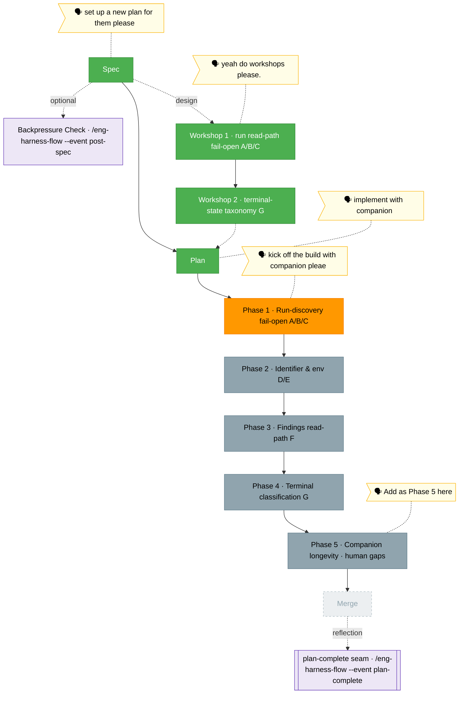

<!-- 🔄 RENDERED from the-flow.json — regenerate, never hand-edit this file as the primary. -->
# the-flow — companion-mode-reliability (plan 028)

**Plan**: companion-mode-reliability · **Mode**: Full · **Phases**: 5 (4 defect-fix + 1 user-added longevity)
**Rail**: `[the-flow] ◆─◆─◆─[◐─◇─◇─◇─◇]─◇`   ·   **now**: Phase 1 tasks dossiered (9 tasks) — Phase 1 in progress · **next**: implement Phase 1 with companion

**Legend**: 🟩 done · 🟧 in progress · 🟥 blocked · 🟦 known future (designed) · ⬜╴assumed future (dashed) · 🟨 🗣 verbatim user input · 🟪 harness seams (violet — routed via `/eng-harness-flow`)

_Generated from `the-flow.json`. **Plan written and validated** (Status READY; all 5 phases passed thesis-aware multi-agent review against source, v1.1.1 folded in the fixes). **The build is now under way**: Phase 1's task dossier is written (`tasks/phase-1-run-discovery-fail-open-a-b-c/tasks.md` — 9 tasks T000–T009; the C-symptom spike runs first to name the surface, then the A/B RED→GREEN pairs, harness seams bracketing). **Next: implement Phase 1 with the companion** — a `code-review-companion` (a parallel `minih` agent) reviews every commit and supersedes the review stage. Phases 2–5 follow; then merge._
