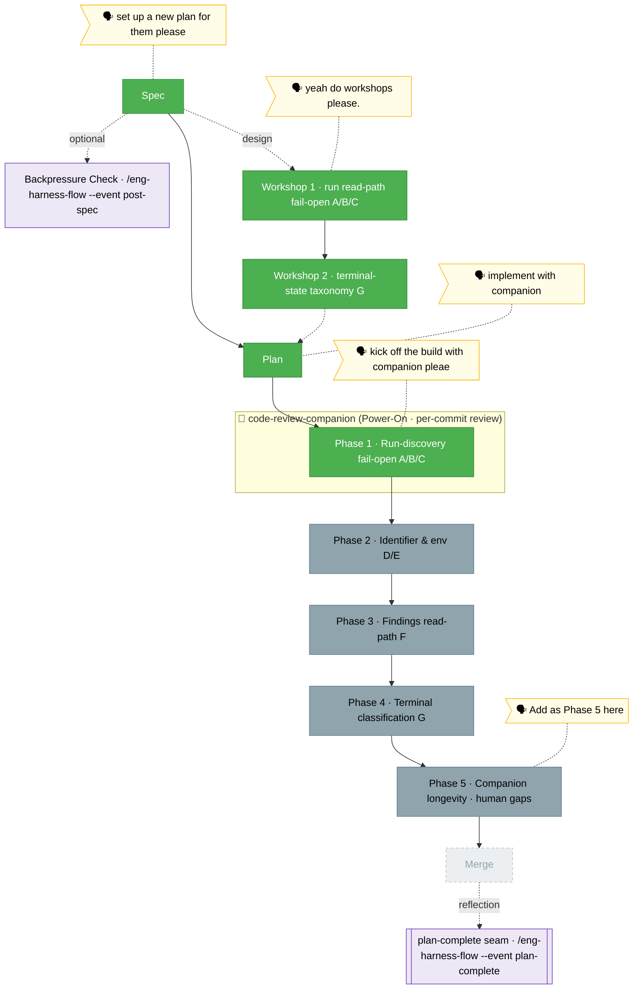

<!-- 🔄 RENDERED from the-flow.json — regenerate, never hand-edit this file as the primary. -->
# the-flow — companion-mode-reliability (plan 028)

**Plan**: companion-mode-reliability · **Mode**: Full · **Phases**: 5 (4 defect-fix + 1 user-added longevity)
**Rail**: `[the-flow] ◆─◆─◆─[◆─◐─◇─◇─◇]─◇`   ·   **now**: Phase 1 COMPLETE (A/B/C) — 5 commits, 1396 tests pass, built with a live companion · **next**: Phase 2 tasks (D/E)

**Legend**: 🟩 done · 🟧 in progress · 🟥 blocked · 🟦 known future (designed) · ⬜╴assumed future (dashed) · 🟨 🗣 verbatim user input · 🟪 harness seams (violet — routed via `/eng-harness-flow`)

_Generated from `the-flow.json`. **Plan written and validated** (Status READY; all 5 phases passed thesis-aware multi-agent review against source, v1.1.1 folded in the fixes). **Phase 1 (run-discovery fail-open, A/B/C) is COMPLETE** — 5 commits on branch `028-companion-mode-reliability`, full suite **1396 pass / 0 fail**, `tsc` clean. Defect **A**: `computeStatusVerdict` fails open for a live-pid run (`status.ts`). Defect **B**: `runs list --all` wired (was a no-op) + best-effort heal-on-read of dead-pid orphans (`run-inventory.ts`). Defect **C**: AC-C fallback — the literal symptom is emitted by no core surface, so a `resolveAgent↔listAgents` parity lock + documented finding. Built with a **live `code-review-companion`** (briefed once, pinged per commit, 0 findings) and the **harness loop** (boot seam → friction capture → phase-end retro). **Next: Phase 2 tasks (Identifier & env, D/E)**, then 3–5, then merge._
