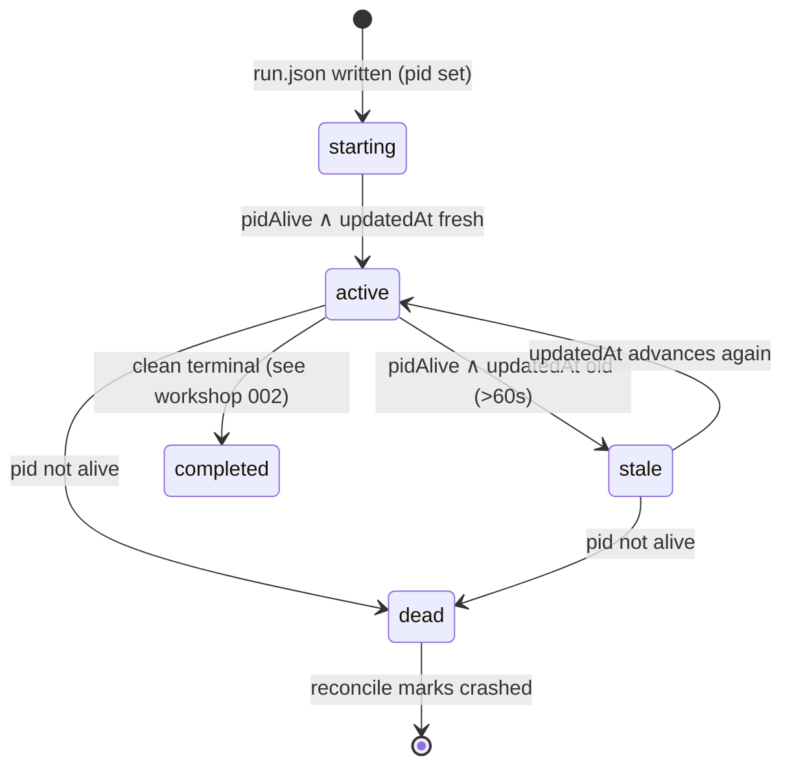

# Workshop: Run read-path — when is a run "active"? (fail-open + reconcile-on-read)

**Type**: State Machine / Integration Pattern
**Plan**: 028-companion-mode-reliability
**Spec**: [companion-mode-reliability-spec.md](../companion-mode-reliability-spec.md)
**Created**: 2026-06-15
**Status**: Draft

**Value Thesis**: This workshop removes the headline ambiguity behind defects A/B/C — three read-paths each answer "is this run active?" differently, and the orchestrator only needs one of them to fail-closed during the boot window to lose the whole companion session. Pinning a single canonical "active" predicate (and where each read-path must adopt it) makes the fix mechanical and the regression tests obvious.
**Target Proof Level**: Contract Ready
**Current Proof Level**: Preferred Direction

**Selected Value Axes**:
- **Knowability**: makes explicit a behaviour (run liveness mid-boot) that today is inferred and inconsistent across commands.
- **Implementation Readiness**: gives the architect an exact predicate + the three call-sites to converge, so Phase 1 is "make these agree", not "design liveness".
- **Operational Reliability**: the failure mode is a *lost review session*; the contract names the boot-window race and how each read-path must behave inside it.
- **Proof Quality**: every claim below is anchored to current `src/` line numbers and a fixture-able scenario.

**Related Documents**:
- [002-terminal-state-taxonomy.md](./002-terminal-state-taxonomy.md) (sibling workshop — G)
- Plan 025 (dead-pid liveness) and Plan 026 (stall watchdog) — the semantics this fix must preserve.

**Domain Context**:
- **Primary Domain**: `runner` (the predicate + reconcile-on-read)
- **Related Domains**: `cli` (`status`, `runs list`, `history`, `last-run` consume the predicate)

---

## Purpose

Decide the single definition of "active" for a run, and where each read-path must adopt it, so an orchestrator can learn a live run's `runId` the moment it boots one. Drives Phase 1 (A/B/C).

## Fresh Entrant Outcome

A fresh agent should reach **Contract Ready** with no extra context — able to:

- State the canonical "active" predicate and why `events.ndjson` is not part of it.
- Point to the one read-path (`computeStatusVerdict`) that diverges and the exact change.
- Explain the boot-window race and what each command must return inside it.
- Decide the `--all` flag and the reconcile-on-read question with eyes open.

## Key Questions Addressed

- What does "active" mean, canonically, and which signal is authoritative?
- Why does `minih status` return `unknown` for a run that `runs list` would call `active`?
- Should stale dead-pid `active` orphans be healed on read, and how without racing a live run?
- Wire or remove `runs list --all`?

---

## Value Frame

| Field | Selection | Why It Matters |
|-------|-----------|----------------|
| Target Proof Level | Contract Ready | Phase 1 needs an exact predicate + call-sites, not a discussion |
| Primary Value Axis | Implementation Readiness | The fix is "converge three call-sites on one predicate" |
| Supporting Value Axes | Knowability, Operational Reliability, Proof Quality | Names a hidden mid-boot behaviour and its failure cost |
| Downstream Loop Improved | Implementation + Testing | Predicate → unit fixtures; race → integration check |

## Overview — three read-paths, three answers

Every run-discovery command ultimately asks "is this run active?" Today that question is answered in **three** places, and only one is wrong — but it's the one the documented orchestrator one-liner hits.

| Read-path | Function | "active" derived from | Verdict for fresh run (pid alive, `updatedAt` fresh, **no `events.ndjson` yet**) |
|---|---|---|---|
| `minih status` | `computeStatusVerdict` — `src/cli/commands/status.ts:170-216` | pid-alive gate, then **`events.ndjson` mtime < 60s**; else `unknown` | **`unknown`** ✗ (the bug — falls through line 216) |
| resolver (`status`/others select here) | `collectActiveRuns` — `src/runner/run-resolver.ts:304-324` | `ACTIVE_STATUSES` + **pid alive** + **`updatedAt` < 60s** | **active** ✓ |
| `minih runs list` | inventory liveness — `src/runner/run-inventory.ts:~204-214` | `ACTIVE_STATUSES` + **pid alive** + **`updatedAt` < 60s** | **active** ✓ |

**The canonical predicate already exists** — `collectActiveRuns` and the inventory agree (both: active status + live pid + recent `updatedAt`, 60s). `computeStatusVerdict` is the lone divergent path: it never consults `manifest.updatedAt` and treats an empty `events.ndjson` as "not active".

> Constants (all present today): `ACTIVE_STATUSES` (`run-resolver.ts:38`, `run-inventory.ts:16`), `PROBE_STATUSES = {starting, active, idle, completing}` (`status.ts:88`, `reconcile.ts:24`), stale threshold `60_000` ms (`status.ts:27`, `run-resolver.ts:37`, `run-inventory.ts:15`).

## The boot-window race (the failure timeline)

```
 t0  orchestrator: `minih run code-review-companion &`   (inline process; pid = this process)
 t1  runner writes run.json  →  status:"starting"/"active", pid set, updatedAt = now   (runner.ts:461-463)
 t2  orchestrator polls `minih status <slug>`  ── events.ndjson still EMPTY ──►  verdict "unknown"   ✗ A
 t3  first event appended → events.ndjson exists, mtime now
 t4  orchestrator polls again  ──►  verdict "active"   ✓ (too late — it already concluded "no active run")
```

The window **t1→t3** is real and unavoidable: a just-booted agent has a live pid and an advancing `updatedAt` before it emits its first event. Inside that window the run is genuinely active, but `status` says `unknown` and the documented `jq 'select(.verdict=="active")'` yields nothing. **Fail-open closes this window.**

Before t1 (t0→t1, run.json not yet written) is a *narrower* race that affects `runs list` (no row yet) and is the most likely source of the issue's "default empty, then `--all` shows it" — successive polls straddling t1. This is a race, **not** the `--all` filter (which is a no-op — see below).

## Decision Space

### D1 — What is "active"? (the predicate)

| Option | Description | Pros | Cons | Decision |
|--------|-------------|------|------|----------|
| A | **Active = `ACTIVE_STATUSES`(status) ∧ pidAlive ∧ (`now − updatedAt` < 60s)**; `events.ndjson` is a *secondary* freshness hint only | Already the resolver/inventory contract; closes the boot window; pid is the truth | A run wedged before its first event but still "updating" run.json counts as active (correct — it IS) | **Selected** |
| B | Keep `events.ndjson` mtime as the authority for `status` | No change to status | Reproduces A; diverges from the other two paths | Rejected |
| C | Active = pidAlive only (drop `updatedAt`) | Simplest | Loses the stall/stale signal from Plan 026; a hung-but-alive pid reads active forever | Rejected |

**Selected: A.** `computeStatusVerdict` adopts the resolver predicate: after the existing pid-alive gate (`status.ts:188-202`), if the manifest is in an `ACTIVE_STATUS` and `updatedAt` is recent, return `active` **even when `events.ndjson` is absent**; use `events.ndjson` mtime only as a tie-breaker for `active` vs `stale` when present. Net change is localized to lines 208-216.

### D2 — Reconcile-on-read for stale dead-pid `active` orphans

Many `status:"active"` manifests with **dead** pids exist on disk (confirmed); they're healed only post-mortem by `minih reconcile`. The read-paths already *skip* them (`collectActiveRuns:306-312` skips dead-pid active; `status` returns `dead`; inventory returns `dead`), so they **do not** crowd out a live run in resolution. The residual harm is hygiene: they linger as `unhealed-dead` rows and add noise.

| Option | Description | Pros | Cons | Decision |
|--------|-------------|------|------|----------|
| A | **Skip-but-don't-heal (status quo)** + leave hygiene to `minih reconcile` | Zero race risk; no writes on a read | Orphans accumulate; `runs list` stays noisy | Open |
| B | **Bounded lazy heal-on-read** — when an inventory/resolver read sees an `ACTIVE_STATUS` manifest with a dead pid, mark it `crashed` (guarded by the existing `reconcile-lock`/`run-lock`) | Self-healing; quieter lists; reuses proven lock | A read now sometimes writes; must be lock-safe and best-effort (never block the read) | **Preferred** |
| C | Heal only the *selected* run | Minimal writes | Doesn't quiet sibling orphans, which is the actual noise | Rejected |

**Preferred: B**, but **gate it on not regressing Plan 025/026** and make it strictly best-effort (a heal failure is swallowed; the read still returns). If lock-safety proves fiddly, fall back to **A** for this plan and keep healing in `reconcile`. (Architect's call — flagged as a risk.)

### D3 — `runs list --all`

`--all` is declared (`run-inventory.ts:26`), passed from the command (`runs.ts:57-58`), echoed in the `filters` block — but **never read** in the inventory's filtering logic (only `input.active` branches). So default and `--all` return identical rows; "default empty / `--all` populated" cannot come from the flag.

| Option | Description | Decision |
|--------|-------------|----------|
| A | **Wire it**: default view = active/recent window (bounded); `--all` = full history incl. completed/crashed, bounded by `--limit` | **Selected** |
| B | Remove `--all` and document default == full | Rejected (the help text promises history) |

**Selected: A** — wire `--all` to actually broaden the set, matching its `--description` ("Include historical rows, bounded by --limit"). A no-op flag that lies is itself a defect.

## State / Transition contract (the canonical predicate)



**Single predicate (target — all three read-paths call this):**

| Input | active | stale | dead | unknown |
|---|---|---|---|---|
| `ACTIVE_STATUSES.has(status)` | ✓ | ✓ | ✓ | — |
| `pidAlive` (`process.kill(pid,0)`) | ✓ | ✓ | ✗ | n/a |
| `now − updatedAt < 60s` | ✓ | ✗ | n/a | n/a |
| `events.ndjson` | **not required** | not required | n/a | only when status not probe-able |
| manifest missing/torn pre-t1 | — | — | — | ✓ (race; caller retries) |

`unknown` survives **only** for the genuine pre-t1 race (no readable manifest yet) — never for a live run that simply hasn't emitted an event.

## Evidence Ledger

| Evidence | Location | Supports | Status |
|----------|----------|----------|--------|
| `computeStatusVerdict` falls to `unknown` with no events | `status.ts:208-216` | A root cause | Ready |
| resolver predicate (pid+updatedAt, no events) | `run-resolver.ts:304-324` | canonical "active" | Ready |
| inventory predicate (identical) | `run-inventory.ts:~204-214` | canonical "active" | Ready |
| `--all` declared, never read | `run-inventory.ts:26` vs filter block | D3 | Ready |
| dead-pid active orphans skipped not healed | `run-resolver.ts:306-312` | D2 | Ready |
| Boot-window timeline | this doc | the race | Draft (fixture in Phase 1) |

## Attention Reduction

| Future Loop | Before Workshop | After Workshop |
|-------------|-----------------|----------------|
| Implementation | "fix the read-paths" (vague) | converge `computeStatusVerdict` on the resolver predicate; wire `--all`; decide D2 | 
| Testing | unclear what to assert | fixture: live-pid run + empty `events.ndjson` ⇒ `status` returns `active`+runId; orphan ⇒ skipped/healed |
| Review | reviewer reconstructs three paths | reviewer checks all three call one predicate |

## Validation / Acceptance

Reaches Contract Ready when:

- The canonical predicate is stated and the three call-sites that must adopt it are named (done).
- Each Decision (D1/D2/D3) has a recorded direction with rationale (done; D2 left as a flagged architect choice).
- A fixture scenario is specified for the boot window (done — feeds AC-A/AC-B regression tests).

## Open Questions

### Q1: What surface returned the null status JSON in the issue (`selfReportedState`/`currentlyRunningTool`)?
**OPEN** — those fields live only in `src/runner/peer-activity.ts`; no `src/cli/` command emits them. The orchestrator's literal Defect-A JSON came from a peer-activity/coordination read, not core `status`. Phase 1 must confirm which surface and whether it needs the same fail-open predicate. (This is the part of C that is investigative.)

### Q2: Is reconcile-on-read (D2-B) lock-safe against a live run's own writes?
**OPEN** — reuse `reconcile-lock`/`run-lock`; if it can't be made strictly best-effort and non-blocking, fall back to D2-A for this plan.

### Q3: Does fail-open (D1-A) regress Plan 026's stall watchdog?
**OPEN→likely no** — `updatedAt` freshness preserves the stale/stall signal; a hung run stops advancing `updatedAt` and drops to `stale`/`dead` as today. Confirm with a stall fixture.
