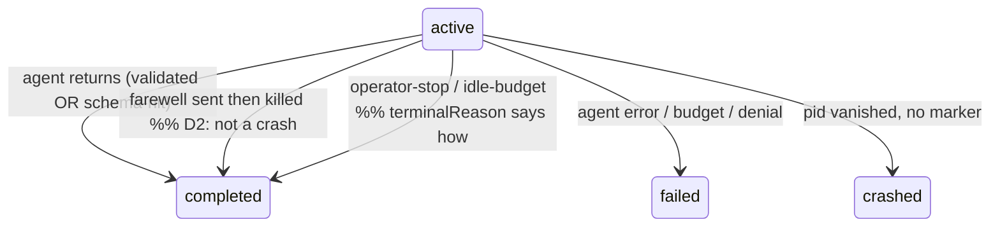

# Workshop: Terminal-state taxonomy — clean vs crash vs degraded vs idle

**Type**: State Machine
**Plan**: 028-companion-mode-reliability
**Spec**: [companion-mode-reliability-spec.md](../companion-mode-reliability-spec.md)
**Created**: 2026-06-15
**Status**: Draft

**Value Thesis**: Defect G makes healthy runs look failed — a 75-minute, 0-error run that sent a `farewell` is recorded `status:"failed"`/`result:"degraded"`/`terminalReason:null`, and an operator-stopped run is indistinguishable from a crash. This workshop defines the terminal vocabulary so "finished cleanly", "operator stopped it", "idle stand-down", and "crashed" are distinct on disk — which is what dashboards, `minih status`, and an orchestrator deciding whether to retry all depend on.
**Target Proof Level**: Contract Ready
**Current Proof Level**: Decision Space

**Selected Value Axes**:
- **Knowability**: today the terminal record erases *why* a run ended; this makes it explicit.
- **Operational Reliability**: clean-vs-crash is the signal a supervising agent/dashboard acts on.
- **Safety to Change**: pins the boundary with follow-up #49 (idle-policy wiring) so the two plans don't collide.
- **Proof Quality**: every state is anchored to current `runner.ts`/`types.ts`/`reconcile.ts` lines.

**Related Documents**:
- [001-run-read-path-fail-open.md](./001-run-read-path-fail-open.md) (sibling — A/B/C)
- Open issue **#49** — wires `evaluateIdlePolicy` into the runner loop (the *consumer* of the `idle` terminal reasons defined here).
- Plan 025 (`pid-vanished`/`crashed`), Plan 026 (budget reasons: `timeout`/`stalled-stream`/`max-turns`).

**Domain Context**:
- **Primary Domain**: `runner` (classification + the `terminalReason` union)
- **Related Domains**: `cli` (`status` surfaces `terminalReason`); `measurement` (velocity skips non-`completed`)

---

## Purpose

Define a terminal vocabulary that distinguishes an intentional/clean stop from a crash, and stop collapsing a clean-but-schema-imperfect run into `failed`. Drives Phase 4 (G) and fixes the boundary with #49.

## Fresh Entrant Outcome

A fresh agent reaches **Contract Ready** — able to:

- Enumerate every terminal outcome and how it's recorded (`status` × `result` × `terminalReason`).
- Point to the two exact defects: the `degraded → failed` collapse and the missing clean/operator/idle reasons.
- State what this plan lands vs what #49 lands.

## Key Questions Addressed

- What terminal outcomes exist, and which are clean vs failure?
- Why is a `farewell`, 0-error run recorded as `failed`?
- Is `farewell` authoritative for "completed"?
- What does the `terminalReason` union need so #49 can record an idle stand-down?

---

## Value Frame

| Field | Selection | Why It Matters |
|-------|-----------|----------------|
| Target Proof Level | Contract Ready | Phase 4 needs the exact enum + decision table |
| Primary Value Axis | Operational Reliability | clean-vs-crash is the actionable signal |
| Supporting Value Axes | Knowability, Safety to Change, Proof Quality | makes terminal cause explicit; fixes the #49 seam |
| Downstream Loop Improved | Implementation + Operations | enum → fixtures; record → honest dashboards/retry |

## Overview — how a run terminates today

```
runner.ts:1516-1521  result =
    agentSucceeded ? 'completed' : 'failed'
    timedOut                      → 'timeout'
    agentSucceeded && !validated  → 'degraded'      ← clean run, schema nit

runner.ts:1589-1594  manifest patch =
    status: result==='completed' ? 'completed' : 'failed'   ← 'degraded' COLLAPSES to 'failed'
    terminalReason: only if budgetReason (timeout|stalled-stream|max-turns) ∧ !denial ∧ !streamAborted

reconcile.ts:106-111  dead pid (no terminal written) → status:'crashed', terminalReason:'pid-vanished'
```

`farewell` is **never read** by classification (confirmed: no `farewell` reference in `runner.ts`/`reconcile.ts`/`run-manifest.ts`; it only pre-fills a draft report in `companion-ledger.ts`).

### Current terminal landscape (what lands on disk)

| Outcome | `result` (completed.json) | `manifest.status` | `terminalReason` | Distinguishable? |
|---|---|---|---|---|
| Clean finish | `completed` | `completed` | (absent) | ✓ |
| Clean finish, schema imperfect | `degraded` | **`failed`** | `null` | ✗ **looks failed (G)** |
| Agent error | `failed` | `failed` | (absent) | ~ (no reason) |
| Wall-clock / stall / max-turns | `timeout` / — | `failed` | `timeout`/`stalled-stream`/`max-turns` | ✓ |
| Permission / stream abort | `failed` | `failed` | `permission-denied`/`provider-stream-aborted` | ✓ |
| **Operator stop** (`kill`/control-stop) | — | **`crashed`** | **`pid-vanished`** | ✗ **looks crashed (G)** |
| **Idle stand-down** (#49) | — | — | — (no member) | ✗ **cannot be recorded** |
| Crash | — | `crashed` | `pid-vanished` | ✓ |

Two collapses erase intent: **clean-but-degraded → failed**, and **operator/idle stop → crashed/pid-vanished**.

## The `terminalReason` union — current vs target

```ts
// types.ts:575-581 (current) — every member is an ABNORMAL/failure reason
terminalReason?: 'permission-denied' | 'provider-stream-aborted' | 'pid-vanished'
               | 'timeout' | 'stalled-stream' | 'max-turns';
```

```ts
// target — add intentional/clean stop reasons (this plan), idle reasons (consumed by #49)
terminalReason?:
  // failures (unchanged)
  | 'permission-denied' | 'provider-stream-aborted' | 'pid-vanished'
  | 'timeout' | 'stalled-stream' | 'max-turns'
  // intentional / clean (NEW)
  | 'operator-stop'        // a `minih stop` / control-stop wrote a marker before kill
  | 'idle-budget'          // idle policy stood it down (maps idle-policy.ts exitReason 'idle_budget')
  | 'no-engagement';       // idle policy: never engaged (maps 'no_engagement')
```

A clean *successful* finish keeps `terminalReason` **absent** (absence already means "ended on its own terms"). `farewell` strengthens that signal but does not need its own reason.

## Decision Space

### D1 — Stop collapsing `degraded` into `status:"failed"`

| Option | Description | Pros | Cons | Decision |
|--------|-------------|------|------|----------|
| A | At `runner.ts:1590`, map `result:'degraded'` → `manifest.status:'completed'` (the `result` field still carries `degraded` for nuance) | Smallest change; a clean run stops reading as failed; dashboards keyed on `status` recover | `status` alone no longer flags the schema imperfection (but `result` does) | **Selected** |
| B | Add a distinct `manifest.status:'degraded'` | Most precise | New status ripples into every status consumer (read-paths, `runs list`, reconcile) — large blast radius | Rejected (scope) |
| C | Leave as-is | none | reproduces G | Rejected |

**Selected: A** — degraded is a *completed* run with a quality caveat, not a failure. `completed.json.result` remains the place that says `degraded`.

### D2 — Is `farewell` authoritative for a clean completion?

| Option | Description | Decision |
|--------|-------------|----------|
| A | **Yes (advisory-authoritative)**: if the agent sent a `farewell` and `errors===0`, the run is a clean stop — `result` may be `degraded` but `status` is `completed`, never `failed`/`crashed`, even if the process is killed immediately after | **Selected** |
| B | No — ignore `farewell` | Rejected (it's the strongest "I finished" signal a companion emits) |

**Selected: A.** The runner records a `farewellAt`/`cleanStop` marker when a `farewell` is observed; the terminal write and `reconcile` both honour it (a post-farewell `pid-vanished` is **not** a crash). This is the companion's real shutdown shape: orchestrator reads the farewell, then kills the idle process.

### D3 — Operator stop vs crash

| Option | Description | Decision |
|--------|-------------|----------|
| A | A control-stop path writes `terminalReason:'operator-stop'` + a terminal marker **before** signalling the process, so `reconcile` sees the marker instead of inferring `pid-vanished` | **Selected (taxonomy + marker honoured here; the stop command surface may be partial → architect)** |
| B | Infer operator-stop heuristically | Rejected (guessing intent) |

### D4 — Boundary with #49 (idle policy)

`idle-policy.ts:38-42` already returns `exitReason: 'idle_budget' | 'no_engagement'`, but nothing consumes it (wiring is #49).

- **This plan (028)** lands: the `terminalReason` union members (`idle-budget`, `no-engagement`, `operator-stop`), the `degraded≠failed` fix (D1), the `farewell`/cleanStop honouring (D2), and the marker-before-kill plumbing (D3) — i.e. the *vocabulary and the write path*.
- **#49** lands: calling `evaluateIdlePolicy` inside the runner loop and standing the run down — i.e. the *trigger* that emits `idle-budget`/`no-engagement`.

So 028 makes the reasons *recordable*; #49 makes them *get recorded by the idle path*. They compose, they don't collide. (Flag in the plan so the architect sequences them.)

## Target classification (decision table)

| Situation | farewell? | budget/denial | → `result` | → `manifest.status` | → `terminalReason` |
|---|---|---|---|---|---|
| Agent finished, validated | any | none | `completed` | `completed` | (absent) |
| Agent finished, schema nit | any | none | `degraded` | **`completed`** | (absent) |
| Agent error | no | none | `failed` | `failed` | (absent / future `agent-error`) |
| Wall-clock / stall / max-turns | — | budget | `timeout`/… | `failed` | `timeout`/`stalled-stream`/`max-turns` |
| Permission / stream abort | — | denial | `failed` | `failed` | `permission-denied`/`provider-stream-aborted` |
| Operator stop | maybe | — | (n/a) | `completed`* | **`operator-stop`** |
| Idle stand-down (#49 triggers) | maybe | — | (n/a) | `completed`* | **`idle-budget`** / **`no-engagement`** |
| Crash (no marker, pid gone) | no | — | (n/a) | `crashed` | `pid-vanished` |

\* an intentional stop is terminal-but-not-failed; whether it reads as `completed` or a new `stopped` status is D1's blast-radius tradeoff — **selected: reuse `completed` + the `terminalReason` to say how**, avoiding a new status.



## Evidence Ledger

| Evidence | Location | Supports | Status |
|----------|----------|----------|--------|
| `degraded` set for clean+invalid | `runner.ts:1521` | D1 | Ready |
| `degraded`/`failed` collapse to `status:"failed"` | `runner.ts:1590` | D1 | Ready |
| `terminalReason` only on budgetReason | `runner.ts:1592-1594` | the `null` reason | Ready |
| union has no clean member | `types.ts:575-581` | the enum extension | Ready |
| dead pid → crashed/pid-vanished | `reconcile.ts:106-111` | D3 | Ready |
| idle policy exitReasons exist, unwired | `idle-policy.ts:38-42` | D4 / #49 | Ready |
| farewell unread by classification | grep `farewell` in runner/reconcile | D2 | Ready |

## Attention Reduction

| Future Loop | Before | After |
|-------------|--------|-------|
| Implementation | "classify clean vs crash" (open) | D1–D3 are mechanical edits at named lines; D4 boundary fixed |
| Operations | healthy runs look failed; can't tell stop from crash | `status`/`terminalReason` tell the truth |
| #49 | unclear contract for idle terminal | union members + write path already exist; #49 only triggers them |

## Validation / Acceptance

Contract Ready when:

- Every terminal outcome maps to a recorded `(result, status, terminalReason)` (done — table above).
- The `terminalReason` union extension is specified (done).
- The 028/#49 split is explicit (done — D4).

## Open Questions

### Q1: Does `velocity` (skipped unless `result==='completed'`, `runner.ts:1527`) need to also compute for `degraded`-but-clean?
**OPEN** — if degraded is now a clean completion, velocity may want it. Low priority; architect's call.

### Q2: Does the operator-stop *command surface* (`minih stop`) exist, or only the marker-honouring?
**OPEN** — this plan can land the marker-honouring + `terminalReason:'operator-stop'` write; whether a first-class `minih stop` ships here or is follow-up is an architect scoping decision.

### Q3: Should there be a distinct `agent-error` terminalReason (vs absent)?
**OPEN** — currently an agent error leaves `terminalReason` absent; a member would make failures self-describing. Nice-to-have; out of headline scope.
