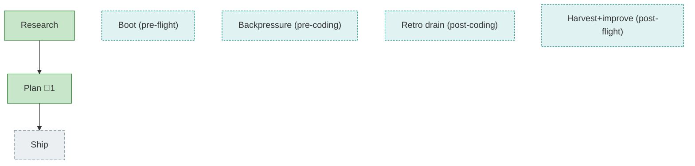

<!-- GENERATED by `harness flow render` — do not hand-edit; regenerate from the flow JSON. -->
# Flow · copilot-home-isolation

**Kind**: flight-plan · **Now**: plan · **Next**: ship · **Intent**: Isolate Copilot SDK sessions into a per-repo, git-ignored ./.minih/copilot-home (COPILOT_HOME) so they stop polluting the main copilot CLI's resume list; toggleable log level (default info) + a CLI warning when an area's logs grow large. · **Nodes**: 7 · **Events**: 17

**Rail**: ◆─□─■─◆─[ □ ]─□─◇  ◆ Research · □ Boot (pre-flight) · [*] · ◆ Plan · [ [*] ] · [*] · ◇ Ship

**Legend**: 🟩 done · 🟧 in-progress · 🟥 blocked · 🟦 known (designed) · ⬜ assumed (speculative) · 🔶 decision · 🗣 user input · 🟪 harness loop · 🤖 companion · 🛠 worker · 🧰 chore (upkeep).

## Node log

### plan · Plan
- `2026-06-23T01:50:43.092Z` · — · note — Simple build T001-T007 complete on branch 029-copilot-home-isolation (HEAD 7f01f11); companion APPROVE_WITH_NOTES, F001 fixed; all 7 ACs met.
